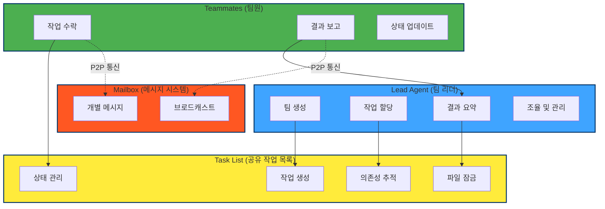
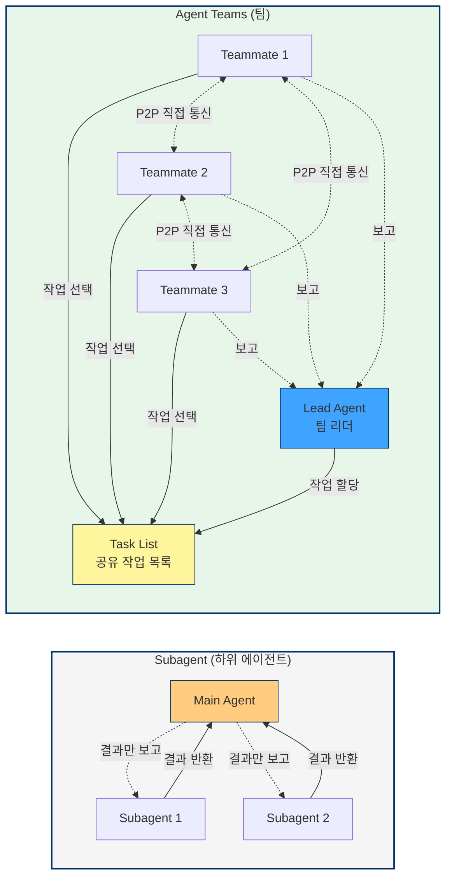
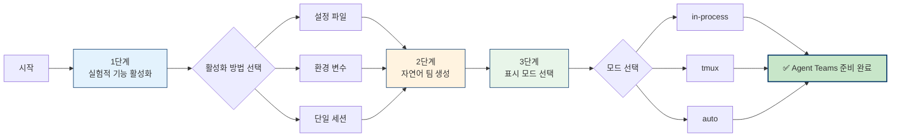
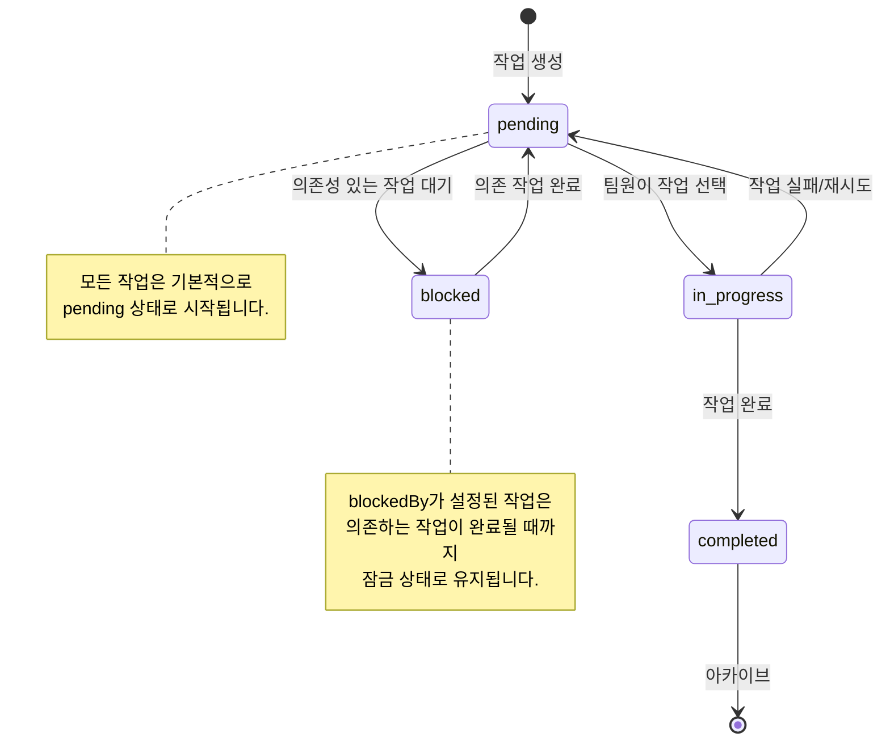
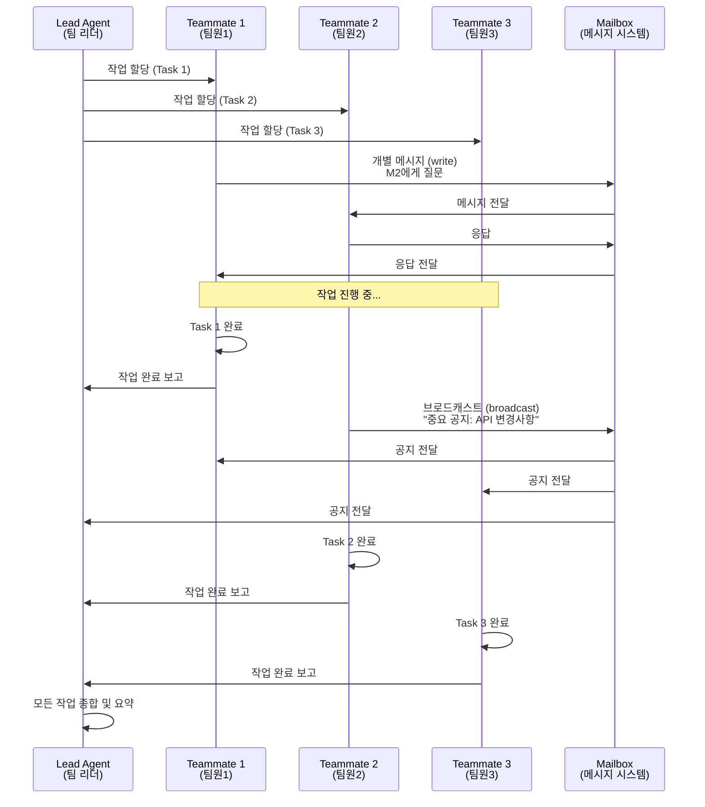
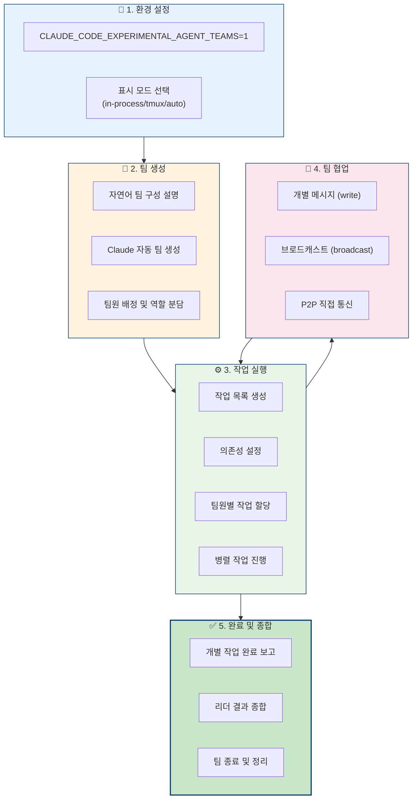

Claude Opus 4.6 출시와 함께 Agent Teams(다중 에이전트 팀) 기능이 공개되었습니다. 이 기능을 통해 여러 개의 Claude 인스턴스가 실제 개발 팀처럼 병렬로 협업할 수 있게 되었죠. 많은 개발자분이 Agent Teams를 어떻게 활성화하는지, 어떻게 실행하는지, 그리고 기존 Subagent와는 무엇이 다른지 궁금해하고 계십니다.

<!--more-->

## 서론: Agent Teams 소개

### 단일 에이전트의 한계

기존의 AI 코딩 도구는 단일 모델이 모든 작업을 처리하는 방식이었습니다. 이는 복잡한 대형 프로젝트에서 다음과 같은 문제가 있었습니다:

- **컨텍스트 제한**: 단일 모델의 컨텍스트 윈도우로 대형 코드베이스 분석 어려움
- **직렬 처리**: 한 번에 한 가지 작업만 가능하여 병렬 처리 불가
- **특화 부족**: 범용적인 목적의 모델로 특정 도메인 지식 깊이 부족
- **확장성 부재**: 팀 단위 협업 시 지각이 공유하는 지식 관리 어려움

### Agent Teams의 해결책

Claude Code Agent Teams는 다음과 같은 문제들을 해결합니다:

- **분산 처리**: 여러 에이전트가 병렬로 작업하여 시간 단축
- **역할 분담**: 각 에이전트가 특정 역할에 특화된 전문가 역할
- **지식 공유**: 팀원 간 자연스러운 의사소통과 지식 공유
- **통합 관리**: 팀 리더가 전체 작업 흐름을 조정하고 관리

### 핵심 가치

이 글을 읽고 나면 활성화 설정부터 명령어 실행, 작업 할당, 팀 협업에 이르기까지 Agent Teams의 전체 사용 프로세스를 마스터하여 즉시 다중 에이전트 프로그래밍을 시작할 수 있습니다.

### Agent Teams 아키텍처 다이어그램



## 핵심 개념: 4가지 구성 요소

Agent Teams는 4가지 핵심 구성 요소로 이루어져 있습니다.

| 구성 요소 | 역할 | 설명 |
| --- | --- | --- |
| **Lead Agent** | 팀 리더 | 메인 Claude Code 세션으로, 팀 생성, 작업 할당, 결과 요약을 담당합니다. |
| **Teammate** | 팀원 | 독립된 Claude Code 인스턴스로, 할당된 작업을 각자 수행합니다. |
| **Task List** | 공유 작업 목록 | 모든 구성원이 볼 수 있는 작업 보드로, 할당, 의존성, 상태 추적을 지원합니다. |
| **Mailbox** | 메시지 시스템 | 팀원 간의 통신 채널로, 개인 메시지와 브로드캐스트를 지원합니다. |

### Subagent와의 비교

| 비교 항목 | Subagent(하위 에이전트) | Agent Teams(팀) |
| --- | --- | --- |
| **통신 방식** | 메인 에이전트에게만 결과 보고 | 팀원 간 **직접 통신** 가능 |
| **조율 방식** | 메인 에이전트가 모든 것을 관리 | 공유 작업 목록 + 자율적 할당 |
| **컨텍스트** | 독립된 컨텍스트, 결과를 호출자에게 반환 | 독립된 컨텍스트, 완전한 자율성 |
| **최적 시나리오** | 결과만 필요한 집중 작업 | **토론과 협업**이 필요한 복잡한 작업 |
| **토큰 소모** | 비교적 낮음 (결과만 메인 컨텍스트로 취합) | 높음 (각 팀원이 독립된 Claude 인스턴스임) |

> 💡 **중요 차이점**: Subagent가 '상하 보고' 모델이라면, Agent Teams는 '팀 협업' 모델입니다. 작업에 여러 명의 토론, 관점 교환, 또는 서로 다른 모듈의 병렬 처리가 필요하다면 Agent Teams가 더 나은 선택입니다.

### Subagent vs Agent Teams 시각적 비교



## 활성화 방법: 3단계

Agent Teams는 기본적으로 **비활성화**되어 있으며, 수동으로 활성화해야 합니다.

### 1단계: 실험적 기능 활성화하기

**방법 A — 설정 파일 (권장)**

Claude Code의 `settings.json` 파일에 다음 내용을 추가하세요.

```json
{
  "env": {
    "CLAUDE_CODE_EXPERIMENTAL_AGENT_TEAMS": "1"
  }
}
```

**방법 B — 환경 변수**

```bash
# .bashrc 또는 .zshrc 파일에 추가
export CLAUDE_CODE_EXPERIMENTAL_AGENT_TEAMS=1
```

**방법 C — 단일 세션**

```bash
CLAUDE_CODE_EXPERIMENTAL_AGENT_TEAMS=1 claude
```

### 2단계: 자연어로 Agent Teams 트리거하기

**`/agent-teams`와 같은 별도의 슬래시 명령어는 없습니다**. 기능을 활성화한 후에는 원하는 팀 구성을 자연어로 설명하기만 하면 됩니다.

```
PR #142를 검토하기 위한 에이전트 팀을 생성해줘. 다음 세 명의 검토자를 만들어줘:
- 보안 취약점 집중 검토자
- 성능 영향 확인자
- 테스트 커버리지 검증자
각자 검토 후 발견된 사항을 보고하게 해줘.
```

또는 더 간단하게 요청할 수도 있습니다.

```
Create a team with 4 teammates to refactor these modules in parallel.
Use Sonnet for each teammate.
```

Claude가 자동으로 팀을 생성하고, 팀원을 배정하며, 업무를 할당합니다. 또한 Claude가 판단하기에 현재 작업이 병렬 처리에 적합하다고 생각되면 **먼저 팀 생성을 제안**할 수도 있습니다. 이 경우 사용자의 확인을 거친 후 진행됩니다.

### 3단계: 표시 모드 선택하기

| 표시 모드 | 설명 | 적용 환경 |
| --- | --- | --- |
| **in-process** (기본값) | 모든 팀원이 메인 터미널에서 실행됨 | VS Code를 포함한 모든 터미널 |
| **tmux** | 각 팀원이 독립된 패널에서 실행됨 | tmux 또는 iTerm2 필요 |
| **auto** | 자동 판단 | tmux 환경이면 화면 분할, 아니면 in-process |

```bash
# 명령행에서 지정
claude --teammate-mode tmux

# 또는 settings.json에서 설정
{
  "teammateMode": "tmux"
}
```

> 💡 **팁**: 처음 사용하신다면 in-process 모드로 시작해 보시고, 익숙해지면 tmux 화면 분할 모드를 시도해 보시는 것을 추천합니다.

### 활성화 3단계 플로우차트



## 조작 가이드

### 키보드 단축키 요약

Agent Teams가 실행 중일 때 다음 단축키를 사용할 수 있어요.

| 단축키 | 기능 |
| --- | --- |
| **Shift+Up/Down** | 다른 팀원 전환/선택 |
| **Enter** | 선택한 팀원의 대화 상세 내용 보기 |
| **Escape** | 팀원의 현재 작업 중단 |
| **Ctrl+T** | 작업 목록 보기 전환 |
| **Shift+Tab** | 위임 모드 전환 (리더는 코딩 없이 조율만 수행) |

### 작업 할당 메커니즘

Agent Teams의 작업 시스템은 3가지 상태와 의존 관계를 지원합니다.

**작업 상태**: `pending`(대기 중) → `in_progress`(진행 중) → `completed`(완료)

**의존성 메커니즘**: 작업에 `blockedBy` 의존성을 설정할 수 있습니다. 의존하는 작업이 완료되면 하위 작업이 **자동으로 잠금 해제**되어 수동 개입 없이 진행됩니다.

**수락 방식**:

1. **리더(Lead) 지정 할당**: 리더에게 특정 작업을 특정 팀원에게 맡기라고 명확하게 지시합니다.
2. **팀원 자율 수락**: 현재 작업을 마친 팀원이 할당되지 않은 다음 가용 작업을 자동으로 가져옵니다.
3. **파일 잠금(File Lock)을 통한 충돌 방지**: 여러 팀원이 동시에 같은 작업을 가져가려 할 때, 시스템은 파일 잠금을 사용하여 충돌을 방지합니다.

**작업 크기 권장 사항**: 팀원당 **5~6개의 작업**을 할당하는 것입니다. 작업이 너무 작으면 조율 비용이 이득보다 커지고, 너무 크면 팀원이 오랫동안 진행 상황을 보고하지 않게 됩니다.

### 작업 상태 다이어그램



### 팀원 간 통신 방식

| 통신 유형 | 설명 | 사용 시나리오 |
| --- | --- | --- |
| **write (개별 메시지)** | 특정 팀원에게 메시지 전송 | 구체적인 문제 조율 |
| **broadcast (브로드캐스트)** | 모든 팀원에게 메시지 전송 | 중요 공지 (주의해서 사용, 팀 규모에 따라 비용 증가) |

통신은 **P2P(점대점)** 방식이며, 리더를 거칠 필요가 없습니다. 어떤 팀원이든 다른 팀원에게 직접 메시지를 보낼 수 있어요.

### 팀원 간 통신 시퀀스 다이어그램



Agent Teams에서 가장 중요한 규칙은 **두 명의 팀원이 동일한 파일을 편집하면 내용이 덮어씌워질 수 있다**는 점입니다.

추천하는 파일 분업 전략은 다음과 같아요.

```
# 풀스택 기능 개발 예시
백엔드 팀원  → src/api/ 및 src/migrations/ 담당
프론트엔드 팀원 → src/components/ 담당
테스트 팀원     → tests/ 담당
```

> ⚠️ **중요**: Agent Teams의 팀원들은 동일한 작업 디렉토리를 공유하며, 자동으로 git worktree를 사용하지 않습니다. 각 팀원이 서로 다른 파일 집합을 담당하도록 하는 것이 충돌을 피하는 핵심입니다.

## 5대 실전 시나리오

### 시나리오 1: 다각도 코드 리뷰

```
이 PR을 리뷰할 에이전트 팀을 생성해줘:
- 보안 리뷰어: 인젝션, XSS, 권한 등 보안 문제 점검
- 성능 리뷰어: N+1 쿼리, 메모리 누수, 캐싱 전략 분석
- 테스트 리뷰어: 테스트 커버리지 및 경계 사례 검증
각자 리뷰를 마친 후 발견 사항을 보고하게 해줘.
```

**Agent Teams에 적합한 이유**: 세 가지 리뷰 관점이 완전히 독립적이므로 파일 충돌이 발생하지 않으며 병렬로 실행할 수 있습니다.

### 시나리오 2: 신기능 모듈 병렬 개발

```
사용자 알림 시스템을 구축할 팀을 생성해줘:
- 팀원 1: 백엔드 API 구축 (src/api/notifications/)
- 팀원 2: 프론트엔드 컴포넌트 구축 (src/components/notifications/)
- 팀원 3: 통합 테스트 작성 (tests/notifications/)
```

**적합한 이유**: 각 팀원이 서로 다른 디렉토리를 담당하여 자연스럽게 격리되며, 작업 완료 후 합치기만 하면 됩니다.

### 시나리오 3: 가설 검증 디버깅

```
간헐적으로 발생하는 버그가 있어. 서로 다른 가설로 디버깅할 팀을 만들어줘:
- 팀원 A: 레이스 컨디션(Race Condition) 여부 조사
- 팀원 B: 메모리 누수 여부 조사
- 팀원 C: 서드파티 API 타임아웃 여부 조사
각자 독립적으로 가설을 검증하고 보고해줘.
```

**적합한 이유**: 대항적 디버깅 방식으로, 여러 단서를 동시에 추적하여 누가 먼저 근본 원인을 찾는지 경쟁할 수 있습니다.

### 시나리오 4: 계층 간 수정 조율

프론트엔드, 백엔드, 데이터베이스를 모두 가로지르는 수정이 필요할 때, Agent Teams를 통해 각 계층의 전문가가 역할을 분담하고 메시지 시스템을 통해 인터페이스 정의를 조율할 수 있습니다.

### 시나리오 5: 탐색적 연구

```
코드 내 TODO 주석을 추적하는 CLI 도구를 설계하고 있어.
다양한 관점에서 탐색할 팀을 만들어줘:
- 한 명은 사용자 경험(UX) 설계 담당
- 한 명은 기술 아키텍처 담당
- 한 명은 '비판자(Devil's Advocate)' 역할 수행
```

**적합한 이유**: 다각도의 관점이 충돌하면서 서로의 가설과 결론에 도전하고 보완할 수 있습니다.

## Subagent와 비교: 선택 가이드표

| 판단 기준 | Subagent 선택 | Agent Teams 선택 |
| --- | --- | --- |
| 팀원 간 소통이 필요한가요? | ❌ 아니요 | ✅ 네 |
| 작업을 병렬로 처리할 수 있나요? | 부분적으로 가능 | ✅ 고도의 병렬 처리 가능 |
| 여러 파일을 동시에 편집하나요? | ✅ 동일 파일 작업 시 안전 | ⚠️ 충돌 방지를 위한 역할 분담 필요 |
| 작업의 복잡도는 어떤가요? | 단일 목표에 집중 | 다각도, 다중 모듈 |
| 토큰 예산은? | 💰 더 절약됨 | 💸 약 3~7배 소모 |
| 토론이나 피드백이 필요한가요? | ❌ 아니요 | ✅ 네 |

**비용 참고**: 3인 구성의 Agent Teams 팀을 30분 동안 실행할 경우, 토큰 소모량은 단일 세션의 약 3~4배 정도입니다. Plan 모드에서는 약 7배까지 늘어날 수 있습니다.

## 고급 팁

### 팁 1: 하이브리드 모델로 비용 절감하기

```
리드(Lead)는 Opus를 사용하고, 팀원 4명은 Sonnet을 사용하는 팀을 구성해 줘.
```

리더는 전략적인 의사결정을 위해 Opus 4.6을 사용하여 품질을 보장하고, 팀원들은 구체적인 실행 작업을 위해 Sonnet을 사용하여 비용을 효율적으로 관리하는 방식이에요.

### 팁 2: Plan 승인 워크플로우 활용하기

```
인증 모듈을 리팩토링할 아키텍트 팀원을 생성해 줘.
수정 작업을 시작하기 전에 먼저 방안을 제출하고 승인을 기다리도록 해줘.
```

이렇게 하면 팀원이 먼저 읽기 전용인 'Plan 모드'로 진입하여 방안을 완성한 뒤, 리더에게 승인 요청을 보냅니다. 리더가 승인한 후에야 팀원이 실제 구현 단계에 들어갑니다.

### 팁 3: 리더의 직접 개입을 방지하는 위임 모드

**Shift+Tab**을 눌러 위임 모드를 켜보세요. 이 모드에서는 리더가 작업 조율과 할당만 담당하고, 직접 코드를 작성하지 않게 됩니다. 리더가 팀원의 '일을 가로채는' 상황을 방지할 수 있죠.

### 팁 4: 품질 게이트 훅(Quality Gate Hooks)

훅(Hook) 메커니즘을 통해 작업 품질을 자동으로 관리할 수 있습니다.

- **`TeammateIdle`**: 팀원이 유휴 상태가 되기 직전에 트리거됩니다. 종료 코드 2를 반환하면 팀원에게 피드백을 보내 작업을 계속하게 할 수 있습니다.
- **`TaskCompleted`**: 작업이 완료로 표시될 때 트리거됩니다. 종료 코드 2를 반환하면 완료 처리를 중단하고 수정을 요구할 수 있습니다.

## 주의사항 및 베스트 프랙티스

### 알려진 제한 사항

1. **대화 복구 미지원**: `/resume` 및 `/rewind` 명령어를 사용해도 종료된 팀원을 복구할 수 없습니다.
2. **세션당 하나의 팀**: 리더(Lead)는 한 번에 하나의 팀만 관리할 수 있습니다.
3. **중첩 팀 미지원**: 팀원이 다시 자신의 팀을 생성할 수는 없습니다.
4. **권한 상속**: 팀원은 리더의 권한 모드를 상속받으며, 생성된 후에는 개별적으로 조정할 수 있습니다.
5. **분할 화면 모드 제한**: tmux 분할 화면은 VS Code 내장 터미널, Windows Terminal, Ghostty를 지원하지 않습니다.
6. **팀원 충돌(Crash)**: 팀원이 충돌하면 5분의 하트비트(Heartbeat) 타임아웃이 발생하며, 해당 작업은 다른 팀원이 이어받을 수 있습니다.

### 베스트 프랙티스

- **팀 규모**: 2~5명의 팀원을 권장하며, 보통 6명보다 3명이 더 효과적인 경우가 많습니다.
- **인원수보다 중요한 작업 분할**: 작업 분할이 제대로 되지 않은 6인 팀보다 잘 분할된 3인 팀이 더 낫습니다.
- **읽기 집약적 작업**(코드 리뷰, 리서치 등)이 에이전트 팀의 강점(Sweet spot)입니다.
- **쓰기 집약적 동시 편집**은 여전히 어려운 과제이며, 엄격한 파일 분업이 필요합니다.

## FAQ

### Q1: 에이전트 팀을 사용하려면 어떤 구독이 필요한가요?

에이전트 팀은 Claude Code의 실험적 기능으로, 충분한 Opus 4.6 사용량을 확보하려면 Claude Max 구독(월 $100-200)이 필요합니다. API 사용자는 표준 Opus 4.6 요율(백만 토큰당 $5/$25)에 따라 과금됩니다.

### Q2: 에이전트 팀은 Opus 4.6만 사용할 수 있나요?

아니요, 그렇지 않습니다. 에이전트 팀은 Opus 4.6과 함께 출시되었지만, 여러 모델을 혼합해서 사용할 수 있습니다. 리더는 전략적 의사결정을 위해 Opus 4.6을 사용하고, 팀원은 구체적인 작업을 수행하기 위해 Sonnet을 사용하는 방식을 추천합니다. 이렇게 하면 협업의 품질을 유지하면서 비용을 효율적으로 관리할 수 있습니다.

### Q3: 에이전트 팀을 VS Code에서 사용할 수 있나요?

네, 가능하지만 몇 가지 제한이 있습니다. VS Code 내장 터미널은 인프로세스(In-process) 모드(모든 팀원이 동일한 터미널에서 실행됨)를 지원합니다. 하지만 tmux 분할 화면 모드는 VS Code에서 사용할 수 없으므로, 이 기능을 쓰려면 외부 터미널을 사용해야 합니다.

## 결론 및 요약

### Agent Teams 전체 프로세스 플로우차트



### 핵심 요약

Claude 4.6 Agent Teams의 핵심 요약:

1. **활성화 방법**: 환경 변수 `CLAUDE_CODE_EXPERIMENTAL_AGENT_TEAMS=1`을 설정한 후, 자연어로 팀 구성을 설명하세요.
2. **아키텍처 모델**: 리더 에이전트(Lead Agent)가 전체를 조율하고 팀원 에이전트(Teammate Agent)가 병렬로 작업하며, 공유 작업 목록과 메시징 시스템을 통해 협업합니다.
3. **최적의 활용 시나리오**: 코드 리뷰, 새로운 모듈의 병렬 개발, 경쟁 가설 디버깅, 계층 간 조율, 탐색적 연구 등.
4. **핵심 원칙**: 인원수보다 작업을 어떻게 나누느냐가 더 중요합니다. 보통 6명보다는 3명의 팀원이 더 효과적이에요.
5. **비용 관리**: 하이브리드 모델(리더는 Opus + 팀원은 Sonnet) 구성이 가성비 면에서 가장 좋은 선택입니다.

Agent Teams는 AI 프로그래밍을 '솔로 플레이'에서 '팀 협업' 시대로 진화시켰습니다. 아직 연구 프리뷰 단계이지만, 이미 강력한 병렬 개발 능력을 보여주고 있죠.
