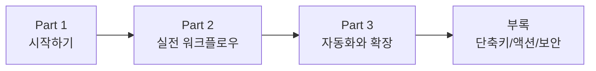
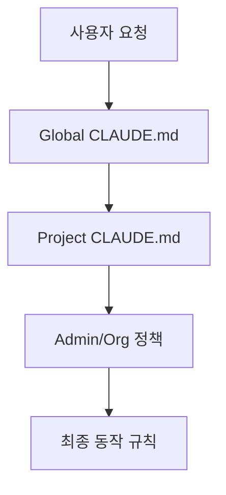
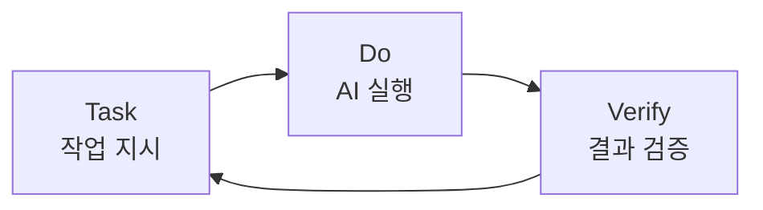
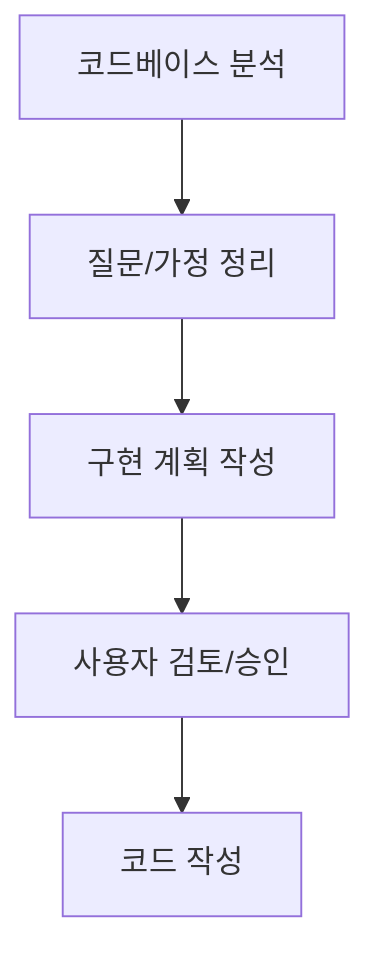
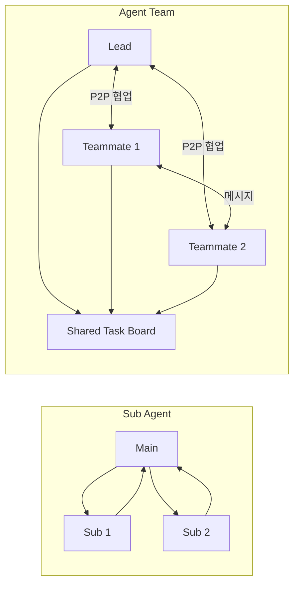

Claude Code를 막 도입했거나, 쓰고는 있는데 결과 품질이 들쑥날쑥하다면 이 글을 먼저 읽어보세요. 이 포스트는 **2026년 2월 기준 Opus 4.6** 환경을 바탕으로, 설치부터 운영 자동화까지 실제로 바로 적용할 수 있는 핵심만 압축해 정리합니다.

<!--more-->

## 한눈에 보는 전체 지도



이 글은 아래 순서로 진행합니다.

1. **시작하기**: 설치, IDE, 토큰/컨텍스트, CLAUDE.md
2. **실전 워크플로우**: Task-Do-Verify, Plan Mode, 컨텍스트 관리
3. **자동화/확장**: Skill, MCP, Sub Agent, Agent Team

---

## Part 1. Claude Code 시작하기

### Claude Code란?

Claude Code는 Anthropic의 에이전틱 코딩 도구입니다. 터미널 중심으로 동작하며 코드 읽기, 파일 수정, 명령 실행, 도구 통합, Git 작업(커밋/브랜치/PR)까지 한 흐름에서 수행할 수 있습니다.

### 구독 플랜 및 설치

| 플랜 | 가격 | 주요 특징 |
| --- | --- | --- |
| Pro | $20/월 | 모든 기능 사용 가능, 사용량 제한 |
| Max 5x | $100/월 | Pro의 5배 사용량, Opus 4.6, Agent Teams |
| Max 20x | $200/월 | Pro의 20배 사용량, 최대 우선순위 |
| API 종량제 | 사용량 기반 | Sonnet 4.5: 입력 $3/1M, 출력 $15/1M 토큰 |

설치 명령어:

```bash
# macOS / Linux / WSL
curl -fsSL https://claude.ai/install.sh | bash

# Windows PowerShell
irm https://claude.ai/install.ps1 | iex

# Homebrew
brew install --cask claude-code
```

> Tip: 네이티브 설치는 Node.js 없이 동작하고 자동 업데이트가 포함됩니다.

### 개발 환경(IDE) 설정

VS Code에서 Anthropic 공식 Claude Code 확장을 사용하는 방식이 가장 일반적입니다. 비슷한 이름의 비공식 확장은 보안 위험이 있을 수 있어 피하는 것이 안전합니다.

| 영역 | 위치 | 역할 |
| --- | --- | --- |
| 파일 탐색기 | 왼쪽 | 프로젝트 파일/폴더 탐색 |
| 코드 편집기 | 가운데 | 코드 확인/수정 |
| Claude Code 채팅 | 오른쪽 또는 아래 | 지시 전달/결과 확인 |

### 토큰과 컨텍스트 윈도우

| 항목 | 의미 |
| --- | --- |
| 토큰(Token) | AI가 텍스트를 처리하는 기본 단위 |
| 컨텍스트 윈도우 | AI가 한 번에 기억 가능한 대화/문맥 범위 |

Opus 4.6 기준으로 컨텍스트 윈도우는 약 200,000 토큰입니다. 결국 핵심은 "큰 컨텍스트를 얼마나 효율적으로 운영하느냐"입니다.

### 프로젝트 브레인: `CLAUDE.md`

`CLAUDE.md`는 프로젝트 루트에서 Claude Code가 가장 먼저 읽는 지침서입니다. 기술 스택, 코드 스타일, 구조, 작업 규칙을 이 파일에 고정하면 세션마다 재설명 비용이 크게 줄어듭니다.



작성 실전 팁:

1. 가장 중요한 규칙을 파일 맨 위에 둡니다.
2. API 문서는 통째로 붙이지 말고 핵심 규칙만 요약합니다.
3. 같은 실수가 반복되면 그때 규칙을 추가합니다.
4. 오래된 규칙은 주기적으로 정리합니다.

### Rules 폴더와 Auto Memory

`.claude/rules/`에 주제별 규칙 파일을 분리하면 관리가 쉬워집니다.

```text
.claude/
  rules/
    workflow.md
    design-rules.md
    technical-defaults.md
```

`MEMORY.md` 자동 메모리를 함께 쓰면 세션이 바뀌어도 중요한 맥락을 이어가기 좋습니다.

---

## Part 2. 실전 개발 워크플로우

### Task-Do-Verify 루프

AI 코딩의 기본은 **Task -> Do -> Verify** 반복입니다.



검증을 생략하면 초반엔 빨라 보여도 후반에 Context Rot로 품질이 급격히 흔들립니다.

### Context Rot 방지 포인트

- 단계마다 테스트/실행 결과를 확인합니다.
- 실패 원인과 수정 내용을 짧게라도 기록합니다.
- 긴 세션은 `/compact`로 정리하고, 큰 전환 시 `/clear`를 고려합니다.

### 병렬 작업과 Hook 시스템

병렬 작업은 3~4개 정도가 실전에서 효율적입니다. Hook은 특정 이벤트에서 자동 실행되는 스크립트로, 반복 실수를 방지하는 강제 장치로 쓰기 좋습니다.

| Hook 이벤트 | 시점 | 활용 예시 |
| --- | --- | --- |
| `PreToolUse` | 도구 실행 전 | 보호 파일 편집 차단 |
| `PostToolUse` | 도구 실행 후 | 포맷팅/정적 검사 |
| `Stop` | 응답 완료 시 | 완료 알림 |
| `Notification` | 알림 전송 시 | OS 알림 연동 |
| `SessionStart` | 세션 시작 시 | 환경 초기화 |
| `UserPromptSubmit` | 프롬프트 제출 시 | 입력 정책 검증 |

종료 코드 해석:

- `Exit 0`: 진행 허용
- `Exit 2`: 진행 차단 + 오류 피드백
- 기타: 진행되지만 stderr는 로그로만 기록

### 4가지 권한 모드

| 모드 | 설명 | 추천 |
| --- | --- | --- |
| 기본 모드 | 파일 변경마다 승인 | 안전 최우선 |
| 자동 수정 모드 | 기존 파일 자동 수정, 새 파일 확인 | 초보자 권장 |
| Bypass Permissions | 권한 대부분 위임 | 격리 환경에서만 |
| Plan Mode | 설계 우선, 코드 수정 불가 | 복잡 작업 필수 |

`Bypass Permissions`는 반드시 주의해서 사용해야 합니다. 격리되지 않은 환경에서의 무분별한 사용은 큰 손실로 이어질 수 있습니다.

### Plan Mode 활용법

복잡한 작업일수록 "바로 구현"보다 "먼저 계획"이 결과 품질과 속도를 동시에 올립니다.



실무 체감으로는 1분 계획이 10분 디버깅을 줄여주는 경우가 흔합니다.

### 컨텍스트 관리 전략

| 전략 | 설명 |
| --- | --- |
| `/context` | 현재 사용량 확인 |
| `/compact` | 대화 고밀도 압축 |
| 짧고 구체적인 프롬프트 | 토큰 절약 + 해석 오차 감소 |
| Sub Agent 위임 | 메인 컨텍스트 보호 |
| Extended Thinking | 사고 토큰 누적 완화 |
| 모델 분리 운용 | 단순 작업 Sonnet, 복잡 작업 Opus |

---

## Part 3. 자동화와 확장

### Skill 시스템

Skill은 반복 작업을 재사용 가능한 작업 매뉴얼로 고정하는 방법입니다.

```text
.claude/skills/my-skill.skill.md
```

```markdown
---
name: my-skill
description: 이 스킬의 간단한 설명
---
실제 작업 단계...
```

핵심은 "자주 하는 일을 사람 기억이 아니라 파일 규칙으로 전환"하는 것입니다.

### MCP (Model Context Protocol)

MCP는 Claude Code를 외부 서비스(Gmail, Slack, Notion, Sheets 등)와 연결하는 확장 메커니즘입니다.

| 항목 | MCP | Skill |
| --- | --- | --- |
| 토큰 사용 | 상대적으로 큼 | 상대적으로 작음 |
| 처리 속도 | 서비스/네트워크 영향 큼 | 빠른 편 |
| 용도 | 연결/탐색/프로토타입 | 운영 자동화 |

추천 흐름: **MCP로 검증 -> 반복되는 경로는 Skill/API 호출로 고정**.

### Sub Agent와 Agent Team

Sub Agent는 특정 작업을 별도 컨텍스트로 위임하고 요약만 회수하는 모델입니다. Agent Team은 여러 에이전트가 상호 소통하며 협업하는 모델입니다.



Agent Team 사용 시 핵심은 **파일 충돌 없는 역할 분리**입니다. 백엔드/프론트/테스트처럼 디렉토리 단위로 분업하면 안정성이 올라갑니다.

### 비용과 활용 기준

- Agent Team은 강력하지만 토큰 사용량이 단일 세션보다 크게 증가할 수 있습니다.
- 대형 리팩터링/보안 감사처럼 다각도 병렬 분석이 필요한 경우에 집중 투입하는 것이 효율적입니다.

---

## 부록 1) 주요 단축키

| 단축키 | 설명 |
| --- | --- |
| `Esc` | Claude 중지 |
| `Esc x 2` | 이전 메시지 목록 이동 |
| `Shift+Tab` | Plan Mode 전환 |
| `Cmd+T` | Extended Thinking 토글 |
| `Cmd+P` | 모델 선택기 |
| `Ctrl+G` | 외부 에디터 편집 |
| `Ctrl+O` | 상세 모드 토글 |
| `Ctrl+B` | 현재 작업 백그라운드 전환 |

## 부록 2) 오늘 바로 실행할 3가지

1. `/init`으로 `CLAUDE.md`를 만들고, 팀 규칙 3줄만 먼저 추가합니다.
2. 다음 복잡 작업에서 Plan Mode를 먼저 거친 뒤 구현합니다.
3. 매일 반복하는 작업 하나를 Skill로 분리해 자동화합니다.

## 부록 3) 보안 주의사항

AI가 생성한 코드에는 보안 취약점이 포함될 수 있습니다. 특히 결제, 인증, 개인정보 처리 기능은 배포 전 반드시 보안 검토를 거치세요. 도구의 생산성과 서비스의 안전성은 별개의 품질 게이트로 관리해야 합니다.

---

## 마무리

Claude Code의 성능 차이는 모델 스펙보다 **운영 체계(규칙, 검증, 자동화, 분업)**에서 더 크게 발생합니다. 설치 후 바로 코드를 쓰기보다, `CLAUDE.md`와 검증 루프를 먼저 세팅하는 것이 가장 높은 ROI를 만듭니다.

최신 내용은 공식 문서를 함께 확인하세요.

- [Anthropic Docs](https://docs.anthropic.com/)
- [Model Context Protocol](https://modelcontextprotocol.io/)
