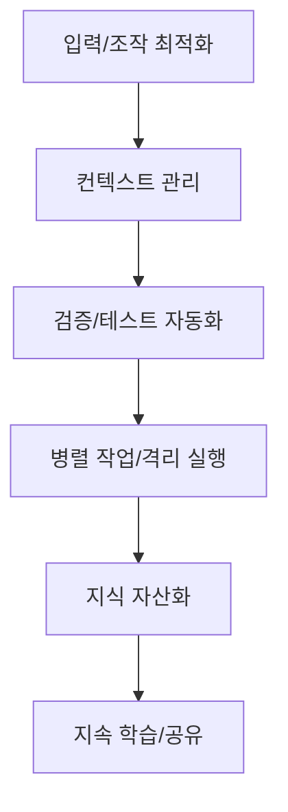
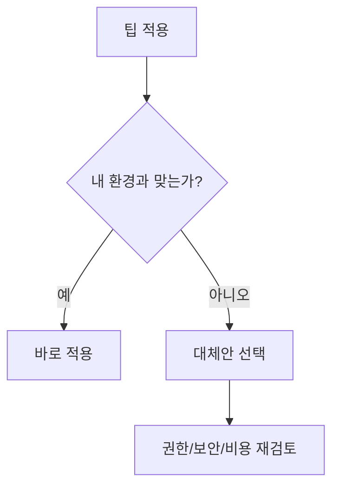

이 글은 [ykdojo/claude-code-tips](https://github.com/ykdojo/claude-code-tips)의 README와 연관 파일을 바탕으로, 팁을 한국어로 번역하고 실무 기준으로 재정리한 문서입니다.

원문은 팁 번호가 `0`부터 시작해서 `45`까지 이어지므로, 제목은 45 Tips지만 실제 항목 표기는 46개(0~45)입니다.

<!--more-->

## 먼저 전체 구조부터 보기

핵심 메시지는 간단합니다.

1. 빠른 입력보다 중요한 건 재현 가능한 작업 흐름이다.
2. 길어진 대화는 정리/분기/압축해서 신선한 컨텍스트로 유지해야 한다.
3. 코드 생성 자체보다 검증 루프(테스트, 리뷰, 자기검증)가 품질을 결정한다.
4. 위험한 작업은 컨테이너/권한 분리로 안전하게 실행해야 한다.

## 45개 팁(0~45) 한국어 번역 + 정리

아래는 원문 팁을 실무 흐름 순서로 다시 묶어 요약한 버전입니다.

### 1) CLI 기본기와 입력 속도

- **[Tip 0](https://github.com/ykdojo/claude-code-tips#tip-0-customize-your-status-line)** 상태바를 커스터마이징해 모델, 브랜치, 미커밋 파일, 토큰 사용률을 한눈에 본다.
- **[Tip 1](https://github.com/ykdojo/claude-code-tips#tip-1-learn-a-few-essential-slash-commands)** `/usage`, `/chrome`, `/mcp`, `/stats`, `/clear` 같은 핵심 슬래시 명령부터 익힌다.
- **[Tip 2](https://github.com/ykdojo/claude-code-tips#tip-2-talk-to-claude-code-with-your-voice)** 로컬 음성 인식 도구를 붙여 타이핑보다 빠르게 지시를 전달한다.
- **[Tip 6](https://github.com/ykdojo/claude-code-tips#tip-6-getting-output-out-of-your-terminal)** `/copy`, `pbcopy`, 파일 저장 후 에디터 열기 등으로 터미널 출력을 깔끔하게 꺼낸다.
- **[Tip 7](https://github.com/ykdojo/claude-code-tips#tip-7-set-up-terminal-aliases-for-quick-access)** `c`, `ch` 같은 alias로 반복 실행 비용을 줄인다.
- **[Tip 10](https://github.com/ykdojo/claude-code-tips#tip-10-cmda-and-ctrla-are-your-friends)** 접근 안 되는 웹/출력은 `Cmd/Ctrl + A` 복붙으로 컨텍스트를 직접 넣는다.
- **[Tip 24](https://github.com/ykdojo/claude-code-tips#tip-24-use-realpath-to-get-absolute-paths)** 다른 경로 파일은 `realpath`로 절대경로를 전달해 혼선을 줄인다.
- **[Tip 38](https://github.com/ykdojo/claude-code-tips#tip-38-navigating-and-editing-your-input-box)** 입력 박스 단축키(`Ctrl+A/E/W/U/K/G`)를 익혀 긴 프롬프트 편집 속도를 높인다.

### 2) 문제 분해와 계획 수립

- **[Tip 3](https://github.com/ykdojo/claude-code-tips#tip-3-break-down-large-problems-into-smaller-ones)** 큰 문제는 작은 실행 단위로 계속 쪼개서 해결한다.
- **[Tip 39](https://github.com/ykdojo/claude-code-tips#tip-39-spend-some-time-planning-but-also-prototype-quickly)** 구현 전에 계획을 먼저 만들고, 빠른 프로토타입으로 기술 선택을 검증한다.
- **[Tip 32](https://github.com/ykdojo/claude-code-tips#tip-32-its-all-about-choosing-the-right-level-of-abstraction)** 항상 같은 깊이로 보지 말고, 상황에 맞게 추상화 레벨을 조절한다.
- **[Tip 35](https://github.com/ykdojo/claude-code-tips#tip-35-be-braver-in-the-unknown-iterative-problem-solving)** 모르는 영역도 반복 탐색 방식으로 접근하면 해결 가능성이 커진다.

### 3) 컨텍스트 관리(성능/품질 핵심)

- **[Tip 5](https://github.com/ykdojo/claude-code-tips#tip-5-ai-context-is-like-milk-its-best-served-fresh-and-condensed)** 대화 컨텍스트는 길어질수록 성능이 떨어지므로, 주제별 새 세션이 유리하다.
- **[Tip 8](https://github.com/ykdojo/claude-code-tips#tip-8-proactively-compact-your-context)** `/compact`를 수동으로 운용하고, 핸드오프 문서(HANDOFF.md)를 남겨 세션을 교체한다.
- **[Tip 13](https://github.com/ykdojo/claude-code-tips#tip-13-search-through-your-conversation-history)** `~/.claude/projects/`의 대화 로그를 검색해 과거 맥락을 재활용한다.
- **[Tip 15](https://github.com/ykdojo/claude-code-tips#tip-15-slim-down-the-system-prompt)** 시스템 프롬프트/툴 설명 토큰 오버헤드를 줄이는 전략(패치, lazy-load MCP)을 적용한다.
- **[Tip 23](https://github.com/ykdojo/claude-code-tips#tip-23-clonefork-and-half-clone-conversations)** `/fork`, clone/half-clone으로 대화를 분기하거나 절반만 남겨 문맥을 가볍게 유지한다.
- **[Tip 30](https://github.com/ykdojo/claude-code-tips#tip-30-keep-claudemd-simple-and-review-it-periodically)** `CLAUDE.md`는 짧게 유지하고 주기적으로 업데이트한다.

### 4) Git/GitHub/PR 실전 운영

- **[Tip 4](https://github.com/ykdojo/claude-code-tips#tip-4-using-git-and-github-cli-like-a-pro)** Git/`gh` 작업(브랜치, 커밋, PR 생성)을 대화형으로 위임하되 푸시는 보수적으로 관리한다.
- **[Tip 16](https://github.com/ykdojo/claude-code-tips#tip-16-git-worktrees-for-parallel-branch-work)** 병렬 작업 충돌을 줄이기 위해 git worktree를 사용한다.
- **[Tip 26](https://github.com/ykdojo/claude-code-tips#tip-26-interactive-pr-reviews)** PR 리뷰를 일회성 평가가 아니라 대화형 점검 루프로 운영한다.
- **[Tip 28](https://github.com/ykdojo/claude-code-tips#tip-28-mastering-different-ways-of-verifying-its-output)** 테스트, 드래프트 PR, 시각적 Git 클라이언트, 자기 재검증 프롬프트를 조합해 검증한다.
- **[Tip 29](https://github.com/ykdojo/claude-code-tips#tip-29-claude-code-as-a-devops-engineer)** GitHub Actions 장애 분석을 자동화해 DevOps 디버깅 시간을 줄인다.
- **[Tip 33](https://github.com/ykdojo/claude-code-tips#tip-33-audit-your-approved-commands)** 승인된 위험 명령(`rm -rf`, `sudo` 등)을 정기 감사해 사고를 예방한다.
- **[Tip 34](https://github.com/ykdojo/claude-code-tips#tip-34-write-lots-of-tests-and-use-tdd)** 테스트를 많이 쓰고 TDD로 명세-구현 일치를 강제한다.

### 5) 브라우저/리서치/외부정보 수집

- **[Tip 9](https://github.com/ykdojo/claude-code-tips#tip-9-complete-the-write-test-cycle-for-autonomous-tasks)** 자율 실행은 반드시 write-test 사이클(작성→실행→검증)을 완성해야 안정적이다.
- **[Tip 11](https://github.com/ykdojo/claude-code-tips#tip-11-use-gemini-cli-as-a-fallback-for-blocked-sites)** 접근 제한 사이트는 Gemini CLI 등 대체 채널을 skill로 붙여 우회한다.
- **[Tip 27](https://github.com/ykdojo/claude-code-tips#tip-27-claude-code-as-a-research-tool)** Claude Code를 코드/시장/로그 조사용 리서치 엔진으로 활용한다.
- **[Tip 36](https://github.com/ykdojo/claude-code-tips#tip-36-running-bash-commands-and-subagents-in-the-background)** 긴 bash/subagent 작업은 백그라운드로 보내고 병렬 진행한다.
- **[Tip 43](https://github.com/ykdojo/claude-code-tips#tip-43-keep-learning)** `/release-notes`, 커뮤니티, DevRel 채널로 지속적으로 최신 기능을 학습한다.

### 6) 글쓰기/문서/지식 관리

- **[Tip 18](https://github.com/ykdojo/claude-code-tips#tip-18-claude-code-as-a-writing-assistant)** 글쓰기도 초안 생성 후 줄 단위 피드백 루프로 품질을 끌어올린다.
- **[Tip 19](https://github.com/ykdojo/claude-code-tips#tip-19-markdown-is-the-st)** 문서의 기본 포맷을 Markdown으로 두면 AI 협업 효율이 높다.
- **[Tip 20](https://github.com/ykdojo/claude-code-tips#tip-20-use-notion-to-preserve-links-when-pasting)** 링크 보존이 필요하면 Notion을 중간 포맷 변환기로 활용한다.
- **[Tip 41](https://github.com/ykdojo/claude-code-tips#tip-41-automation-of-automation)** 반복되는 지시/명령을 자동화하는 자동화(automation of automation)를 추구한다.
- **[Tip 42](https://github.com/ykdojo/claude-code-tips#tip-42-share-your-knowledge-and-contribute-where-you-can)** 팁 공유와 오픈소스 기여를 통해 피드백 루프를 만든다.

### 7) 작업환경 확장(컨테이너/플러그인/오케스트레이션)

- **[Tip 12](https://github.com/ykdojo/claude-code-tips#tip-12-invest-in-your-own-workflow)** 내 워크플로를 직접 개선(음성 입력, 상태바, 규칙 문서)하는 투자를 한다.
- **[Tip 14](https://github.com/ykdojo/claude-code-tips#tip-14-multitasking-with-terminal-tabs)** 터미널 탭을 캐스케이드 방식으로 운영해 멀티태스킹을 정돈한다.
- **[Tip 17](https://github.com/ykdojo/claude-code-tips#tip-17-manual-exponential-backoff-for-long-running-jobs)** 긴 작업은 수동 지수 백오프로 상태를 점검해 토큰 낭비를 줄인다.
- **[Tip 21](https://github.com/ykdojo/claude-code-tips#tip-21-containers-for-long-running-risky-tasks)** 위험하거나 장시간 작업은 컨테이너에서 실행해 호스트를 보호한다.
- **[Tip 22](https://github.com/ykdojo/claude-code-tips#tip-22-the-best-way-to-get-better-at-using-claude-code-is-by-using-it)** 결국 실력이 느는 가장 빠른 방법은 실제로 많이 쓰는 것이다.
- **[Tip 31](https://github.com/ykdojo/claude-code-tips#tip-31-claude-code-as-the-universal-interface)** Claude Code를 단순 코더가 아니라 컴퓨터 작업 전반의 범용 인터페이스로 본다.
- **[Tip 37](https://github.com/ykdojo/claude-code-tips#tip-37-the-era-of-personalized-software-is-here)** 개인 맞춤형 소프트웨어를 빠르게 만드는 시대가 열렸다는 관점을 갖는다.

### 8) 규칙 시스템 이해와 빠른 셋업

- **[Tip 25](https://github.com/ykdojo/claude-code-tips#tip-25-understanding-claudemd-vs-skills-vs-slash-commands-vs-plugins)** `CLAUDE.md` / Skills / Slash Commands / Plugins의 역할 차이를 구분해서 쓴다.
- **[Tip 40](https://github.com/ykdojo/claude-code-tips#tip-40-simplify-overcomplicated-code)** 모델이 과하게 복잡한 코드를 만들면 의도 설명을 요구하고 단순화시킨다.
- **[Tip 44](https://github.com/ykdojo/claude-code-tips#tip-44-install-the-dx-plugin)** `dx` 플러그인으로 gha/handoff/clone 등 반복 작업을 묶어 설치한다.
- **[Tip 45](https://github.com/ykdojo/claude-code-tips#tip-45-quick-setup-script)** 제공된 setup 스크립트로 권장 설정을 한번에 적용하되 항목별로 선택 설치한다.

## 실무 적용 순서(추천)

처음부터 모든 팁을 한 번에 넣기보다, 위 순서대로 한 단계씩 도입하는 편이 실패 확률이 낮습니다.

## 번역 시 유지해야 할 전제(중요)

원문의 일부 팁은 환경 의존성이 강하므로, 그대로 복사하기보다 전제를 함께 봐야 합니다.

- macOS 기준 예시가 많다(`pbcopy`, 키 바인딩, 경로 예시).
- `--dangerously-skip-permissions`, 시스템 프롬프트 패치, 자동 승인 권한은 강한 리스크를 동반한다.
- 컨테이너 오케스트레이션, 다중 모델 병행은 초보자에게 과할 수 있다.
- 플러그인/스킬은 편리하지만, 설정 파일과 승인 규칙 감사가 선행되어야 안전하다.

## 바로 써먹는 최소 체크리스트

1. `/usage`, `/mcp`, `/stats`부터 익혔는가?
2. `CLAUDE.md`를 짧게 유지하고 불필요 지시를 제거했는가?
3. 코드 작업마다 테스트/드래프트 PR 기반 검증 루프를 두었는가?
4. 컨텍스트가 길어질 때 handoff/half-clone 같은 분기 전략이 있는가?
5. 위험 명령 승인 목록을 정기적으로 감사하는가?

## 참고 원문

- 메인 문서: [README.md](https://github.com/ykdojo/claude-code-tips/blob/main/README.md)
- 설정 예시: [GLOBAL-CLAUDE.md](https://github.com/ykdojo/claude-code-tips/blob/main/GLOBAL-CLAUDE.md)
- 스크립트/스킬: [scripts](https://github.com/ykdojo/claude-code-tips/tree/main/scripts), [skills](https://github.com/ykdojo/claude-code-tips/tree/main/skills)
