프롬프트를 잘 쓰는 시대는 끝났다는 말이 과장처럼 들릴 수 있습니다.
하지만 최근 에이전트형 AI 흐름에서는 "질문 한 줄"보다 "AI가 일을 수행할 수 있는 문맥 전체"를 어떻게 설계하느냐가 결과를 좌우합니다.

이 글은 아래 영상을 기반으로, 핵심 개념과 실무 적용법을 도표 중심으로 정리한 레퍼런스 노트입니다.

- 영상: [90%가 모르는 AI 활용법… 질문이 아니라 '이것'입니다](https://www.youtube.com/watch?v=s6mXMxU7VEw)
- 채널: [메이커 에반 | Maker Evan](https://www.youtube.com/@maker-evan)

<!--more-->

## 핵심 요약

1. 프롬프트 엔지니어링은 "어떻게 물어볼까"에 집중한다.
2. 컨텍스트 엔지니어링은 "무엇을 보여줄까"를 설계한다.
3. AI 성능 저하는 모델 문제가 아니라 컨텍스트 오염/과부하에서 자주 발생한다.
4. 실무에서는 저장하기, 골라주기, 정리하기, 나눠주기 4가지 전략이 효과적이다.
5. 좋은 컨텍스트 설계는 품질뿐 아니라 비용까지 줄인다.

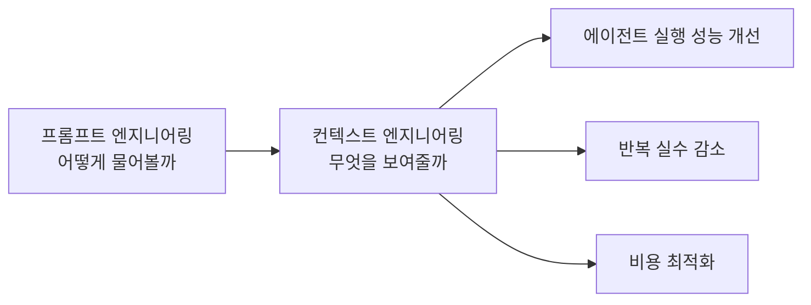

## 왜 프롬프트만으로는 한계가 생겼을까

영상의 핵심 전제는 간단합니다.
AI가 더 이상 단일 Q&A가 아니라, 도구를 연속 호출하며 다단계 업무를 수행하는 환경으로 바뀌었다는 점입니다.

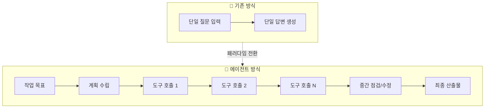

즉, 이제는 대사 한 줄을 고치는 기술보다 "시나리오 전체를 설계하는 기술"이 중요해졌습니다.

## 컨텍스트 엔지니어링의 정의

영상에서는 컨텍스트 엔지니어링을 다음처럼 설명합니다.

> AI가 다음 할 일을 제대로 수행하도록, 필요한 정보만 선별해 전달하는 설계 기술

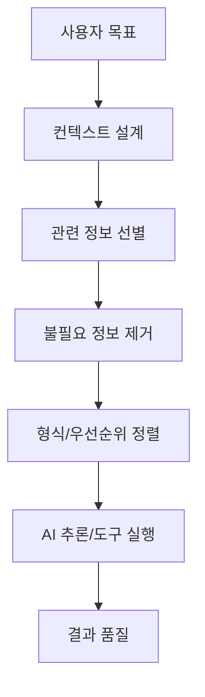

## 컨텍스트를 구성하는 7가지 요소

질문은 컨텍스트의 일부일 뿐입니다.
영상의 프레임으로 보면, 실제 결과를 좌우하는 요소는 아래처럼 더 넓습니다.

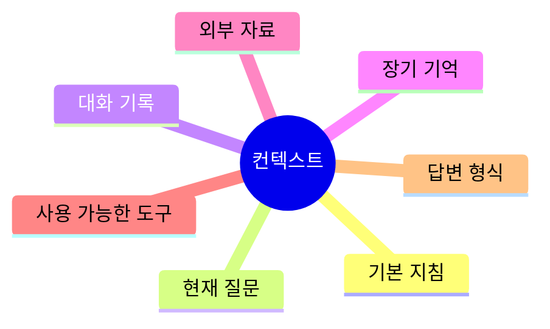

이 관점으로 보면 "질문 잘 쓰기"는 7개 중 1개만 다루는 셈입니다.

## 실패 패턴: 컨텍스트가 나쁘면 생기는 4가지 문제

영상에서 강조한 문제를 운영 관점으로 재정리하면 아래와 같습니다.

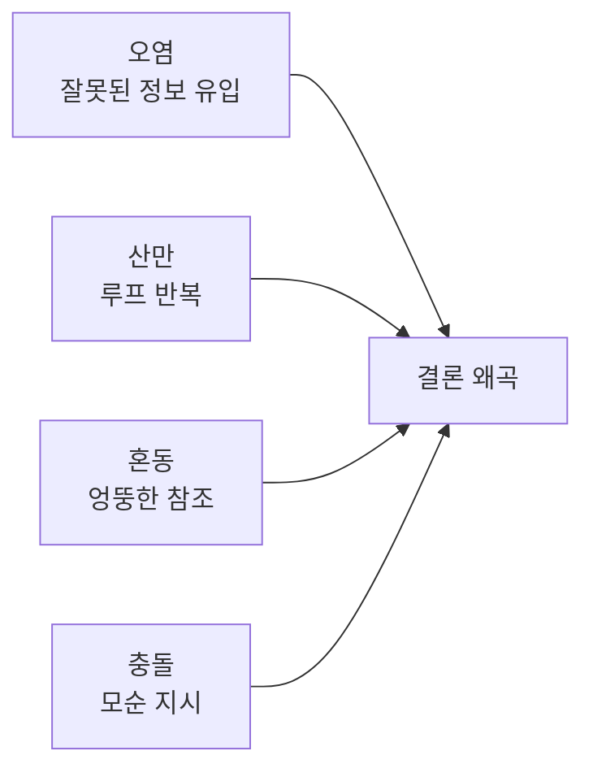

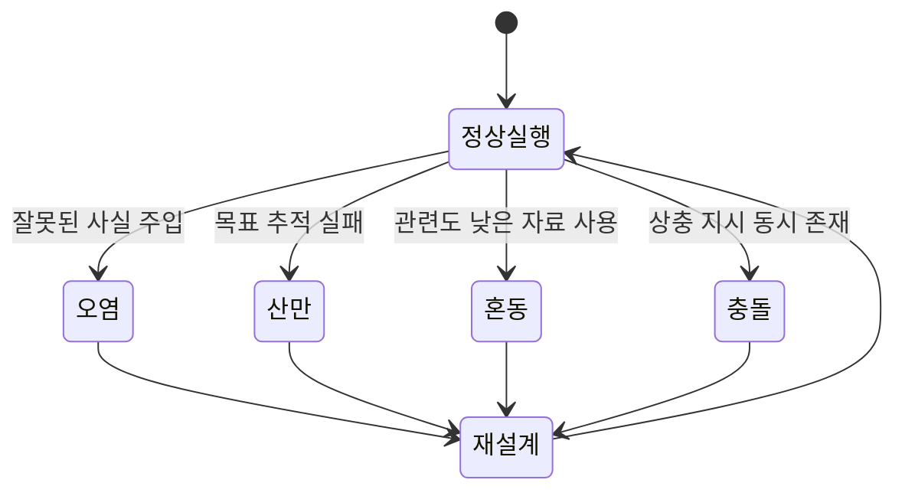

## 실무 전략 4가지: 저장, 선별, 요약, 분할

영상의 실행 전략을 팀 적용 관점으로 도식화하면 다음과 같습니다.

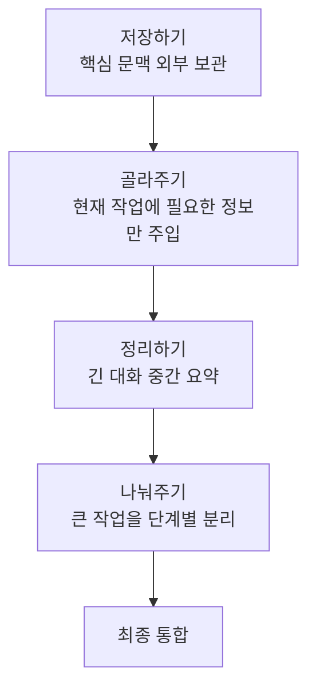

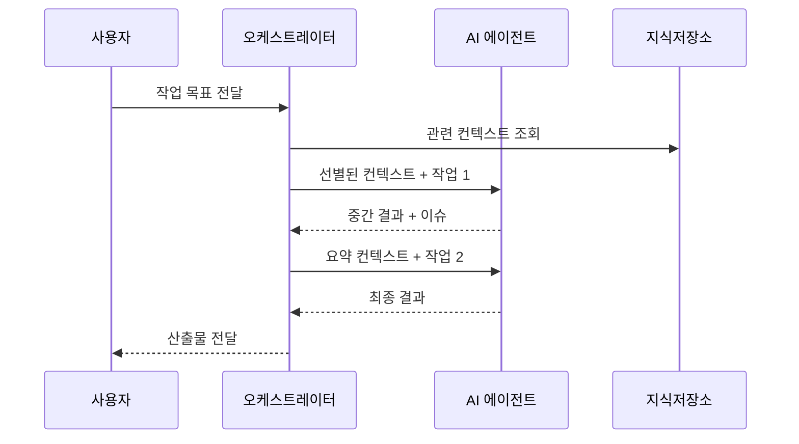

## To-Do 루프가 중요한 이유

영상에서 특히 강조되는 운영 팁은 "작업 시작 시 To-Do를 만들고 단계별로 갱신"하는 방식입니다.

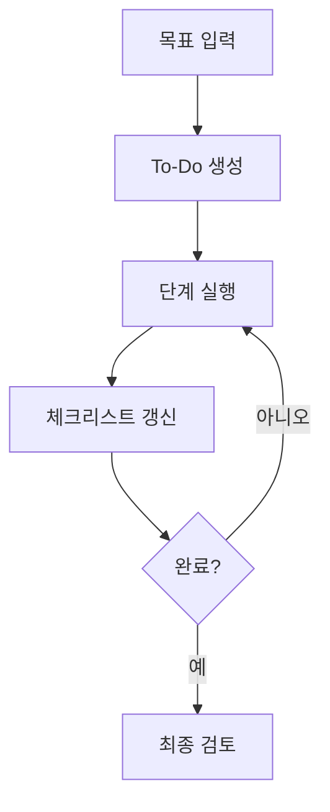

긴 작업에서 목표 이탈을 막고, 실패 원인을 추적하기 쉬워지는 구조입니다.

## 비용 관점: 캐싱은 왜 중요한가

영상의 중요한 메시지 중 하나는 "같은 컨텍스트를 안정적으로 재사용하면 비용이 크게 줄어든다"는 점입니다.
반대로 매 요청마다 바뀌는 정보(예: 현재 시각)를 고정 프리픽스에 넣으면 캐시 효율이 떨어집니다.

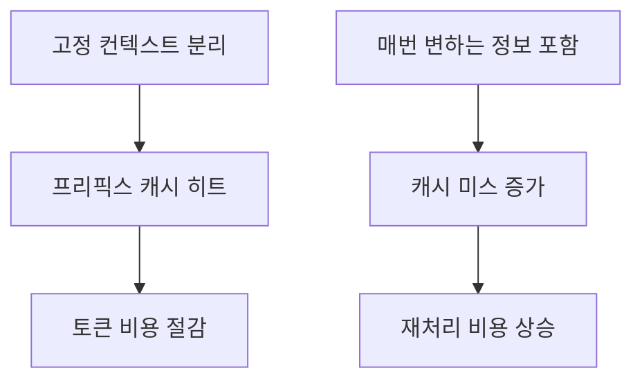

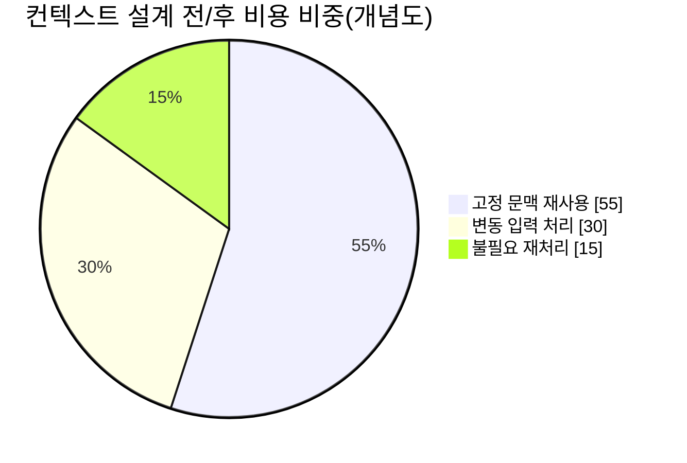

## 바로 적용하는 실전 템플릿

아래 템플릿을 업무 프롬프트 시작점으로 쓰면, "질문 문장"이 아니라 "작업 문맥" 중심으로 요청을 구성할 수 있습니다.

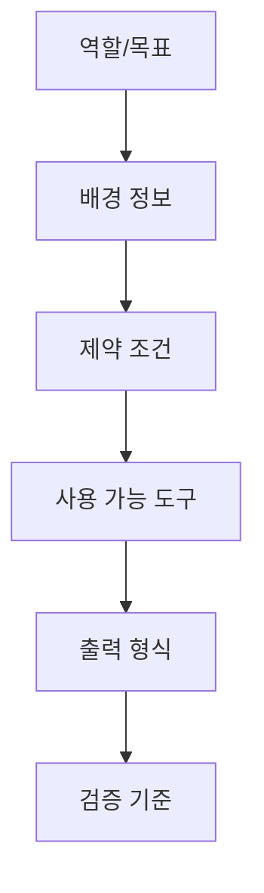

실무 입력 예시(요약):

1. 역할: "당신은 B2B 마케팅 매니저 어시스턴트다."
2. 목표: "거래처 미팅 일정 조율 메일 작성"
3. 배경: "이전 논의, 상대 선호 시간, 금지 표현"
4. 제약: "톤은 정중/길이는 7문장 이하"
5. 출력: "제목 3개 + 본문 1개"
6. 검증: "오해 가능 표현 제거 체크리스트 포함"

## 결론

영상의 메시지를 한 문장으로 요약하면 이것입니다.

**이제 AI 활용력은 질문 문장 스킬이 아니라, 컨텍스트를 설계하는 운영 능력에서 갈립니다.**

모델이 좋아질수록 격차는 더 줄어들 것 같지만, 실제로는 반대입니다.
좋은 모델일수록 좋은 컨텍스트에서 더 큰 성능 차이를 내기 때문입니다.

## 참고

- [90%가 모르는 AI 활용법… 질문이 아니라 '이것'입니다 (YouTube)](https://www.youtube.com/watch?v=s6mXMxU7VEw)
- [메이커 에반 | Maker Evan](https://www.youtube.com/@maker-evan)
- [BESPIN GLOBAL - 컨텍스트 엔지니어링](https://www.bespinglobal.com/trend-letter/context-engineering-ai/)
- [한빛미디어 - AI 에이전트와 컨텍스트 엔지니어링](https://m.hanbit.co.kr/channel/view.html?cmscode=CMS2153195484)
- [IBM - 2026 AI 트렌드](https://www.ibm.com/kr-ko/think/news/ai-tech-trends-predictions-2026)
