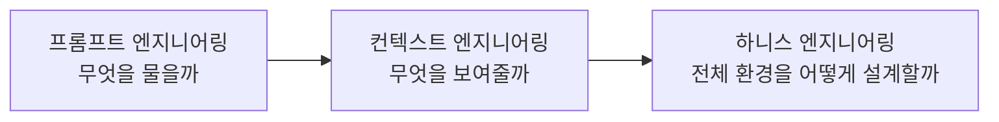
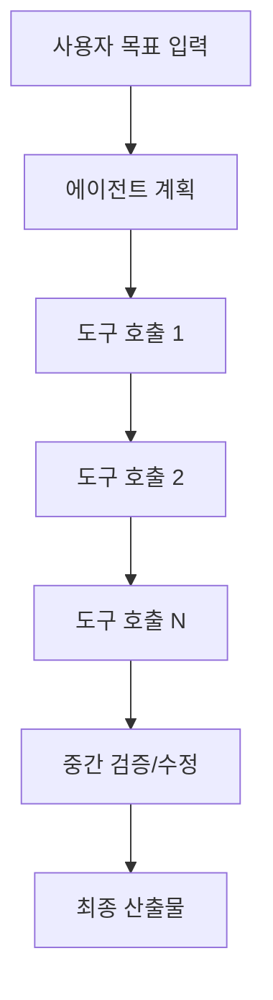
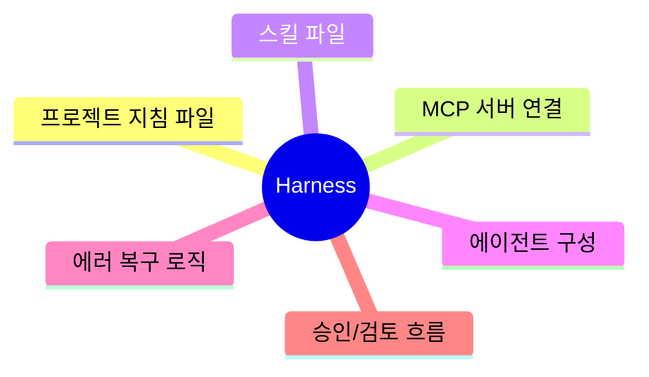
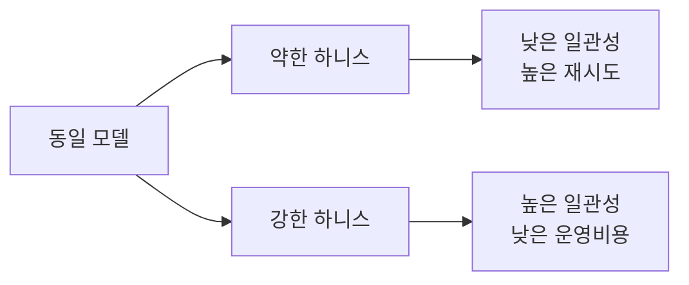
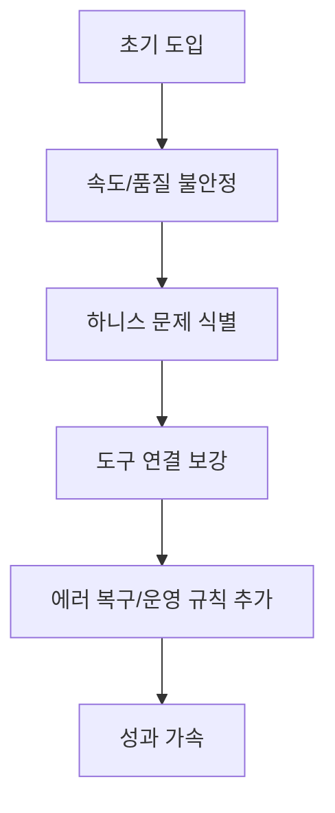
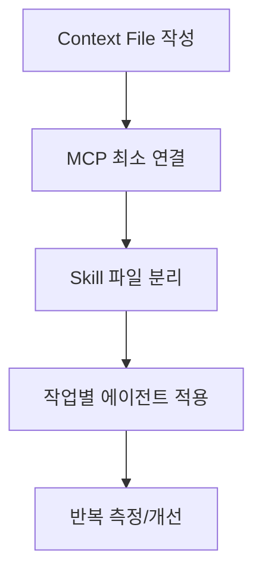

AI 활용의 병목은 모델 자체보다, 모델이 일할 수 있는 환경 설계에 있다는 주장이 빠르게 힘을 얻고 있습니다.

이 글은 아래 영상을 기반으로, 하니스 엔지니어링의 개념과 실무 적용 순서를 한 번에 정리한 레퍼런스 노트입니다.

- 영상: [https://www.youtube.com/watch?v=BssPGKsP60s&t=12s](https://www.youtube.com/watch?v=BssPGKsP60s&t=12s)
- 채널: 메이커 에반 | Maker Evan

<!--more-->

## 핵심 요약

1. 프롬프트 엔지니어링은 "무엇을 물을까"에 집중한다.
2. 컨텍스트 엔지니어링은 "무엇을 보여줄까"를 설계한다.
3. 하니스 엔지니어링은 컨텍스트, 도구 연결, 스킬, 에이전트 설정까지 포함한 전체 운영 환경 설계다.
4. 같은 모델도 하니스 품질에 따라 결과 격차가 크게 벌어진다.
5. 실무 시작점은 `컨텍스트 파일`, `MCP 연결`, `스킬 파일` 3가지다.

## 왜 하니스 엔지니어링이 등장했나

영상의 문제의식은 명확합니다.
AI가 단일 Q&A에서 멈추지 않고, 다단계 작업을 스스로 수행하는 에이전트 모드로 넘어가면서 "질문 한 줄" 최적화만으로는 품질을 보장하기 어려워졌다는 점입니다.

즉, 이제는 모델이 똑똑한가보다 **모델이 일할 수 있는 작업장(하니스)이 잘 설계됐는가**가 더 중요해졌습니다.

## 하니스 엔지니어링의 구성 요소

영상 기준으로 하니스는 아래 요소를 함께 다루는 개념입니다.

- 프로젝트 지침 파일(예: `CLAUDE.md`)
- MCP 서버 설정(외부 도구 연결)
- 스킬 파일(작업별 전문 지식)
- 에이전트 설정(역할/책임 분리)

영상의 비유를 빌리면,
컨텍스트 엔지니어링이 "좋은 재료 고르기"라면 하니스 엔지니어링은 "주방 전체 설계"에 가깝습니다.

## 핵심 주장: 모델이 아니라 하니스가 병목이다

영상에서 반복되는 메시지는 아래 한 줄로 요약됩니다.

> 같은 모델도 어떤 환경에서 어떻게 운영하느냐에 따라 성과가 크게 달라진다.

즉, "어떤 모델을 쓰느냐" 경쟁에서 "어떤 작업 환경을 설계했느냐" 경쟁으로 무게중심이 이동한 것입니다.

## 영상 사례: OpenAI 내부 에이전트 운용에서 나온 교훈

영상에서는 OpenAI 내부 사례를 다음처럼 소개합니다.

- Codex 기반 에이전트만으로 내부 제품 개발 시도
- 초기에는 기대보다 느렸음
- 원인은 모델 성능보다 하니스 세팅 부족(도구 연결, 복구 로직, 운영 규칙)
- 하니스를 정비하면서 성과가 가속됨

또한 영상 내 수치로는 "5개월 동안 100만 줄 코드, 1500개 PR 머지" 같은 지표가 언급됩니다.
이 수치는 영상 화자의 제시 값으로 이해하는 것이 안전합니다.

## 실무 적용: 지금 당장 시작할 3단계

### 1) 컨텍스트 파일을 먼저 고정

프로젝트 구조, 코딩 규칙, 리뷰 기준, 금지사항을 대화가 아니라 파일로 고정합니다.

### 2) MCP 연결을 최소 단위로 설계

브라우저 자동화, 문서 검색, 디자인 도구 등 필요한 도구만 연결하고, 과도한 도구 노출은 피합니다.

### 3) 스킬 파일로 작업별 전문성 분리

코드 리뷰, 문서 작성, 배포 점검처럼 반복되는 작업을 스킬로 모듈화합니다.

## 운영 체크리스트

아래 항목이 갖춰져 있으면 하니스 기반 운영으로 넘어갈 준비가 된 상태입니다.

1. 프로젝트 규칙이 대화창이 아닌 파일에 남아 있는가?
2. 에이전트가 쓸 도구 범위와 권한이 명확한가?
3. 반복 작업이 스킬 파일로 표준화되어 있는가?
4. 실패 시 복구 규칙(재시도/중단/승인)이 정의되어 있는가?
5. 산출물 품질을 검증할 체크포인트가 있는가?

## 결론

2025년이 컨텍스트 엔지니어링의 해였다면,
영상의 메시지대로 2026년은 하니스 엔지니어링의 해라고 볼 수 있습니다.

AI 모델 성능은 점점 평준화되지만,
하니스는 팀의 운영 방식과 축적된 노하우가 반영되어 쉽게 복제되지 않습니다.
결국 장기 경쟁력은 "어떤 모델을 쓰는가"보다 "AI가 성과를 내는 환경을 얼마나 잘 설계했는가"에서 결정됩니다.

## 참고

- [YouTube: 하니스 엔지니어링 관련 영상](https://www.youtube.com/watch?v=BssPGKsP60s&t=12s)
- [Model Context Protocol](https://modelcontextprotocol.io/)
