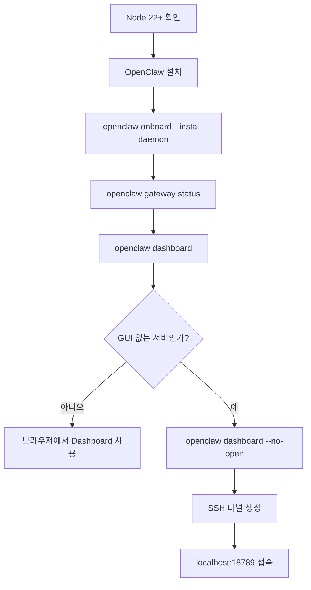
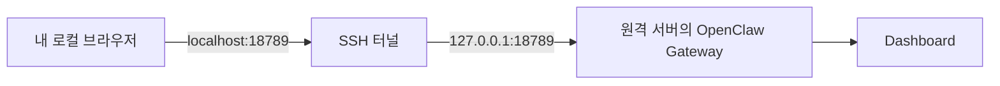
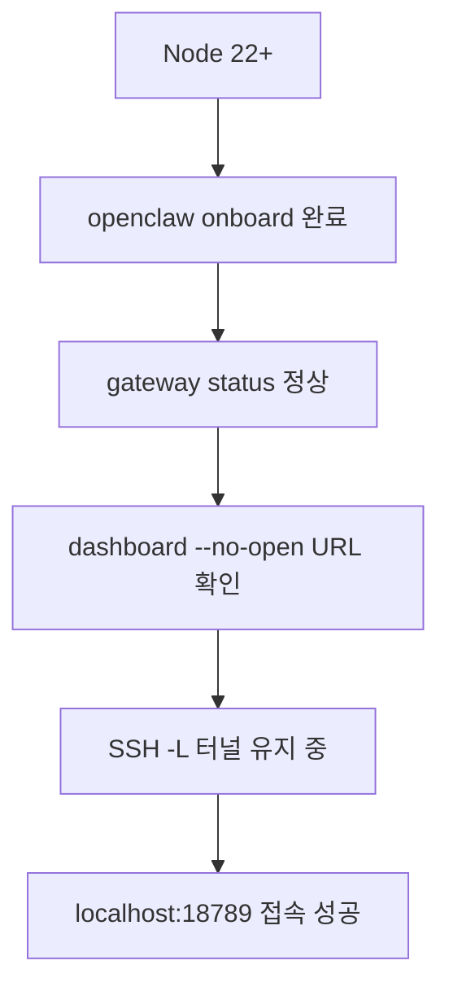

OpenClaw를 처음 설치할 때는 공식 문서의 최소 경로대로 진행하면 가장 빠르게 동작을 확인할 수 있습니다.

이 글은 [Getting Started](https://docs.openclaw.ai/start/getting-started)와 [Remote Access](https://docs.openclaw.ai/gateway/remote)를 기준으로,

1. 설치
2. 온보딩
3. Dashboard 실행
4. 서버에서 `--no-open` 출력이 나왔을 때 원격 접속

까지 한 번에 정리한 실전용 가이드입니다.

<!--more-->

## 전체 흐름 한눈에 보기



## 1) 사전 준비

공식 문서 기준 필수 조건은 다음 하나입니다.

- Node.js 22 이상

```bash
node --version
```

## 2) OpenClaw 설치

### macOS / Linux

```bash
curl -fsSL https://openclaw.ai/install.sh | bash
```

### Windows (PowerShell)

```powershell
iwr -useb https://openclaw.ai/install.ps1 | iex
```

## 3) 온보딩과 게이트웨이 확인

설치 후 바로 온보딩을 실행합니다.

```bash
openclaw onboard --install-daemon
```

다음으로 게이트웨이 상태를 확인합니다.

```bash
openclaw gateway status
```

정상이면 Dashboard를 엽니다.

```bash
openclaw dashboard
```

## 4) 서버 환경에서 Dashboard 접속하기 (`--no-open`)

리눅스 서버처럼 GUI가 없는 환경에서 아래처럼 실행하면:

```bash
openclaw dashboard --no-open
```

다음과 같은 핵심 메시지가 나옵니다.

```text
Dashboard URL: http://127.0.0.1:18789/#token=...
No GUI detected. Open from your computer:
ssh -N -L 18789:127.0.0.1:18789 gyuha@192.168.0.11
Then open:
http://localhost:18789/
http://localhost:18789/#token=...
```

이 출력의 의미는 간단합니다.

1. OpenClaw Dashboard는 서버의 `127.0.0.1:18789`(루프백)에서 열려 있음
2. 내 로컬 PC에서 직접 접근할 수 없으므로 SSH 로컬 포트 포워딩 필요
3. 터널을 열면 로컬 `localhost:18789`로 서버 Dashboard에 접속 가능

## 5) 실제 원격 접속 절차

로컬 컴퓨터(내 노트북/데스크톱)에서 아래 명령을 실행합니다.

```bash
ssh -N -L 18789:127.0.0.1:18789 gyuha@192.168.0.11
```

그리고 브라우저에서 다음 주소를 엽니다.

```text
http://localhost:18789/
```

토큰 인증이 필요하면 CLI가 출력한 URL 그대로 열면 됩니다.

```text
http://localhost:18789/#token=2cf9481971b618af3e439e78930f22d812368c16eee30bb1
```

`--no-open`은 브라우저를 자동 실행하지 않겠다는 옵션일 뿐이고,
실제 Dashboard 엔드포인트와 토큰은 그대로 출력해 주기 때문에 원격 서버에서 특히 유용합니다.

## 6) 왜 SSH 터널이 필요한가?



공식 Remote Access 문서도 기본 권장값을 "루프백 바인드 + SSH 터널"로 안내합니다.

- 게이트웨이를 외부 공개하지 않고
- 필요한 때만 터널을 열어
- 원격 제어하는 방식이라 안전하고 단순합니다.

## 7) 자주 확인하는 체크리스트



- 포트가 기본값이 아닐 경우 `18789`를 실제 포트로 바꿔서 터널링
- SSH 세션이 끊기면 Dashboard 접속도 같이 끊김
- `#token=...` URL은 인증 정보이므로 공유 시 주의

## 참고

- [OpenClaw Getting Started](https://docs.openclaw.ai/start/getting-started)
- [OpenClaw Remote Access](https://docs.openclaw.ai/gateway/remote)
- [OpenClaw Dashboard](https://docs.openclaw.ai/web/dashboard)
- [OpenClaw Gateway Remote Docs](https://docs.openclaw.ai/gateway/remote)
