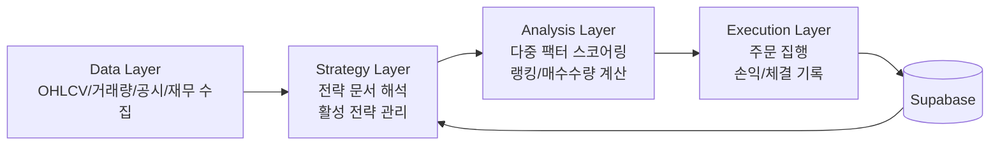
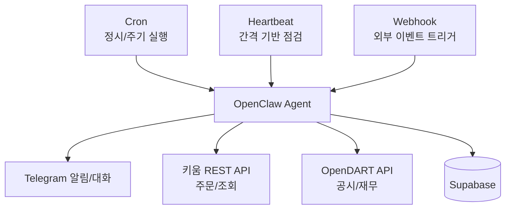
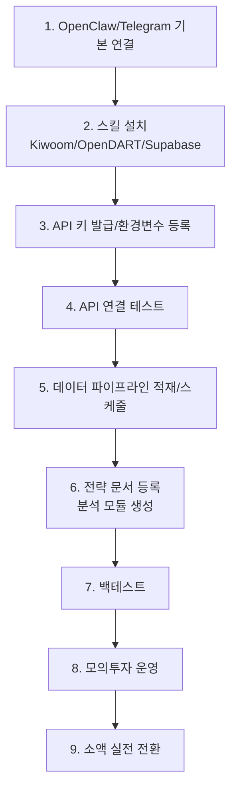
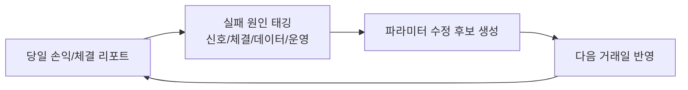

OpenClaw를 트레이딩에 붙이면 "지표 조회 자동화" 수준을 넘어서, 전략 문서를 해석하고 점수화 로직을 만들고 주문까지 연결하는 운영 체계를 만들 수 있습니다.

이번 글은 아래 두 소스를 기준으로, 실제로 따라 할 수 있는 구축 순서와 운영 체크포인트를 한 번에 정리한 실전형 포스팅입니다.

- 영상: [OpenClaw Utilization Guide](https://www.youtube.com/watch?v=CgniMVyJtmg&t=733s)
- 문서: [OpenClaw Trading Notion](https://dante-labs-english.notion.site/openclaw-trading)

<!--more-->

## 핵심 요약

OpenClaw Trading의 본질은 "매매 봇 하나 실행"이 아니라 다음 루프를 계속 돌리는 것입니다.

1. 데이터 수집 파이프라인 구축
2. 전략 문서 기반 분석 모듈 생성
3. 종목 스코어링 및 주문 집행
4. 결과 기록과 피드백을 다음 전략에 반영

즉, 사람이 매일 감으로 진입/청산을 판단하는 구조가 아니라, **전략-실행-회고를 자동화 가능한 운영 시스템**으로 바꾸는 접근입니다.

## 시스템 구조: 4계층 아키텍처

### 1) Data Layer

- OHLCV, 거래량, 공시/재무 데이터 수집
- 종목군(예: 거래량 상위 Top 50) 기준 적재
- 장중/장후/새벽 정리 작업까지 스케줄링

### 2) Strategy Layer

- 투자 전략 보고서(PDF/문서) 입력
- LLM이 전략 규칙을 실행 가능한 로직으로 변환
- 전략 버전 관리(활성/비활성)

### 3) Analysis Layer

- 다중 팩터 스코어링(수치, 차트, 뉴스/감성 등)
- 종목별 점수, 랭킹, 예산 대비 매수 수량 계산
- Python 분석 모듈 자동 생성/수정

### 4) Execution Layer

- 스케줄 또는 신호 기반 주문 실행
- 예산 한도와 분산 투자 규칙 적용
- 주문/체결/손익 로그 저장

## OpenClaw가 자동으로 돌아가는 3가지 메커니즘

### Cron

정해진 시간에 작업을 실행합니다.

- 예: 장중 5분 수집, 장후 일봉 적재, 장마감 전 청산

### Heartbeat

고정 시각이 아니라 "간격 기반"으로 상태를 확인합니다.

- 장애 감지, 누락 점검, 알림에 유리

### Webhook

외부 이벤트가 들어오면 작업을 깨웁니다.

- 메시지/트리거 기반 실행

## 기술 스택 조합이 중요한 이유

영상/문서 흐름에서 강조되는 조합은 다음입니다.

- **키움 REST API**: 자동매매 실행 경로
- **OpenDART API**: 공시/재무 데이터 보강
- **Supabase(Postgres)**: 데이터/전략/결과 저장소
- **Telegram**: 운영 커뮤니케이션 채널

포인트는 "모델이 똑똑하다"가 아니라, **실행 가능한 인프라와 연결되어 있느냐**입니다.

## 구축 절차: 실무에서 바로 쓰는 순서

### 1) 기본 환경 준비

1. OpenClaw 설치 및 초기 설정
2. Telegram bot 연결(대화 승인/송수신 확인)
3. 스킬 경로 확인 (`~/.openclaw/skills`)

### 2) 스킬 설치

- 키움 REST API 스킬
- OpenDART API 스킬
- Supabase/Postgres 관련 스킬
- 시크릿/환경변수 관리 스킬

핵심은 임시 프롬프트가 아니라, 반복 가능한 작업을 스킬로 고정하는 것입니다.

### 3) API 키 발급 및 환경변수 등록

필수 항목 예시:

- `SUPABASE_URL`
- `SUPABASE_SECRET_KEY`
- `SUPABASE_DB_PASSWORD`
- `OPENDART_API_KEY`
- `KIWOOM_MOCK_APP_KEY`, `KIWOOM_MOCK_SECRET_KEY`, `KIWOOM_MOCK_ACCOUNT_NO`
- `KIWOOM_APP_KEY`, `KIWOOM_SECRET_KEY`, `KIWOOM_ACCOUNT_NO`

실전 팁: 모의/실전 키는 변수명부터 명확히 분리해야 운영 사고를 줄일 수 있습니다.

### 4) API 연결 테스트(반드시 선행)

순서:

1. Supabase 읽기/쓰기 테스트
2. OpenDART 조회 테스트
3. 키움 REST API 핵심 엔드포인트 테스트

이 단계를 건너뛰면, 이후 문제 발생 시 전략 오류와 인프라 오류를 구분하기가 어려워집니다.

## 데이터 파이프라인 설계 예시

영상 흐름 기준 운영 주기:

- 장중: 5분 봉 데이터 수집
- 장후: 일봉/집계 데이터 적재
- 공시: 10분 단위 모니터링
- 새벽: 정리/청소 작업

또한 예시로 Top 50 종목군 대상 데이터 적재(수천 건 규모)를 수행하고, 기술/재무/공시/스냅샷 테이블을 분리 관리합니다.

중요한 운영 포인트는 하나입니다.

**"스케줄 문서 작성"이 아니라, 실제 cron 등록 여부를 반드시 검증해야 한다.**

## 전략 생성: 감 대신 근거로

영상/문서에서는 전략 설계 시 다음 흐름을 추천합니다.

1. 리서치 도구(예: Deep Research)로 전략 아이디어 정리
2. 진입/청산/가중치/임계값을 수식/파라미터로 명시
3. 분석 코드를 자동 생성하고 버전 관리
4. 백테스트로 1차 검증

예시로 통합 점수 임계값(예: 70점 이상 진입) 같은 규칙을 명확히 수치화해, 전략 해석 편차를 줄이는 접근을 사용합니다.

## 백테스트와 실거래는 다르게 나온다

소스에서 제시된 백테스트 수치(승률/손익비 등)는 참고 지표일 뿐, 그대로 실거래 성과를 보장하지 않습니다.

대표적인 이유:

- 과최적화(Overfitting)
- 체결 지연/슬리피지
- 장중 분석 지연으로 인한 타이밍 미스
- API/네트워크/운영 장애

권장 순서는 항상 같습니다.

1. 모의투자 충분 검증
2. 소액 실전
3. 점진적 증액

## 실행 레이어 운영 예시

데이트레이딩 형태 기준으로는 다음 패턴이 자주 사용됩니다.

- 장중 특정 시각: 스냅샷 + 스코어링 실행
- 예산 사용 한도 적용(예: 자산의 일정 비율)
- 종목별 상/하한 규칙으로 분산 매수
- 장마감 전 일괄 청산

이 구조는 "당일 리스크 종료"에 유리하지만, 스윙 전략에는 별도 청산 규칙이 필요합니다.

## 운영에서 성능을 만드는 진짜 포인트

자동매매는 주문 자동화보다 **회고 자동화**가 더 중요합니다.

매일 최소 루프:

1. 당일 손익/체결 리포트 생성
2. 실패 원인 태깅(신호/체결/데이터/운영)
3. 파라미터 수정 후보 제안
4. 다음 거래일 반영

이 루프가 없으면, 시스템은 "자동 실행"만 하고 "자동 개선"은 하지 못합니다.

## 리스크 관리 체크리스트

- 모의/실전 계정과 키를 완전히 분리했는가
- 주문 전 한도(일손실, 종목당 익스포저)를 강제했는가
- 데이터 누락/지연 감지 알림이 있는가
- 비정상 응답 시 주문 중지(fail-safe) 규칙이 있는가
- cron이 실제 등록되어 있고 주기 점검 중인가
- 로그/감사 추적(누가, 언제, 어떤 규칙으로 주문했는가)이 가능한가

## 비용 최적화 전략

운영 단계에서 놓치기 쉬운 부분이 모델/API 비용입니다.

- 전략 설계/재구성: 상위 모델
- 일상 운영/반복 분석: 경량 모델
- 이벤트성 재검증: 상위 모델 재투입

결국 목표는 "수익률"뿐 아니라 **수익 - 운영비(모델/API/인프라)** 기준으로 시스템을 관리하는 것입니다.

## 마무리

OpenClaw Trading은 "AI에게 주문을 맡긴다"보다 훨씬 큰 개념입니다.

정확히는, **전략 지식 + 데이터 파이프라인 + 자동 집행 + 피드백 학습**을 하나의 운영 시스템으로 묶는 작업입니다.

자동매매를 시작할 때 가장 먼저 해야 할 일은 화려한 전략이 아니라, 안전하게 반복 실행 가능한 기본 루프를 만드는 것입니다.

## 참고

- [OpenClaw 홈페이지](https://openclaw.ai)
- [OpenClaw Repository](https://github.com/openclaw/openclaw)
- [OpenClaw Utilization Guide (YouTube)](https://www.youtube.com/watch?v=CgniMVyJtmg&t=733s)
- [OpenClaw Trading (Notion)](https://dante-labs-english.notion.site/openclaw-trading)
- [키움증권 REST API 개발자 포털](https://openapi.koreainvestment.com)
- [Liner AI (딥리서치)](https://hey.liner.com/ixyht1)
- [OpenDART (공시정보)](https://opendart.fss.or.kr/)
- [Supabase (클라우드 데이터베이스)](https://supabase.com)
- [SkillsMP (스킬 마켓플레이스)](https://skill.sh)
- [스킬 다운로드 유틸](https://github.com/dandacompany/dantelabs-agentic-school)
- [Telegram Bot 공식 문서](https://core.telegram.org/bots)
