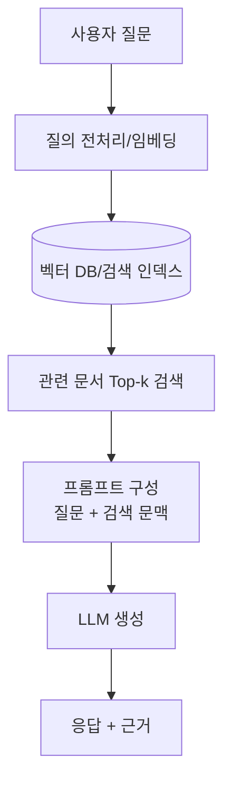
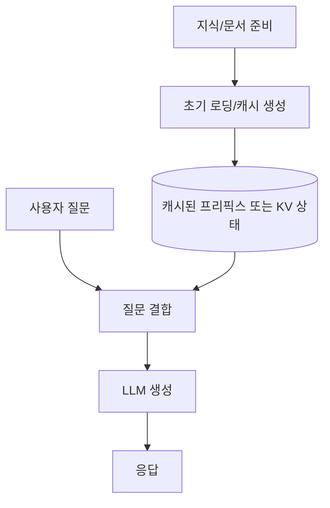
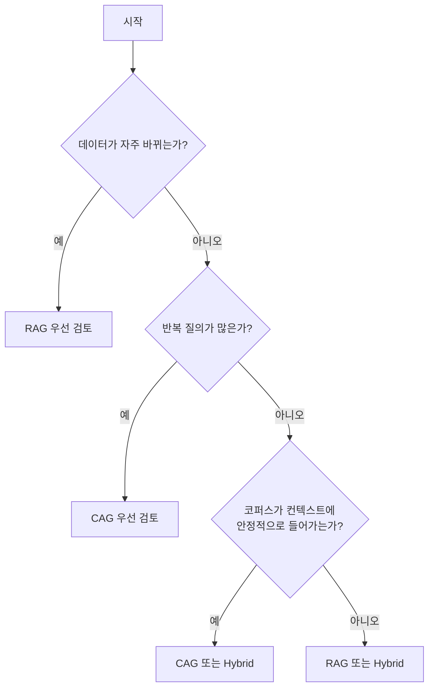

LLM 애플리케이션을 만들다 보면 결국 같은 질문에 부딪힙니다.

"외부 지식을 **매 요청마다 검색(RAG)** 할지, 아니면 **미리 넣어두고 캐시(CAG)** 할지"

이 글은 공식 문서와 논문을 바탕으로 RAG와 CAG를 실무 관점에서 비교합니다.

<!--more-->

## 먼저 용어 정리: 이 글에서 CAG는 무엇인가?

먼저 주의할 점이 있습니다. CAG라는 약어는 문맥에 따라 다르게 쓰일 수 있습니다.

- 이 글에서 CAG는 **Cache-Augmented Generation**(캐시 증강 생성)을 의미합니다.
- 즉, 질의 시점의 실시간 검색을 줄이거나 생략하고, 미리 준비한 컨텍스트/캐시를 활용하는 접근입니다.

## RAG 한 장 요약

RAG(Retrieval-Augmented Generation)는 질의가 들어올 때마다 관련 문서를 검색해 LLM 프롬프트에 붙여 답변을 생성하는 방식입니다.

### RAG의 강점

- 문서가 자주 바뀌는 환경에 유리합니다.
- 대규모 지식베이스(문맥창보다 큰 규모)에도 확장하기 쉽습니다.
- 검색된 근거를 함께 보여주기 쉬워 감사/추적에 강합니다.

### RAG의 주의점

- 검색 품질(청킹, 임베딩, 리랭킹)에 따라 답변 품질이 흔들립니다.
- 검색 단계가 추가되어 시스템 복잡도와 지연이 늘어납니다.

## CAG 한 장 요약

CAG(Cache-Augmented Generation)는 자주 쓰는 컨텍스트를 미리 로딩/캐싱해, 반복 질의에서 재사용하는 접근입니다.

### CAG의 강점

- 반복 질의 워크로드에서 지연과 비용을 낮추기 쉽습니다.
- 검색 계층이 줄어 아키텍처가 단순해집니다.

### CAG의 주의점

- 지식이 자주 바뀌면 캐시 무효화/재생성 전략이 필요합니다.
- 모델 컨텍스트 크기와 캐시 정책 제약을 직접 관리해야 합니다.

## RAG vs CAG 핵심 비교

| 항목 | RAG | CAG |
|---|---|---|
| 지식 반영 방식 | 질의 시점 실시간 검색 | 사전 로딩/캐시 재사용 |
| 데이터 변경 대응 | 강함 (업데이트 반영 용이) | 보통 (재캐시 필요) |
| 시스템 구성 | 검색 파이프라인 필요 | 상대적으로 단순 |
| 응답 근거 추적 | 용이 | 구현 방식에 따라 다름 |
| 반복 질의 효율 | 중간 | 높음(캐시 히트 시) |
| 대규모 코퍼스 확장 | 유리 | 컨텍스트/캐시 한계에 영향 |

## 언제 무엇을 선택할까?

실무에서는 **하이브리드**도 자주 씁니다.

- 변동이 큰 데이터: RAG로 최신성 확보
- 고정된 정책/핸드북/반복 규칙: CAG로 캐시 효율 확보

## 구현 팁 (짧게)

### RAG 품질을 올리려면

- 청킹 기준(길이/의미 단위)을 먼저 고정합니다.
- 검색 후 리랭킹 단계를 넣어 관련도 편차를 줄입니다.
- "검색 실패" 케이스를 별도로 로깅해 인덱스 품질을 개선합니다.

### CAG 효율을 올리려면

- 프롬프트에서 고정 프리픽스를 앞에 두고, 변동 입력을 뒤에 둡니다.
- 캐시 키 전략(테넌트/문서 버전 단위)을 명시합니다.
- TTL, 캐시 무효화, 버전 롤백 정책을 운영 규칙으로 둡니다.

## 결론

RAG와 CAG는 경쟁이라기보다 **워크로드에 따라 분업**하는 관계에 가깝습니다.

- 최신성/대규모/근거 추적이 핵심이면 RAG
- 반복 질의/지연·비용 최적화가 핵심이면 CAG
- 대부분의 프로덕션은 둘을 섞는 하이브리드가 현실적입니다.

---

## 참고 자료

1. Lewis et al., "Retrieval-Augmented Generation for Knowledge-Intensive NLP Tasks" (arXiv, 2020): https://arxiv.org/abs/2005.11401
2. Chan et al., "Don't Do RAG: When Cache-Augmented Generation is All You Need for Knowledge Tasks" (arXiv, 2024/2025): https://arxiv.org/abs/2412.15605
3. OpenAI Docs, "Prompt caching": https://developers.openai.com/api/docs/guides/prompt-caching/
4. Anthropic Docs, "Prompt caching": https://docs.anthropic.com/en/docs/build-with-claude/prompt-caching
5. Anthropic News, "Introducing Contextual Retrieval" (RAG 품질 향상 관련): https://www.anthropic.com/news/contextual-retrieval
6. Google Cloud, "Vertex AI RAG Engine overview": https://docs.cloud.google.com/vertex-ai/generative-ai/docs/rag-engine/rag-overview
7. AWS Prescriptive Guidance, "Retrieval Augmented Generation options and architectures on AWS": https://docs.aws.amazon.com/prescriptive-guidance/latest/retrieval-augmented-generation-options/introduction.html
