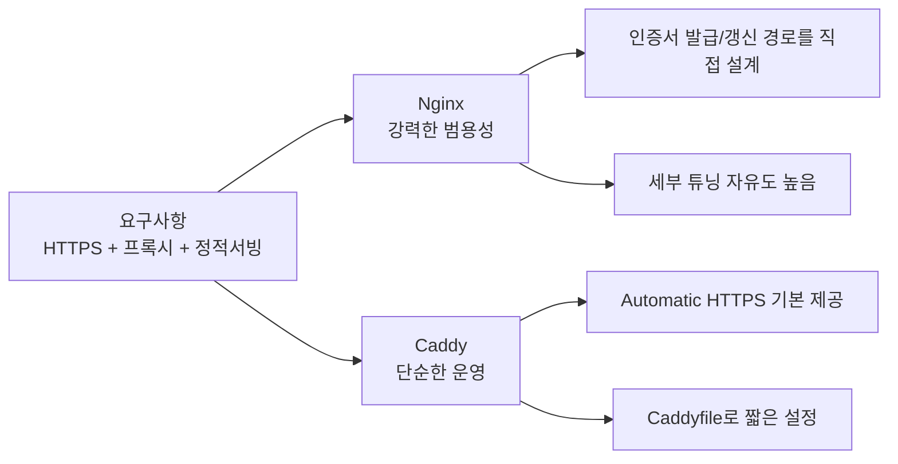
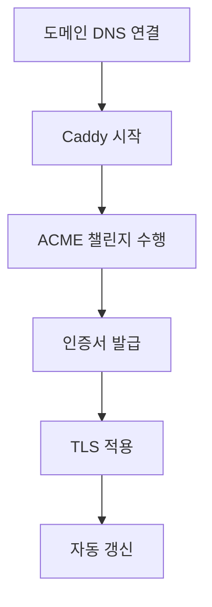

웹서버를 처음 고를 때 가장 자주 나오는 질문이 있습니다.

"Nginx를 써야 할까, Caddy를 써도 될까?"

이 글은 같은 요구사항을 두 서버 설정으로 나란히 보여주면서, 어디서 차이가 나는지 직관적으로 설명합니다.

<!--more-->

## 한눈에 보는 차이



핵심만 먼저 정리하면:

- **Nginx**: 세밀한 제어와 생태계가 강점, 대신 초기 구성과 운영 포인트가 많습니다.
- **Caddy**: 기본값이 좋아서 빠르게 서비스 열기 좋고, HTTPS 자동화가 특히 편합니다.

## 비교 시나리오

아래 3가지를 같은 조건으로 비교합니다.

1. `app.example.com`을 `localhost:3000`으로 프록시
2. HTTPS 적용
3. 정적 파일(`/var/www/site`) 서빙

## 1) 리버스 프록시: 같은 기능, 다른 설정 밀도

### Nginx 예제

```nginx
server {
    listen 80;
    server_name app.example.com;

    location / {
        proxy_pass http://127.0.0.1:3000;
        proxy_set_header Host $host;
        proxy_set_header X-Real-IP $remote_addr;
        proxy_set_header X-Forwarded-For $proxy_add_x_forwarded_for;
        proxy_set_header X-Forwarded-Proto $scheme;
    }
}
```

### Caddy 예제

```caddy
app.example.com {
    reverse_proxy 127.0.0.1:3000
}
```

둘 다 같은 역할이지만, Caddy는 기본 프록시 헤더 처리와 HTTPS 연계가 자연스럽게 이어져 설정이 짧습니다.

## 2) HTTPS: 운영 난이도 차이가 크게 나는 지점

### Nginx 예제 (인증서 설정 포함)

```nginx
server {
    listen 80;
    server_name app.example.com;
    return 301 https://$host$request_uri;
}

server {
    listen 443 ssl http2;
    server_name app.example.com;

    ssl_certificate /etc/letsencrypt/live/app.example.com/fullchain.pem;
    ssl_certificate_key /etc/letsencrypt/live/app.example.com/privkey.pem;

    location / {
        proxy_pass http://127.0.0.1:3000;
    }
}
```

Nginx는 보통 Certbot 같은 도구와 갱신 스케줄을 별도로 운영합니다.

### Caddy 예제 (Automatic HTTPS)

```caddy
app.example.com {
    reverse_proxy 127.0.0.1:3000
}
```

공개 DNS가 올바르게 연결된 도메인이라면, Caddy가 인증서 발급/갱신/적용을 자동으로 처리합니다.



## 3) 정적 파일 서빙: 문법 차이

### Nginx 예제

```nginx
server {
    listen 80;
    server_name static.example.com;
    root /var/www/site;
    index index.html;

    location / {
        try_files $uri $uri/ =404;
    }
}
```

### Caddy 예제

```caddy
static.example.com {
    root * /var/www/site
    file_server
}
```

기본 정적 사이트 운영에서는 Caddy 문법이 더 읽기 쉽고, 작은 팀에서 유지보수 부담이 낮습니다.

## Caddy 사용법: 처음부터 운영까지

여기서는 Linux 서버 기준으로 가장 단순한 흐름만 정리합니다.

### 1) 설치

공식 문서를 기준으로 배포판별 설치 방법을 사용합니다.

- Caddy Docs: https://caddyserver.com/docs/install

### 2) Caddyfile 작성

`/etc/caddy/Caddyfile` 예시:

```caddy
app.example.com {
    reverse_proxy 127.0.0.1:3000
}
```

### 3) 설정 검증

```bash
caddy fmt --overwrite /etc/caddy/Caddyfile
caddy validate --config /etc/caddy/Caddyfile
```

### 4) 서비스 실행/재시작

```bash
sudo systemctl enable caddy
sudo systemctl restart caddy
sudo systemctl status caddy
```

### 5) 로그 확인

```bash
sudo journalctl -u caddy -f
```

운영 관점에서 중요한 점은 "설정이 짧다"보다 "HTTPS 갱신 운영이 자동화된다"는 부분입니다.

## 언제 Caddy를 선택하면 좋은가?

- 소규모/중간 규모 서비스에서 빠르게 HTTPS까지 안정적으로 열고 싶을 때
- Nginx 고급 튜닝보다 운영 단순성이 더 중요할 때
- 인프라 담당자가 적어 인증서 갱신 자동화의 가치가 클 때

## 언제 Nginx가 더 적합한가?

- 이미 Nginx 중심 운영 표준(템플릿, 모듈, 모니터링)이 자리잡은 조직
- 매우 세밀한 트래픽 제어/고급 라우팅/기존 에코시스템 결합이 필요한 경우

## 결론

둘 중 "절대 우위"는 없습니다.

- 빠른 시작과 단순한 HTTPS 운영이 목표라면 Caddy가 유리하고,
- 강한 제어권과 기존 운영 자산을 활용해야 하면 Nginx가 유리합니다.

처음 도입 단계라면, 같은 서비스에 대해 두 설정을 직접 작성해 보고 팀의 운영 부담이 어디서 줄어드는지 비교해 보는 것이 가장 현실적인 선택 방법입니다.

## 참고 자료

1. Caddy Docs - Automatic HTTPS: https://caddyserver.com/docs/automatic-https
2. Caddy Docs - Caddyfile Concepts: https://caddyserver.com/docs/caddyfile/concepts
3. Caddy Docs - `reverse_proxy` Directive: https://caddyserver.com/docs/caddyfile/directives/reverse_proxy
4. Caddy Docs - Install: https://caddyserver.com/docs/install
5. Nginx Docs - Beginner's Guide: https://nginx.org/en/docs/beginners_guide.html
6. Nginx Docs - Reverse Proxy: https://docs.nginx.com/nginx/admin-guide/web-server/reverse-proxy/
7. Certbot Docs: https://certbot.eff.org/
