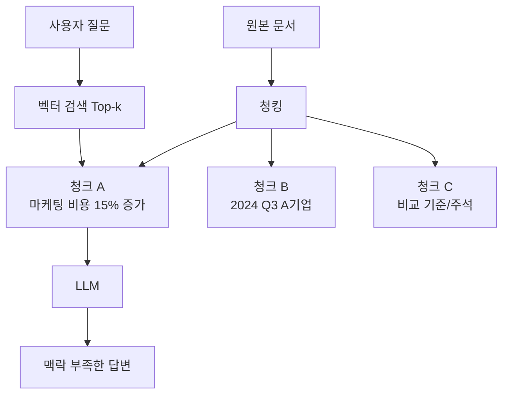
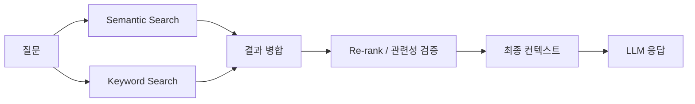
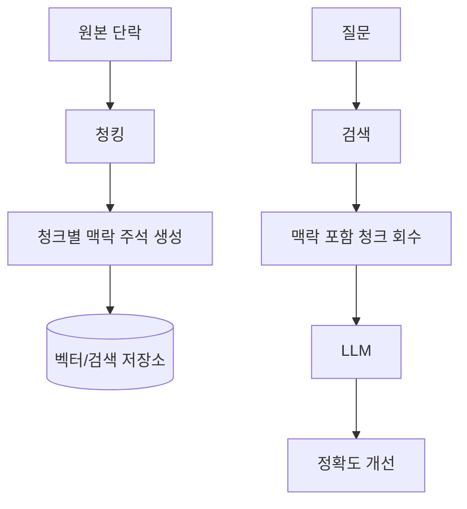
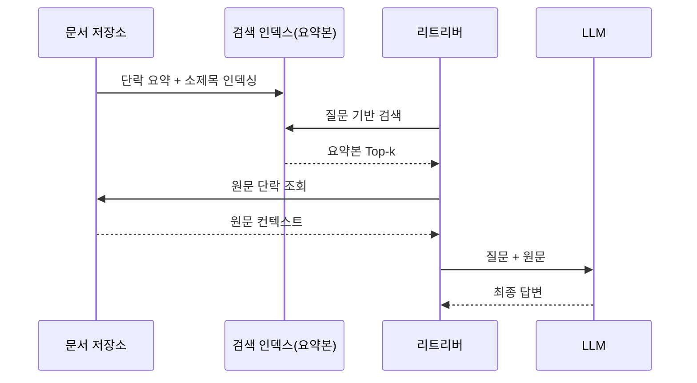
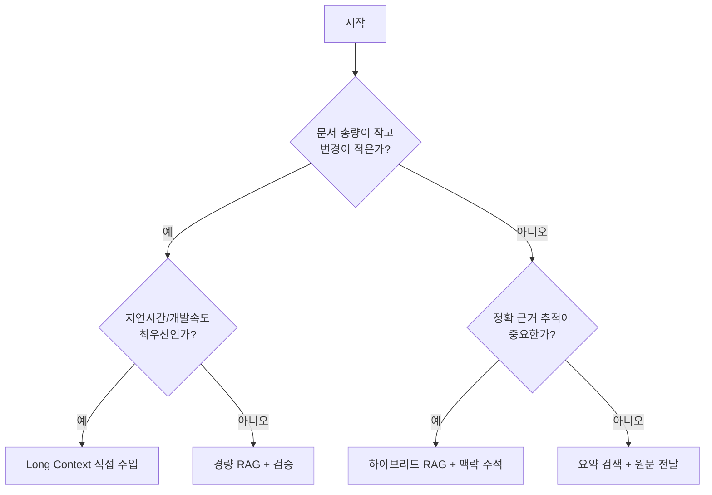

RAG는 죽지 않았습니다.
다만 "문서를 잘라서 벡터 DB에 넣고 Top-k만 붙이는 단순 RAG"가 빠르게 한계를 드러내고 있습니다.

이 글은 아래 영상을 바탕으로, 왜 단순 RAG가 흔들리는지와 지금 바로 적용할 수 있는 개선 패턴을 정리한 실전 노트입니다.

- 영상: [아직도 RAG 쓰세요? 이거 보고 나면 멈춥니다](https://www.youtube.com/watch?v=2jcOpJnHKBw)
- 채널: [메이커 에반 | Maker Evan](https://www.youtube.com/@maker-evan)

<!--more-->

## 3줄 요약

1. 문제는 RAG 자체가 아니라, 문맥이 끊기는 단순 청킹 중심 RAG입니다.
2. 개선의 핵심은 하이브리드 검색 + 검색 후 검증 + 청크에 맥락 주석(Contextual Retrieval)입니다.
3. 문서량이 작을 때는 Long Context 직접 주입이 빠르지만, 비용·확장성·중간 구간 누락 리스크를 같이 봐야 합니다.

## 왜 단순 RAG에서 오답이 늘어날까

영상에서 강조하는 핵심은 "문서를 자르는 순간 의미의 좌표가 사라진다"는 점입니다.

예를 들어 "마케팅 비용이 전 분기 대비 15% 증가"라는 문장만 떼어 놓으면,
어느 회사인지, 어느 분기인지, 어떤 기준인지가 사라집니다.

즉, 검색 히트율과 정답률은 다릅니다.
"비슷한 문장"을 찾는 것만으로는 "정확한 문맥"까지 보장되지 않습니다.

## 영상에서 제시한 개선 전략 1: 하이브리드 검색

의미 기반 검색(semantic)과 키워드 기반 검색(keyword)을 함께 써야 누락이 줄어듭니다.

- 의미 기반: 표현이 달라도 의도가 비슷한 문서를 찾음
- 키워드 기반: 고유명사/정확 용어(예: 삼성전자, 계약번호)를 놓치지 않음

여기서 중요한 포인트는 "검색 후 검증(Re-rank)" 단계입니다.
검색 결과를 그대로 넣지 말고, 한 번 더 관련도를 점검해 노이즈를 줄여야 합니다.

## 개선 전략 2: Contextual Retrieval(맥락 주석형 청킹)

영상에서 특히 강하게 추천하는 방식은 청크 앞에 "문서 내 위치/의미"를 짧게 붙여 저장하는 것입니다.

예시:

- 기존 청크: "마케팅 비용이 15% 증가했다"
- 맥락 주석 청크: "A기업 2024년 3분기 실적 보고서 중 마케팅 비용 분석 섹션: 마케팅 비용이 15% 증가했다"

영상 내 언급 기준으로, 이 접근은 검색 실패율을 크게 낮추는 효과가 보고됩니다.
핵심은 "청크를 작게 자르되, 의미의 꼬리표를 붙여 잃어버린 맥락을 복구"하는 것입니다.

## 개선 전략 3: 요약본으로 찾고, 원문으로 답하기

실무에서 적용하기 쉬운 패턴은 다음 2단계입니다.

1. 각 단락을 요약해 "검색용 인덱스"를 만든다.
2. 검색에 성공하면 실제 생성 단계에는 "요약이 아닌 원문"을 전달한다.

이 구조는 속도와 정확도를 분리해 최적화한다는 점이 장점입니다.

- 검색 단계: 가벼운 요약본으로 빠르게
- 생성 단계: 원문으로 깊고 정확하게

## Long Context를 언제 쓸까

문서량이 작거나 태스크가 단기성이라면, 복잡한 RAG 파이프라인 없이 통째로 넣는 방식이 빠를 수 있습니다.
다만 영상에서 짚듯이 세 가지를 같이 봐야 합니다.

1. 비용: 토큰 사용량이 급증할 수 있음
2. 확장성: 문서량이 커지면 전량 주입이 불가능해짐
3. 품질: 긴 문맥에서 중간 구간 정보가 약해질 수 있음

## 팀 적용용 체크리스트

아래 항목 5개만 적용해도 단순 RAG 대비 체감 품질이 빠르게 올라갑니다.

- 청킹 전에 문서 구조(장/절/표/주석)를 보존할 수 있는지 점검
- Semantic + Keyword 하이브리드 검색 기본값으로 설정
- 검색 후 Re-rank 또는 관련성 필터 단계 추가
- 청크 저장 시 맥락 주석(문서명/섹션/시점/주체) 붙이기
- 검색 인덱스와 생성 컨텍스트를 분리(요약 검색 + 원문 전달)

## 결론

"RAG is dead"의 정확한 해석은 "단순 RAG의 시대가 끝나고 있다"에 가깝습니다.

앞으로의 기준은 더 선명합니다.

- 문서가 작고 빠른 실험이 필요하면: Long Context 우선
- 문서가 크고 운영이 중요하면: 하이브리드 RAG + Contextual Retrieval
- 둘 사이에서는: 요약 검색 + 원문 전달 패턴으로 현실적인 균형

결국 승부는 모델 이름이 아니라, **문맥을 어떻게 설계하고 전달하느냐**에서 납니다.

## 참고

- [아직도 RAG 쓰세요? 이거 보고 나면 멈춥니다 (YouTube)](https://www.youtube.com/watch?v=2jcOpJnHKBw)
- [메이커 에반 | Maker Evan](https://www.youtube.com/@maker-evan)
