"AI가 똑똑한데도 일관되게 못 끝내는 이유"를 팀 운영 관점에서 풀어낸 영상입니다.
핵심은 모델 성능 비교가 아니라, AI가 흔들리는 지점을 시스템으로 감싸서 생산성을 올리는 방법입니다.

## Sources

- https://www.youtube.com/watch?v=7vihh_G_434

<!--more-->

## 3줄 요약

1. 영상의 본질은 "더 좋은 모델 찾기"가 아니라 "AI 작업 공정 설계"입니다.
2. 기억 리셋, 매뉴얼 미참조, 마무리 누락 같은 실패를 자동 게이트로 막아 품질을 안정화합니다.
3. 특히 계획서, 맥락노트, 체크리스트 3문서를 고정하면 단일 AI든 멀티 에이전트든 재현성이 크게 올라갑니다.

## 영상 원문 기준 핵심 디테일 (보강)

영상에서 직접 확인되는 운영 포인트를 먼저 고정합니다.

- 4개 시스템 축: 자동 매뉴얼, 작업 기억, 자동 품질 검사, 전문 에이전트
- Hook 지점: 시작 전 알림, 완료 후 체크(강제 차단보다 상기 중심)
- Skill 운영법: 긴 매뉴얼 1개가 아니라 목차 + 상세 챕터 분할
- 기억 보강법: 계획서/맥락노트/체크리스트 3문서를 저장하고 재시작 시 재로딩
- 실행 방식: 한 번에 전부 지시하지 않고 1~2개 작업 단위로 확인하며 진행

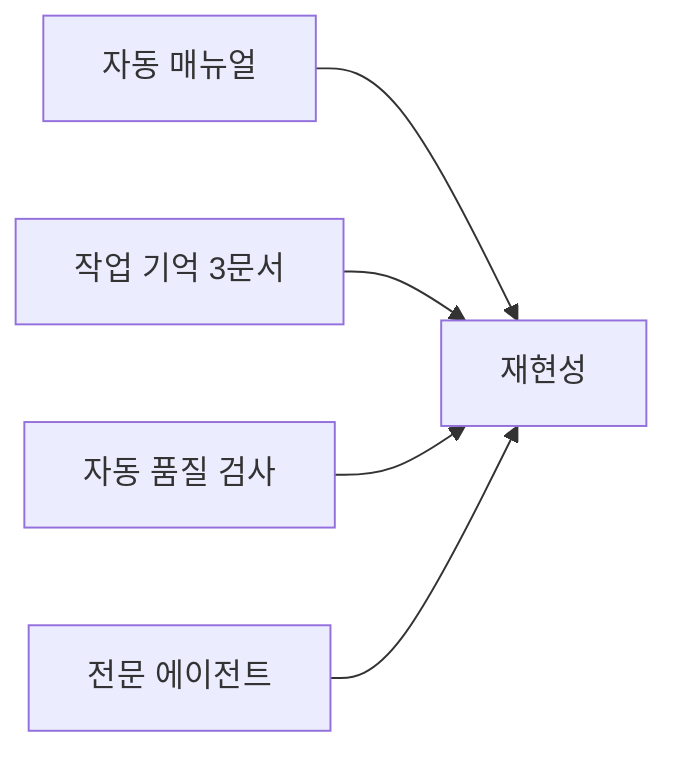

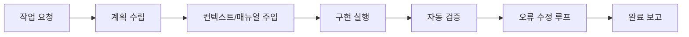

## 왜 AI는 중간에 자주 길을 잃는가

영상에서 반복적으로 다루는 문제는 세 가지입니다.

- 단기 기억 붕괴: 일정 시간 뒤 처음 합의한 목표를 벗어남
- 참조 실패: 옆에 있는 규칙/매뉴얼을 사용하지 않음
- 종료 품질 부족: "됐다"고 보고하지만 검증이 비어 있음

즉, 문제는 능력 부족보다 **프로세스 결핍**에 가깝습니다.

## 3문서 시스템: 계획서·맥락노트·체크리스트

영상 맥락에서 빠지면 안 되는 핵심은, 작업 전에 아래 3개 문서를 먼저 고정하는 방식입니다.

1. **계획서(Plan)**: 이번 작업의 목표, 범위, 단계, 완료 기준
2. **맥락노트(Context Note)**: 참고해야 할 규칙, 기존 결정사항, 변경 이력
3. **체크리스트(Checklist)**: 제출 전 반드시 통과해야 하는 검증 항목

이 3개가 있어야 Hook은 "무엇을 검증할지"를 알 수 있고, Skill은 "어떤 방식으로 수행할지"를 안정적으로 따릅니다.

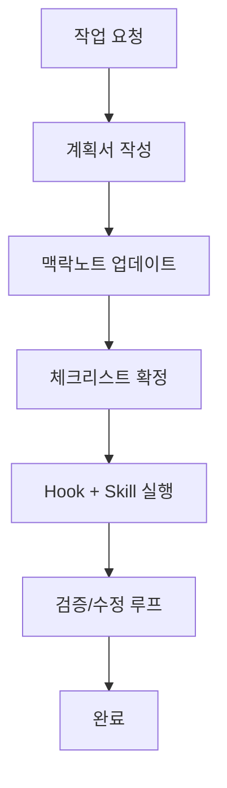

### 문서별 최소 포함 항목

#### 계획서(Plan)

- 해결할 문제 1문장
- 범위(In/Out)
- 단계별 작업 순서
- 완료 정의(Definition of Done)

#### 맥락노트(Context Note)

- 기존 결정사항(왜 그렇게 했는지)
- 참조해야 할 문서/규칙/패턴
- 이번 작업에서 새로 생긴 제약
- 다음 작업자가 알아야 할 상태

#### 체크리스트(Checklist)

- 기능 검증(요구사항 충족)
- 품질 검증(오류/형식/일관성)
- 회귀 검증(기존 동작 영향)
- 보고 형식 검증(근거/결과 명확성)

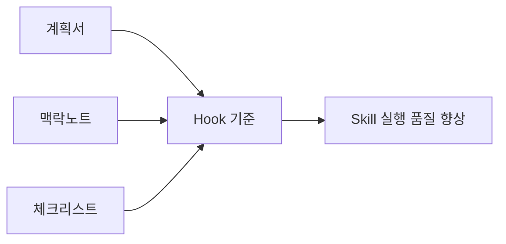

### 3문서 운용 순서(영상에서 강조된 부분)

1. AI에게 먼저 계획을 세우게 함
2. 사람이 계획을 꼼꼼히 검토하고 승인
3. 승인 즉시 AI 실행을 잠시 멈추고 3문서를 파일로 저장
4. 새 대화를 시작해 저장된 3문서를 읽고 이어서 작업
5. 작업 중간마다 체크리스트를 갱신

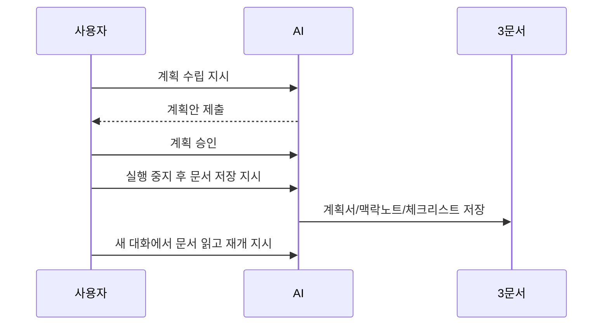

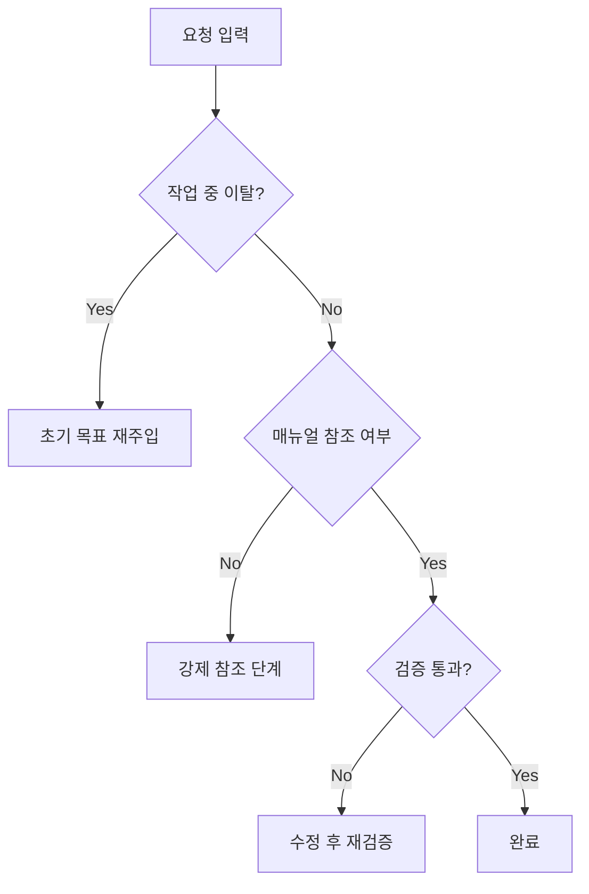

## 6개월 동안 만든 핵심 운영 구조

영상 맥락을 공장 비유로 바꾸면 "투입 전 점검-생산-출하 전 검사" 구조입니다.

### 1) 작업 기억 시스템

- 현재 목표, 제외 범위, 완료 조건을 매 단계 다시 확인
- 장시간 세션에서 컨텍스트 드리프트를 줄이는 역할

### 2) 자동 매뉴얼 시스템

- 작업 시작 시 관련 규칙/문서/패턴을 강제로 로드
- "알아야 하는데 안 본 상태"를 구조적으로 차단

### 3) 자동 품질 검사

- 수정 파일 기록, 오류 체크, 셀프 점검, 실패 시 즉시 재작업
- 사람 검토 전에 1차 결함을 제거

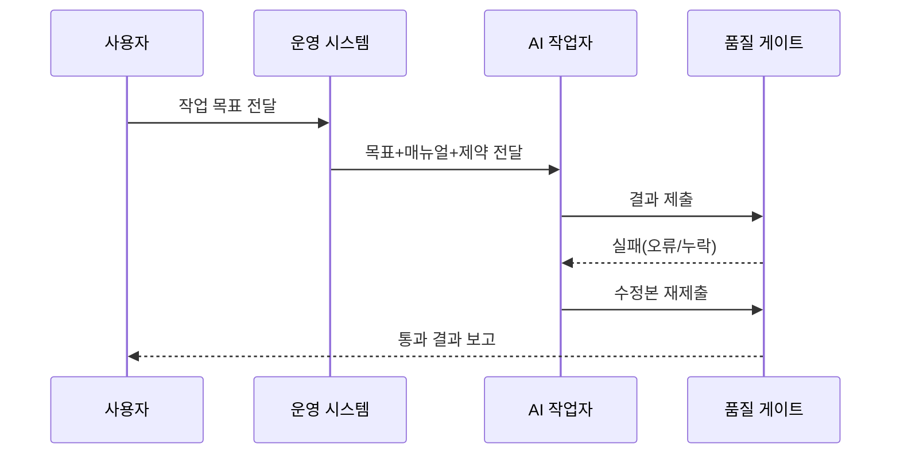

## 전문 에이전트 분업이 중요한 이유

영상의 후반부 포인트는 "한 명의 만능 AI"보다 "전문 팀 구성"입니다.

- 기획형: 요구사항 해석, 계획 구조화
- 구현형: 코드/문서/산출물 생성
- 품질형: 테스트, 규칙 위반, 누락 검증

이 분리는 결과 품질뿐 아니라, 실패 원인 추적을 쉽게 만듭니다.

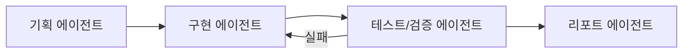

## Hook 구조 개선: "중간 제동 장치"를 어디에 거는가

영상과 댓글 맥락에서 핵심은, AI가 마음대로 달려가기 전에 **검문소(Hook)** 를 여러 지점에 두는 방식입니다.

- 시작 전 Hook: 목표/비목표/완료조건이 없으면 실행 금지
- 도구 사용 후 Hook: 맥락노트 최신화 여부, 수정 파일 기록, 규칙 위반(형식/금칙어/누락) 검사
- 완료 전 Hook: 테스트/체크리스트 미통과면 완료 보고 차단

영상에서 제시된 활성화 기준도 운영 규칙으로 옮기기 좋습니다.

- 키워드 기준: 요청 문구의 도메인 단어
- 의도/액션 기준: "새 기능 추가" 같은 작업 유형
- 작업 위치 기준: 특정 폴더/경로에서의 변경
- 파일 내용 기준: 특정 패턴이 포함된 파일

이렇게 하면 "한 번 잘못 달리기 시작하면 끝까지 틀린 결과를 내는" 패턴을 줄일 수 있습니다.

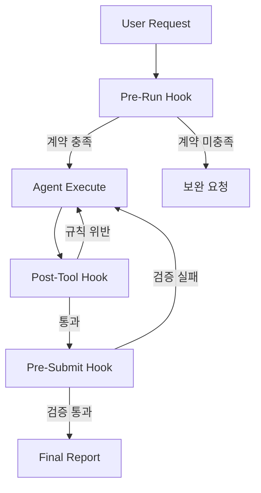

## Skill 구조 개선: "전문 팀원"을 재사용 가능한 단위로 고정

영상의 "전문 에이전트" 개념을 실무에 옮기면, 역할별 지침/체크리스트를 **Skill 단위**로 분리하는 설계가 됩니다.

- Planner Skill: 요구사항 분해, 작업 순서, 리스크 명시
- Builder Skill: 구현 규칙, 파일 변경 범위, 스타일 일관성
- QA Skill: 테스트 기준, 오류 재현 절차, 회귀 체크

핵심은 "모델에게 매번 새로 설명"이 아니라, 검증된 작업법을 Skill로 고정해 재사용하는 것입니다.

또한 영상에서처럼 Skill을 과도하게 길게 만들면 효율이 떨어질 수 있습니다.
그래서 실무에서는 아래 구조가 더 안정적입니다.

- `index` 역할: 어떤 상황에서 어떤 챕터를 읽을지 선택
- `chapter` 역할: 실제 상세 규칙과 예외 처리
- `hook` 역할: 지금 상황에 필요한 챕터만 선택해 로드

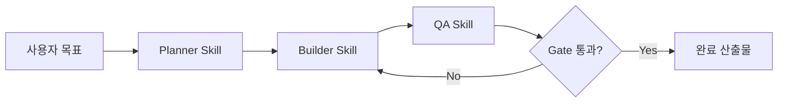

## Hook + Skill 결합 아키텍처

Hook은 "언제 멈추고 검증할지"를 담당하고, Skill은 "어떻게 일할지"를 담당합니다.
둘을 분리하면 확장성과 유지보수가 좋아지고, 결합하면 실행 품질이 안정화됩니다.

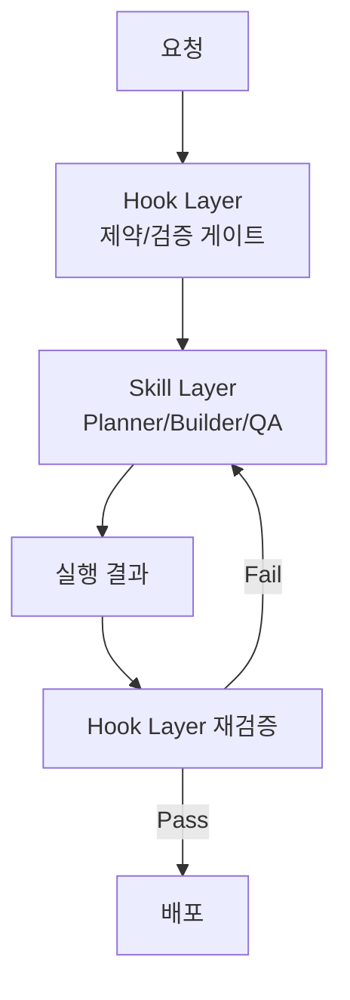

## 실무 적용 템플릿: 바로 써먹는 6단계

1. **계획서 작성**: 목표, 비목표, 완료 기준을 먼저 고정
2. **맥락노트 작성**: 관련 문서/패턴/결정 이력을 작업 시작 전에 주입
3. **분업 실행**: 계획-구현-검증 역할을 분리
4. **체크리스트 확정**: 제출 전에 통과해야 할 항목을 명시
5. **자동 게이트 적용**: 오류/누락/형식 위반을 자동 검사
6. **사람 승인 마감**: 최종 맥락과 비즈니스 책임은 사람이 확인

추가 운영 팁(영상 근거):

- 품질 검사는 "파일 하나 수정할 때마다"보다 "응답 완료 시점"에 돌리는 편이 안정적
- 오류가 소수면 즉시 수정, 다수면 전문 담당(리뷰/수리 에이전트)으로 이관
- 전문 에이전트에는 "무엇을 발견/수정/판단했는지"를 보고서 형식으로 요구

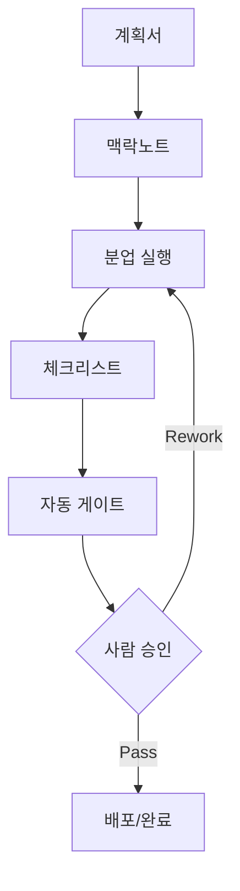

## 주의할 점: 영상 기반 해석에서의 불확실성

영상에서는 레딧 사례를 언급하지만, 본문에 직접 링크가 포함되어 있지는 않습니다.
또한 Hook/Skill의 구체 API나 파일 구조는 영상만으로는 완전 복원하기 어렵습니다.
영상 수치는 자동 생성 자막 기준으로 확인했기 때문에, 정확한 원문 표기는 채널 후속 자료와 대조가 필요할 수 있습니다.
따라서 이 글의 Hook/Skill 파트는 "영상 메시지 + 공개 커뮤니티 맥락"을 기반으로 한 운영 설계 관점으로 정리했습니다.

## 결론

이 영상의 핵심 메시지는 단순합니다.
**AI를 잘 쓰는 팀은 모델을 바꾸기 전에, 작업 시스템부터 바꾼다**는 점입니다.

기억 보강, 매뉴얼 강제 참조, 자동 품질 게이트, 역할 분업이 결합되면,
AI는 "가끔 잘하는 도구"에서 "지속적으로 재현 가능한 생산 파이프라인"으로 바뀝니다.
