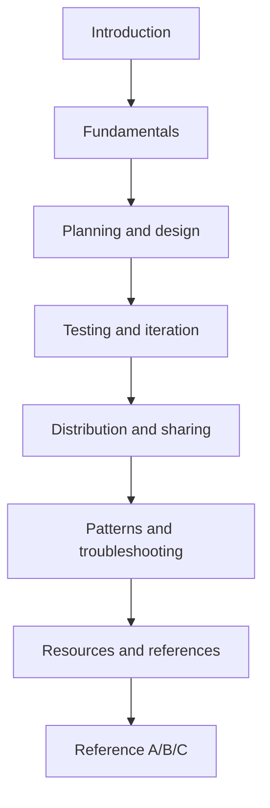
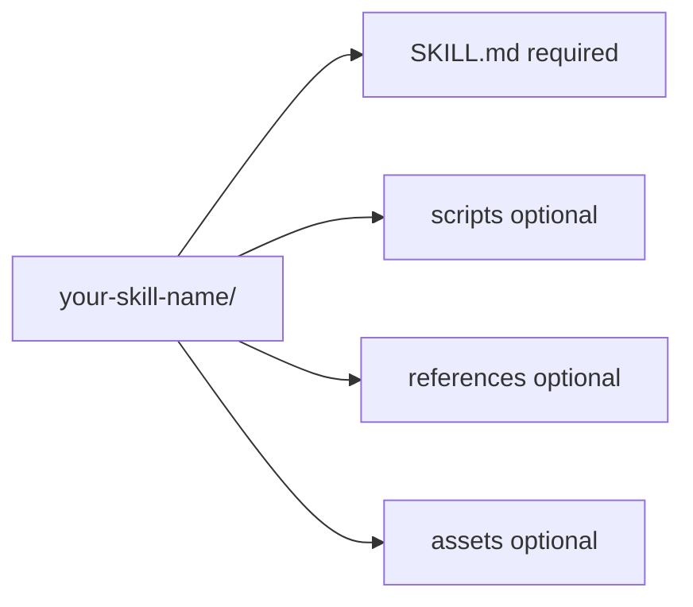
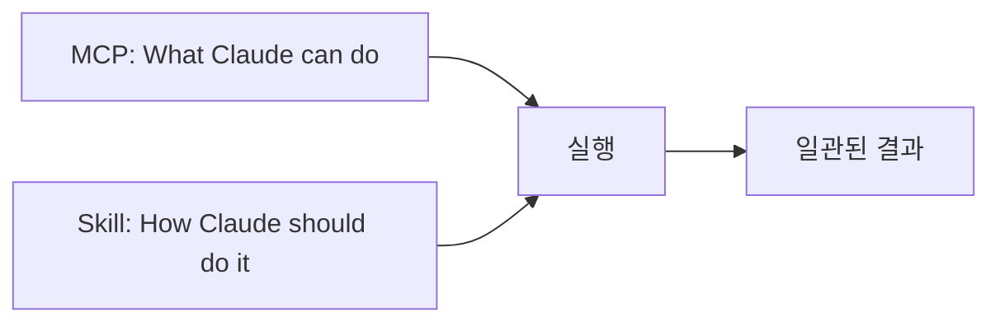
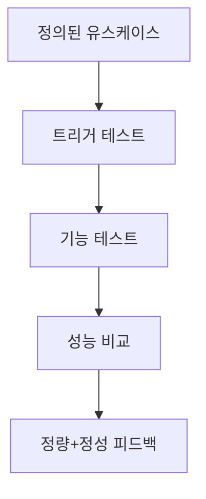
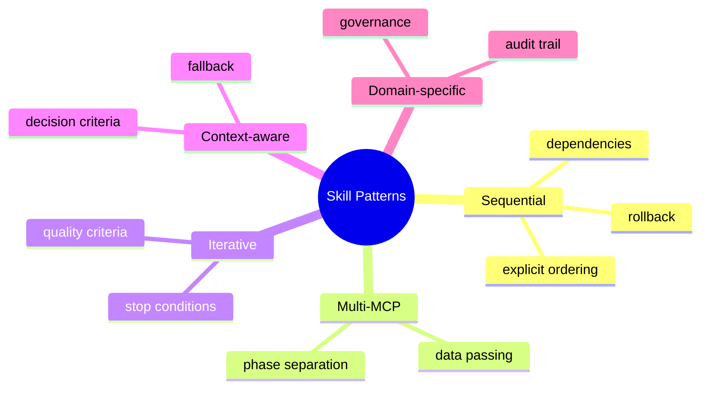
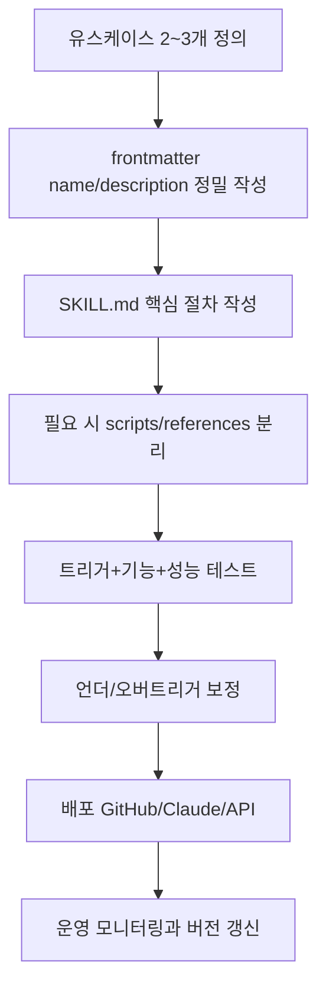

이 글은 Anthropic의 PDF 문서 **The Complete Guide to Building Skills for Claude**를 "요약"이 아니라 **전체 흐름 기준으로 재구성**한 버전입니다.

문서의 챕터 구조(Introduction, Fundamentals, Planning and design, Testing and iteration, Distribution and sharing, Patterns and troubleshooting, Resources and references, Reference A/B/C)를 그대로 따라가면서, 실무에서 바로 쓸 수 있게 한국어로 재정렬했습니다.

## Sources

- https://resources.anthropic.com/hubfs/The-Complete-Guide-to-Building-Skill-for-Claude.pdf

<!--more-->

## 문서 전체 구조 한눈에 보기

원문 목차는 아래 순서입니다.

1. Introduction
2. Fundamentals
3. Planning and design
4. Testing and iteration
5. Distribution and sharing
6. Patterns and troubleshooting
7. Resources and references
8. Reference A: Quick checklist
9. Reference B: YAML frontmatter
10. Reference C: Complete skill examples



## 1) Introduction 재구성

원문이 규정하는 Skill의 핵심 정의는 다음과 같습니다.

- Skill은 "간단한 폴더로 패키징된 지침 세트"
- 반복 워크플로우를 매 대화마다 다시 설명하지 않게 해 주는 재사용 단위
- 단독으로도 유효하지만, MCP 연계 시 "도구 접근"을 "일관된 실행 방식"으로 끌어올리는 지식 계층

원문이 강조한 사용 시나리오도 비교적 명확합니다.

- 프런트엔드 디자인 생성
- 일정한 조사 방법론으로 리서치 수행
- 팀 문서 스타일에 맞춘 문서 생성
- 다단계 프로세스 오케스트레이션

또한 입문자를 위한 현실적인 기대치도 제시합니다.

- 첫 Skill은 보통 15~30분 내 구축/테스트 가능
- skill-creator를 활용하면 초안 생성과 반복 개선이 빨라짐

## 2) Fundamentals 재구성

### 2-1. Skill 폴더 구성 요소

원문의 기본 구조는 다음과 같습니다.

- `SKILL.md` (필수)
- `scripts/` (선택)
- `references/` (선택)
- `assets/` (선택)



### 2-2. Core Design Principles

원문은 세 가지 원칙을 핵심으로 둡니다.

1. Progressive Disclosure
2. Composability
3. Portability

#### Progressive Disclosure (3단계)

- 1단계: YAML frontmatter (항상 시스템 프롬프트에 로드)
- 2단계: `SKILL.md` 본문 (관련성 판단 후 로드)
- 3단계: 링크 파일(`references/` 등, 필요 시 탐색)

이 방식의 목적은 **토큰 비용 최소화 + 전문성 유지**입니다.

#### Composability

Claude는 여러 Skill을 동시에 로드할 수 있으므로,
각 Skill은 "나 혼자만 존재한다"는 전제를 버리고 상호 조합 가능하게 설계해야 합니다.

#### Portability

Skill은 Claude.ai, Claude Code, API에서 동일한 원리로 동작합니다.
단, 스크립트 의존성이 있으면 실행 환경 의존성은 별도 관리해야 합니다.

### 2-3. Skills + MCP (주방 비유)

원문의 비유를 그대로 옮기면,

- MCP = 전문 주방(도구/재료/장비)
- Skill = 레시피(어떤 순서로 무엇을 만들지)



원문은 특히 MCP 제작자 관점의 문제를 짚습니다.

- Skill이 없으면: "연결은 했는데 다음에 뭘 해야 하지?"가 반복
- Skill이 있으면: 사전 정의된 워크플로우가 자동 활성화되어 학습 비용 감소

## 3) Planning and design 재구성

### 3-1. 코드보다 먼저 유스케이스

원문은 시작점으로 **2~3개의 구체 유스케이스 정의**를 요구합니다.

예시 구성은 다음 필드를 포함합니다.

- Use Case
- Trigger
- Steps
- Result

체크 질문도 명확합니다.

- 사용자가 실제로 달성하려는 목표는 무엇인가?
- 이 목표는 어떤 다단계 흐름이 필요한가?
- 내장 도구/MCP 중 무엇이 필요한가?
- 어떤 도메인 지식을 내장해야 하는가?

### 3-2. Anthropic이 관찰한 3개 카테고리

1. Document & Asset Creation
2. Workflow Automation
3. MCP Enhancement

각 카테고리마다 원문은 기술 포인트를 다르게 제시합니다.

- 문서/산출물형: 스타일 가이드, 템플릿, 품질 체크리스트
- 자동화형: 단계별 게이트, 반복 개선 루프
- MCP 강화형: 다중 MCP 호출 순서, 오류 처리, 도메인 컨텍스트 내장

### 3-3. Success Criteria(정량 + 정성)

원문의 예시 지표는 아래와 같습니다.

- 관련 질의의 90%에서 Skill 트리거
- 워크플로우당 API 실패 0
- Skill 사용 전후 도구 호출 수/토큰 비교
- 사용자 교정 없이 완료되는 비율
- 세션 간 일관성



### 3-4. Technical requirements 상세

원문에서 특히 강하게 강조하는 규칙은 아래입니다.

- 파일명은 정확히 `SKILL.md` (대소문자 포함)
- 폴더명은 kebab-case
- Skill 폴더 내부 `README.md` 금지
- frontmatter의 `description`은 "무엇+언제" 둘 다 포함
- `description` 길이 1024자 이하
- XML 태그(`< >`) 금지
- 이름에 `claude`/`anthropic` 사용 금지(예약)

## 4) YAML frontmatter와 지침 작성 재구성

### 4-1. 최소 형식

```yaml
---
name: your-skill-name
description: What it does. Use when user asks to [specific phrases].
---
```

### 4-2. 선택 필드

- `license`
- `compatibility`
- `metadata`
- (참고 섹션에서) `allowed-tools`

### 4-3. description 작성 원칙

원문의 공식 구조:

- What it does
- When to use it
- Key capabilities

좋은 예시의 공통점:

- 특정 트리거 표현 포함
- 파일 형식/도메인 맥락 포함
- 사용자 가치가 명확함

나쁜 예시의 공통점:

- "Helps with projects" 같은 모호한 문장
- 트리거 조건 누락
- 내부 구현 용어만 있고 사용자 의도 신호가 없음

### 4-4. 본문 지침(SKILL.md body) 구조

원문 권장 틀:

1. 단계별 절차
2. 실행 예시
3. 오류 시 원인/해결
4. 필요 시 스크립트 명령

핵심 작성 원칙:

- 구체적이고 실행 가능한 문장
- 오류 처리 포함
- `references/`로 상세 문서 분리
- 긴 설명보다 구조화된 목록 우선

## 5) Testing and iteration 재구성

원문은 테스트 강도를 3단계로 설명합니다.

1. Claude.ai 수동 테스트
2. Claude Code 스크립트 테스트
3. Skills API 기반 평가 스위트

### 5-1. 추천 접근

원문의 실전 팁은 매우 현실적입니다.

- 먼저 "단일 고난도 작업"을 통과시키고
- 그 성공 패턴을 Skill로 추출한 뒤
- 커버리지 케이스를 점진적으로 늘린다

### 5-2. 테스트 3축

1. Triggering tests
2. Functional tests
3. Performance comparison

원문 예시 비교(요지):

- Skill 없음: 지시 반복, 대화 왕복 증가, 실패 호출 발생, 토큰 소모 큼
- Skill 있음: 자동 워크플로우, 실패 감소, 토큰 감소

### 5-3. skill-creator의 역할

원문은 skill-creator를 다음 용도로 제시합니다.

- 초안 생성
- 구조/트리거/표현 문제 리뷰
- 반복 개선(실패 케이스 반영)

단, 자동 정량 평가를 완전히 대체하는 도구로 보지는 않습니다.

### 5-4. 반복 개선 신호

- 언더트리거: 필요한데 안 뜸 -> description 정밀화
- 오버트리거: 불필요한데 뜸 -> 범위 축소/negative trigger 추가
- 실행 불안정: 결과 흔들림/API 오류 -> 지침과 오류 처리 강화

## 6) Distribution and sharing 재구성

원문의 배포 흐름은 2026년 1월 기준 모델로 설명됩니다.

- 개인: 폴더 다운로드 -> zip -> Claude.ai 업로드 또는 Claude Code 디렉터리 배치
- 조직: 관리자 단위 workspace 배포, 자동 업데이트, 중앙 관리

### 6-1. API 활용

원문 핵심 포인트:

- `/v1/skills`로 관리
- Messages API 요청에서 `container.skills` 사용
- Claude Console 기반 버전 관리
- Agent SDK와 결합 가능

추가 조건:

- API의 Skill 실행은 Code Execution Tool beta가 필요

### 6-2. 현재 권장 배포 전략

원문 권장 순서:

1. GitHub 공개 저장소에 Skill 호스팅
2. 저장소 README에 설치/예시/스크린샷 문서화
3. MCP 문서에서 Skill 연계 가치와 퀵스타트 안내

중요한 구분:

- 저장소 루트 README는 권장
- Skill 폴더 내부 README.md는 금지

## 7) Patterns and troubleshooting 재구성

### 7-1. 문제 중심 vs 도구 중심

원문은 Skill 설계를 두 관점으로 나눕니다.

- Problem-first: 사용자가 결과를 말하면 Skill이 도구 순서를 알아서 조직
- Tool-first: 사용자가 MCP 연결은 했고, Skill이 최적 활용법을 제공

둘 중 하나가 우세하더라도, 대부분은 혼합 형태로 운영됩니다.

### 7-2. 원문 패턴 5종

1. Sequential workflow orchestration
2. Multi-MCP coordination
3. Iterative refinement
4. Context-aware tool selection
5. Domain-specific intelligence



### 7-3. Troubleshooting 핵심 재구성

#### 업로드 실패

- `SKILL.md` 이름 오타/대소문자 불일치
- frontmatter 구분자(`---`) 오류
- name 규칙 위반(공백/대문자)

#### 트리거 실패

- description이 너무 일반적임
- 사용자가 실제로 말하는 표현이 없음
- 디버그 질문: "When would you use [skill]?"로 현재 트리거 해석 점검

#### 과도 트리거

- 부정 조건(Do NOT use ...) 추가
- 범위 명확화(문서 처리 -> 법률 PDF 계약 검토처럼 좁힘)

#### MCP 연결 실패

- 확장 연결 상태
- 인증/권한/토큰
- MCP 자체 단독 호출 테스트
- tool name 대소문자 포함 정확성

#### 지침 미준수

- 문서 과다 장문 -> 핵심 지시를 상단으로 이동
- 모호한 표현 -> 검증 기준 수치화
- 중요 검증은 언어 지시만 두지 말고 스크립트로 결정론화

#### 대형 컨텍스트 이슈

- `SKILL.md` 5000단어 이하 권장
- 상세는 `references/`로 이동
- 동시 활성 Skill 수 과다(20~50+) 점검

## 8) Resources and references 재구성

원문 리소스 파트는 아래 축으로 구성됩니다.

- 공식 문서(베스트 프랙티스, Skills docs, API reference, MCP docs)
- 관련 블로그 포스트
- 공개 스킬 저장소(`anthropics/skills`)
- skill-creator 활용법
- 지원 채널(Discord, GitHub Issues)

실무적 의미는 간단합니다.

- 처음 만들 때: 베스트 프랙티스 + 예제 리포지토리부터 시작
- 운영 문제 발생 시: 이슈 재현 정보(이름/오류/재현 단계)를 표준화해 보고

## 9) Reference A (Quick checklist) 재구성

원문 체크리스트를 단계별로 재정리하면 다음과 같습니다.

### 시작 전

- 2~3개 유스케이스 정의
- 도구(MCP/내장) 식별
- 예제 검토
- 폴더 구조 계획

### 개발 중

- 폴더명 kebab-case
- `SKILL.md` 존재 및 이름 정확성
- frontmatter `---` 구분자
- `name` 규칙 준수
- `description`에 What/When 포함
- XML `< >` 금지
- 실행 지침/오류 처리/예시/참조 링크 준비

### 업로드 전

- 트리거/비트리거 케이스 점검
- 기능 테스트 통과
- 통합 도구 정상
- zip 패키징

### 업로드 후

- 실제 대화에서 관찰
- 언더/오버트리거 모니터링
- 사용자 피드백 반영
- 메타데이터 버전 업데이트

## 10) Reference B (YAML frontmatter) 재구성

원문은 필수/선택 필드를 아래처럼 정리합니다.

### 필수

- `name`
- `description`

### 선택

- `license`
- `allowed-tools`
- `metadata`(author, version, mcp-server, tags 등)

### 보안 제한

- XML angle brackets(`< >`) 금지
- `claude`/`anthropic` 접두 Skill 이름 금지
- 안전한 YAML 파싱 전제

## 11) Reference C (Complete skill examples) 재구성

원문은 "완성 예시는 별도 저장소가 최신"이라는 점을 강조합니다.

- 문서 생성형 스킬(PDF/DOCX/PPTX/XLSX)
- 다양한 워크플로우 예시
- 파트너 스킬 디렉터리

즉, 가이드를 읽고 끝내기보다 예시 저장소를 복제해 실사용 시나리오에 맞춰 변형하는 것이 권장 경로입니다.

## 12) 전체 가이드의 실무 적용 순서

원문 전체를 합치면, 실제 실행 순서는 아래로 귀결됩니다.



이 순서를 따르면, Skill은 "프롬프트 템플릿"이 아니라
반복 가능한 운영 단위(설계-검증-배포-개선)로 자리잡습니다.

## 결론

원문을 끝까지 관통하는 메시지는 단순합니다.

- Skill의 성패는 frontmatter와 구조화된 지침에서 시작되고,
- 품질은 트리거/기능/성능 테스트에서 결정되며,
- 장기 가치는 배포 후 반복 개선에서 완성됩니다.

즉, Claude Skill은 "한 번 잘 쓰는 프롬프트"가 아니라,
**지식과 절차를 제품처럼 운영하는 방법론**입니다.

## 참고

- https://resources.anthropic.com/hubfs/The-Complete-Guide-to-Building-Skill-for-Claude.pdf
