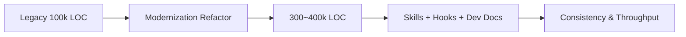
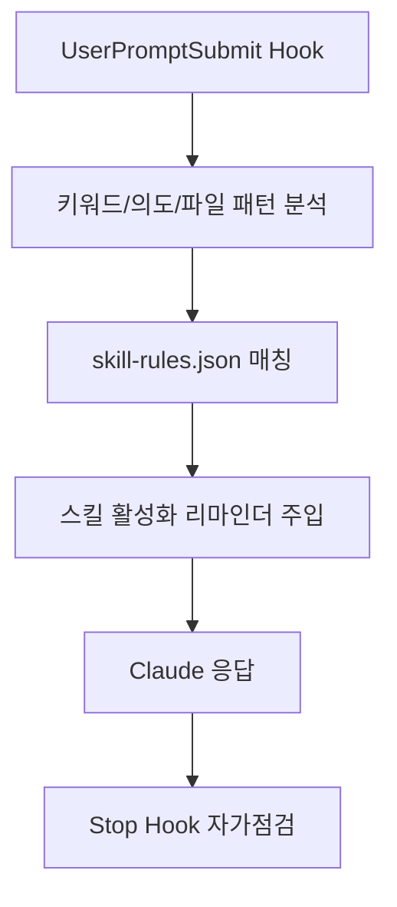
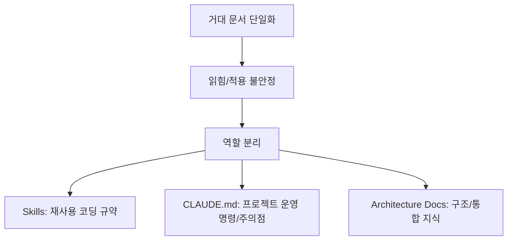
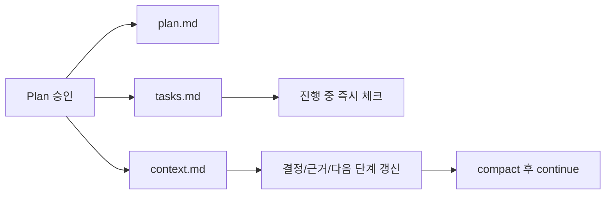
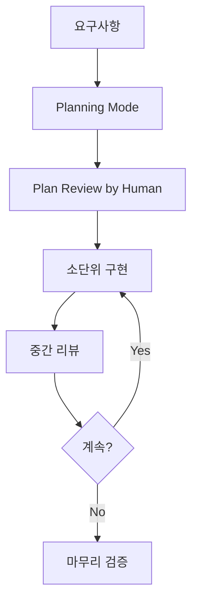
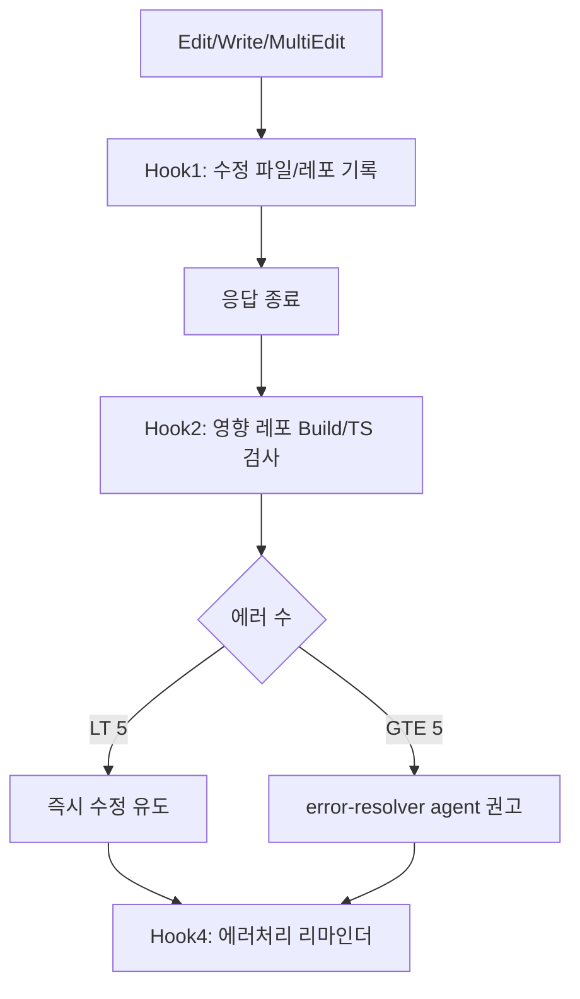
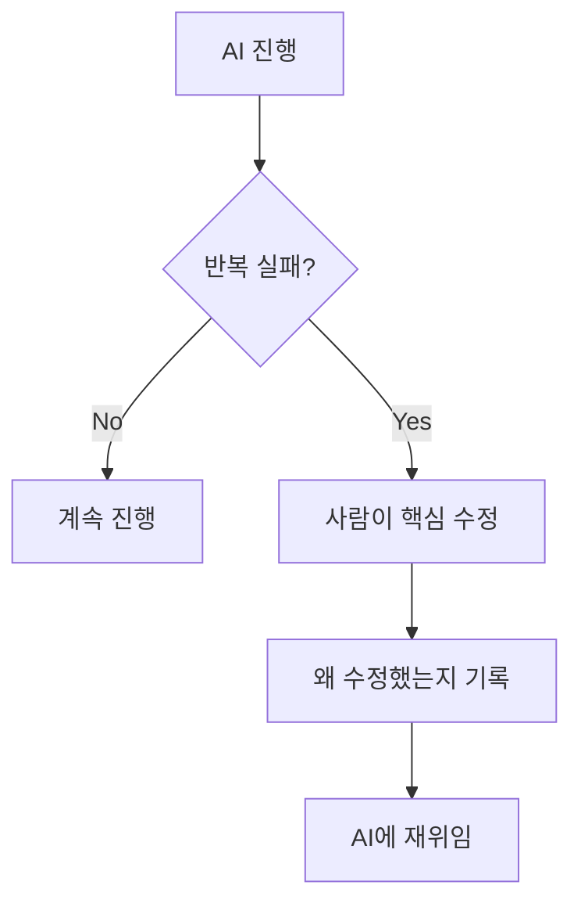

이 글은 Reddit의 **"Claude Code is a Beast – Tips from 6 Months of Hardcore Use"** 내용을 기준으로, 실제 운영 절차를 그대로 옮길 수 있게 핵심 사실과 실행 순서를 다시 정리한 문서입니다.
핵심 목표는 "요약"이 아니라, **어떤 조건에서 어떤 장치를 붙였는지**를 정확히 설명하는 것입니다.
<!--more-->

## Sources

- https://www.reddit.com/r/ClaudeAI/comments/1oivjvm/claude_code_is_a_beast_tips_from_6_months_of/
- https://dev.to/diet-code103/claude-code-is-a-beast-tips-from-6-months-of-hardcore-use-572n
- https://github.com/diet103/claude-code-infrastructure-showcase

## 원문에서 먼저 고정해야 할 사실(수치)

- 작성자 배경: 프로덕션 웹앱 개발 약 7년
- 사용 맥락: 20x Max 플랜, 6개월 하드코어 사용
- 대상 프로젝트: 약 100k LOC 레거시에서 리디자인/리팩터링 후 약 300~400k LOC 규모
- 운영 구조: 프론트 1개 + 백엔드 마이크로서비스 7개
- 핵심 결론: 모델 자체보다 **운영 시스템(계획-문서-훅-검증-개입)** 이 결과 품질을 좌우

## 전제: "만능 공식"이 아니라 운영 실험 기록

원문 작성자가 반복해서 강조한 전제는 아래와 같습니다.

- 20x Max 플랜 기준 경험이 포함되어 있음
- "vibe coding"이 아니라 계획/검토/반복 중심 협업
- 모델 출력 품질은 확률적 특성이 있어 같은 지시에도 편차가 발생
- 출력이 불안정할 때는 "모델 탓"만 하지 말고, 프롬프트/맥락/절차를 먼저 점검

즉, 복붙 대상은 문장 템플릿이 아니라 **운영 원칙**입니다.

## 1) Skills 자동활성화: "스킬 작성"보다 "스킬 호출"

원문에서 가장 큰 전환점은 "스킬이 안 불리는 문제"를 훅으로 강제한 부분입니다.

- 문제: 수천 줄 스킬을 만들어도 자동 호출이 거의 일어나지 않음
- 해결: `UserPromptSubmit` 훅 + `Stop` 훅으로 호출/자가점검 루프 구성

`skill-rules.json`에서 실제로 거는 트리거 축:

- 키워드 매칭
- 의도(Regex) 매칭
- 파일 경로 매칭
- 파일 내용 패턴 매칭
- 우선순위/강제도 설정

## 2) Skill 길이 전략: 500라인 규칙과 점진적 공개

작성자는 초기에 대형 스킬(1000~1500+ 라인)을 사용하다가, Anthropic 권장 구조로 전환합니다.

원문에 나온 실제 전환 수치:

- `frontend-dev-guidelines`: 메인 398줄 + 리소스 10개
- `backend-dev-guidelines`: 메인 304줄 + 리소스 11개
- 체감 결과: 토큰 효율 약 40~60% 개선

## 3) CLAUDE.md 재편: 코딩 규칙은 Skills, 프로젝트 지식은 Docs

핵심은 거대한 `BEST_PRACTICES.md`에 몰아넣던 내용을 역할별로 분리한 것입니다.

원문 기준 구조 예시:

- 루트 `CLAUDE.md`: 약 100줄(핵심 공통 규칙)
- 리포별 `claude.md`: 약 50~100줄(리포 전용 명령/주의점)
- 프로젝트별 운영 정보: 약 200줄로 집중 유지
- 문서 생태계: 850+ markdown 문서(아키텍처/통합 지식 중심)

## 4) Dev Docs 시스템: Claude의 "단기 기억 상실"을 구조로 보완

원문에서 가장 효과가 컸다고 밝힌 장치 중 하나가 `plan/context/tasks` 3문서 고정 생성입니다.

운영 절차(원문 흐름):

1. 계획 모드에서 초안을 만든다.
2. 사람이 계획을 꼼꼼히 검토/승인한다.
3. `/dev-docs`로 3문서를 생성한다.
4. 구현 중 `tasks`를 즉시 갱신한다.
5. compact 전 `/dev-docs-update`로 `context + next-step`를 갱신한다.
6. 새 세션에서는 문서를 먼저 읽고 `continue`한다.

## 5) Planning 우선 접근: 구현 전에 설계 검토를 고정 루틴으로

원문 표현 그대로 핵심은 **"Planning is king"** 입니다.

- 계획 모드에서 구조 파악과 의존성 탐색을 먼저 수행
- 승인 전에는 사람이 계획의 오해/누락을 교정
- 구현은 1~2 섹션씩 쪼개서 중간 리뷰 반복

## 6) PM2 운영: "로그 접근성"이 백엔드 디버깅 속도를 결정

원문 환경은 백엔드 마이크로서비스 7개 동시 운영입니다.
여기서 PM2 도입의 핵심은 "Claude가 실시간 로그를 직접 읽을 수 있게 만든 것"입니다.

운영 효과:

- 수동 로그 복사/붙여넣기 제거
- 서비스별 실시간 로그 접근
- 크래시 시 자동 재시작

주의점:

- 프론트엔드 핫리로드는 별도 `pnpm dev` 병행이 유리

## 7) Hook 파이프라인: "#NoMessLeftBehind"를 4단계로 분리

원문 훅 체계는 단일 훅이 아니라 역할 분리된 파이프라인입니다.

1. `PostToolUse` 파일 수정 추적 훅
2. `Stop` 빌드 검사 훅
3. `Stop` 포맷 훅(현재는 비권장으로 전환)
4. `Stop` 에러 처리 리마인더 훅

원문의 정량 기준:

- 에러 `< 5`: 즉시 노출 후 수정
- 에러 `>= 5`: 자동 에러 해결 에이전트 권고

중요 업데이트(원문 후속 수정):

- 자동 Prettier 훅은 현재 비권장
- 이유: 파일 수정이 `<system-reminder>` diff를 늘려 컨텍스트 토큰을 크게 소모할 수 있음
- 원문에 공유된 사례: 3라운드에서 약 160k 토큰 소모
- 대안: 세션 중 자동 포매팅 대신 세션 사이 수동 포매팅

## 8) Scripts Attached to Skills: "설명"보다 "즉시 실행 가능한 도구"

원문에서 실무적으로 중요한 포인트는 스킬에 유틸 스크립트를 붙이는 방식입니다.

- 예시: 인증 라우트 테스트 스킬에서 `test-auth-route.js` 직접 호출
- 스크립트가 토큰/서명/쿠키 구성 과정을 대신 수행
- 장점: 매번 임시 테스트 스크립트를 생성하지 않아도 됨

## 9) Agents + Hooks + Slash Commands: 운영의 "성삼위"

원문의 표현을 실무 관점으로 바꾸면, 세 축이 분리되어야 유지보수가 쉽습니다.

- Agents: 역할 기반 실행 담당
- Hooks: 타이밍 기반 검증 담당
- Slash Commands: 반복 프롬프트 캡슐화 담당

자주 쓰는 슬래시 커맨드(원문 예시):

- `/dev-docs`
- `/dev-docs-update`
- `/create-dev-docs`
- `/code-review`
- `/build-and-fix`

## 10) 프롬프트 운용과 인간 개입 기준

이 파트는 "요령"이 아니라 운영 원칙에 가깝습니다.

- 동일한 요청도 재프롬프트(더블 ESC 브랜치)로 결과가 크게 달라질 수 있음
- AI가 30분 막히고 사람이 2분에 고칠 수 있으면 즉시 사람 개입
- 개입 후에는 왜 고쳤는지 문서에 남겨 다음 루프로 환류
- 유도형 질문보다 중립 질문이 더 정확한 피드백을 유도

## 실전 도입 체크리스트

1. 스킬 자동활성화 훅(UserPromptSubmit)을 먼저 붙였는가?
2. `skill-rules.json`에 키워드/의도/경로/콘텐츠 트리거를 모두 정의했는가?
3. 스킬 메인을 500라인 내로 유지하고 리소스 파일을 분리했는가?
4. 작업별 `plan/context/tasks` 3문서와 `/dev-docs` 루프를 운용하는가?
5. Stop 훅에서 영향 레포 빌드 검증과 에러 임계치(`<5`, `>=5`)를 자동화했는가?
6. 자동 포맷 훅 사용 시 `<system-reminder>` 토큰 비용을 실측했는가?
7. PM2로 백엔드 로그 접근/재시작 루프를 표준화했는가?
8. 자주 반복되는 검증/빌드/문서 갱신을 슬래시 커맨드로 캡슐화했는가?
9. AI 반복 실패 시 인간 개입 기준과 환류 규칙을 팀 정책으로 문서화했는가?

## 결론

이 원문의 본질은 "Claude가 갑자기 완벽해졌다"가 아닙니다.
핵심은 **운영 시스템을 설계해서 변동성을 관리한 것**입니다.

- 계획으로 시작하고
- 스킬 호출을 자동화하고
- 훅으로 품질을 검사하고
- 문서로 맥락을 복원하고
- 사람 개입 기준으로 실패 비용을 제한

이 다섯 가지가 동시에 돌아갈 때, 대형 코드베이스에서도 재현성과 속도가 함께 올라갑니다.
