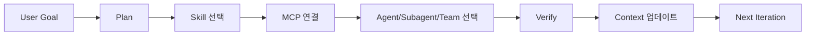
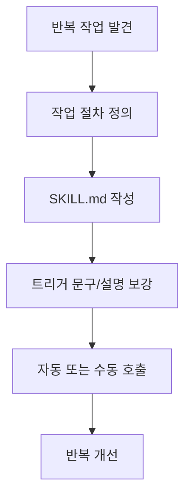
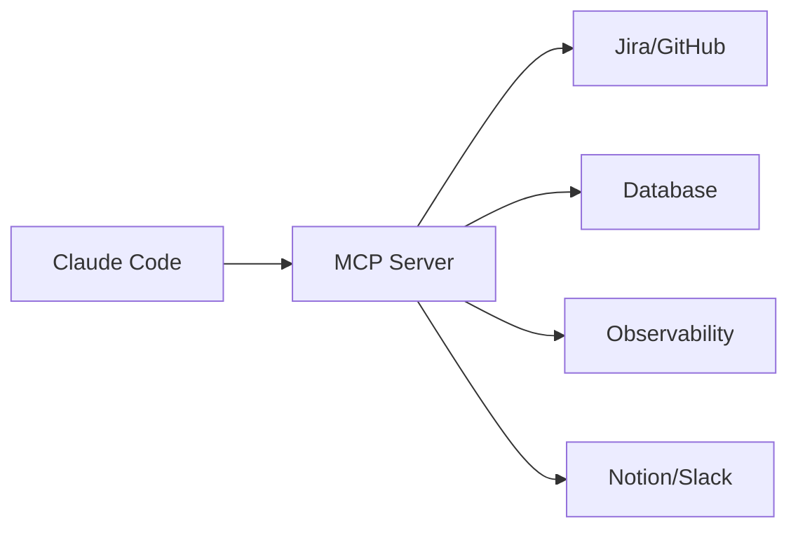
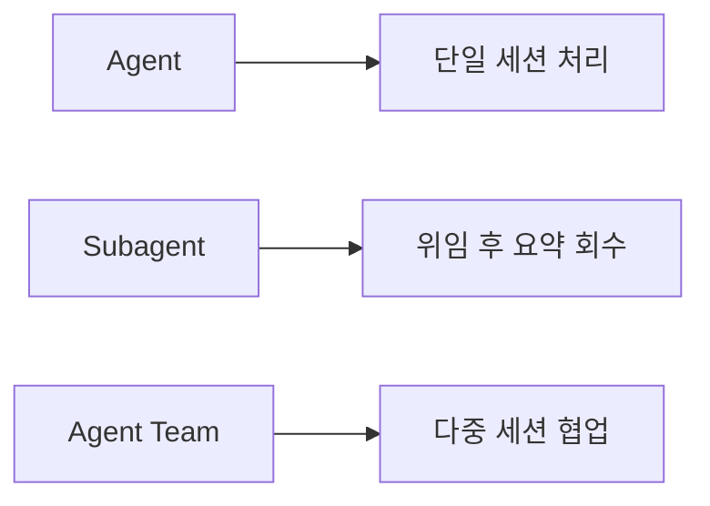
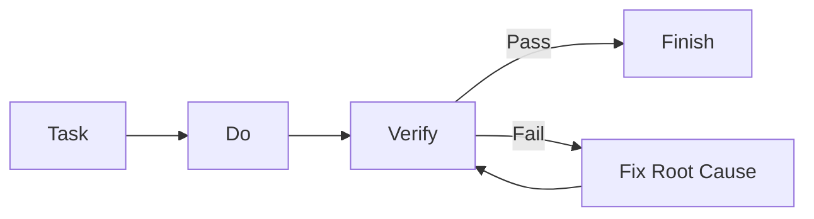
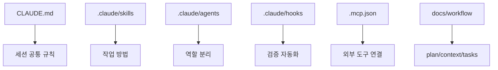
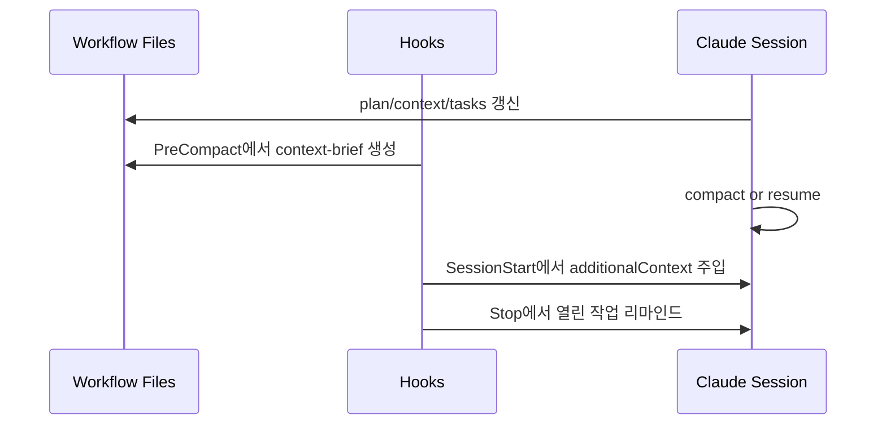

Claude Code를 "그냥 잘 답하는 도구"로 쓰면 세션이 길어질수록 품질이 흔들리고, 같은 작업도 매번 다시 설명하게 됩니다. 반대로 **Skill-MCP-Agent-검증-Context 문서화**를 체계로 묶으면, 바이브 코딩도 재현 가능한 개발 프로세스로 바뀝니다.

<!--more-->

## Sources

- https://docs.anthropic.com/en/docs/claude-code/skills
- https://docs.anthropic.com/en/docs/claude-code/mcp
- https://docs.anthropic.com/en/docs/claude-code/sub-agents
- https://code.claude.com/docs/en/agent-teams
- https://docs.anthropic.com/en/docs/claude-code/common-workflows
- https://docs.anthropic.com/en/docs/claude-code/hooks-guide
- https://docs.anthropic.com/en/docs/claude-code/hooks
- https://docs.anthropic.com/en/docs/claude-code/best-practices
- https://docs.anthropic.com/en/docs/claude-code/memory
- https://docs.anthropic.com/en/docs/claude-code/settings
- https://gyuha.com/post/2026/2026-02-18-claude-code-core-guide-opus-46/
- https://gyuha.com/post/2026/2026-02-21-claude-code-six-months-hardcore-workflow-upgrade/

## 핵심 요약

1. **Skill은 "어떻게 일할지"를 고정**하고, MCP는 "무엇을 할 수 있는지"를 확장한다. Agent/Subagent/Agent Team은 "어떤 실행 구조로 일할지"를 분리한다.
2. 구현 단계는 반드시 **Task -> Do -> Verify** 루프로 돌리고, Hook으로 검증 게이트를 자동화해야 품질 편차를 줄일 수 있다.
3. 컨텍스트는 대화창에만 두지 말고 `plan.md`, `context.md`, `tasks.md` 파일로 외부화해야 긴 세션에서도 안정적으로 이어진다.



## 1) Skill, MCP를 어떻게 나눠 쓸까

### Skill: 반복 작업을 파일 규칙으로 전환

공식 문서 기준으로 Skill은 `SKILL.md` 중심의 재사용 가능한 작업 지침입니다. 핵심은 프롬프트 복붙을 줄이는 게 아니라, 팀의 작업 방법을 코드처럼 관리하는 것입니다.

- 개인 범용 스킬: `~/.claude/skills/<skill-name>/SKILL.md`
- 프로젝트 스킬: `.claude/skills/<skill-name>/SKILL.md`
- 공통 규칙/체크리스트/스크립트 경로를 Skill 내부에 고정



실무 팁:

- 거대한 단일 Skill보다 역할별 Skill(Planner/Builder/QA) 분리가 유지보수에 유리
- 본문이 길어질수록 로드 비용이 커지므로, 상세 예시는 별도 리소스 파일로 분리

### MCP: 외부 시스템 접근을 표준화

MCP는 외부 도구(이슈 트래커, DB, 모니터링, SaaS API) 연결 계층입니다. Skill이 절차를 고정한다면, MCP는 실행 가능한 능력 집합을 제공합니다.

- 서버 등록: `claude mcp add ...`
- 상태/인증: `/mcp`
- 범위: `local`(개인+프로젝트), `project`(팀 공유), `user`(개인 전체)



실무 팁:

- "많이 연결"보다 작업별 최소 세트 연결이 토큰/안정성에 유리
- 민감한 환경에서는 project/user 스코프와 권한 정책을 분리해 관리

## 2) Agent, Subagent, Agent Team을 어떻게 나눠 쓸까

핵심은 "복잡한 문제를 어떤 협업 구조로 풀 것인가"입니다. 같은 작업도 구조를 잘못 고르면 토큰 비용과 충돌 리스크가 빠르게 증가합니다.

### Agent: 단일 세션에서 끝낼 수 있는 기본 실행 단위

Agent(메인 세션)는 요구사항 해석, 구현, 검증을 한 흐름으로 밀어붙일 때 가장 빠릅니다.

- 파일 수가 적고 의존성이 단순한 변경
- 사용자와 빠른 왕복이 필요한 작업
- 계획-구현-검증을 한 문맥에서 연속 처리해야 하는 작업

### Subagent: 단일 세션 내부 위임 + 요약 회수

Subagent는 메인 세션에서 파생된 독립 컨텍스트로 동작하고, 결과를 요약해서 되돌려줍니다.

- 코드베이스 조사, 로그 분석, 대량 테스트처럼 출력이 큰 작업
- 메인 컨텍스트를 보호하면서 병렬 탐색이 필요한 작업
- "결과만 회수"하면 되는 조사/검증성 작업

### Agent Team: 다중 세션 병렬 협업

Agent Team은 리드 + 팀원 세션이 공유 작업 목록과 메시지로 협업하는 구조입니다. Subagent와 달리 팀원끼리 직접 조율할 수 있습니다.

- 프론트/백엔드/테스트처럼 병렬로 독립 분업 가능한 큰 작업
- 가설 경쟁형 디버깅, 다관점 리뷰처럼 상호 토론이 필요한 작업
- 장점: 탐색 속도와 관점 다양성
- 주의: 조율 비용과 토큰 비용이 단일 세션/서브에이전트보다 큼



선택 기준(실무 요약):

- **Agent**: 작고 연속적인 구현
- **Subagent**: 출력이 큰 조사/검증 분리
- **Agent Team**: 독립 모듈 병렬 개발 + 상호 조율 필요

## 3) 개발 시 검증 방법 (Verify를 시스템으로 만들기)

바이브 코딩의 실패 지점은 구현이 아니라 검증 생략입니다. 따라서 검증은 "원할 때 실행"이 아니라 "항상 실행"으로 설계해야 합니다.

### 기본 루프: Task -> Do -> Verify

1. **Task**: 변경 범위와 완료 조건 선언
2. **Do**: 구현
3. **Verify**: 테스트, 빌드, 타입/린트 확인
4. 실패 시 원인 수정 후 Verify 재실행



### Hook 기반 품질 게이트

Claude Code Hooks를 쓰면 검증 타이밍을 강제할 수 있습니다.

- `PreToolUse`: 위험 명령 차단, 보호 파일 수정 방지
- `PostToolUse`: 포맷/정적 분석 트리거
- `Stop`: 응답 종료 직전 "검증 미완료" 차단 또는 리마인드

권장 운영 원칙:

- 경량 규칙은 command hook으로 빠르게 처리
- 맥락 판단이 필요한 검증은 agent hook으로 분리
- 에러가 많을수록(예: 다수 실패) 자동 수정보다 원인 분류를 먼저 수행

## 4) 추천 폴더 구조

아래 구조는 공식 스코프(user/project/local)와 실전 운영 패턴을 함께 반영한 최소 템플릿입니다.

```text
project-root/
  CLAUDE.md
  .claude/
    settings.json
    settings.local.json
    agents/
      code-reviewer.md
      debugger.md
      test-runner.md
    skills/
      planner/
        SKILL.md
      builder/
        SKILL.md
      qa/
        SKILL.md
    hooks/
      validate-command.sh
      run-checks.sh
    docs/
      workflow/
        plan.md
        context.md
        tasks.md
  .mcp.json
```



운영 포인트:

- 팀 공유가 필요한 설정은 `.claude/settings.json`, 개인 전용은 `.claude/settings.local.json`
- `.mcp.json`은 팀 공통 서버만, 개인 토큰/민감값은 user/local 스코프로 분리

## 5) 추가 Context 운영: `plan`, `context`, `tasks` + Hook

대화창에만 상태를 남기면 compaction 이후에 중요한 맥락이 누락되기 쉽습니다. 그래서 문서 3종(`plan/context/tasks`)을 기준 상태로 두고, Hook으로 "압축 전 저장 -> 세션 재시작 시 재주입"을 자동화하는 방식이 안정적입니다.

### 기본 상태 문서(3종)

### `plan.md`

- 목표, 비목표, 범위, 성공 조건
- 구현 단계와 리스크
- 의사결정 근거

### `context.md`

- 현재 아키텍처 이해
- 지금까지의 결정 사항
- 다음 세션이 바로 이어갈 수 있는 현재 상태

### `tasks.md`

- 원자 단위 작업 목록
- 상태(`pending`, `in_progress`, `done`)
- 검증 항목(테스트/빌드/체크리스트)

### Hook으로 추가 Context를 운영하는 3단계

1. **`PreCompact`**: compaction 직전에 `plan/context/tasks`를 요약 스냅샷으로 저장
2. **`SessionStart` (`compact|resume`)**: 저장된 스냅샷을 `additionalContext`로 재주입
3. **`Stop`**: `tasks.md`에 열린 작업이 남아 있으면 다음 액션을 리마인드

```json
{
  "hooks": {
    "PreCompact": [
      {
        "matcher": "manual|auto",
        "hooks": [
          {
            "type": "command",
            "command": "\"$CLAUDE_PROJECT_DIR\"/.claude/hooks/context/snapshot-precompact.sh"
          }
        ]
      }
    ],
    "SessionStart": [
      {
        "matcher": "compact|resume",
        "hooks": [
          {
            "type": "command",
            "command": "\"$CLAUDE_PROJECT_DIR\"/.claude/hooks/context/inject-context.sh"
          }
        ]
      }
    ],
    "Stop": [
      {
        "hooks": [
          {
            "type": "command",
            "command": "\"$CLAUDE_PROJECT_DIR\"/.claude/hooks/context/remind-open-tasks.sh"
          }
        ]
      }
    ]
  }
}
```

`SessionStart` 훅은 stdout 내용을 컨텍스트에 바로 붙일 수 있고, 필요하면 JSON의 `hookSpecificOutput.additionalContext`로 명시적으로 주입할 수 있습니다.

```bash
#!/bin/bash
# .claude/hooks/context/inject-context.sh
BRIEF_FILE="$CLAUDE_PROJECT_DIR/docs/workflow/context-brief.md"

if [ -f "$BRIEF_FILE" ]; then
  jq -n --arg ctx "$(cat "$BRIEF_FILE")" '{
    hookSpecificOutput: {
      hookEventName: "SessionStart",
      additionalContext: $ctx
    }
  }'
fi
```



### Hook 기반 Context 운영 참고 폴더 구조

```text
project-root/
  .claude/
    settings.json
    hooks/
      context/
        snapshot-precompact.sh
        inject-context.sh
        remind-open-tasks.sh
  docs/
    workflow/
      plan.md
      context.md
      tasks.md
      context-brief.md
```

권장 루틴:

1. 구현 전에 `plan.md` 확정
2. 구현 중에는 `tasks.md`를 실시간 갱신
3. 큰 전환 전후로 `context.md`를 업데이트
4. compaction 직전에는 `PreCompact` 훅으로 요약 스냅샷 생성
5. 재시작(`resume`/`compact`) 시 `SessionStart` 훅으로 핵심 맥락 재주입

## 실전 체크리스트

- Skill/MCP/Agent/Subagent/Agent Team 역할이 혼재되지 않고 분리되었는가?
- 모든 구현 단계에 Verify(테스트/빌드/타입/린트)가 포함되어 있는가?
- Hook이 "검증 타이밍"을 강제하고 있는가?
- `.claude` 구조가 팀 공유 설정과 개인 설정을 분리하고 있는가?
- `plan.md`, `context.md`, `tasks.md`가 현재 상태를 반영하는가?

## 결론

Claude Code 바이브 코딩의 핵심은 "잘 쓰는 프롬프트"가 아니라 **운영 시스템 설계**입니다. Skill로 절차를 고정하고, MCP로 능력을 확장하고, Agent/Subagent/Agent Team으로 실행 구조를 분리하며, Verify와 Context 문서화로 품질을 닫아야 실제 개발 생산성이 올라갑니다.

처음부터 완벽하게 구축할 필요는 없습니다. 오늘은 `Task -> Do -> Verify` 루프와 `plan/context/tasks` 파일 3개만 먼저 도입해도, 다음 세션의 품질이 눈에 띄게 안정됩니다.
