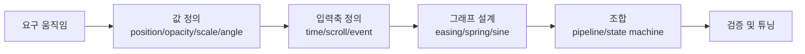
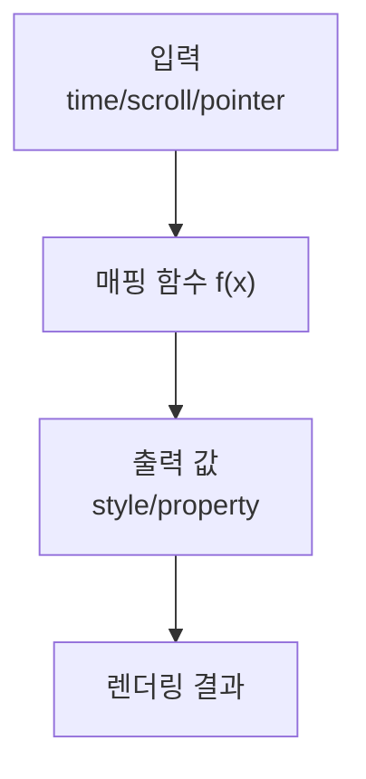
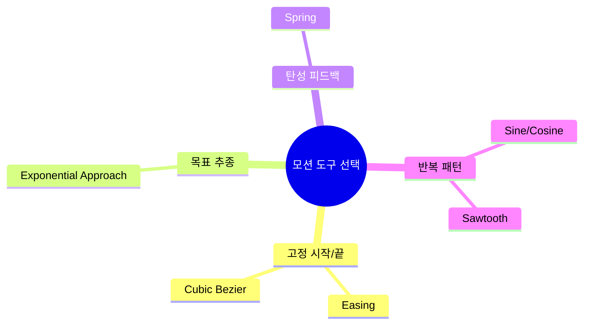
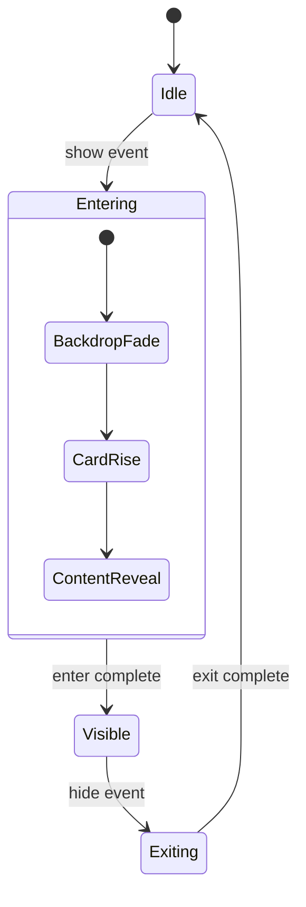
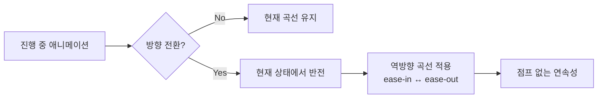

애니메이션을 잘 만드는 사람은 "감각이 좋다"고 자주 말하지만, 실제 구현 단계에서는 감각만으로 재현 가능한 결과를 만들기 어렵습니다.
이번 글은 kciter의 글을 기반으로, 애니메이션을 그래프와 상태 전환 문제로 바꿔서 설계하는 실무 프레임워크를 정리한 요약 노트입니다.

<!--more-->

## Sources

- https://kciter.so/posts/how-to-design-animation/

## 핵심 요약

1. 애니메이션은 시간(또는 입력값)에 따라 값이 변하는 그래프로 보면 설계가 가능해집니다.
2. 단일 기법보다 "그래프 분해 + 의존성 정의 + 조합 전략"이 복잡한 인터랙션에서 훨씬 강합니다.
3. UI 핵심 전환은 예측 가능성을, 보조 효과는 물리/랜덤성을 우선해 역할을 분리해야 유지보수가 쉬워집니다.

## 1) 애니메이션을 "그래프"로 보면 달라지는 점

글의 가장 중요한 메시지는 단순합니다. 애니메이션은 결국 입력값에 따른 출력값 변화이며, 이는 그래프로 표현할 수 있다는 점입니다.

- x축: 시간, 스크롤 위치, 마우스 좌표, 이벤트 진행도 등
- y축: opacity, translate, scale, rotation, blur 등

이 관점의 장점은 두 가지입니다.

- 재현 가능성: 같은 입력이면 같은 결과를 만든다.
- 조합 가능성: 속성별 그래프를 분리해서 재사용할 수 있다.

## 2) 수학 도구는 "공식"이 아니라 "움직임 라이브러리"

원문에서 소개한 수학 기법은 외워야 할 공식이 아니라, 원하는 질감의 움직임을 빠르게 고르는 라이브러리로 보는 편이 실무에 맞습니다.

### 이징/베지어: 의도된 시작과 끝

- 장점: 시작점/종점이 명확하고, 구현이 쉽다.
- 사용처: 모달 열림, 토스트 등장, 페이지 전환 같은 핵심 UI 트랜지션.

### 지수적 접근: 목표값이 자주 바뀌는 추종

- 패턴: `value += (target - value) * factor`
- 장점: 목표가 바뀌어도 부드럽게 추적한다.
- 사용처: 커서 추종, 카운터 증가, 부드러운 프로그레스 표시.

### 스프링: 관성과 반발이 필요한 피드백

- 장점: 오버슛/안착으로 촉각적 반응을 만든다.
- 사용처: 버튼 탭 반응, 카드 스냅, 드래그 복귀.

### 삼각함수/톱니파: 반복 모션

- `sin/cos`: 왕복형 반복(호흡, 흔들림, 파동)
- sawtooth: 단방향 반복(펄스 링, 핑, 반복 진행감)

## 3) 복잡한 모션 설계: 분해 후 조립

원문의 설계 파트는 실무에서 가장 바로 적용됩니다. 핵심은 "한 방 공식"을 찾지 말고 그래프를 분해하고 조립하는 것입니다.

### 그래프를 구간으로 분해

예: 핀 바운스, 카드 진입, 폭죽처럼 단계별 성격이 달라지는 모션은 구간별(piecewise) 함수로 나눕니다.

### 무엇에 의존하는지 먼저 결정

- 시간 기반: 대부분의 전환 애니메이션
- 값 기반: 스크롤/포인터 기반 인터랙션
- 이벤트 기반: 클릭/호버/데이터 완료 트리거

### 조합 전략 선택

- 파이프라이닝: 순차/겹침/동시/스태거로 연결
- 상태 전환: 조건으로 다음 단계 이동(상태 머신)
- 속성 분리: opacity/scale/border 등은 독립 트랙으로 운영

## 4) 랜덤성과 양방향성: 자연스러움과 안정성의 균형

글에서 특히 좋은 포인트는 랜덤성과 양방향성을 "추가 기능"이 아니라 설계 원칙으로 다룬 점입니다.

- 랜덤성은 범위를 통제해야 합니다. 완전 무작위는 의도하지 않은 결과를 만듭니다.
- 양방향성은 진행 중 역전(되감기)을 가정해야 합니다. 스크롤/토글 인터랙션에서 점프를 줄일 수 있습니다.

## 5) 언제 코드 기반을 포기하고 도구로 갈까

원문처럼, 모든 애니메이션을 코드로 밀어붙일 필요는 없습니다.

- 코드 기반 적합: 실시간 입력 반응, 상태 의존 인터랙션
- 도구 기반 적합: 복잡한 모핑, 레이어 다중 연출, 정교한 캐릭터 모션

즉, "인터랙션 중심은 코드", "연출 중심은 Lottie/Rive/영상"으로 역할 분리를 두면 생산성과 품질이 모두 올라갑니다.

## 실무 적용 체크리스트

1. 먼저 속성을 분리했는가? (`position`, `opacity`, `scale`, `rotation`)
2. 각 속성의 입력축을 정의했는가? (time/scroll/event)
3. 트랙별 곡선을 독립적으로 선택했는가? (easing/spring/sine)
4. 역방향 전환 시 점프 없이 이어지는가?
5. 랜덤 범위가 의도된 상/하한 안에 있는가?

이 5가지만 지켜도 "멋있지만 고치기 어려운 모션"에서 "재현 가능하고 협업 가능한 모션"으로 빠르게 전환할 수 있습니다.

## 마무리

애니메이션 설계의 핵심은 화려한 효과가 아니라 **분해 가능한 모델**을 만드는 것입니다.
그래프 관점으로 문제를 재정의하고, 상태 전환과 속성 분리로 조립하면 복잡한 모션도 팀 단위로 안정적으로 운영할 수 있습니다.
