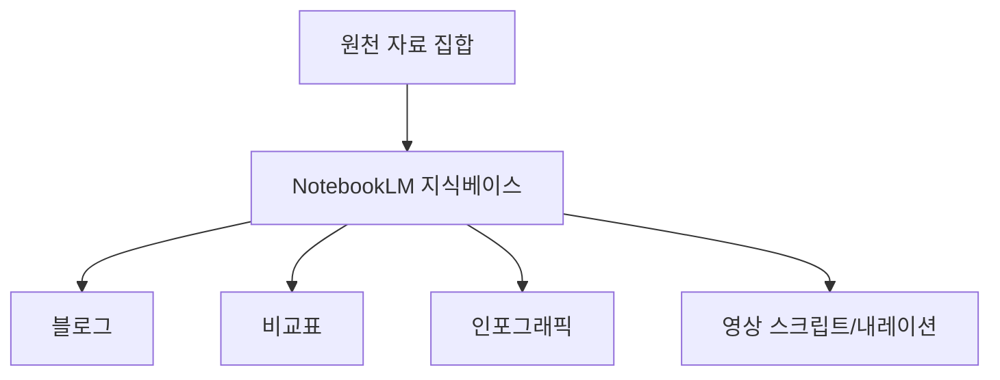
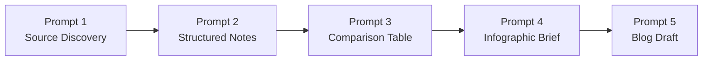
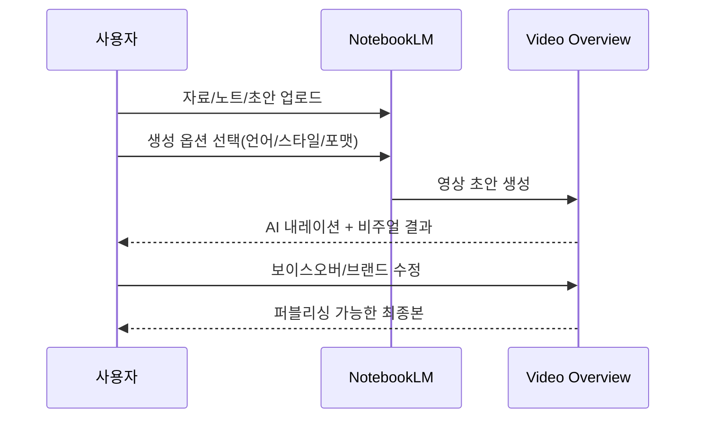
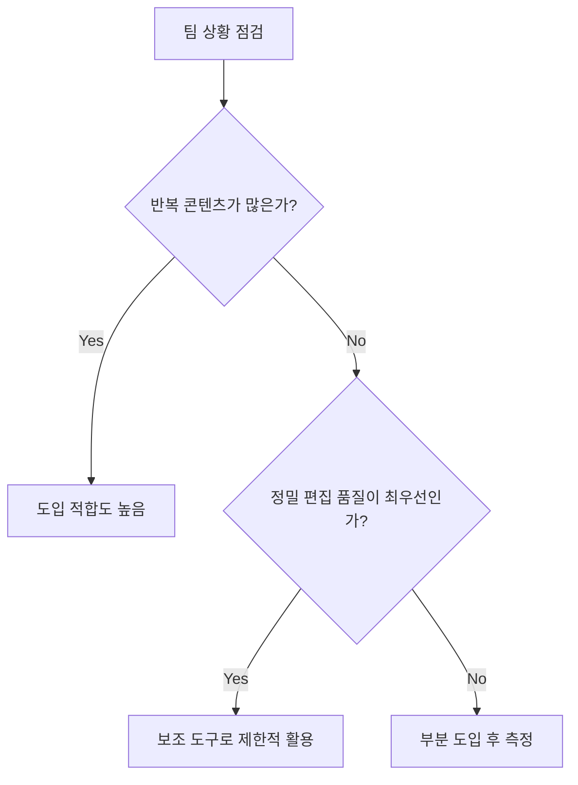

NotebookLM이 Gemini 3 기반으로 업데이트되면서, 리서치-정리-시각화-블로그-영상화가 하나의 도구 안에서 이어지는 흐름이 현실화되었습니다.
이 글은 아래 영상을 바탕으로, 과장된 마케팅 문구는 걷어내고 실제로 재현 가능한 워크플로우만 추려서 정리한 실전 노트입니다.

## Sources

- https://www.youtube.com/watch?v=MeUemwjlGSk

<!--more-->

## 3줄 요약

1. 영상의 핵심은 "NotebookLM으로 자료 수집부터 모바일 영상 초안 생성까지 연결"되는 점입니다.
2. 실무적으로는 5개 프롬프트(수집→구조화→비교표→인포그래픽→블로그 초안)가 재사용 가능한 골격입니다.
3. 최종 품질은 AI 초안 자체보다, 사람의 보이스오버/브랜드 맥락을 얼마나 덧입히는지에서 갈립니다.

## 왜 이번 업데이트가 체감상 큰가

영상에서 강조하는 변화는 기능 하나가 아니라 "콘텐츠 생산 파이프라인의 마찰 감소"입니다.

- 이전: 검색 탭, 문서 정리 도구, 디자인 도구, 영상 도구를 오가며 컨텍스트 손실 발생
- 이후: NotebookLM 내부에서 소스 축적과 재가공을 반복하며 출력물 형태만 바꿔 확장

즉, 생산성 포인트는 "완전히 새로운 결과물"보다 "같은 근거 자료를 여러 포맷으로 재활용"하는 데 있습니다.

## 영상에서 제시한 5개 프롬프트, 실무용으로 재해석

영상은 AI Profit Boardroom이라는 커뮤니티 사례를 기준으로 5개 프롬프트를 제시합니다.
실무에 옮길 때는 아래처럼 "산출물 계약"을 명시하는 방식이 더 안정적입니다.

### 1) Discover: 신뢰 소스 수집

- 목적: 공식 문서, 최신 글, 튜토리얼, 사례를 빠르게 모으기
- 실무 팁: "기간", "출처 우선순위", "제외할 상업성 콘텐츠" 조건을 함께 지정

### 2) Analyze: 구조화

- 목적: 개념, 단계, 도구, 이점, 실수 포인트로 분해
- 실무 팁: 팀 공유를 고려해 섹션 헤더를 고정하면 재사용성이 올라감

### 3) Compare Table: 설명 책임 강화

- 목적: 사용 사례/입력/출력/비즈니스 의미를 표로 정리
- 실무 팁: 랜딩 페이지나 세일즈 자료에서 "증거" 역할을 하므로 칼럼 정의를 먼저 고정

### 4) Infographic: 멀티 채널 변환

- 목적: 같은 내용을 SNS/블로그/뉴스레터용 비주얼로 확장
- 실무 팁: 세로형(숏폼/SNS)과 가로형(썸네일/슬라이드)을 처음부터 분기 설계

### 5) Blog Draft: 퍼블리싱 초안

- 목적: 강한 도입부와 실제 예시를 포함한 초안 생성
- 실무 팁: 표/인포그래픽 자리 표시자(placeholder)를 먼저 넣으면 협업 편집이 쉬움

## 모바일 Video Overview를 쓸 때의 현실적 운영 포인트

영상의 하이라이트는 스마트폰에서 Video Overview를 만드는 부분입니다.
다만 운영 관점에서는 "생성 자체"보다 "검수 체계"가 더 중요합니다.

1. 소스 선택: 어떤 문서를 영상 생성 대상으로 넣었는지 기록
2. 내레이션 선택: 언어/톤 설정을 브랜드 톤과 맞추기
3. 시각 요소 검수: 자동 삽입된 비주얼이 실제 메시지와 일치하는지 확인
4. 최종 보강: 사람 목소리나 브랜드 문구로 차별점 추가

## 이 접근이 잘 맞는 팀 vs 주의가 필요한 팀

- 잘 맞는 경우: 반복 발행이 중요하고, 하나의 리서치 자산을 여러 채널로 재활용해야 하는 팀
- 주의할 경우: 브랜드 톤/법적 표현/수치 정확성 검수가 매우 엄격한 도메인(금융, 의료 등)

## 실전 체크리스트

1. 프롬프트를 "질문"이 아니라 "산출물 스펙"으로 작성했는가
2. 비교표/인포그래픽/블로그/영상이 같은 근거 자료를 공유하는가
3. AI 결과물을 사람 검수 단계(팩트/톤/표현)로 반드시 통과시키는가
4. 채널별 포맷(세로/가로, 길이, 톤)을 초기에 분리했는가
5. 발행 후 성과(조회, 체류, 전환)를 다시 다음 프롬프트 개선에 반영하는가

## 결론

이 영상의 요점은 "AI가 영상을 대신 만들어준다"보다,
**하나의 지식베이스를 중심으로 텍스트/표/인포그래픽/영상을 연쇄 생산하는 운영 방식**에 가깝습니다.

결국 성과를 가르는 것은 도구 자체보다,
프롬프트를 시스템처럼 설계하고 마지막 품질 책임을 사람이 가져가는 팀 운영입니다.
