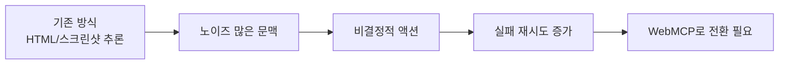
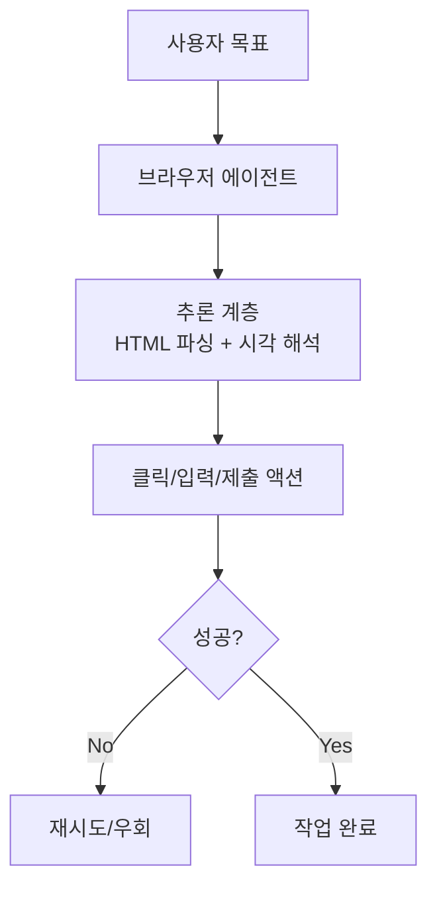
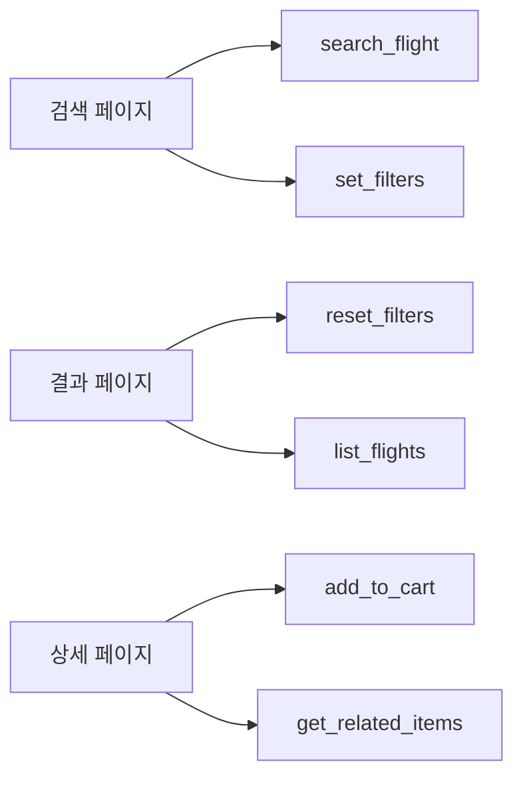
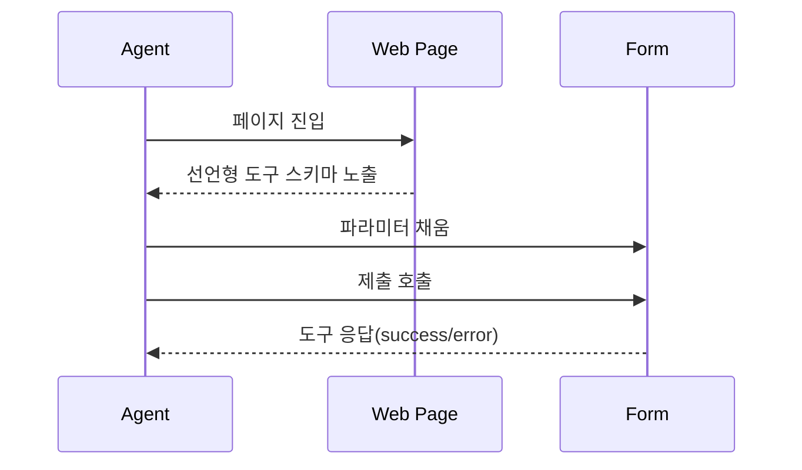
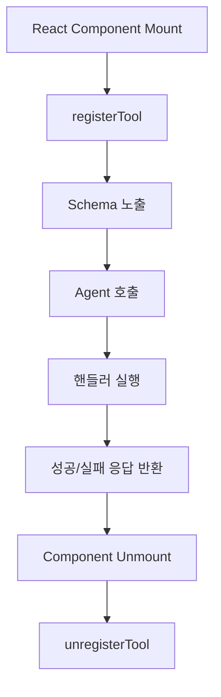
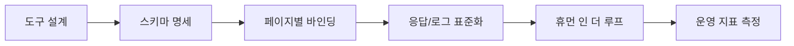
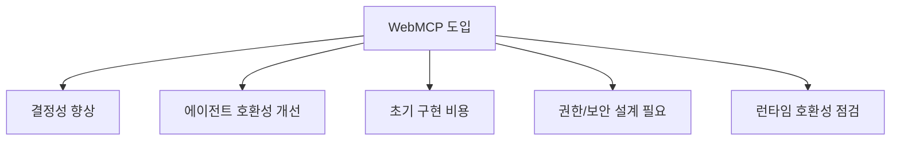

브라우저를 쓰는 AI 에이전트가 늘어나면서, 웹사이트는 이제 "사람만 읽기 좋은 UI"를 넘어 "에이전트가 결정적으로 조작하기 좋은 인터페이스"를 요구받고 있습니다.

이 글은 아래 영상을 기반으로 WebMCP의 핵심 개념과 실제 도입 흐름을 실무 관점으로 압축해 정리한 노트입니다.

- 원본 영상: [구글이 공개한 역대급 기술! 이제 AI가 내 웹사이트를 직접 조종합니다 (WebMCP)](https://www.youtube.com/watch?v=8zEh7eYz4Pc)
- 채널: [Nova AI](https://www.youtube.com/@NovaAI)

<!--more-->

## 3줄 요약

1. 기존 브라우저 자동화는 HTML/스크린샷 해석 기반이라 비결정성이 높고 실패율이 누적됩니다.
2. WebMCP는 웹페이지 내부에 도구 스키마를 직접 노출해, 에이전트 행동을 MCP 호출처럼 구조화합니다.
3. 선언형(HTML 속성)과 명령형(JS/React 등록)을 상황별로 선택하면, 롱테일 웹 기능도 에이전트 친화적으로 전환할 수 있습니다.

## 왜 WebMCP가 필요한가

영상의 핵심 문제정의는 명확합니다.
현재 대부분의 브라우저 에이전트는 사람이 소비하도록 설계된 화면을 다시 해석해 행동을 추론합니다.
이때 번역 계층(스크린샷 주석, 대량 HTML 정리)에서 노이즈가 유입되고, 결국 같은 요청도 매번 다르게 실행될 수 있습니다.

WebMCP는 이 "추론 계층의 불확실성"을 줄여,
에이전트가 페이지 문맥에 맞는 도구를 명시적으로 호출하게 만드는 접근입니다.

## WebMCP의 기본 모델: 페이지 문맥 기반 도구 로딩

중요한 포인트는 "페이지마다 노출되는 도구가 달라진다"는 점입니다.

- 홈/검색 페이지: 검색, 필터링, 카테고리 조회
- 상세 페이지: 장바구니 추가, 관련 항목 조회
- 결과 페이지: 정렬 변경, 조건 리셋, 다음 액션

즉, 에이전트는 현재 뷰에서 가능한 행동만 좁은 스키마로 받아 실행합니다.

이 구조는 MCP의 장점(스키마 기반 결정성)을 유지하면서도,
항상 모든 도구를 문맥에 넣어야 하는 부담을 줄입니다.

## 구현 방식 1: 선언형(Declarative)

정적 페이지나 단순 폼에는 선언형이 가장 빠릅니다.

핵심 아이디어:

- 폼에 도구 이름/설명 메타 속성 부여
- 입력 필드마다 파라미터 설명 부여
- 제출 이벤트에서 성공/실패 도구 응답 반환
- 필요 시 에이전트 전용 CSS 상태 클래스(`tool-form-active`, `tool-submit-active`)로 UX 분리

이 방식의 장점은 "도입 속도"입니다.
기존 HTML 폼을 대규모 리팩터링 없이 에이전트 사용 가능 상태로 전환할 수 있습니다.

## 구현 방식 2: 명령형(Imperative, JS/React)

실서비스 앱(React/Next.js 등)에서는 명령형이 주력입니다.

흐름은 보통 다음과 같습니다.

1. WebMCP 도구 정의 파일 분리
2. `registerTool`/`unregisterTool` 패턴으로 생명주기 연결
3. 컴포넌트 마운트 시 도구 등록, 언마운트 시 해제
4. 요청 ID 기반 이벤트 추적으로 실행 로그/결과 관리

핵심은 UI 상태와 도구 가용성을 동기화하는 것입니다.
컴포넌트가 화면에 있을 때만 해당 도구를 노출하면, 에이전트의 액션 공간을 자연스럽게 제한할 수 있습니다.

## WebMCP를 도입할 때 팀이 바로 점검할 것

아래 체크리스트는 영상 내용을 실무 관점으로 재구성한 최소 기준입니다.

- 도메인 액션을 "도구 단위"로 먼저 쪼개고, 각 도구의 입력/출력 스키마를 문서화했는가
- 페이지/컴포넌트 전환 시 도구 등록/해제 누락이 없는가
- 도구 응답에 성공/실패 사유를 구조화해 후속 액션 판단이 가능한가
- 사람 검토가 필요한 단계(결제/삭제/전송)는 명시적 확인 UI를 제공하는가
- 기존 셀레니움/스크린샷 자동화 대비 실패율, 재시도율, 완료시간 지표를 비교 측정하는가

## 리스크와 현실적 기대치

영상은 WebMCP를 매우 강하게 긍정하지만, 운영 관점에서는 아래를 같이 봐야 합니다.

1. 브라우저/플래그 의존성: 초기에는 특정 채널(예: 베타) 기능 의존이 생길 수 있습니다.
2. 도구 설계 비용: UI 이벤트를 그대로 노출하는 대신 도메인 동작으로 재설계해야 합니다.
3. 보안 경계: 강한 액션(삭제/결제/변경)은 권한과 확인 단계가 필수입니다.

## 결론

WebMCP의 본질은 "웹 자동화"를 더 잘하는 기술이라기보다,
웹 애플리케이션을 에이전트가 다룰 수 있는 API-유사 인터페이스로 재구성하는 설계 패턴에 가깝습니다.

앞으로 에이전트 트래픽이 늘어날수록,
"화면을 읽게 하는 사이트"와 "의도를 실행하게 하는 사이트"의 전환 속도 차이가 제품 경쟁력으로 이어질 가능성이 큽니다.

## 참고

- [구글이 공개한 역대급 기술! 이제 AI가 내 웹사이트를 직접 조종합니다 (WebMCP)](https://www.youtube.com/watch?v=8zEh7eYz4Pc)
- [Nova AI 채널](https://www.youtube.com/@NovaAI)
