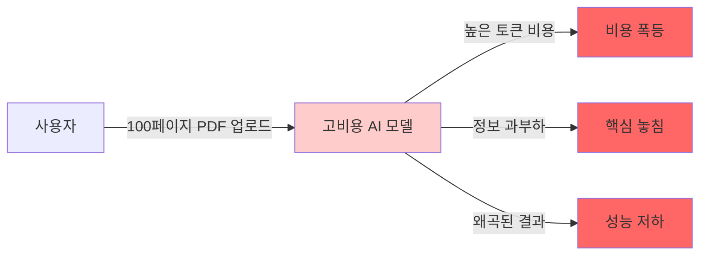
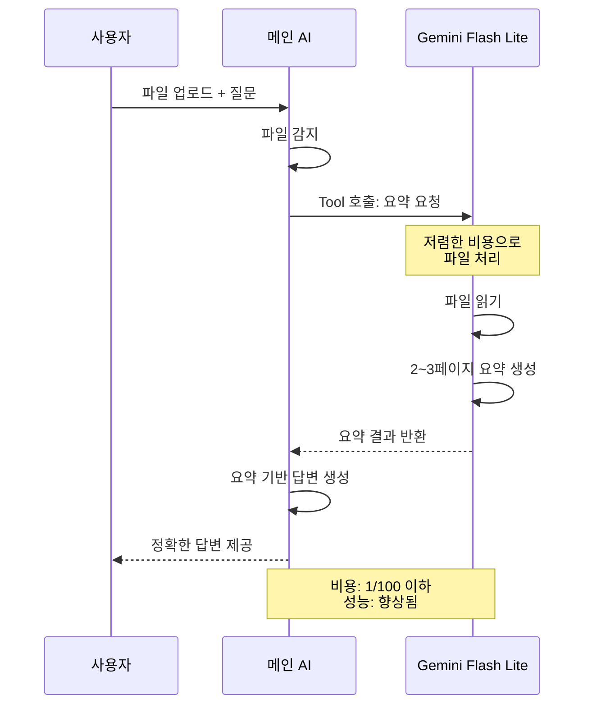
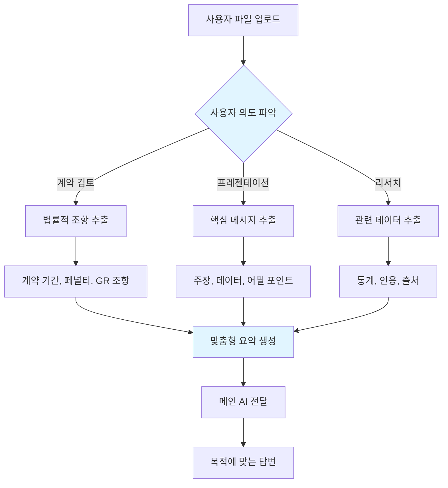

당신이 회사에서 가장 비싼 고액 연봉의 컨설턴트를 고용했다고 상상해보세요. 그런데 100페이지짜리 방대한 PDF 문서를 그 컨설턴트 앞에 던져주며 "이걸 읽고 요약해줘"라고 요청합니다. 비싼 시간당 비용을 내면서 말이죠.

이것이 지금 대부분의 AI 서비스가 범하고 있는 실수입니다. 대용량 파일을 고성능 AI 모델에 직접 업로드하면 비용은 폭등하고, 정작 중요한 핵심 내용은 누락되기 쉽습니다.

더 나은 방법이 있습니다. **두 개의 AI 시스템을 역할 분담**시키는 것입니다. 저렴하고 빠른 AI가 파일을 읽고 요약하면, 고성능 AI가 그 요약만 받아서 정확한 답변을 제공합니다.

이 글에서는 왜 파일 직접 업로드가 문제인지, 그리고 두 개의 AI를 활용해 비용을 절감하고 성능을 향상시키는 구체적인 방법을 소개합니다.

<!--more-->

## Sources

- **YouTube**: [파일 넣으면 AI가 멍청해지는 이유](https://www.youtube.com/watch?v=E5JQUmlvtSw)
- **Channel**: 메이커 에반 | Maker Evan

## 파일 직접 업로드의 문제점

대용량 파일을 AI에 직접 업로드하는 것은 세 가지 핵심 문제를 야기합니다.

### 1. 비용 폭등

파일 크기가 커질수록 AI 처리 비용은 선형으로 증가합니다. GPT-4나 Claude 같은 고성능 모델에 100페이지 PDF를 그대로 올리면 토큰 사용량이 폭발적으로 늘어납니다. 단순한 "요약" 작업에도 고비용 모델의 전체 능력을 사용하게 되는 낭비가 발생합니다.

### 2. 정보 과부하로 인한 집중력 저하

사람에게도 정보 과부하가 문제가 되듯 AI에게도 마찬가지입니다. 100페이지 분량의 텍스트를 한 번에 처리하면 AI는 모든 내용을 균등하게 처리하려고 시도하고, 정작 핵심적인 내용을 놓치거나 희석시킬 가능성이 높아집니다.

### 3. 컨설턴트 비유의 핵심

시간당 100만 원을 받는 최고급 컨설턴트를 고용했다고 상상해보세요. 이 컨설턴트에게 100페이지짜리 계약서를 주고 "이걸 다 읽고 요약해줘"라고 요청하는 것은 낭비입니다. 대신 인턴이 먼저 읽고 2~3페이지로 요약한 후 핵심 내용만 컨설턴트에게 전달하면 어떨까요? 컨설턴트는 핵심 내용에 집중해 더 정확한 분석을 제공할 것입니다.



현재 대부분의 AI 서비스가 이 비효율적인 구조를 따르고 있습니다. 파일을 그대로 고비용 AI에 전달하기 때문이죠.

## 두 개의 AI 시스템 활용

해결책은 **역할 분담**입니다. 두 개의 AI 모델을 각각의 강점에 맞게 사용하는 것입니다.

### 첫 번째 AI: Gemini Flash 2.5 (저렴하고 빠른 모델)

Gemini Flash 2.5는 매우 저렴하면서도 대용량 파일 처리에 특화된 모델입니다. 이 모델의 역할은:
- 원본 파일을 읽고 핵심 내용 추출
- 2~3페이지 분량의 요약 생성
- 사용자 질문과 관련된 부분 식별

### 두 번째 AI: 메인 AI (GPT/Claude)

사용자가 직접 대화하는 고성능 AI 모델의 역할은:
- 요약된 내용을 기반으로 사용자 질문에 답변
- 복잡한 분석과 추론 수행
- 정확하고 깊이 있는 답변 제공

### 역할 분담의 핵심

인턴과 최고급 컨설턴트의 관계와 동일합니다. 인턴(Flash)이 자료를 정리하면, 컨설턴트(메인 AI)가 핵심에 집중해 최종 분석을 제공합니다.



### Tool Calling 구현

메인 AI는 도구 호출(Tool Calling) 메커니즘을 통해 자동으로 Flash Lite를 활용합니다. 사용자가 파일을 업로드하면 메인 AI는:

1. 파일 크기와 유형을 감지
2. 요약이 필요하다고 판단하면 Flash Lite 도구 호출
3. 요약 결과를 받아 사용자 질문에 답변

이 과정은 사용자에게 완전히 투명하게 진행됩니다.

## 세 가지 핵심 이점

두 개의 AI 시스템을 활용하는 접근 방식은 세 가지 명확한 이점을 제공합니다.

### 1. 역할 분담 (Role Division)

각 AI 모델이 가장 잘하는 작업에 집중합니다.

- **Gemini Flash**: 대용량 파일 읽기, 텍스트 추출, 기본 요약
- **메인 AI**: 복잡한 분석, 추론, 사용자 질문에 대한 정확한 답변

컨설팅 회사에서 인턴이 자료 조사를 담당하고 시니어 컨설턴트가 전략 수립을 담당하는 것과 같은 원리입니다.

### 2. 비용 절감 (Cost Reduction)

가장 눈에 띄는 이점은 비용 절감입니다. 구체적인 예를 들어보겠습니다.

**20페이지 PDF 처리 비용 비교**:

| 항목 | 직접 업로드 방식 | 두 AI 방식 |
|------|------------------|------------|
| GPT-4O 처리 토큰 | 약 30,000 토큰 | 약 1,000 토큰 (요약만) |
| Flash Lite 처리 | 없음 | 약 30,000 토큰 |
| 예상 비용 | $0.15~$0.30 | $0.001~$0.003 |
| 비용 절감율 | 기준 | **약 95~99% 절감** |

Flash Lite는 거의 무료에 가까운 가격을 제공하므로, 대용량 파일을 처리하는 비용이 거의 발생하지 않습니다.

### 3. 성능 향상 (Performance Improvement)

역설적이게도, 더 적은 정보를 주면 더 좋은 결과를 얻을 수 있습니다.

- **더 깔끔한 입력**: 100페이지 대신 2~3페이지의 정제된 요약
- **핵심에 집중**: 노이즈가 제거된 정보로 더 정확한 답변
- **할루시네이션 감소**: 정보 과부하로 인한 모호한 답변 감소

좋은 입력이 좋은 출력을 만듭니다(Garbage In, Garbage Out의 역버전). 정제된 정보는 AI가 더 나은 결론을 내리도록 돕습니다.

## 목적에 따른 맞춤형 요약

동일한 파일이라도 사용자의 **의도(Intent)**에 따라 다르게 요약될 수 있습니다. 이것이 두 AI 시스템의 강력한 기능 중 하나입니다.

### 계약서 예시

50페이지짜리 계약서 PDF를 업로드한다고 가정해보겠습니다. 사용자의 목적에 따라 요약의 내용이 완전히 달라집니다.

**목적 1: "계약서 검토 부탁해"**

Flash Lite는 다음 내용을 중점적으로 추출합니다:
- 계약 기간과 갱신 조건
- 위약금 및 페널티 조항
- GR(Governing Law) 및 분쟁 해결 조항
- 주요 의무사항과 제한사항

**목적 2: "이걸로 프레젠테이션 자료 만들어줘"**

Flash Lite는 다음 내용을 중점적으로 추출합니다:
- 핵심 주장과 요점
- 주요 데이터와 수치
- 중요한 날짜와 마일스톤
- 클라이언트에게 어필할 핵심 메시지



### 맥락 인식 요약

메인 AI는 사용자의 질문을 분석해 Flash Lite에게 **어떤 관점**으로 요약할지 지시합니다.

- "이 계약서의 리스크는?" → 리스크 관련 조항 중심 요약
- "한 줄로 요약해줘" → 전체 핵심만 간결하게
- "상대방에게 불리한 부분은?" → 상대방 약점 중심 추출

이렇게 사용자의 의도에 따라 동적이고 맞춤화된 요약이 가능합니다.

## 실전 적용 방법

AI 에이전트 개발자가 이 패턴을 즉시 적용할 수 있는 구체적인 방법입니다.

### 1. 파일 업로드 감지

사용자가 파일을 업로드하면 메인 AI는 파일 크기와 유형을 감지합니다. 일정 크기 이상(예: 5페이지 이상)인 경우 자동으로 요약 파이프라인을 트리거합니다.

### 2. 별도 인프라 불필요

새로운 서버나 데이터베이스를 구축할 필요가 없습니다. Tool Calling만으로 구현 가능합니다.

```python
# 메인 AI의 Tool 정의 예시
tools = [{
    "type": "function",
    "function": {
        "name": "summarize_file",
        "description": "대용량 파일을 읽고 요약합니다",
        "parameters": {
            "type": "object",
            "properties": {
                "file_path": {"type": "string"},
                "focus": {"type": "string", "description": "사용자 질문의 맥락"}
            }
        }
    }
}]
```

### 3. 자동 결정

메인 AI가 스스로 판단해서 도구를 호출합니다. 사용자가 "요약해줘"라고 말하지 않아도, 파일이 크면 자동으로 요약 프로세스를 시작합니다.

### 4. 목적별 프롬프트

사용자 질문의 맥락을 Flash Lite에게 전달해 목적에 맞는 요약을 유도합니다.

| 사용자 질문 유형 | Flash Lite에게 전달할 포커스 |
|----------------|---------------------------|
| "계약서 검토해줘" | "법률적 조항, 리스크, 의무사항 중심으로" |
| "간단히 요약해줘" | "전체 핵심을 2~3문단으로" |
| "데이터만 뽑아줘" | "수치, 통계, 날짜 위주로" |

### 5. 개발자 체크리스트

AI 에이전트에 파일 업로드 기능을 추가할 때:
- [ ] 파일 크기 감지 로직 구현
- [ ] Flash Lite API 연동 (Tool 형태)
- [ ] 사용자 질문에서 맥락 추출 로직
- [ ] 요약 결과를 메인 AI의 컨텍스트로 전달
- [ ] 비용 모니터링 (절감 효과 확인)

## 결론

**AI에게 무엇을 보여주느냐가 아니라 무엇을 걸러서 주느냐**가 핵심입니다.

이 글에서 살펴본 두 개의 AI 시스템 접근 방식의 핵심을 정리하면:

1. **저렴한 AI**가 대용량 파일을 읽고 요약합니다
2. **고성능 AI**는 정제된 요약만 받아서 분석합니다
3. 결과적으로 **비용은 95% 이상 절감**되고 **성능은 향상**됩니다

좋은 입력이 좋은 출력을 만듭니다. 100페이지를 그대로 주는 것보다, 2~3페이지로 잘 정리된 핵심만 주는 것이 AI는 더 정확한 답변을 제공합니다.

AI 에이전트 개발자라면 이 패턴을 즉시 적용해보세요. 별도의 인프라 없이 Tool Calling만으로 구현 가능하며, 비용 절감 효과는 즉각적으로 체감할 수 있습니다.

AI의 성능은 모델의 능력만으로 결정되지 않습니다. **어떤 정보를 어떻게 전달하느냐**가 동등하게 중요합니다. 필터링 없는 데이터 전달은 비용 낭비이자 성능 저하의 원인입니다.


