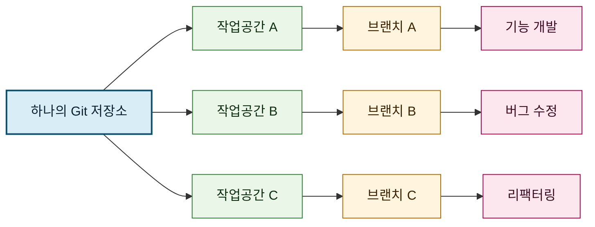
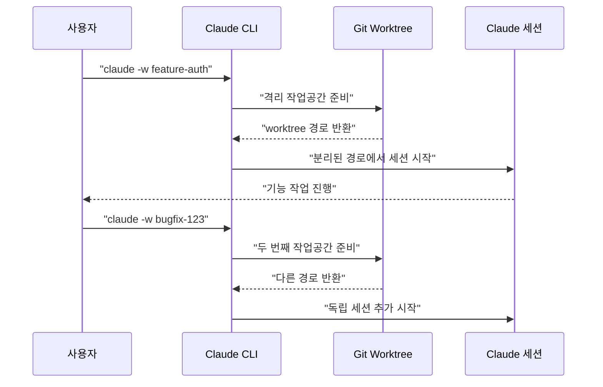
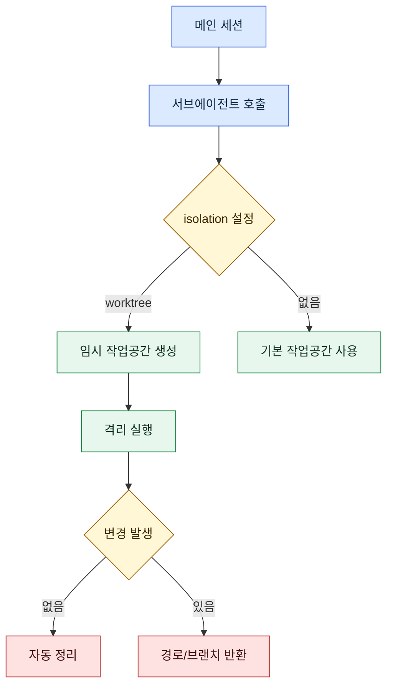

Claude Code를 여러 개 동시에 돌리면 생산성이 크게 오르지만, 같은 작업 디렉터리에서 병렬 실행하면 파일 충돌과 컨텍스트 꼬임이 빠르게 발생합니다. 최근 Threads에서 공유된 `qjc.ai`의 7개 연속 포스트는 이 문제를 `git worktree + claude -w` 조합으로 풀어내는 실전 감각을 잘 보여줬습니다.

이 글은 해당 스레드 내용을 그대로 요약하는 데서 끝내지 않고, Anthropic 공식 문서와 교차 검증해서 **지금 바로 재현 가능한 패턴**과 **검증이 필요한 주장**을 분리해 정리합니다.

<!--more-->

## Sources

- [https://www.threads.com/@qjc.ai/post/DVDEONRkrEn?xmt=AQF0vgR-Dy3VkP_ZSt6xVhOAoMmJOtAMmO2hKX7XNZdecZa1dRz9vhicp7e-u8xfvkEkHJ3w](https://www.threads.com/@qjc.ai/post/DVDEONRkrEn?xmt=AQF0vgR-Dy3VkP_ZSt6xVhOAoMmJOtAMmO2hKX7XNZdecZa1dRz9vhicp7e-u8xfvkEkHJ3w)
- [Claude Code CLI reference](https://code.claude.com/docs/en/cli-reference.md)
- [Claude Code Common workflows](https://code.claude.com/docs/en/common-workflows.md)
- [Claude Code Best practices](https://code.claude.com/docs/en/best-practices.md)
- [Create custom subagents](https://code.claude.com/docs/en/sub-agents.md)
- [Agent Teams](https://code.claude.com/docs/en/agent-teams.md)

## 1) 왜 Git Worktree가 병렬 실행의 기준 단위가 되는가

스레드의 핵심 메시지는 단순합니다. "폴더를 여러 번 복사해서 병렬 작업하지 말고, 하나의 리포에서 worktree를 나눠서 돌려라"입니다. 실제로 Git worktree는 `.git` 객체를 공유하면서 작업 디렉터리를 분리하므로, 디스크 낭비를 줄이면서도 작업 충돌을 구조적으로 낮출 수 있습니다.

스레드 본문도 같은 요지를 강조합니다. "하나의 리포에서 여러 브랜치를 동시에 체크아웃"하고, 물리적으로 파일이 분리되기 때문에 충돌 자체를 줄일 수 있다는 설명입니다.



## 2) `claude -w` 패턴: 여러 세션을 동시에 띄우는 최소 구성

공식 CLI 문서 기준으로 `--worktree`(`-w`)는 검증된 옵션입니다. 동작은 `<repo>/.claude/worktrees/<name>` 경로에 격리된 작업공간을 만들고, 이름을 생략하면 자동 생성됩니다.

스레드에서 공유된 패턴은 다음처럼 "작업 단위별 이름"으로 병렬 실행하는 방식입니다.

```bash
claude -w feature-auth
claude -w bugfix-123
claude -w refactor-api
claude -w add-tests
```

이 구조의 장점은 세 가지입니다. 첫째, 세션별 파일 상태가 분리됩니다. 둘째, 각 세션을 서로 다른 브랜치 흐름으로 관리하기 쉽습니다. 셋째, 마지막 병합을 PR 중심으로 고정해 팀 협업 규칙과 맞추기 좋습니다.



## 3) `--tmux`와 `--teammate-mode tmux`: 지금 문서에서 확인되는 차이

스레드 예시는 `claude -w ... --tmux` 형태로 제시됩니다. 반면, 현재 공식 문서에서 확인되는 tmux 관련 설정은 Agent Teams 문서의 `--teammate-mode tmux` 또는 `teammateMode: "tmux"`입니다.

즉, "tmux로 다중 세션을 보는 방식" 자체는 문서에 존재하지만, **독립 `--tmux` 플래그 표기**는 제가 확인한 공식 문서에서는 직접 확인되지 않았습니다. 이 부분은 로컬 버전 차이, 별칭(alias), 또는 비공식 표기 가능성을 열어두고 점검하는 것이 안전합니다.

## 4) Subagent 격리(`isolation: worktree`)와 `.worktreeinclude` 검증 범위

스레드에서는 "서브에이전트 격리 모드"와 `.worktreeinclude`를 함께 소개합니다. 여기서 문서 교차 검증 결과는 명확히 갈립니다.

- `isolation: worktree`: 공식 subagent 문서에서 검증됨
- `.worktreeinclude`: 공식 Claude Code 문서에서 직접 확인되지 않음

따라서 운영 기준은 "문서로 확인된 기능은 적극 사용, 문서에 없는 항목은 실험 플래그처럼 취급"이 가장 안전합니다.

```yaml
---
name: migration-specialist
description: Large migration helper
isolation: worktree
---
```



## 5) 스레드 내용을 실무에 적용할 때의 체크포인트

스레드의 7개 포스트는 "혼자서 팀 단위 병렬 작업"이라는 방향성을 잘 보여줍니다. 다만 실무에서는 아래처럼 검증 레이어를 추가해야 시행착오를 줄일 수 있습니다.

1. 병렬 세션 개수보다 먼저 "작업 경계"를 정의한다.
2. 각 worktree를 기능 단위 브랜치로 고정하고, 마지막 통합은 PR로만 진행한다.
3. CLI 옵션은 항상 `claude --help`와 공식 문서로 재확인한다.
4. 문서 비공식 항목(`.worktreeinclude` 등)은 파일 템플릿/스크립트로 대체 가능하게 설계한다.

## Practical Takeaways

- 병렬 생산성의 핵심은 "더 많은 세션"이 아니라 "격리된 작업공간"이다.
- `claude -w`는 공식 문서로 확인된 안전한 시작점이다.
- tmux 연동은 현재 문서 기준으로 Agent Teams의 `--teammate-mode tmux` 맥락에서 이해하는 것이 정확하다.
- subagent에 `isolation: worktree`를 붙이면 대규모 변경 작업에서 충돌 위험을 크게 낮출 수 있다.
- `.worktreeinclude`는 공식 문서 근거가 약하므로 팀 표준 도입 전 검증이 필요하다.

## Conclusion

이번 스레드가 던진 메시지는 분명합니다. "병렬 실행은 옵션이 아니라 구조"라는 점입니다. 다만 실제 운영에서는 커뮤니티 팁을 그대로 복제하기보다, 공식 문서로 검증된 기능을 중심에 두고 실험적 요소를 분리해 적용해야 안정성과 속도를 동시에 얻을 수 있습니다.
