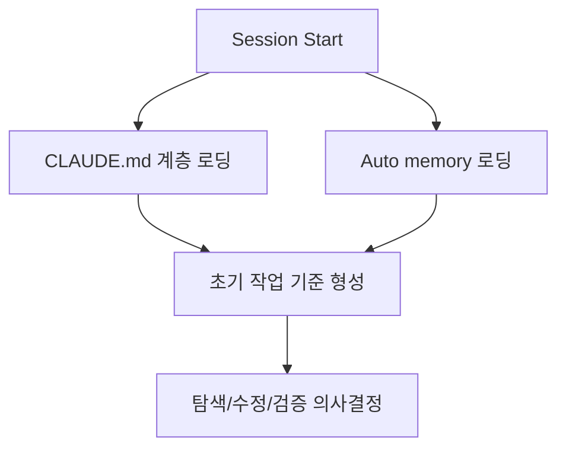
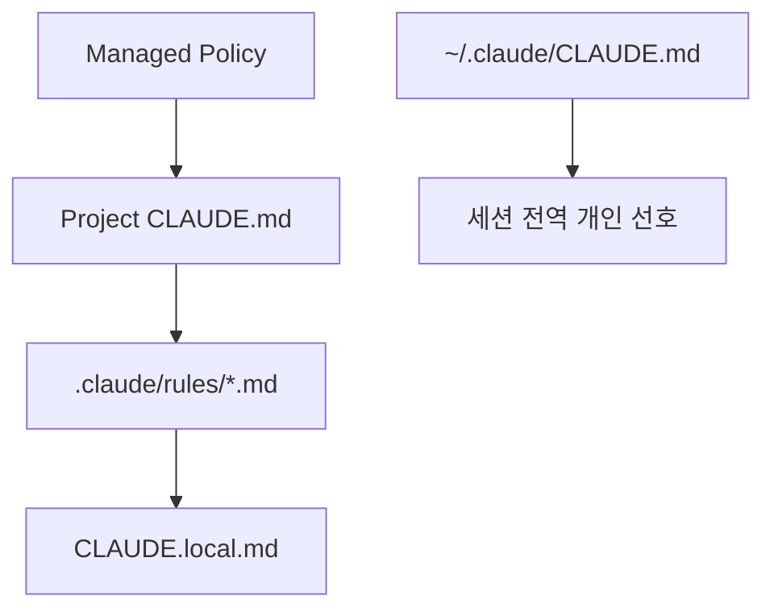
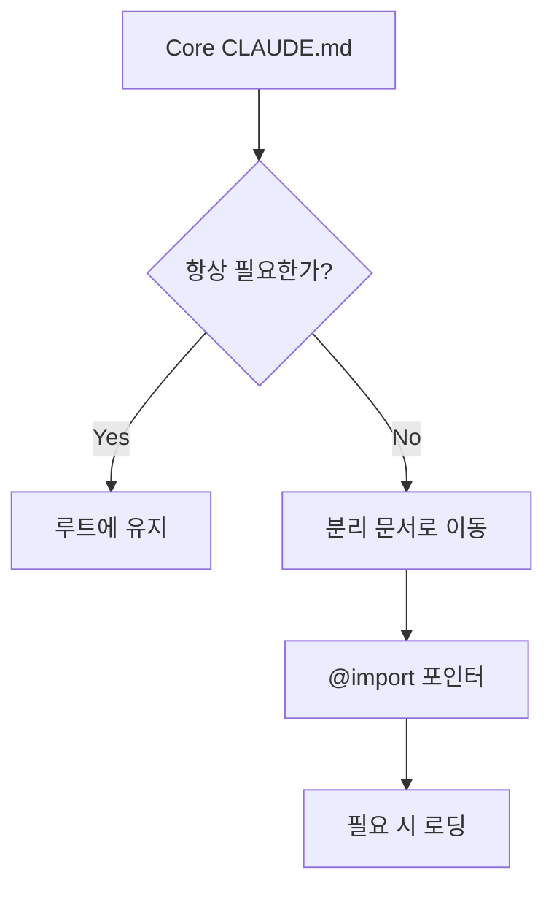
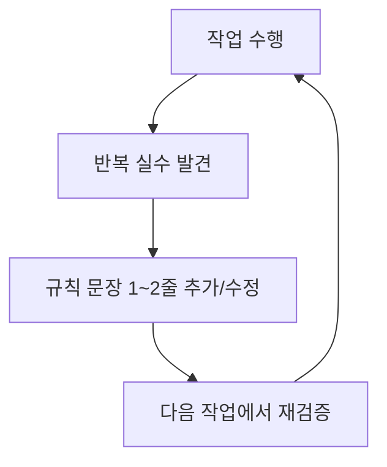
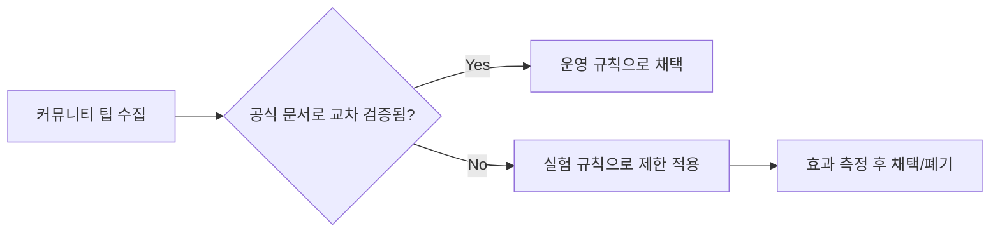

`CLAUDE.md`는 Claude Code에서 단순한 메모 파일이 아니라, 세션마다 재주입되는 작업 기준 문서입니다. 그래서 이 파일의 밀도가 낮으면 매번 같은 실수가 반복되고, 반대로 핵심만 압축하면 결과 품질이 빠르게 안정됩니다.
이 글은 공식 문서에서 확인 가능한 사실과 커뮤니티 실전 패턴을 분리해, 바로 복붙 가능한 운영 형태로 재구성합니다.

<!--more-->

## Sources

- [1] https://code.claude.com/docs/en/memory
- [2] https://code.claude.com/docs/en/best-practices
- [3] https://code.claude.com/docs/en/interactive-mode
- [4] https://code.claude.com/docs/en/skills
- [5] https://claude.com/blog/using-claude-md-files
- [6] https://www.humanlayer.dev/blog/writing-a-good-claude-md
- [7] https://www.builder.io/blog/claude-md-guide

## 핵심 요약

1. `CLAUDE.md`는 세션 시작 시 로드되는 프로젝트 메모리이며, 상위/하위 디렉터리 및 사용자/관리 정책과 함께 계층적으로 동작합니다.[1]
2. `/init`은 시작점으로 유용하지만 완성본이 아니라 초안입니다. 팀 규칙과 실제 검증 명령을 반드시 수동 보정해야 합니다.[1][5]
3. 긴 단일 문서보다 `핵심 규칙 + 분리 문서 + 필요 시 로드` 구조가 더 안정적입니다. (`@path` import, `.claude/rules` 활용)[1]
4. 금지 규칙은 "하지 마라"로 끝내지 말고 대체 경로를 함께 써야 에이전트가 막히지 않습니다.[2][6]
5. 문서는 한 번 쓰고 끝내는 정적 문서가 아니라, 반복 실수 로그를 반영하는 운영 문서로 다뤄야 효과가 납니다.[2][6][7]


## 1) CLAUDE.md는 무엇이고 왜 그렇게 중요한가

공식 문서 기준으로 Claude Code 메모리는 크게 두 종류입니다. 사용자가 관리하는 `CLAUDE.md` 계열과, 도구가 자동 기록하는 auto memory입니다.[1]
핵심은 둘 다 세션 시작 컨텍스트에 반영된다는 점입니다. 즉, 평소 작성 습관이 매 작업 품질로 누적됩니다.[1][2]



실무적으로는 이렇게 이해하면 됩니다.

- "프롬프트를 잘 쓰는 능력"보다 먼저, `CLAUDE.md` 품질이 바닥선을 정합니다.
- 매번 같은 지시를 반복하는 팀일수록 문서 설계 개선 ROI가 큽니다.

## 2) 계층 구조를 잘못 쓰면 지시 충돌이 발생한다

공식 메모리 문서가 제시하는 범위를 실전 관점으로 정리하면 다음과 같습니다.[1]

- 관리 정책(organization-wide)
- 프로젝트 메모리(`./CLAUDE.md` 또는 `./.claude/CLAUDE.md`)
- 프로젝트 규칙(`./.claude/rules/*.md`)
- 사용자 메모리(`~/.claude/CLAUDE.md`)
- 로컬 프로젝트 메모리(`./CLAUDE.local.md`)



또한 하위 디렉터리 `CLAUDE.md`는 필요 시(on-demand) 로드되는 형태라, 모노레포/대형 레포에서 특히 유용합니다.[1]

## 3) /init은 빠른 출발점이지, 최종본이 아니다

`/init`은 코드베이스를 보고 초기 `CLAUDE.md`를 부트스트랩하는 명령입니다.[1][3]
문제는 이 초안이 팀의 숨은 운영 규칙(예: 특정 테스트 순서, 배포 승인 절차, 위험 폴더 금지)을 완전히 알기 어렵다는 점입니다.


최소 보정 체크:

1. 빌드/테스트/타입체크 명령이 실제 레포와 일치하는가
2. "절대 금지" 규칙에 대체 행동이 함께 적혀 있는가
3. 프로젝트 특화 용어/디렉터리 맵이 포함되어 있는가

## 4) 문서를 짧게 유지하되, 정보는 잃지 않는 방법

공식 Best Practices는 CLAUDE.md를 짧고 적용 범위가 넓은 규칙 위주로 유지하라고 권장합니다.[2]
또한 skills 문서와 memory 문서는 긴 지식은 분리 파일로 이동해 필요할 때만 불러오는 방식을 지원합니다.[1][4]

실전 패턴:

- 루트 `CLAUDE.md`: 항상 필요한 전역 규칙
- `.claude/rules/`: 주제별 세분화(테스트, 보안, API)
- `@path` import: 상세 문서의 점진적 로딩



## 5) 반드시 넣어야 할 항목과 안티패턴

### 반드시 넣을 항목

- **정확한 명령어**: 빌드/테스트/린트/타입체크/실행
- **워크플로우**: 기능 추가, 버그 수정, PR 생성 순서
- **코딩 표준**: 네이밍/에러 처리/예외 정책
- **도메인 용어집**: 프로젝트 고유 약어/비즈니스 용어
- **Never Do + 대안**: 금지 규칙과 우회 경로

### 피해야 할 항목

- 장문 튜토리얼 전체 복붙(공식 문서 링크/참조로 대체)
- "코드를 깔끔하게" 같은 모호한 선언
- 대안 없는 금지만 적는 규칙
- 자주 바뀌는 운영 수치/임시값을 핵심 문서에 고정


## 6) 바로 쓸 수 있는 CLAUDE.md 골격

아래 골격은 "짧지만 실전형"으로 맞춘 템플릿입니다.

```markdown
# Project Overview
- 목적:
- 핵심 스택:
- 주요 디렉터리:

# Commands
- dev:
- build:
- test:
- typecheck:

# Workflows
- 새 API 추가:
  1) 계획
  2) 구현
  3) 테스트
  4) 문서 갱신

# Coding Standards
- 네이밍:
- 에러 처리:
- 비동기/상태 규칙:

# Domain Jargon
- 용어A:
- 용어B:

# Never Do (with Alternative)
- 절대 X 하지 말 것. 대신 Y를 사용.
- 절대 A 파일 직접 수정하지 말 것. 대신 B 스크립트 실행.

# References
- 테스트 상세: @docs/testing.md
- 배포 상세: @docs/deploy.md
```

## 7) 운영 루프: 문서를 "살아있게" 관리하기

좋은 CLAUDE.md는 처음부터 완벽한 문서가 아니라, 실패 로그를 흡수하는 문서입니다.[2][6][7]



운영 팁:

- 주간 10분 리뷰: "최근 1주 반복 실수"만 반영
- 길이가 늘어나면 즉시 분리: 루트는 고신호만 유지
- 새 규칙은 "왜 필요한지"를 짧게 같이 기록

## 8) 커뮤니티 팁을 적용할 때의 주의점

커뮤니티 글에는 유용한 패턴이 많지만, 버전/환경별 편차가 큰 항목도 있습니다.
대표적으로 "스킬이 항상 자동으로 잘 호출된다" 같은 주장은 실전에서 일관되지 않을 수 있으니, 자동 추론에만 기대지 말고 명시 호출 경로(`/skill-name`)도 함께 설계하는 편이 안전합니다.[4][6]



운영 원칙:

- 공식 문서에서 확인 가능한 항목은 "기본 규칙"으로 채택
- 커뮤니티 고급 팁은 "실험 규칙"으로 먼저 적용
- 효과가 검증된 항목만 루트 `CLAUDE.md`에 승격

## 결론

완벽한 `CLAUDE.md`는 긴 매뉴얼이 아니라, **매 세션에 들어가도 부담 없는 고신호 운영 문서**입니다.
공식 문서의 계층/로딩 모델을 기반으로 구조를 잡고, 커뮤니티 실전 패턴(짧게 유지, 대안 포함 금지 규칙, 점진적 공개, 지속 갱신)을 결합하면 코드 품질과 속도, 토큰 효율이 함께 올라갑니다.

## 참고

- [Anthropic Engineering] https://www.anthropic.com/engineering/effective-context-engineering-for-ai-agents
- [Anthropic Engineering] https://www.anthropic.com/engineering/prompt-engineering-overview
