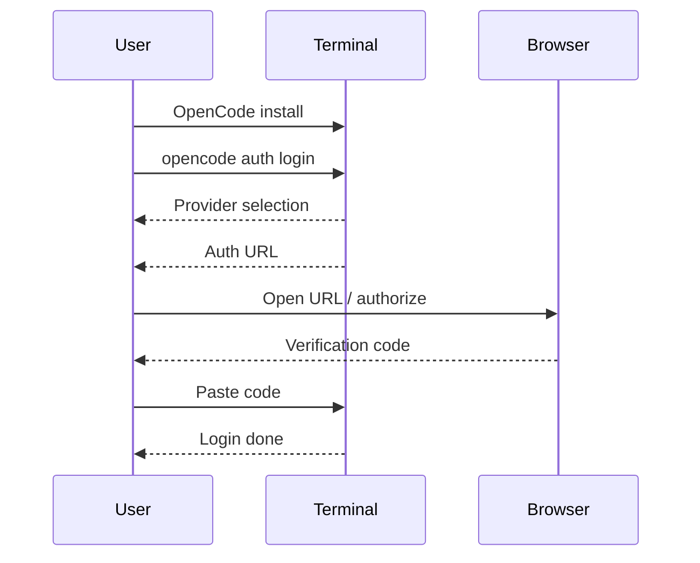
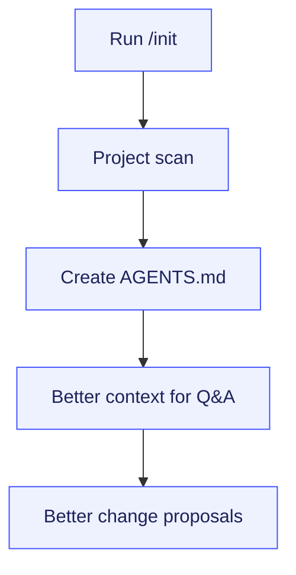
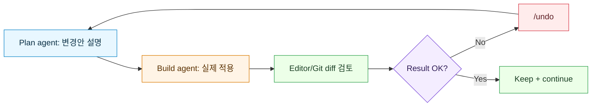
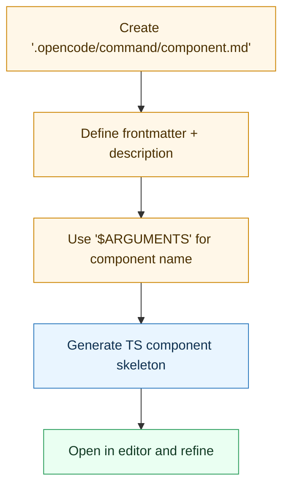

Neovim과 tmux를 중심으로 일하는 개발자라면, OpenCode를 별도 GUI 도구가 아니라 터미널 워크플로우의 "한 pane/window"로 붙이는 방식이 가장 자연스럽습니다. 이 글은 영상의 핵심 데모를 기준으로 바로 적용 가능한 운영 플레이북만 남겨 정리했습니다.

## Sources

- https://www.youtube.com/watch?v=9FW43mb1vTM

<!--more-->

## 먼저 구조부터: OpenCode를 어디에 배치할 것인가

영상에서는 pane 분할과 window 분리 모두 소개하지만, 실전에서는 `OpenCode`를 별도 window로 두는 방식이 더 안정적입니다.

- 에디터/실행 로그와 AI 대화의 시야가 분리됨
- 전환 단축키만 익히면 컨텍스트 스위칭이 빠름
- AI 응답을 크게 보고 검토하기 쉬움

## 1) 설치와 인증: 가장 먼저 결정할 2가지

1. 설치 방식(Homebrew/npm 등)
2. 모델 제공자(Anthropic 계정 연동 또는 API 키 제공자)

영상에서처럼 소규모 프로젝트면 구독형 계정 연동으로 시작하고, 사용량/비용 패턴이 보이면 API 키 전략을 확장하는 접근이 안전합니다.

## 2) `/init`는 선택이 아니라 시작 루틴

프로젝트 루트에서 `/init`을 실행하면 `AGENTS.md`가 생성되고, OpenCode가 코드베이스 구조를 읽는 기준점이 생깁니다.

핵심은 "AI가 알아서 이해하겠지"가 아니라, 분석 진입점을 명시적으로 만들어 주는 것입니다.

## 3) 기본 운영 규칙: `plan -> build -> verify -> undo`

영상 데모의 실전 포인트는 바로 이 루프입니다.

특히 "의도와 다르게 바뀌었을 때 즉시 되돌리기"가 중요합니다. 되돌릴 수 있다는 확신이 있어야 작은 실험을 빠르게 반복할 수 있습니다.

## 4) 설정 파일 `opencode.json`: 팀 공통 규칙의 최소 단위

영상에서 보여준 커스터마이징 포인트는 아래 4가지입니다.

- 모델 지정
- 테마 지정
- 에이전트 정의
- 키바인드/리더 키(prefix) 변경

리더 키를 바꾸면 전체 단축키 체계가 연쇄적으로 바뀌므로, 팀 운영 시에는 온보딩 문서에 키맵을 반드시 고정해 두는 것이 좋습니다.

## 5) 커스텀 명령: 반복 작업은 `.opencode/command/*.md`로 캡슐화

영상 예시는 `/component` 명령으로 Svelte TypeScript 컴포넌트 보일러플레이트를 자동 생성하는 패턴입니다.

이 패턴은 프레임워크 무관하게 재사용됩니다.

1. API 엔드포인트 스캐폴딩
2. 테스트 파일 초기 템플릿
3. 폴더/파일 네이밍 강제

## 6) 공유(`/share`)는 문서화에 유용하지만 보안 규칙이 먼저

영상처럼 대화 세션을 URL로 공유할 수 있지만, 프로젝트 맥락이 들어간다는 점을 잊으면 안 됩니다.

- 내부 코드/경로/설정 노출 가능성 점검
- 공유 후 필요 없으면 `/unshare`로 즉시 회수

## 바로 적용 체크리스트

1. 프로젝트 루트에서 OpenCode 실행 후 `/init` 완료
2. tmux에서 `editor+run`과 `AI` window 분리
3. 모든 변경 요청은 plan으로 먼저 검토
4. build 적용 후 즉시 diff 확인
5. 어긋난 결과는 `/undo`로 바로 롤백
6. `opencode.json`으로 키맵/모델 정책 고정
7. `.opencode/command`에 반복 작업 1개 자동화

## 결론

이 영상의 핵심은 "AI를 더 많이 쓰는 법"이 아니라 **터미널 워크플로우를 깨지 않고 AI를 관리 가능한 루프로 넣는 법**입니다. OpenCode를 독립 창으로 분리하고 `plan/build/undo` 루프만 먼저 고정해도, 코드 제어권을 유지한 채 반복 작업 속도를 눈에 띄게 끌어올릴 수 있습니다.
