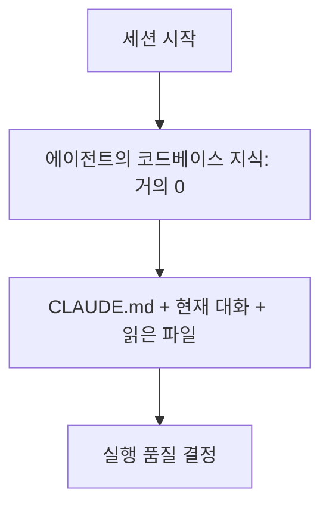
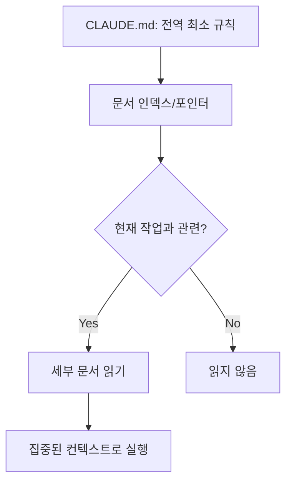
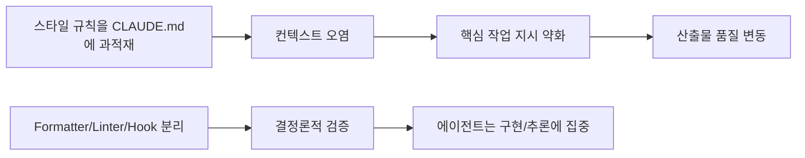
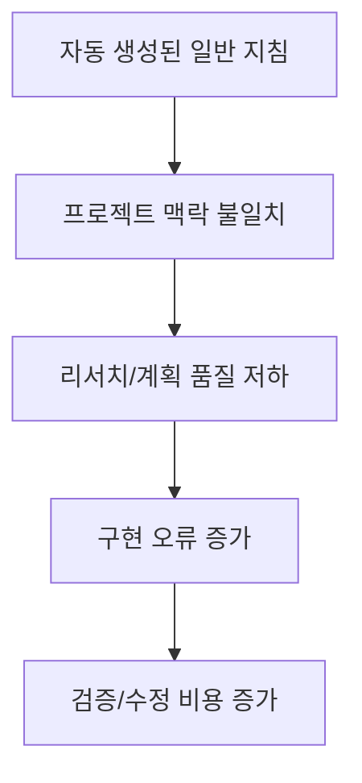
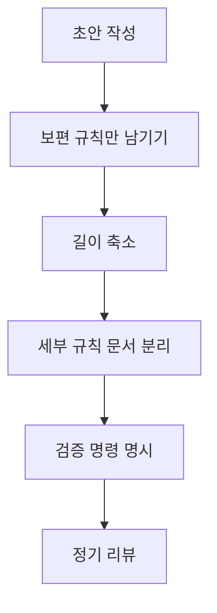

코딩 에이전트 품질이 들쭉날쭉한 팀을 보면, 모델 자체보다 `CLAUDE.md` 설계에서 문제가 시작되는 경우가 많습니다.
이 글은 HumanLayer의 "Writing a good CLAUDE.md"를 바탕으로, 실제 프로젝트에서 바로 적용할 수 있는 운영 원칙을 압축해 정리합니다.

<!--more-->

## Sources

- https://www.humanlayer.dev/blog/writing-a-good-claude-md

## 핵심 요약

1. `CLAUDE.md`(또는 `AGENTS.md`)는 매 세션에 주입되는 **상시 컨텍스트**라서 영향력이 매우 큽니다.
2. 지시를 많이 넣을수록 에이전트가 특정 지시만 무시하는 것이 아니라, **전체 지시 준수율이 같이 떨어질 수 있습니다**.
3. 정답은 "모든 규칙을 한 파일에 넣기"가 아니라, **짧은 전역 규칙 + 필요한 순간에만 읽는 점진적 공개(Progressive Disclosure) 구조**입니다.
4. 코드 스타일 강제는 LLM에게 맡기기보다 lint/format/hook 같은 **결정론적 도구**로 분리하는 편이 안정적입니다.
5. `CLAUDE.md`는 `/init` 같은 자동 생성으로 끝내지 말고, 팀/프로젝트 맥락에 맞게 **수동으로 다듬는 고레버리지 문서**로 관리해야 합니다.


## 1) 왜 CLAUDE.md가 중요한가

원문이 강조하는 첫 번째 전제는 간단합니다. LLM은 세션을 넘어 코드베이스를 "학습"하지 않습니다.
즉, 에이전트가 현재 세션에서 아는 내용은 **주어진 토큰**뿐이며, 그중 `CLAUDE.md`는 거의 모든 대화에 반복적으로 들어가는 기본 메모리입니다.



그래서 `CLAUDE.md`의 역할은 장식이 아니라 온보딩 문서입니다.
원문의 프레임을 그대로 쓰면 다음 3가지를 다뤄야 합니다.

- WHAT: 스택, 디렉터리 구조, 모노레포 구성 지도
- WHY: 프로젝트 목적, 각 모듈의 존재 이유
- HOW: 실제 작업/검증 명령, 테스트와 타입체크 방법

## 2) "Less is more": 지시를 늘리면 왜 성능이 떨어지나

원문은 instruction-following 연구를 인용해, 지시 수가 커질수록 모델의 지시 이행 품질이 낮아질 수 있음을 설명합니다.
핵심은 "아래쪽 몇 줄만 무시"가 아니라 **전반적 저하**라는 점입니다.


실무적으로는 다음 판단이 중요합니다.

- `CLAUDE.md`에 "항상 필요한 규칙"만 남긴다.
- 특정 작업에서만 필요한 규칙(예: DB 마이그레이션 세부 규칙)은 분리 문서로 뺀다.
- 파일 길이는 짧을수록 유리하며, 원문은 일반적으로 300줄 이하 권고를 언급합니다.

## 3) 점진적 공개(Progressive Disclosure)로 분리 설계하기

좋은 운영 방식은 지식을 없애는 게 아니라, **필요한 순간에만 로드**되게 만드는 것입니다.
원문이 제안하는 구조는 다음과 같습니다.



예시 디렉터리:

```text
agent_docs/
  building_the_project.md
  running_tests.md
  code_conventions.md
  service_architecture.md
  database_schema.md
```

그리고 본문 복붙 대신 `file:line` 포인터를 두라는 조언이 중요합니다.
코드 스니펫은 빠르게 낡지만, 권위 있는 원본 파일 위치는 유지보수 비용이 낮기 때문입니다.

## 4) "Claude는 비싼 린터가 아니다"

원문의 강한 메시지 중 하나는 코드 스타일 검사를 LLM에게 과도하게 맡기지 말라는 것입니다.
스타일/포맷 규칙이 `CLAUDE.md`를 비대하게 만들면, 본래 중요한 지시가 희석됩니다.



운영 팁:

- 포맷/린트는 CI나 훅에서 자동 실행
- 에이전트에게는 "무엇을 구현할지"를 우선 전달
- 필요하면 Stop hook이나 전용 slash command로 후처리

## 5) 왜 `/init` 자동 생성에 의존하면 안 되나

원문은 `/init` 또는 자동 생성으로 `CLAUDE.md`를 만드는 습관을 명확히 경계합니다.
핵심 이유는 `CLAUDE.md`가 단순 안내문이 아니라, 리서치-계획-구현-검증 전 단계에 반복 주입되는 **최상위 레버리지 지점**이기 때문입니다.



원문 취지를 실무적으로 옮기면 다음과 같습니다.

- 자동 생성 초안을 "완성본"으로 쓰지 말고, 반드시 팀 규칙 기준으로 재작성한다.
- 전역에 항상 필요한 원칙만 남기고, 나머지는 분리 문서로 이동한다.
- `CLAUDE.md` 한 줄의 품질이 후속 산출물 전체를 증폭시키므로, 줄 단위로 검토한다.

## 6) 바로 적용 가능한 CLAUDE.md 체크리스트

다음 체크리스트로 현재 파일을 점검해보면 빠르게 개선할 수 있습니다.



체크 항목:

1. 전역적으로 항상 필요한 규칙만 포함했는가?
2. 작업 특화 규칙은 별도 문서로 분리했는가?
3. 파일 길이가 과도하게 길지 않은가?
4. `WHAT/WHY/HOW`가 명확한가?
5. 테스트/타입체크/빌드 명령이 실제 프로젝트와 일치하는가?
6. 코드 스타일 강제는 lint/format/hook으로 위임했는가?
7. 코드 스니펫보다 `file:line` 포인터를 우선했는가?

## 요약 

1. `CLAUDE.md`는 Claude를 코드베이스에 온보딩하기 위한 문서이며, 프로젝트의 WHY/WHAT/HOW를 정의해야 합니다.
1. 지시는 적을수록 좋습니다. 필요한 지시를 빼면 안 되지만, 파일에는 합리적으로 필요한 최소한의 지시만 담아야 합니다.
1. `CLAUDE.md` 내용은 간결하고 보편적으로 적용 가능해야 합니다.
1. 점진적 공개(Progressive Disclosure)를 사용하세요. Claude에게 가능한 모든 정보를 한 번에 주지 말고, 필요한 시점에 필요한 정보를 찾고 읽을 수 있도록 안내해 컨텍스트 윈도우와 지시 수의 비대화를 막아야 합니다.
1. Claude는 린터가 아닙니다. 린터/포매터를 사용하고, 필요에 따라 Hook과 Slash Command 같은 기능을 함께 활용해야 합니다.
1. `CLAUDE.md`는 하니스의 가장 레버리지가 큰 지점이므로 자동 생성에 의존하지 말고, 최상의 결과를 위해 내용을 신중하게 직접 다듬어야 합니다.

## 마무리

좋은 `CLAUDE.md`는 "많이 알려주는 문서"가 아니라, **항상 필요한 것만 정확히 알려주는 문서**입니다.
짧은 전역 지침과 점진적 공개 구조를 만들면, 에이전트는 덜 흔들리고 팀은 더 일관된 결과를 얻을 수 있습니다.
