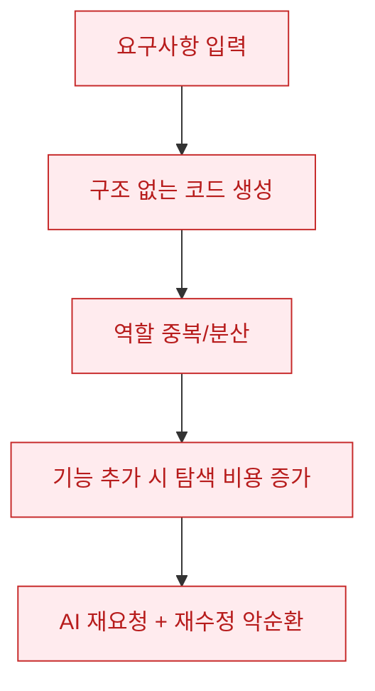
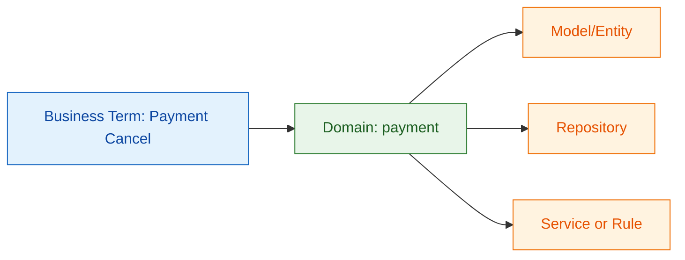
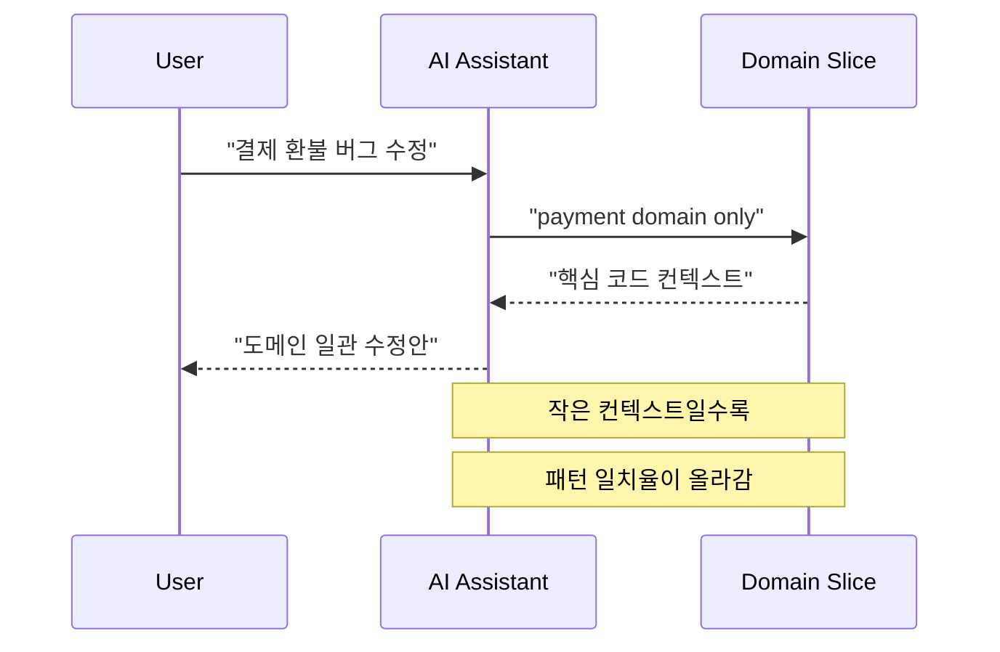
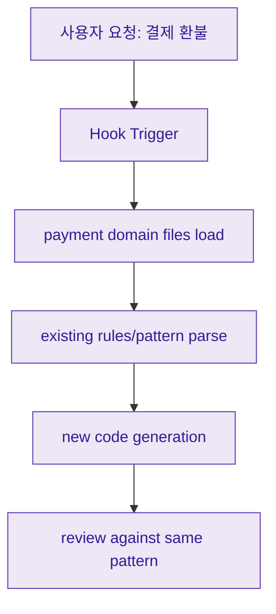

AI가 코드를 빠르게 만들어 주는 시대에도, 팀이 오래 살아남는 코드는 여전히 구조에서 결정됩니다. 이번 영상은 "AI가 못해서"가 아니라 "AI가 이해할 틀을 주지 않아서" 코드 품질이 무너진다는 점을 강조하고, 그 틀로 DDD(Domain-Driven Design)를 제시합니다. 

핵심 메시지는 단순합니다. **도메인 경계가 명확하고, 비즈니스 용어와 코드 이름이 일치하며, AI가 읽을 범위를 좁혀주면** 생성 코드의 일관성과 유지보수성이 크게 좋아진다는 것입니다.

<!--more-->

## Sources

- https://www.youtube.com/watch?v=7GjRM2uv-6E&t=107s
- 채널: 메이커 에반 | Maker Evan
- 게시일: 2026-02-22
- 영상 길이: 7분 49초

## 1) 왜 AI 코딩은 "처음엔 빠르고 나중엔 느려질까"

영상은 아주 현실적인 실패 시나리오로 시작합니다. AI로 백엔드를 빠르게 만들었지만, 일주일 뒤 작은 기능을 추가하려고 보니 코드 구조를 누구도 자신 있게 설명하지 못하는 상태가 되었다는 이야기입니다. 

여기서 포인트는 "AI 성능"이 아니라 "구조 부재"입니다. 영상의 표현대로, 정해진 틀이 없으면 AI가 매번 조금씩 다른 방식으로 코드를 만들고, 그 결과 동일 역할 코드가 여러 곳에 흩어져 유지보수 비용이 급격히 올라갑니다.

## 2) 영상이 말하는 DDD의 핵심: 경계, 역할, 용어

영상 설명을 실무 언어로 압축하면 DDD의 핵심은 세 가지입니다.

1. 도메인 단위 경계 설정(예: User, Payment, Order)
2. 도메인 내부 역할 분리(개념/저장/규칙)
3. 비즈니스 용어와 코드 이름 정렬

특히 세 번째가 AI 코딩 품질에 직접 연결됩니다. 사람이 쓰는 용어(예: "결제 취소")와 코드의 개념 이름이 맞아야, AI가 수정 대상을 추측이 아니라 매핑으로 찾을 수 있기 때문입니다.

## 3) 컨텍스트 윈도우 관점: "전체를 주지 말고 도메인을 줘라"

영상 중반의 중요한 주장 중 하나는, AI도 한 번에 너무 많은 코드를 보면 집중 품질이 떨어진다는 점입니다. 전체 코드를 통째로 주고 버그를 고치라고 하면, 엉뚱한 파일 수정이나 중복 코드 생성이 발생하기 쉬워진다는 경험을 공유합니다.

그래서 DDD는 단지 폴더 미학이 아니라, **AI에게 필요한 맥락만 주는 운영 단위**가 됩니다. 유저 문제는 유저 도메인, 결제 문제는 결제 도메인처럼 입력 범위를 줄이면, 모델이 봐야 할 정보량과 혼선이 함께 줄어듭니다.

## 4) 훅(Hook)과 도메인 트리거를 붙였을 때의 운영 패턴

영상 후반에는 Claude Code의 훅 시스템을 예로 들며, "요청 키워드 -> 관련 도메인 코드 선독 -> 생성" 흐름을 제안합니다. 즉, AI가 답을 바로 만들기 전에 **도메인 경계 안에서 기존 패턴을 먼저 읽게 강제**하는 방식입니다.

이 지점은 실무적으로 매우 중요합니다. DDD 경계가 없으면 트리거를 달아도 "무엇을 읽어야 하는지"가 불명확하고, 경계가 있으면 트리거가 안정적으로 동작할 수 있습니다.

다만 영상은 경험 사례 중심 설명이며, 통제된 정량 실험(예: 동일 과제 A/B 벤치마크)의 수치까지 제공하지는 않습니다. 따라서 "항상 몇 퍼센트 개선"처럼 일반화하기보다는, **팀의 도메인 크기와 코드베이스 성숙도에 따라 효과를 검증**하는 방식이 안전합니다.

## Practical Takeaways

1. 첫 도메인(User 또는 Payment)만큼은 팀이 직접 규칙을 명시해 기준 패턴을 만드세요.
2. 기능 요청 프롬프트를 "도메인 이름 + 행위 + 제약" 형태로 고정해 AI 입력을 표준화하세요.
3. 코드 네이밍을 기술 용어보다 비즈니스 용어에 맞추고, 용어집을 PR 템플릿에 포함하세요.
4. 훅/트리거를 쓴다면 "선독 파일 집합"을 도메인 단위로 제한해 컨텍스트 폭주를 막으세요.
5. 도입 효과는 체감이 아니라 지표로 검증하세요(수정 리드타임, 중복 코드 비율, 회귀 버그 비율).

## Conclusion

이 영상이 주는 실전 교훈은 "AI가 코드를 대신 써준다"보다 "AI가 잘 쓸 수 있는 구조를 먼저 설계하라"에 가깝습니다. DDD를 거창한 설계론이 아니라 **AI가 이해할 작업 좌표계**로 보면, 생성 속도와 유지보수성을 동시에 잡는 현실적인 운영 원칙으로 사용할 수 있습니다.
