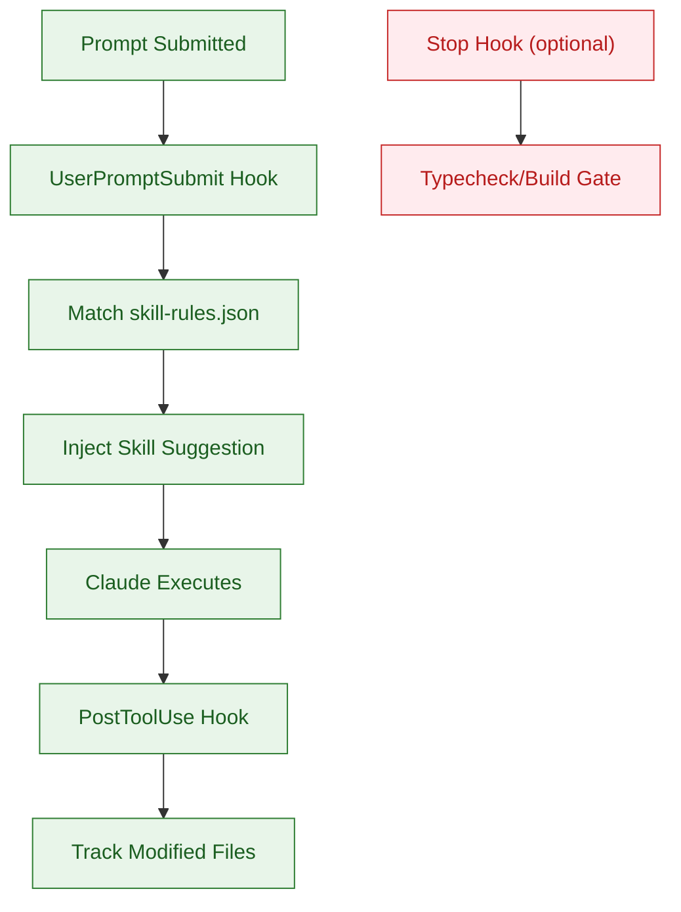
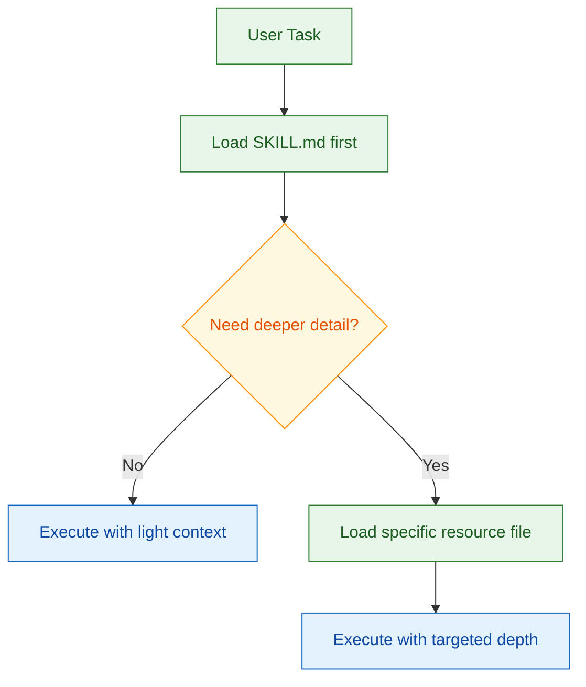
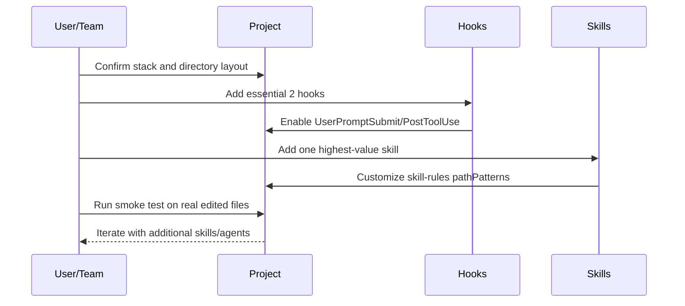

`diet103/claude-code-infrastructure-showcase`는 "앱 템플릿"이 아니라 "인프라 패턴 라이브러리"입니다. 즉, 이 저장소의 가치는 코드 실행 자체보다 **Claude Code 운영 체계(스킬 자동 활성화, 모듈형 스킬, 에이전트 분업)**를 재사용 가능하게 정리했다는 데 있습니다.

<!--more-->

## Sources

- [Claude Code Infrastructure Showcase](https://github.com/diet103/claude-code-infrastructure-showcase) 

## 1) 이 저장소를 보는 올바른 프레임: "완성품"이 아니라 "조립식 레퍼런스"

README에서 가장 먼저 강조하는 문장은 "This is NOT a working application - it's a reference library"입니다. 따라서 통째로 가져와 실행하는 접근보다, 필요한 조각만 선택해 현재 프로젝트 구조에 맞게 붙이는 접근이 맞습니다.

핵심은 네 가지 축입니다.

1. Hooks: 스킬 자동 제안과 변경 파일 추적
2. Skills: 500라인 규칙 기반의 모듈형 운영 지식
3. Agents: 복잡 작업 전용 서브 에이전트
4. Dev Docs 패턴: 컨텍스트 리셋 이후에도 이어지는 작업 문맥


실무 관점에서 이 프레임이 중요한 이유는 단순합니다. 모델 성능 편차를 직접 통제할 수는 없지만, **모델이 일하는 방식(입력 구조, 검사 포인트, 작업 분해 방식)**은 팀이 통제할 수 있기 때문입니다.

## 2) 가장 먼저 이식할 최소 단위: "Essential Hooks 2개"

`.claude/hooks/README.md`와 통합 가이드는 공통적으로 두 개의 훅을 최소 구성으로 권장합니다.

- `skill-activation-prompt` (`UserPromptSubmit`): 사용자 프롬프트와 파일 문맥을 분석해 관련 스킬을 자동 제안
- `post-tool-use-tracker` (`PostToolUse`): 편집된 파일을 기록해 현재 작업 컨텍스트를 유지

여기서 중요한 포인트는 이 두 훅이 "대체로 무커스터마이징"으로 동작한다는 점입니다. 반대로 Stop 훅(`tsc-check`, `trigger-build-resolver`)은 모노레포 구조에 강하게 의존하므로, 바로 복사하면 오작동 위험이 큽니다.



운영적으로는 "자동화 범위를 넓히는 것"보다 "안전하게 좁게 시작하는 것"이 더 빠릅니다. 먼저 필수 2개 훅으로 가치 검증을 끝내고, 이후에 Stop 훅을 점진적으로 붙이는 순서가 실패 비용을 최소화합니다.

## 3) Modular Skills (500-Line Rule): 길이를 줄이는 게 아니라 로딩 전략을 바꾸는 것

README에서 강조하는 500라인 규칙은 "문서를 짧게 써라"가 목적이 아니라, **Claude가 필요한 지식만 단계적으로 읽게 하라**는 운영 규칙입니다.

- `SKILL.md`: 500라인 이하의 라우팅 문서(개요, 언제 쓰는지, 어디를 더 읽을지)
- `resources/*.md`: 주제별 심화 규칙(라우팅, 컨트롤러, 테스트, 에러 처리 등)



이 구조는 컨텍스트 토큰 사용량을 줄이면서도 정확도를 지킵니다. 즉, "크게 한 번에"가 아니라 "작게 나눠서 필요할 때만" 읽는 방식으로 일관성을 확보합니다.

추가로 `skill-rules.json`의 트리거(키워드/의도/경로)가 함께 맞물려야 실제 자동 활성화가 동작합니다. 예시 경로를 그대로 두면 스킬은 존재해도 거의 호출되지 않습니다.

## 4) Repository Structure: 왜 이 디렉터리 배치가 운영에 유리한가

이 저장소는 컴포넌트별 역할이 분리된 구조를 명확하게 드러냅니다.

```text
.claude/
├── skills/
│   ├── backend-dev-guidelines/
│   ├── frontend-dev-guidelines/
│   ├── skill-developer/
│   ├── route-tester/
│   ├── error-tracking/
│   └── skill-rules.json
├── hooks/
│   ├── skill-activation-prompt.*
│   ├── post-tool-use-tracker.sh
│   └── (optional stop hooks)
├── agents/
│   └── *.md
└── commands/
    └── *.md
```

이 배치의 장점은 "책임 분리"입니다.

1. `hooks`: 언제 개입할지(타이밍)를 정의
2. `skills`: 무엇을 기준으로 코딩할지(규칙)를 정의
3. `agents`: 어떤 복잡 작업을 위임할지(역할)를 정의
4. `commands`: 반복 실행 흐름을 단축(진입점) 정의

그래서 프로젝트 이식 시에도 우선순위가 명확해집니다. 훅으로 자동화 기반을 먼저 만들고, 스킬로 규칙을 붙이고, 이후 에이전트/커맨드를 확장하는 방식이 가장 안정적입니다.

## 5) Agents/Commands를 붙일 때의 판단 기준

`.claude/agents/README.md` 기준으로 에이전트는 대체로 단독 복사가 가능하지만, 인증/경로 의존성이 있는 에이전트는 사전 점검이 필요합니다.

- 상대적으로 안전: `code-architecture-reviewer`, `plan-reviewer`, `documentation-architect`
- 조건부: `auth-route-tester`, `auth-route-debugger` (JWT 쿠키 인증 전제)
- 경로 확인 필요: 스크린샷 저장 경로, 하드코딩된 로컬 경로 참조

Commands도 동일합니다. 명령 자체보다 내부 경로(`dev/active/...`)가 현재 프로젝트와 맞는지 먼저 맞춰야 합니다.

결론적으로 "복사"보다 "전제 확인"이 먼저입니다. 이 저장소가 좋은 이유는 정답 코드를 주기 때문이 아니라, **무엇을 질문해야 안전하게 이식되는지**까지 같이 알려주기 때문입니다.

## 6) 15-30분 통합 플로우(실전 버전)

README의 통합 흐름을 실제 적용 관점으로 재배열하면 다음 순서가 가장 안정적입니다.



이 흐름에서 절대 건너뛰지 말아야 할 단계는 "경로 패턴 검증"입니다. 자동 활성화 시스템의 성공/실패는 모델 품질이 아니라 경로 매칭 정확도에서 대부분 갈립니다.

## Practical Takeaways

1. 이 저장소는 실행 프로젝트가 아니라 운영 패턴 레퍼런스이므로, 전량 복사보다 선택적 이식이 정답입니다.
2. 초기에 가장 높은 ROI는 `UserPromptSubmit` + `PostToolUse` 두 훅입니다.
3. Stop 훅은 구조 의존성이 크므로, 모노레포가 아니면 나중으로 미루는 편이 안전합니다.
4. 스킬 도입은 한 번에 여러 개보다 "핵심 1개 + 트리거 튜닝"이 실제 활성화율을 더 빨리 올립니다.
5. 통합 성공 여부는 코드 양이 아니라 `skill-rules.json`의 `pathPatterns` 정합성으로 판단해야 합니다.

## Conclusion

`claude-code-infrastructure-showcase`의 핵심 가치는 "좋은 프롬프트"를 모아둔 데 있지 않습니다. 훅, 규칙 파일, 모듈형 스킬, 에이전트를 결합해 **Claude Code의 동작을 시스템으로 통제**하게 만든 점이 본질입니다. 팀에 도입할 때는 필수 훅 2개와 스킬 1개로 작게 시작하고, 실제 활성화 로그를 기준으로 점진 확장하는 방식이 가장 현실적인 경로입니다.
