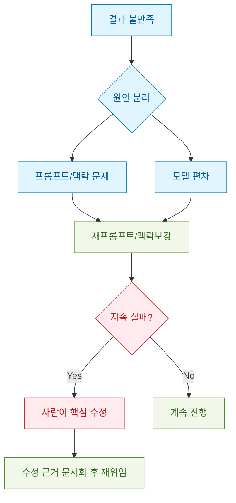
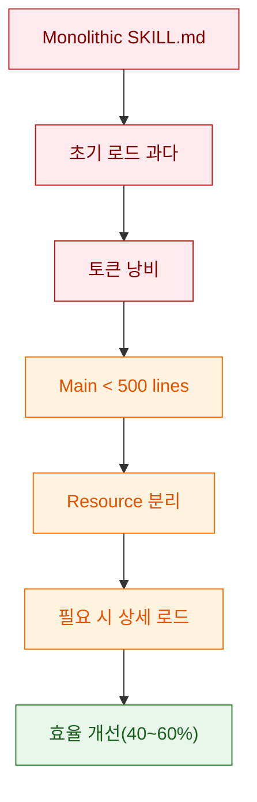
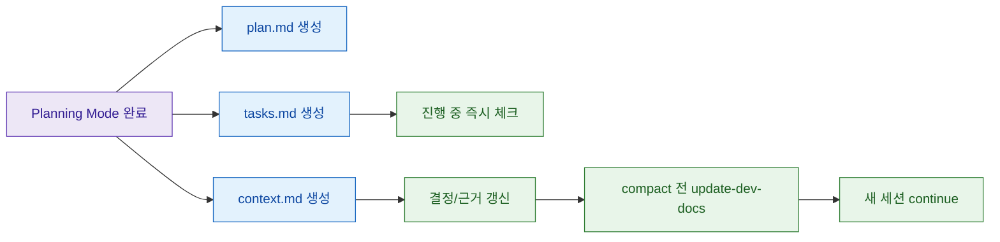
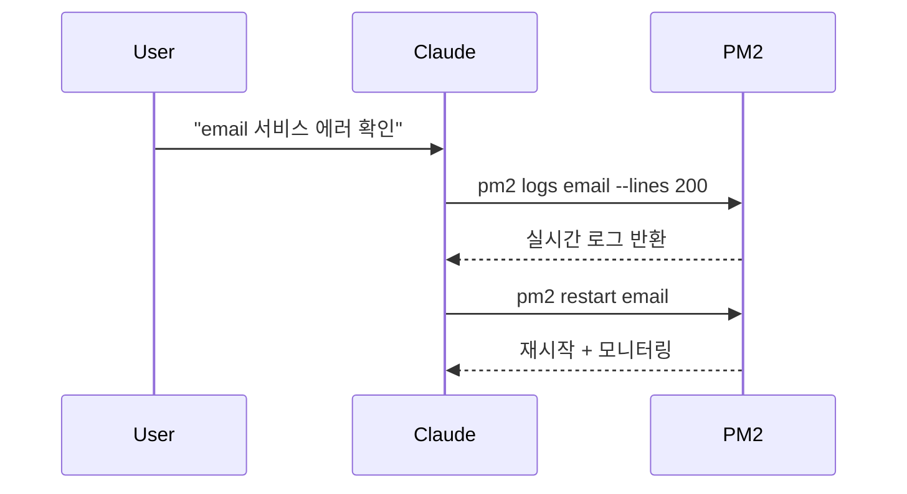
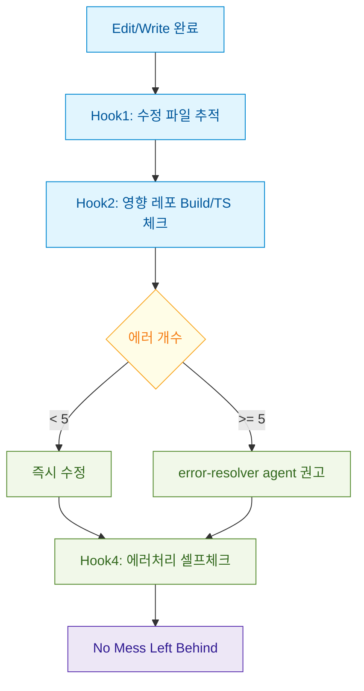

이 글은 Reddit의 **Claude Code is a Beast – Tips from 6 Months of Hardcore Use**를 한국어로 다시 정리한 재포스팅입니다. 원문에서 전달한 핵심 맥락과 세부 운영 팁이 빠지지 않도록, 주장-근거-실행 흐름 순서로 재구성했습니다.

<!--more-->

## Sources

- https://www.reddit.com/r/ClaudeAI/comments/1oivjvm/claude_code_is_a_beast_tips_from_6_months_of/
- https://dev.to/diet-code103/claude-code-is-a-beast-tips-from-6-months-of-hardcore-use-572n
- https://github.com/diet103/claude-code-infrastructure-showcase

## 먼저 고정해야 할 전제와 배경

- 이 글은 보편 법칙이 아니라, 작성자 개인의 실무 운영 실험 기록이다.
- 작성자 조건: 프로덕션 웹앱 경력 약 7년, Claude Code 20x Max 플랜 사용.
- 프로젝트 조건: 약 100k LOC 내부 레거시 앱을 단독 리디자인/리팩터링해 약 300~400k LOC로 확장.
- 구조 조건: 프론트 1개 + 백엔드 마이크로서비스 7개 동시 운영.
- 결론의 방향: "모델 성능"보다 "운영 체계"가 품질/속도를 좌우한다.

## 품질 이슈를 보는 관점: "모델 탓"보다 "운영 점검"

원문 작성자는 커뮤니티의 불만(출력 품질 저하, 사용량 제한)을 부정하지 않지만, 다음을 함께 보라고 말합니다.

- AI는 확률적(stochastic)이라 동일 입력도 출력 편차가 있다.
- 프롬프트 문구의 미세한 차이로 결과 품질이 크게 바뀔 수 있다.
- 재프롬프트(더블 ESC 브랜치)는 실제로 품질 회복에 자주 유효하다.
- AI가 30분 막히고 사람이 2분에 고칠 수 있으면, 즉시 사람이 개입하는 게 맞다.

## 시스템 핵심 1: Skills 자동활성화 (Hooks 결합)

### 문제 인식

- 대규모 스킬 문서를 만들어도 자동 호출이 거의 일어나지 않았다.
- 키워드를 정확히 써도 스킬이 안 붙는 사례가 반복됐다.

### 전환점

- "Claude가 스스로 스킬을 못 붙이면, 훅으로 사전 점검을 강제하자"로 방향 전환.

### 구현 구조

1. `UserPromptSubmit` 훅 (응답 전)
   - 프롬프트 키워드/의도 패턴 분석
   - 관련 스킬 탐지
   - 스킬 활성화 리마인더를 컨텍스트에 주입
2. `Stop` 훅 (응답 후)
   - 수정 파일/위험 패턴(try-catch, DB, async 등) 점검
   - "오류 처리 확인" 같은 비차단 셀프체크 제공

### `skill-rules.json` 트리거 축

- 키워드 트리거 (`layout`, `workflow`, `database` 등)
- 의도 패턴 트리거 (정규식 기반)
- 파일 경로 트리거
- 파일 콘텐츠 트리거(예: Prisma import, Controller 패턴)

### 운영 결과

- 스킬 누락/구패턴 재생산 감소
- 코드 일관성 개선
- 리뷰/수정 시간 감소

## 시스템 핵심 2: 스킬 파일 구조 재설계 (500줄 규칙)

원문의 중요한 포인트는 "스킬 작성"보다 "스킬 로딩 전략"입니다.

- 초기: 1000~1500줄 이상 단일 `SKILL.md`
- 문제: 로딩 과다, 토큰 비효율
- 전환: 메인 파일 500줄 이하 + 리소스 파일 분리(Progressive Disclosure)

원문에 명시된 수치:

- `frontend-dev-guidelines`: 메인 398줄 + 리소스 10개
- `backend-dev-guidelines`: 메인 304줄 + 리소스 11개
- 체감 토큰 효율: 약 40~60% 개선

## 시스템 핵심 3: CLAUDE.md와 문서 역할 분리

원문의 구조 개편 핵심은 역할 분리입니다.

- 기존 `BEST_PRACTICES.md`(1400+줄)에 있던 코딩 규약 대부분을 Skills로 이동
- `CLAUDE.md`는 프로젝트 운영 지식(명령어/서비스 설정/워크플로우) 중심으로 축소

분리 후 구조:

- Root `CLAUDE.md`: 공통 핵심 규칙(약 100줄)
- Repo별 `claude.md`: 리포 전용 명령/주의점(약 50~100줄)
- 참조 문서: `PROJECT_KNOWLEDGE.md`, `TROUBLESHOOTING.md`, API 문서 등

## 시스템 핵심 4: Dev Docs 3종으로 컨텍스트 유실 방지

원문의 표현대로 Claude는 "자신감 있는 주니어 + 심한 건망증"처럼 동작할 수 있고, 이를 문서 루프로 보완합니다.

큰 작업 시작 시 고정 생성:

- `[task]-plan.md`
- `[task]-context.md`
- `[task]-tasks.md`

지속 규칙:

- 태스크 완료 즉시 체크
- 세션 종료/compact 전 문서 갱신
- 다음 세션은 3문서 재읽기 후 `continue`

## 시스템 핵심 5: Planning 우선 + 인간 리뷰 고정

원문의 직접 문장: **Planning is king**.

- 구현 전에 계획 모드로 코드베이스 조사/계획 수립
- 계획 승인 전에 사람이 반드시 검토
- 구현은 1~2 섹션씩 쪼개고 중간 리뷰 반복
- 서브에이전트 코드리뷰를 중간중간 붙여 대형 실수를 조기 차단

## 시스템 핵심 6: PM2로 백엔드 디버깅 자동화

문제 상황:

- 7개 마이크로서비스 동시 실행
- 기존에는 로그를 사람이 복사해 전달해야 분석 가능

PM2 전환 후:

- `pnpm pm2:start`로 서비스 관리
- `pm2 logs`, `pm2 monit`, `pm2 restart <service>` 기반 즉시 대응
- 로그 실시간 접근 + 크래시 자동 재시작

주의:

- 프론트는 핫리로드 때문에 별도 `pnpm dev` 유지

## 시스템 핵심 7: Hooks 파이프라인 (#NoMessLeftBehind)

원문에 나온 운영 구조를 그대로 압축하면 다음과 같습니다.

1. PostToolUse 파일 수정 추적 훅
2. Stop 빌드/TS 검사 훅
3. Stop 포맷 훅(현재는 비권장으로 입장 변경)
4. Stop 에러처리 리마인더 훅

에러 처리 임계 규칙:

- 에러 `< 5`: 즉시 노출 후 바로 수정
- 에러 `>= 5`: 자동 에러 해결 에이전트 권고

Prettier 훅 업데이트(매우 중요):

- 자동 포맷은 `<system-reminder>` diff 토큰 비용을 키울 수 있음
- 공유 사례: 3라운드 약 160k 토큰 소비
- 권장 변경: 세션 중 자동 포맷 대신 세션 사이 수동 포맷

## 시스템 핵심 8: Skills에 실행 스크립트 붙이기

원문에서 실무성이 높은 팁:

- 스킬 문서에 "설명"만 넣지 않고, 실행 가능한 유틸 스크립트 경로/사용법을 같이 둔다.
- 예시: 인증 라우트 테스트 시 `test-auth-route.js`를 직접 호출.
- 효과: 임시 스크립트 재생성 비용 감소, 반복 테스트 표준화.

## 시스템 핵심 9: 보조 도구 운영 (SuperWhisper / Memory MCP / BetterTouchTool)

원문의 도구 섹션 요지:

- SuperWhisper: 손 피로 시 음성 프롬프트 입력
- Memory MCP: 스킬 외 프로젝트별 결정사항 기록
- BetterTouchTool: 앱 전환/경로 복사 자동화로 컨텍스트 전환 비용 절감

또한 "귀찮은 반복 작업은 전부 스크립트화"를 강조합니다.

- 대량 목데이터 생성
- 인증 테스트
- DB reset/seeding
- migration 전 schema diff
- dev DB backup/restore

## 시스템 핵심 10: 문서 전략과 프롬프트 전략

문서 전략:

- Skills: 재사용 코딩 패턴/가이드
- Docs: 아키텍처/데이터 흐름/API/통합 지식
- 문서 다층화(상위 개요 + 하위 상세 링크)로 탐색성 개선

프롬프트 전략:

- 가능한 한 구체적으로 요구사항 제시
- 불확실하면 조사 지시 후 여러 대안 비교
- 유도 질문 대신 중립 질문으로 검증 편향 줄이기

## 시스템 핵심 11: Agents + Hooks + Slash Commands "성삼위"

원문의 운영 축은 세 가지입니다.

- Agents: 역할 특화 실행(리뷰, 디버깅, 계획, 문서화, UX 등)
- Hooks: 타이밍 기반 자동 검증
- Slash Commands: 반복 프롬프트 캡슐화

자주 쓰는 커맨드 예시:

- `/dev-docs`
- `/dev-docs-update`
- `/create-dev-docs`
- `/code-review`
- `/build-and-fix`
- `/route-research-for-testing`
- `/test-route`

## 원문 결론을 한국어로 압축

### Essentials (필수)

1. 계획부터 시작 (planning mode 또는 계획 전용 에이전트)
2. Skills + Hooks 결합 (자동활성화 없이는 일관성 유지가 어렵다)
3. Dev Docs 3종 루프 (컨텍스트 유실 방지)
4. 코드 리뷰 루프 (AI가 AI 코드를 재검증)
5. 백엔드 PM2 운영 (로그 기반 자율 디버깅)

### Nice-to-Haves (보강)

- 태스크별 전문 에이전트 세분화
- 반복 작업 슬래시 커맨드화
- 문서 체계 고도화
- 스킬-스크립트 결합 확장
- 메모리 계층(MCP) 보조 사용

## Practical Takeaways

1. 스킬 자동활성화는 선택이 아니라 대형 코드베이스 일관성의 전제 조건이다.
2. 스킬은 길게 쓰는 것보다 "가볍게 로드되고 필요 시 확장"되는 구조가 성능/비용에 유리하다.
3. "계획-문서-작업체크" 3문서 루프는 장기 세션에서 가장 강력한 안전장치다.
4. Hook 파이프라인은 "에러를 남기지 않는 기본값"을 만드는 장치여야 하며, 포매팅 자동화는 토큰 비용과 교환관계를 반드시 측정해야 한다.
5. 에이전트 도입의 핵심은 숫자가 아니라 역할 선명도와 반환 형식의 명확성이다.
