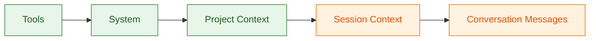
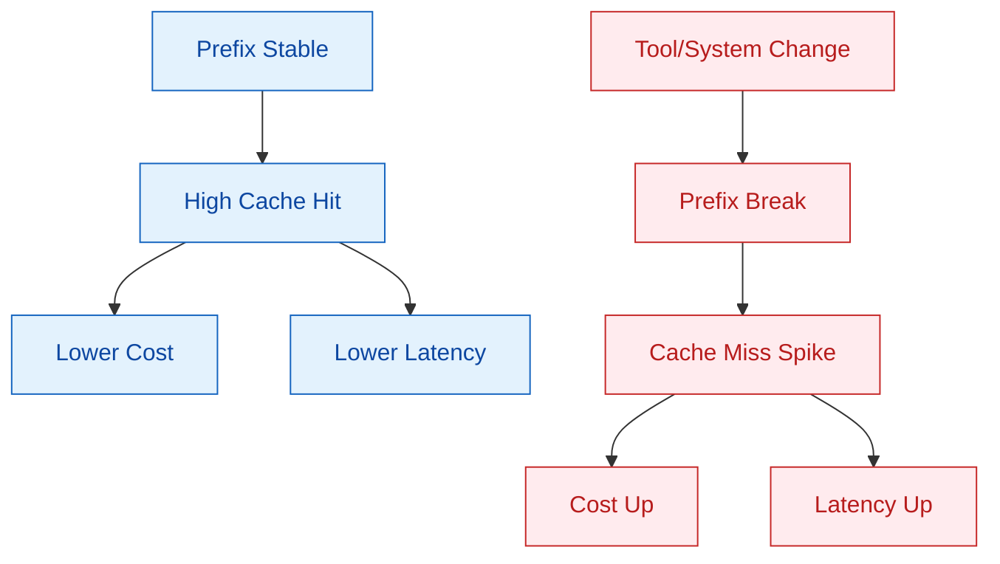
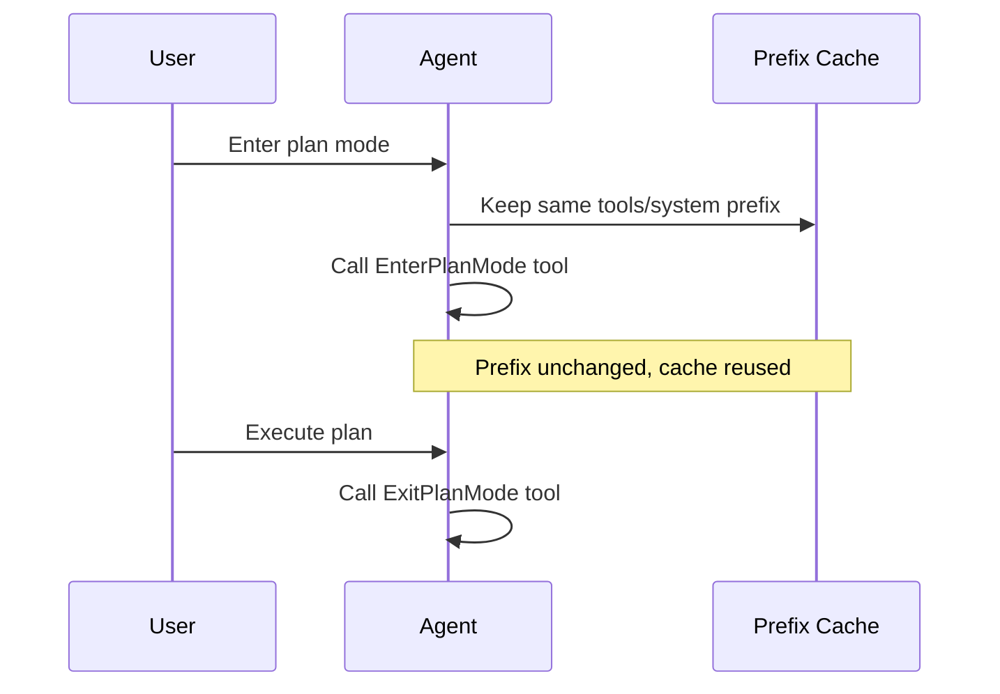
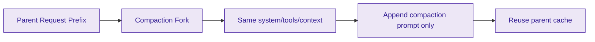

에이전트형 제품에서 성능과 원가를 동시에 안정화하려면, 모델 성능만이 아니라 요청 구조 자체를 캐시 친화적으로 설계해야 합니다. 이번 글은 `https://x.com/trq212/status/2024574133011673516`에 공개된 Claude Code 프롬프트 캐싱 레슨을 중심으로, 공식 문서와 대조해 재현 가능한 규칙만 추려서 정리합니다.

<!--more-->

## Sources

- https://x.com/trq212/status/2024574133011673516

> [!NOTE]
> 원본 X 페이지는 로그인/JS 장벽으로 자동 수집이 제한되어, 동일 URL의 텍스트 미러(`r.jina.ai/http://x.com/...`)와 Anthropic 공식 문서로 교차 검증했습니다.

## 1) 핵심 전제: 프롬프트 캐싱은 "접두사(prefix) 일치" 문제다

미러된 원문에는 다음 문장이 나옵니다. "Prompt caching works by prefix matching" 그리고 "static content first, dynamic content last". 즉, 캐시는 문장의 의미가 아니라 **요청 앞부분의 동일성**으로 성립합니다.

Anthropic 문서도 같은 구조를 명시합니다. 캐시 대상은 `tools -> system -> messages` 순서의 prefix이며, breakpoint 이전이 동일해야 cache hit가 발생합니다. 이 규칙 하나로 왜 도구 정의 순서, 시스템 프롬프트 변경, 중간 설정 토글이 모두 민감한지 설명됩니다.

실무적으로는 "앞쪽은 최대한 고정, 뒤쪽만 변화"가 유일한 기본 전략입니다. 이 원칙이 깨지면 캐시 hit율이 떨어지고, 비용과 지연이 동시에 악화됩니다.

## 2) 캐시를 깨는 대표 패턴: 사소한 변경이 큰 비용으로 번진다

스레드에서 언급된 실제 실패 사례는 매우 구체적입니다. 예를 들어 시스템 프롬프트에 시각 정보를 직접 넣거나, tool 정의 순서를 비결정적으로 섞거나, 도구 파라미터를 자주 바꾸면 prefix가 달라집니다. 겉보기에는 작은 변경이지만 캐시 관점에서는 "새 요청"이 됩니다.

Anthropic 문서 역시 invalidation 표에서 같은 경향을 보여줍니다. tool 정의 변화는 하위 레벨 캐시를 전부 무효화하고, system 수준 토글(예: web search/citations/speed)도 메시지 캐시까지 연쇄 무효화를 일으킬 수 있습니다.

그래서 상태 갱신이 필요할 때는 시스템 프롬프트를 수정하기보다, 다음 turn의 메시지(예: `system-reminder`)로 업데이트를 주입하는 방식이 권장됩니다. 스레드의 "edit prompt 대신 next turn message" 조언이 여기서 나옵니다.

## 3) 모델/도구 전환 전략: "바꾸지 말라"가 아니라 "구조적으로 바꿔라"

스레드에서 특히 중요한 지점은 "모델 전환"과 "도구 전환"입니다. "Opus 대화 중 Haiku로 바꾸면 오히려 비쌀 수 있다"는 사례는, 모델별 캐시가 분리된다는 전제를 잘 보여줍니다. Anthropic 문서도 캐시가 모델 단위로 동작한다는 점을 명확히 합니다.

도구도 같은 맥락입니다. 스레드는 "중간에 tool set을 추가/삭제하면 전체 대화 캐시가 깨진다"고 경고하고, 해결책으로 Plan Mode를 도구 교체가 아니라 **상태 전이 도구(EnterPlanMode/ExitPlanMode)**로 모델링하는 방식을 제시합니다.

추가로 스레드의 "defer loading" 아이디어는, 도구를 제거하지 않고 stub을 유지해 prefix 안정성을 지키는 패턴입니다. 기능 토글을 구조적 삭제로 구현하면 캐시를 잃고, 상태 전이로 구현하면 캐시를 보존할 수 있다는 차이입니다.

## 4) Compaction과 Forking: 사이드 작업도 부모 prefix를 공유해야 한다

긴 대화에서 context window를 넘기면 compaction(요약)이 필요합니다. 스레드의 핵심 주장은 "요약용 별도 API 호출을 단순 구현하면 prefix가 달라져 큰 비용을 낸다"입니다. 대신 parent와 동일한 system/tool/context를 유지한 채 요약 프롬프트만 뒤에 붙이는 "cache-safe forking"을 제안합니다.

Anthropic 문서의 원칙과도 일치합니다. cache hit는 정확한 prefix 일치로만 발생하므로, 사이드 연산(요약, 서브태스크)도 부모 요청의 prefix를 최대한 재사용해야 합니다.

운영 관점에서는 compaction buffer를 미리 남겨, 요약 입력과 출력 토큰이 들어갈 공간을 보장해야 합니다. 캐시를 살리려다 컨텍스트 한계에 다시 부딪히면 오히려 회복 비용이 커집니다.

## Practical Takeaways

1. 캐시 hit율을 비용 지표가 아니라 신뢰성 지표로 다루세요. 스레드처럼 알림과 incident(예: SEV) 기준을 두면 회귀를 빨리 잡을 수 있습니다.
2. 요청 구조는 "정적 앞, 동적 뒤"를 강제하고, 변경이 잦은 값은 메시지 레벨 업데이트로 내리세요.
3. 모델/도구 전환은 prefix 파괴 방식(삭제/교체) 대신 상태 전이 방식(도구 호출, stub+defer)으로 설계하세요.
4. compaction, 요약, 서브태스크 같은 fork 연산은 부모 prefix를 공유하도록 파이프라인을 짜세요.
5. 원본 접근이 제한된 소셜 소스는 반드시 공식 문서와 교차 검증해 단일 출처 의존을 피하세요.

## Conclusion

Claude Code 사례가 보여주는 핵심은 단순한 "캐시 사용"이 아니라 **제품 아키텍처 전체를 prefix 안정성 중심으로 설계**해야 한다는 점입니다. 프롬프트 캐싱은 최적화 옵션이 아니라, 장시간 에이전트 제품의 비용 구조와 체감 속도를 좌우하는 기본 설계 조건에 가깝습니다.
