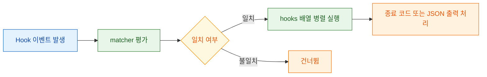
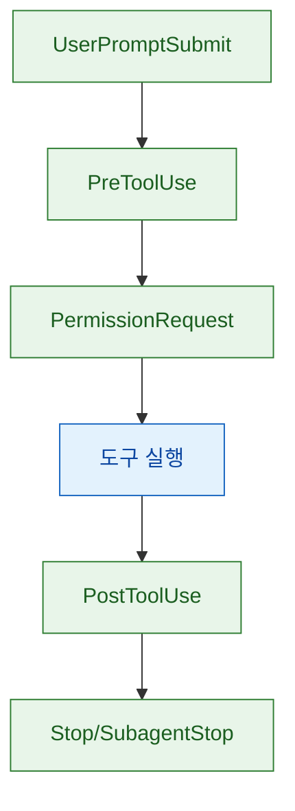
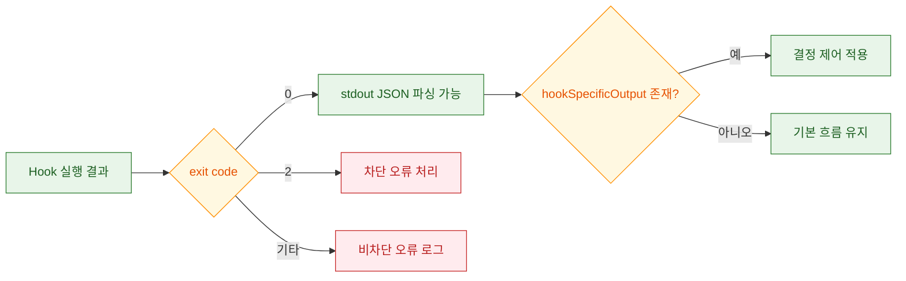

Claude Code hooks는 단순한 "명령 실행 장치"가 아니라, 에이전트 실행 흐름을 정책화하는 인터페이스에 가깝습니다. 핵심은 `언제(이벤트)`, `무엇을(명령/프롬프트)`, `어떻게(종료 코드/JSON 출력)`를 명시적으로 분리해 제어하는 데 있습니다.

<!--more-->

## Sources

- [Claude Code Hooks Reference (Korean)](https://code.claude.com/docs/ko/hooks)

## 1) 설정 모델의 핵심: Event -> matcher -> hooks

문서의 기본 구조는 `hooks.EventName[]` 아래에 matcher와 hook 배열을 두는 형태입니다. 특히 `PreToolUse`, `PermissionRequest`, `PostToolUse`는 matcher 기반 도구 필터링이 가능하고, `UserPromptSubmit`, `Stop`, `SubagentStop` 같은 이벤트는 matcher 없이도 구성할 수 있습니다.

즉, 운영 관점에서는 다음처럼 생각하면 명확합니다.

1. 이벤트는 "실행 시점"을 정의한다.
2. matcher는 "대상 도구 범위"를 정의한다.
3. hooks 배열은 "실행 액션 집합"을 정의한다.

문서에서 명시하듯 matcher는 대소문자를 구분하고, 정규식(`Edit|Write`)과 와일드카드(`*`)를 지원합니다. 또한 프로젝트 경로 기반 스크립트를 쓸 때는 `CLAUDE_PROJECT_DIR` 환경 변수를 사용하는 패턴이 권장됩니다.

## 2) 이벤트 수명주기와 입출력 계약

Hook 입력은 공통 필드(`session_id`, `transcript_path`, `cwd`, `permission_mode`)와 이벤트별 필드로 구성됩니다. 이 구조 덕분에 같은 스크립트에서도 이벤트 문맥에 따라 분기 처리가 가능합니다.

특히 실무에서 자주 쓰는 이벤트는 다음 흐름으로 이해하면 좋습니다.

- `PreToolUse`: 도구 실행 직전 정책 검사
- `PermissionRequest`: 권한 대화 자동 허용/거부 판단
- `PostToolUse`: 실행 직후 피드백/추가 컨텍스트 주입
- `UserPromptSubmit`: 프롬프트 전처리 또는 차단
- `Stop` / `SubagentStop`: 종료 허용 여부 재평가

또한 문서에는 `SessionStart`/`SessionEnd` 이벤트도 제공되며, `SessionStart`에서는 `CLAUDE_ENV_FILE`을 통해 이후 Bash 실행에 사용할 환경 변수를 유지할 수 있다고 설명합니다. 세션 초기화 자동화가 필요한 팀이라면 매우 중요한 포인트입니다.

## 3) 결정 제어의 실전 포인트: 종료 코드 vs JSON 출력

레퍼런스가 강조하는 포인트는 "단순 종료 코드"와 "구조화된 JSON 출력"의 역할 분리입니다.

- 종료 코드 `0`: 성공 (일부 이벤트는 stdout이 컨텍스트로 주입됨)
- 종료 코드 `2`: 차단성 오류 (hook 이벤트별로 차단 동작)
- 그 외 코드: 비차단 오류 (verbose 모드에서 stderr 확인)

그리고 JSON 출력은 **종료 코드 0에서만** 처리된다는 제약이 핵심입니다. 예를 들어 `PreToolUse`는 `permissionDecision`(allow/deny/ask)과 `updatedInput`으로 실행 전 입력을 정책적으로 수정할 수 있습니다.

추가로 문서에는 `type: "prompt"` 기반 hook을 소개하며, LLM이 `{ "ok": true|false, "reason": "..." }` 형태로 판단을 반환하도록 정의합니다. 다만 성능 관점에서 bash 명령형 hook보다 느릴 수 있으므로, 복잡한 맥락 판단에만 선택적으로 배치하는 것이 합리적입니다.

## 4) 보안과 운영: "강력한 기능"일수록 방어선을 먼저 세우기

문서는 hooks가 임의 셸 명령을 자동 실행한다는 점을 명확히 경고합니다. 따라서 실무에서는 다음 방어 원칙을 기본값으로 두는 것이 안전합니다.

1. 입력 검증/정규화(특히 경로, 사용자 입력, JSON 파싱 실패 처리)
2. 셸 변수 인용(`"$VAR"`)
3. 경로 순회(`..`) 차단
4. 절대 경로 사용 또는 `CLAUDE_PROJECT_DIR` 기반 경로 고정
5. 민감 파일(`.env`, `.git/`, 키 파일) 제외 정책

문서의 실행 세부에서도 여러 hook이 병렬 실행되고 동일 명령은 중복 제거된다고 안내합니다. 따라서 hook 스크립트는 **멱등성(idempotency)** 과 **동시 실행 안정성**을 전제로 작성해야 예측 가능한 운영이 가능합니다.

## Practical Takeaways

- 첫 도입은 `PreToolUse` + `PostToolUse` 중심의 단순 규칙부터 시작하고, `Stop`/`SubagentStop`의 차단 정책은 점진적으로 강화하세요.
- `PreToolUse`에서 `updatedInput`을 쓸 경우, 변경 전후 값을 로그에 남겨 추적 가능성을 확보하세요.
- `prompt` 기반 hook은 "정적 규칙으로 표현하기 어려운 판단"에만 쓰고, 나머지는 bash hook으로 유지해 지연을 최소화하세요.
- `SessionStart`에서 `CLAUDE_ENV_FILE`을 사용한다면 환경 변수 누적 정책(덮어쓰기/추가)을 팀 규칙으로 명시하세요.
- 운영 전에는 `claude --debug` 기반으로 matcher 일치, 종료 코드 처리, stderr 메시지 품질을 반드시 리허설하세요.

## Conclusion

Claude Code hooks의 본질은 "자동화" 자체가 아니라 "실행 경계의 명시적 제어"에 있습니다. 이벤트 구조, 출력 계약(종료 코드/JSON), 보안 원칙을 함께 설계하면, 단순한 편의 기능을 넘어 팀 단위의 안정적인 에이전트 운영 레이어로 확장할 수 있습니다.
