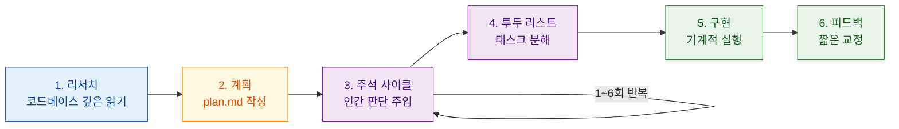
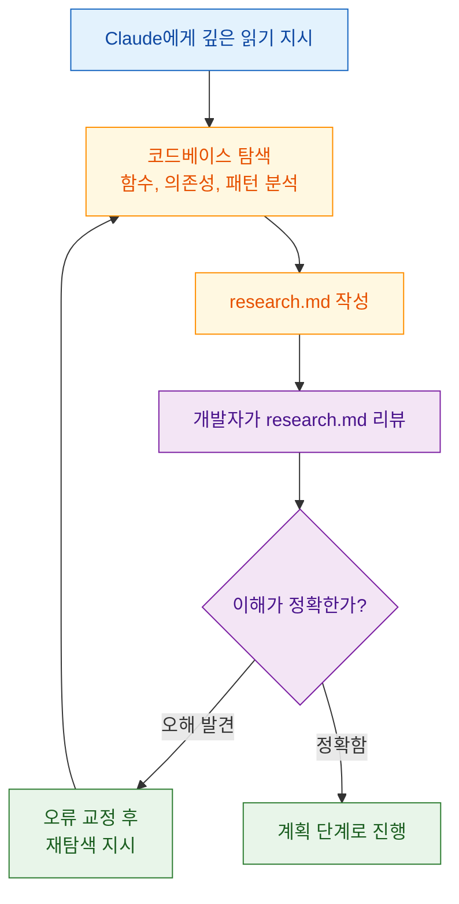
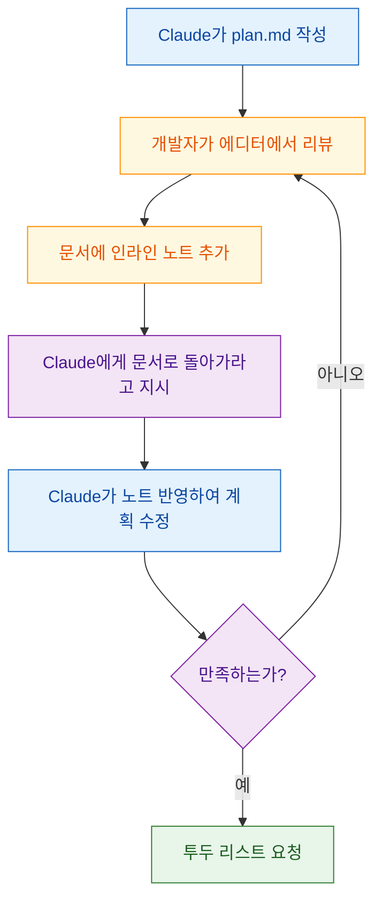
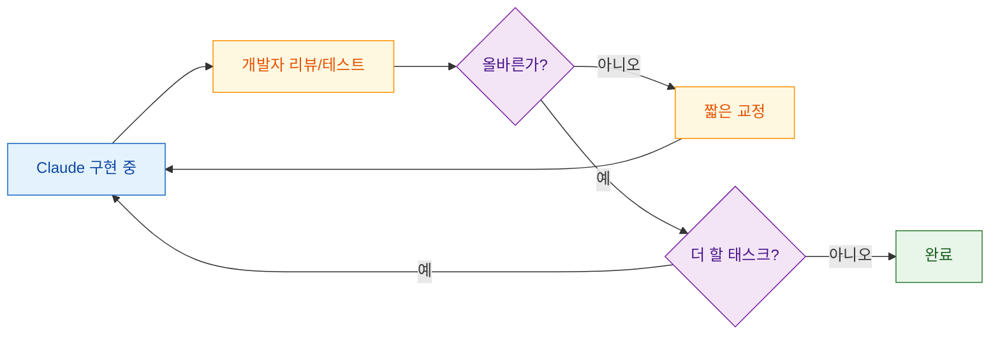
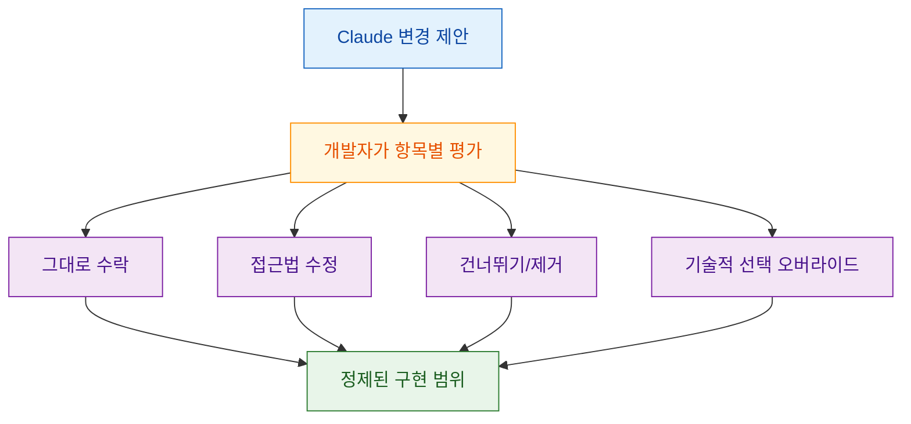

AI 코딩 도구를 쓰는 대부분의 개발자는 프롬프트를 입력하고, 에러를 고치고, 반복합니다. 하지만 Boris Tane은 Claude Code를 약 9개월간 주력 개발 도구로 사용하면서 전혀 다른 패턴에 도달했습니다. 핵심 원칙은 단 하나입니다: **검토하고 승인한 서면 계획이 있기 전까지는 절대 코드를 작성하지 않는다.**

이 계획과 실행의 분리가 낭비되는 노력을 방지하고, 아키텍처 결정의 통제권을 유지하며, 최소한의 토큰으로 훨씬 나은 결과를 만들어낸다고 합니다.

<!--more-->

## Sources

- https://boristane.com/blog/how-i-use-claude-code/

## 1) 전체 워크플로우 구조: 리서치 → 계획 → 주석 → 구현

Boris Tane의 워크플로우는 네 개의 명확한 단계로 나뉩니다. 가장 중요한 특징은 **코드 작성이 전체 프로세스의 마지막에야 일어난다**는 점입니다.

일반적으로 AI 코딩 도구의 실패 모드는 잘못된 구문이나 논리 오류가 아닙니다. **단독으로는 작동하지만 주변 시스템을 깨뜨리는 구현**이 가장 비싼 실패입니다. 기존 캐싱 레이어를 무시하는 함수, ORM 관례를 고려하지 않는 마이그레이션, 이미 존재하는 로직을 중복하는 API 엔드포인트 — 리서치 단계가 이 모든 것을 사전에 방지합니다.

## 2) 리서치 단계: 깊은 읽기와 영속적 문서화

모든 의미 있는 작업은 **deep-read 지시**로 시작합니다. 핵심은 두 가지입니다:

1. **강한 언어로 깊은 읽기를 요구한다**: "deeply", "in great details", "intricacies", "go through everything" 같은 표현이 없으면 Claude는 파일을 시그니처 수준에서만 훑고 넘어갑니다.
2. **결과를 영속적 마크다운 파일에 기록한다**: 채팅 안의 구두 요약이 아니라 `research.md` 같은 파일로 남겨야 리뷰할 수 있습니다.

실제 프롬프트 예시:

> "이 폴더를 깊이 읽고, 어떻게 작동하는지 깊이 이해하고, 모든 세부 사항을 파악해라. 끝나면 배운 내용을 research.md에 상세 보고서로 작성해라."

> "알림 시스템을 상세히 연구하고, 복잡한 부분을 이해하고, 알림이 어떻게 작동하는지에 대해 알아야 할 모든 것을 research.md에 작성해라."

`research.md`는 Claude에게 숙제를 시키는 것이 아닙니다. **리뷰 표면(review surface)**을 만드는 것입니다. 이 파일을 읽고 Claude가 시스템을 실제로 이해했는지 검증하고, 오해를 교정한 뒤에야 계획 단계로 넘어갑니다. 리서치가 틀리면 계획이 틀리고, 구현도 틀립니다. Garbage in, garbage out.

## 3) 플래닝 단계: plan.md 기반 구조화

리서치를 리뷰한 후, 별도의 마크다운 파일에 상세 구현 계획을 요청합니다.

> "cursor-based pagination을 지원하도록 list 엔드포인트를 바꾸고 싶다. 이를 달성하기 위한 상세 plan.md를 작성해라. 변경 사항을 제안하기 전에 소스 파일을 읽고, 실제 코드베이스에 기반해서 계획을 세워라."

생성되는 계획에는 다음이 포함됩니다:
- 접근 방식에 대한 상세 설명
- 실제 변경 사항을 보여주는 코드 스니펫
- 수정될 파일 경로
- 고려 사항과 트레이드오프

### 빌트인 plan mode 대신 자체 .md 파일을 쓰는 이유

저자는 Claude Code의 빌트인 plan mode 대신 자체 마크다운 파일을 사용합니다. 그 이유는 마크다운 파일이 다음을 제공하기 때문입니다:

- **에디터에서 직접 편집** 가능
- **인라인 노트** 추가 가능
- 프로젝트의 **실제 아티팩트**로 영속

반면 빌트인 plan mode는 이런 직접 조작이 제한적입니다.

### 오픈소스 참조 코드 활용 팁

잘 구현된 오픈소스 레포에서 참조 코드를 발견하면, 계획 요청과 함께 공유합니다:

> "이것은 그들이 sortable ID를 구현하는 방식이다. 우리가 유사한 접근법을 도입하는 방법을 설명하는 plan.md를 작성해라."

저자에 따르면, Claude는 처음부터 설계하는 것보다 **구체적인 참조 구현을 기반으로 작업할 때 극적으로 더 나은 결과**를 만들어냅니다. 이는 LLM의 in-context learning 특성과도 일치하는 관찰입니다.

## 4) 주석 사이클: 계획에 인간 판단을 주입하는 핵심 루프

이 워크플로우에서 가장 독특하고 가치 있는 부분입니다.

Claude가 계획을 작성하면, 개발자는 에디터에서 **문서 안에 직접 인라인 노트를 추가**합니다. 그리고 Claude에게 노트를 반영하여 문서를 업데이트하라고 지시합니다.

> "문서에 노트 몇 개를 추가했다. 모든 노트를 반영하고 문서를 업데이트해라. 아직 구현하지 마라."

이 사이클은 **1회에서 6회까지 반복**됩니다. 반복할 때마다 "아직 구현하지 마라(don't implement yet)"라는 가드가 필수입니다. 이 가드 없이는 Claude가 계획이 충분하다고 판단하는 순간 코드 작성으로 뛰어들기 때문입니다.

### 실제 인라인 노트 예시

노트의 길이는 상황에 따라 매우 다릅니다:

| 유형 | 예시 |
|------|------|
| 도메인 지식 | "마이그레이션에 raw SQL 대신 drizzle:generate를 사용해라" |
| 가정 교정 | "아니다 — 이건 PUT이 아니라 PATCH여야 한다" |
| 접근법 거부 | "이 섹션 전체를 제거해라, 여기에 캐싱이 필요 없다" |
| 로직 설명 | "큐 컨슈머가 이미 재시도를 처리하므로 이 재시도 로직은 중복이다. 제거하고 실패하게 놔둬라" |
| 구조 재설계 | "이건 틀렸다. visibility 필드는 개별 아이템이 아니라 리스트 자체에 있어야 한다. 스키마 섹션을 재구성해라" |

### 왜 이 방식이 효과적인가

마크다운 파일이 개발자와 Claude 사이의 **공유 가변 상태(shared mutable state)**로 기능합니다:

- 자기 속도에 맞춰 생각하고, 문제가 있는 **정확한 지점에 교정을 작성**할 수 있습니다
- 채팅 메시지로 구현을 조종하는 것과 근본적으로 다릅니다 — 채팅은 스크롤을 되돌려 결정을 재구성해야 하지만, 계획 문서는 전체를 한눈에 리뷰할 수 있습니다
- 3라운드의 주석 사이클만으로 일반적인 구현 계획을 기존 시스템에 완벽히 맞는 계획으로 변환할 수 있습니다

Claude는 코드를 이해하고, 솔루션을 제안하고, 구현을 작성하는 데 뛰어납니다. 하지만 제품 우선순위, 사용자의 불편, 기꺼이 감수할 수 있는 엔지니어링 트레이드오프를 알지 못합니다. 주석 사이클은 바로 그 **판단력을 주입하는 메커니즘**입니다.

## 5) 구현 단계: 기계적 실행과 피드백 루프

계획이 확정되면 투두 리스트를 요청한 뒤, 표준화된 단일 프롬프트로 구현을 시작합니다:

> "전부 구현해라. 태스크나 단계를 완료할 때마다 계획 문서에 완료로 표시해라. 모든 태스크와 단계가 완료될 때까지 멈추지 마라. 불필요한 주석이나 jsdoc을 추가하지 마라, any나 unknown 타입을 사용하지 마라. 타입체크를 지속적으로 실행해서 새로운 이슈를 만들지 않도록 해라."

이 프롬프트에 담긴 설계 의도:

| 지시 | 의도 |
|------|------|
| "전부 구현해라" | 계획의 일부만 골라서 하지 마라 |
| "계획 문서에 완료 표시" | 계획이 진행 상황의 source of truth |
| "멈추지 마라" | 중간에 확인을 위해 멈추지 마라 |
| "불필요한 주석 금지" | 코드를 깔끔하게 유지 |
| "any/unknown 금지" | 엄격한 타이핑 유지 |
| "지속적 타입체크" | 문제를 마지막이 아닌 즉시 잡아라 |

핵심은 이 시점에서 **구현이 지루한 작업이 되어야 한다**는 것입니다. 창의적인 작업은 주석 사이클에서 끝났습니다. 계획이 맞으면 실행은 기계적이어야 합니다.

### 구현 중 피드백 패턴

계획 단계의 노트가 문단이었다면, 구현 중 교정은 **한 문장**으로 충분합니다:

- "deduplicateByTitle 함수를 구현하지 않았다."
- "설정 페이지를 메인 앱에 만들었는데 어드민 앱에 있어야 한다. 옮겨라."
- "더 넓게"
- "아직 잘렸다"
- "2px 간격이 있다"

Claude는 계획과 진행 중인 세션의 전체 컨텍스트를 갖고 있기 때문에, 짧은 교정만으로 충분합니다. 시각적 문제에는 스크린샷을 첨부하기도 합니다.

### 잘못된 방향으로 갈 때의 대응

잘못된 방향으로 진행되면 패치하려 하지 않고, **git 변경사항을 되돌린 후 범위를 좁혀서 재시작**합니다:

> "전부 되돌렸다. 이제 내가 원하는 건 리스트 뷰를 더 미니멀하게 만드는 것 — 그것만."

되돌린 후 범위를 좁히는 것이 잘못된 접근을 점진적으로 고치려는 것보다 거의 항상 더 나은 결과를 만들어냅니다.

## 6) 세션 관리: 단일 긴 세션 전략

저자는 리서치, 계획, 구현을 **분리된 세션이 아닌 하나의 긴 세션**에서 진행합니다. 하나의 세션에서 폴더를 깊이 읽는 것으로 시작해, 3라운드의 주석 사이클을 거치고, 전체 구현까지 연속된 대화에서 수행합니다.

저자에 따르면 50% 컨텍스트 윈도우 이후의 성능 저하를 경험하지 못했다고 합니다. "구현해라"라고 말하는 시점까지 Claude는 전체 세션 동안 이해를 쌓아왔기 때문입니다: 리서치 중 파일 읽기, 주석 사이클 동안 멘탈 모델 정교화, 도메인 지식 교정 흡수.

컨텍스트 윈도우가 가득 차면 Claude의 자동 컴팩션이 충분한 컨텍스트를 유지하고, **영속적 아티팩트인 plan.md는 컴팩션을 온전히 통과**합니다. 언제든지 이 파일을 참조할 수 있습니다.

> **참고**: 단일 긴 세션 전략은 저자의 주관적 경험에 기반합니다. 커뮤니티에서는 "하나의 세션에서 하나의 명확한 목표를 수행하라"는 조언도 있으며, 최적의 세션 전략은 작업 복잡도와 컨텍스트 의존성에 따라 달라질 수 있습니다.

## 7) 운전석 유지하기: 제안에 대한 선택적 통제

실행을 Claude에 위임하더라도, 무엇이 만들어지는지에 대한 **완전한 자율권은 절대 주지 않습니다**. 구체적인 통제 방식은 다음과 같습니다:

- **항목별 체리피킹**: "첫 번째는 Promise.all을 쓰고 복잡하게 만들지 마라; 세 번째는 가독성을 위해 별도 함수로 추출해라; 네 번째와 다섯 번째는 무시해라, 복잡성 대비 가치가 없다."
- **범위 다듬기**: "다운로드 기능을 계획에서 제거해라, 지금은 구현하고 싶지 않다."
- **기존 인터페이스 보호**: "이 세 함수의 시그니처는 바뀌면 안 된다, 라이브러리가 아니라 호출자가 적응해야 한다."
- **기술적 선택 오버라이드**: "저 모델 대신 이 모델을 사용해라" 또는 "커스텀 함수 대신 이 라이브러리의 빌트인 메서드를 사용해라."

## 실전 적용 포인트

1. **"아직 구현하지 마라" 가드를 매번 사용하라**: 이 한 마디가 계획 단계를 보호합니다. 없으면 Claude는 계획이 충분하다고 판단하는 순간 코드 작성으로 넘어갑니다.
2. **영속적 문서(research.md, plan.md)를 리뷰 표면으로 활용하라**: 채팅 안의 구두 요약은 리뷰할 수 없습니다. 파일로 남겨야 교정하고 추적할 수 있습니다.
3. **구체적 참조 코드를 함께 제공하라**: 처음부터 설계하게 하는 것보다, 잘 만들어진 오픈소스 구현을 참조로 주면 결과 품질이 크게 향상됩니다.
4. **리서치 프롬프트에 강한 언어를 사용하라**: "deeply", "in great details", "intricacies" 같은 표현이 표면적 읽기와 깊은 읽기를 가릅니다.
5. **잘못된 방향은 패치하지 말고 되돌린 뒤 범위를 좁혀라**: 점진적 수정보다 revert + 좁은 재시작이 거의 항상 낫습니다.
6. **구현 프롬프트를 표준화하라**: 타입 안전성, 진행 추적, 코드 스타일 등의 요구를 매번 동일한 프롬프트에 인코딩하면 일관된 품질을 유지할 수 있습니다.

## 마무리

Boris Tane의 워크플로우를 한 문장으로 요약하면 이렇습니다: **깊이 읽고, 계획을 세우고, 계획이 맞을 때까지 주석을 달고, 그 다음에 Claude가 멈추지 않고 전부 실행하게 하되 타입을 계속 확인한다.**

매직 프롬프트도, 정교한 시스템 지시도, 영리한 핵도 없습니다. 생각하기와 타이핑하기를 분리하는 훈련된 파이프라인이 전부입니다. 리서치가 무지한 변경을 방지하고, 계획이 잘못된 변경을 방지하고, 주석 사이클이 인간의 판단을 주입하고, 구현 명령이 모든 결정이 내려진 후 중단 없이 실행하게 합니다.

핵심은 AI 코딩 도구에 자율권을 줄수록 좋은 것이 아니라, **적절한 단계에서 적절한 통제를 행사하는 것**이 품질을 결정한다는 점입니다.
