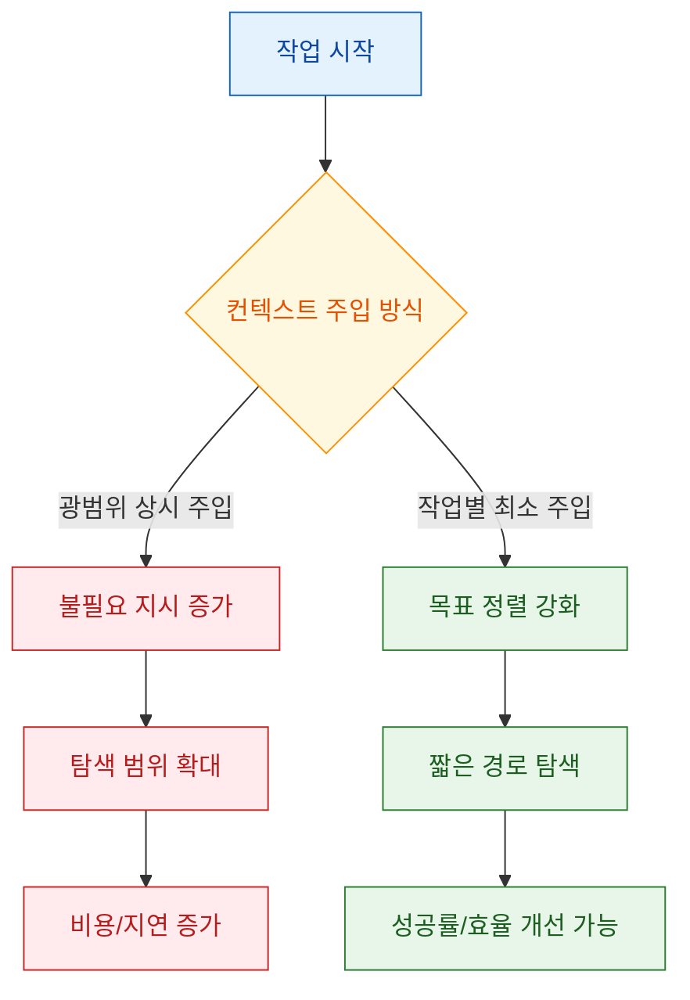
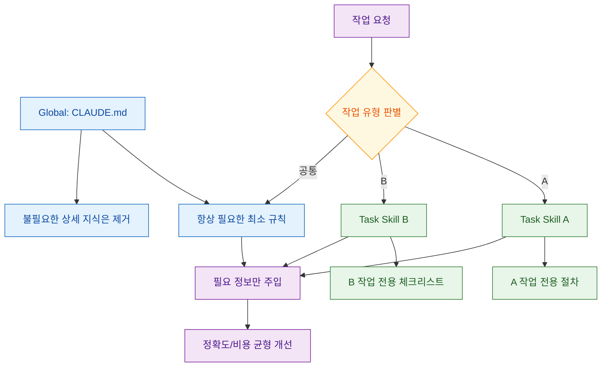

"CLAUDE.md를 열심히 쓰면 에이전트가 더 똑똑해질 것"이라는 직관은 꽤 강합니다. 하지만 영상에서 소개된 논의는 반대 방향의 경고를 던집니다. 핵심은 컨텍스트 파일의 존재 자체가 아니라, **현재 작업과 무관한 지시가 상시 주입되는 구조**가 탐색 비용과 추론 비용을 밀어 올릴 수 있다는 점입니다.

<!--more-->

## Sources

- https://youtu.be/c7_ANA1NiS0?t=299

## 1) 핵심 메시지: "많이 넣는 것"보다 "맞게 넣는 것"이 중요하다

영상은 컨텍스트 파일(예: `CLAUDE.md`, `AGENTS.md`)을 넣었을 때 오히려 성공률이 떨어지거나 비용이 증가하는 경향을 소개합니다. 특히 자동 생성 컨텍스트는 "없는 경우 대비 개선"이 아니라 "오히려 비효율"로 나타나는 구간이 있었고, 사람 작성 컨텍스트는 상대적으로 더 나은 결과를 보였다는 점이 반복해서 강조됩니다.

근거 노트:

| claim | transcript quote/time marker | video url | confidence |
|---|---|---|---|
| 컨텍스트 파일 주입이 성공률 저하/비용 증가로 이어질 수 있다 | "컨텍스트 파일을 제공했을 때 오히려 작업 성공률이 감소... 추론 비용은 20% 이상 증가" (중반, 약 02:58~14:28 구간) | https://youtu.be/c7_ANA1NiS0?t=299 | High |
| 사람 작성 컨텍스트는 자동 생성 대비 상대적으로 낫다 | "사람이 직접 작성한 컨텍스트 파일이... 대체적으로 조금 더 좋은 결과" (중반~후반) | https://youtu.be/c7_ANA1NiS0?t=530 | Medium |

## 2) 왜 성능이 떨어지나: 정답 신호보다 잡음 신호가 커지기 때문

영상 설명을 실무 관점으로 번역하면 원인은 세 가지입니다. 첫째, 작업과 무관한 규칙이 우선순위 높은 위치에서 지속적으로 모델을 흔듭니다. 둘째, 모델이 "읽을 필요가 없는 파일"까지 넓게 탐색하면서 툴 사용량이 늘어납니다. 셋째, 결과적으로 첫 유효 작업까지 도달하는 단계 수가 증가해 토큰과 시간이 함께 증가합니다.

이 지점에서 중요한 해석은 "컨텍스트 파일이 나쁘다"가 아니라 "**작업 단위로 압축되지 않은 컨텍스트가 나쁘다**"입니다. 즉, 레포 전체 문서를 늘리는 방식보다, 현재 작업에 맞는 규칙만 짧게 제공하는 방식이 유리합니다.

근거 노트:

| claim | transcript quote/time marker | video url | confidence |
|---|---|---|---|
| 컨텍스트가 있을수록 툴 사용과 탐색 폭이 늘어날 수 있다 | "컨텍스트 파일을 제공하면 더 많은 툴유즈... 코드를 불필요하게 더 넓게 탐색" (중반, 피규어 설명 파트) | https://youtu.be/c7_ANA1NiS0?t=700 | High |
| 첫 상호작용까지 스텝이 늘어날 수 있다 | "메모리 파일이 있으면 더 빨리 파악할 것 같지만... 오히려 더 늘어난다" (중반) | https://youtu.be/c7_ANA1NiS0?t=610 | High |

## 3) 실무 설계: "얇은 공통 규칙" + "작업별 스킬"로 분리하라

영상 후반 제안은 실무적으로 매우 명확합니다. `CLAUDE.md` 같은 전역 메모리 파일은 반드시 필요한 최소 규칙만 유지하고, 세부 지식/절차는 작업 트리거형 스킬 문서로 분해하라는 전략입니다. 이렇게 하면 특정 작업에서 필요한 정보만 주입되어 컨텍스트 오염을 줄일 수 있습니다.

실무 적용 체크:

1. `CLAUDE.md`에서 현재 작업과 무관한 정책/설명/예시를 제거한다.
2. 반복 업무(테스트, 릴리즈, 문서화, 마이그레이션)는 스킬 단위로 분리한다.
3. 스킬은 "트리거 조건 + 금지 사항 + 검증 절차"까지 포함해 짧고 강하게 유지한다.
4. 작업 종료 후 불필요하게 커진 전역 문서를 정리하는 루틴을 둔다.

근거 노트:

| claim | transcript quote/time marker | video url | confidence |
|---|---|---|---|
| 전역 파일은 최소 필수만 남기고 나머지는 분리하는 전략이 제시됨 | "필요 없는 것들은 지우고 필요한 것들만 남겨둬라... 스킬로 전부 옮겨 놓은 거" (후반, 약 14:28~17:42) | https://youtu.be/c7_ANA1NiS0?t=915 | High |
| 작업별 컨텍스트 주입이 더 합리적이라는 결론 | "특정 작업을 할 때 필요한 정보만 주입" (후반) | https://youtu.be/c7_ANA1NiS0?t=940 | High |

## Practical Takeaways

- `CLAUDE.md`는 "상시 정책"만 두고, 기술 스택 설명서처럼 비대해지지 않게 관리하세요.
- 자동 생성 컨텍스트를 그대로 신뢰하지 말고, 실제 작업 로그 기준으로 줄여가며 튜닝하세요.
- "하지 마" 규칙을 과도하게 늘리기보다, 현재 작업 성공 기준을 짧게 명시하는 편이 효과적입니다.
- 성능 측정은 최소한 `성공률`, `툴 호출 수`, `완료까지 단계`, `토큰 비용` 4개 지표를 함께 보세요.
- 에이전트 품질 이슈가 생기면 모델 탓 전에 컨텍스트 오염(무관 지시 주입)부터 점검하세요.

## Conclusion

이 영상의 메시지는 단순히 "CLAUDE.md를 지워라"가 아닙니다. 정확히는 **전역 컨텍스트의 밀도를 낮추고, 작업 컨텍스트의 정밀도를 높이라**는 운영 원칙에 가깝습니다. 에이전트 시대의 문서 전략은 많이 쓰는 문서가 아니라, 필요한 순간에 정확히 불러오는 문서 구조에서 성능이 갈립니다.
