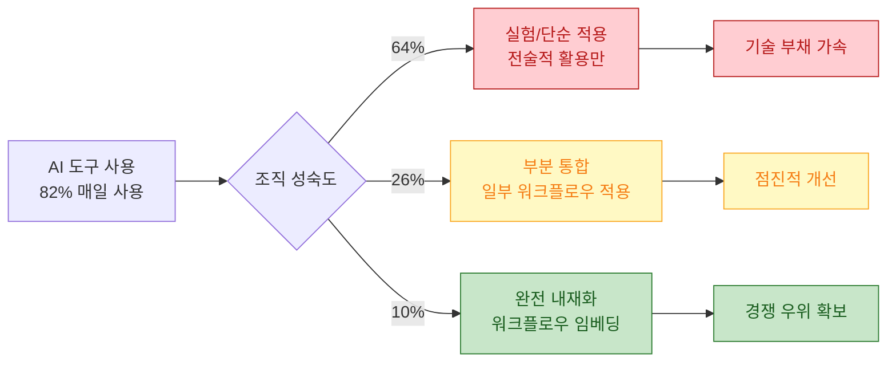
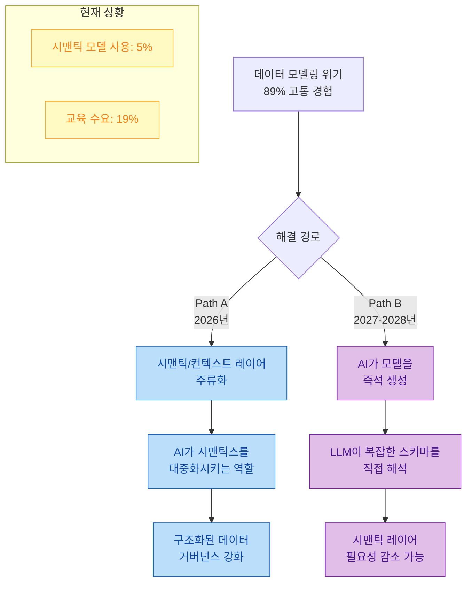
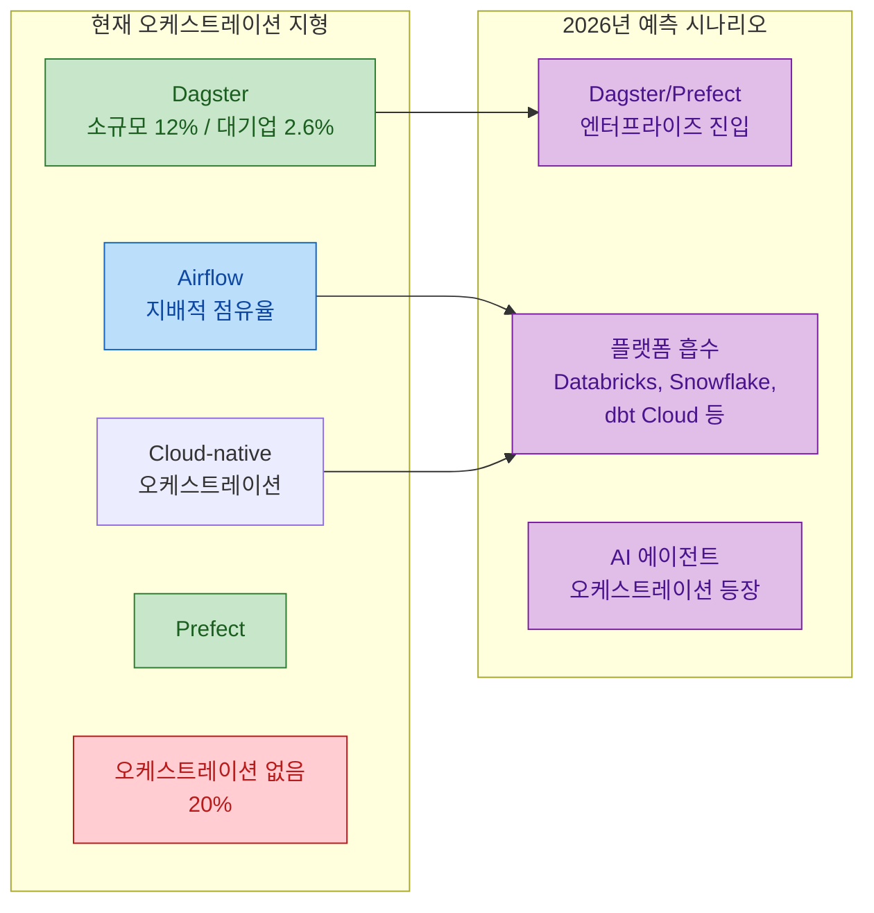
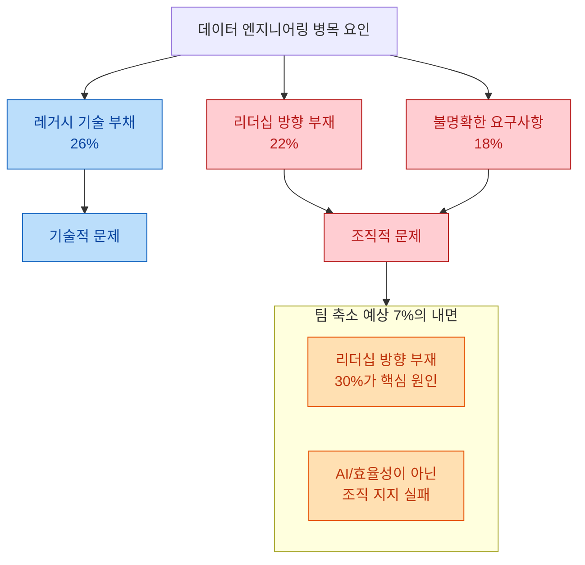

데이터 엔지니어링의 미래를 예측하는 글은 많지만, 실제 데이터에 기반한 분석은 드뭅니다. Joe Reis는 2025년 12월부터 2026년 1월까지 **1,101명의 데이터 실무자와 리더**를 대상으로 설문을 진행했고, 그 결과를 바탕으로 2026년 데이터 엔지니어링의 방향성을 제시했습니다. 핵심 메시지는 분명합니다: **과거에 갚지 않은 빚은 이자가 붙고, 그 이자율은 사채 수준**이라는 것입니다.

<!--more-->

## Sources

- https://joereis.substack.com/p/where-data-engineering-is-heading

## 1. AI 도구 성숙도 양극화: 82%가 매일 쓰지만 제대로 쓰는 팀은 10%

설문 결과 **82%** 의 데이터 실무자가 AI 도구를 매일 사용하고 있습니다. AI를 쓰냐 안 쓰냐의 질문은 이미 끝났습니다. 진짜 질문은 **"잘 쓰고 있느냐"** 입니다.

문제는 조직 수준의 성숙도입니다. **64%** 의 조직이 여전히 "실험 중"이거나 "단순 반복 업무에만 AI를 적용"하는 단계에 머물러 있습니다. 반면 **AI를 워크플로우에 완전히 내재화한 팀은 10%** 에 불과합니다. 이 10%가 나머지 팀들과의 격차를 계속 벌리고 있으며, AI 성숙 팀이 미성숙 팀의 인재를 빼가는 현상도 가속화될 것으로 예상됩니다.

Joe Reis의 예측에 따르면, 2026년 말이 되면 채용 공고에서 "AI 활용 가능"이라는 문구가 사라질 것입니다. AI 사용이 **기본 전제**가 되기 때문입니다. 최신 AI 도구를 쓰지 않는다면, 시장 경쟁력을 잃게 됩니다.

여기서 주목할 점은 이 양극화가 데이터 엔지니어링의 본질적 문제를 더 심화시킨다는 것입니다. **규율 있는 팀은 AI를 통해 품질을 유지하면서 더 빠르게 움직이고, 규율 없는 팀은 AI를 통해 기술 부채를 더 빠르게 쌓습니다.** 같은 도구가 정반대의 결과를 만드는 구조입니다.

## 2. 데이터 모델링 위기와 시맨틱 레이어의 부상

설문 응답자의 **89%** 가 데이터 모델링에서 어떤 형태든 고통(pain point)을 겪고 있다고 답했습니다. 구체적으로 **59%** 가 "빠르게 움직여야 한다는 압박"을, **51%** 가 "명확한 소유권 부재"를 핵심 문제로 지적했습니다. 체계적인 데이터 모델링 접근 방식을 갖춘 팀 대비, 그때그때 모델링하는(ad-hoc) 팀의 **38%** 가 화재 진압(firefighting)에 시간을 쓰고 있습니다.

현재 **시맨틱 모델을 사용하는 조직은 5%** 에 불과합니다. 그런데 시맨틱/온톨로지 교육 수요는 **19%**, 데이터 모델링 교육 수요도 **19%** 로 높은 관심을 보이고 있습니다. 이 격차는 기회를 의미합니다.

Joe Reis는 앞으로 두 가지 경로가 가능하다고 분석합니다:

**Path A**는 시맨틱 레이어와 컨텍스트 도구가 2026년에 본격적으로 주류에 진입하는 시나리오입니다. AI가 시맨틱 레이어를 더 쉽게 구축하고 활용할 수 있게 만들면서 대중화를 촉진합니다. **Path B**는 AI 모델이 직접 복잡한 스키마를 해석해서 시맨틱 레이어 자체의 필요성이 줄어드는 시나리오입니다.

Joe Reis는 **Path A가 먼저 일어나고, Path B가 2027-2028년에 Path A를 잠식할 것**이라고 예측합니다. 현재 AI 모델의 발전 속도를 고려하면, 이 전환은 생각보다 빠르게 올 수 있습니다.

## 3. 오케스트레이션 통합: Airflow 독점의 점진적 균열

설문 결과에서 가장 놀라운 수치 중 하나는 **회사 규모와 무관하게 20%의 팀이 오케스트레이션 도구를 전혀 사용하지 않는다**는 점입니다. 이 팀들은 세 가지 상태 중 하나입니다:

- 수동 프로세스와 직감에 의존하는 상태
- 설문에 포착되지 않은 도구(cron 등)를 사용하는 상태
- 곧 심각한 장애를 겪을 상태

Airflow가 여전히 지배적이지만, 흥미로운 변화가 바닥에서 올라오고 있습니다. **Dagster가 소규모 회사에서 12%의 점유율** 을 차지하는 반면, **엔터프라이즈에서는 2.6%**에 그칩니다. 이는 차세대 오케스트레이션 도구가 **바텀업 방식으로 시장에 침투** 하고 있다는 신호입니다.

Joe Reis의 예측은 두 갈래입니다: **Dagster나 Prefect가 엔터프라이즈에 진입하거나**, 아니면 **"오케스트레이션"이라는 카테고리 자체가 Databricks, Snowflake, dbt Cloud 같은 플랫폼에 흡수** 될 수 있습니다. 여기에 AI 에이전트를 위한 오케스트레이션이라는 새로운 차원도 등장하고 있어서, 이 영역의 변화는 아직 진행 중입니다.

## 4. 레이크하우스 vs 웨어하우스: 승자 없는 수렴

현재 데이터 아키텍처 분포는 **웨어하우스 44%, 레이크하우스 27%, 하이브리드 12%** 입니다. Snowflake와 Databricks가 기능 동등성(feature parity)에 수렴하면서, "레이크하우스"는 더 이상 차별화 요소가 아닌 **기본값(norm)**이 되어가고 있습니다.

특히 주목할 점은 **중남미 지역의 레이크하우스 채택률이 40%** 라는 것입니다. Joe Reis는 이것이 그린필드 채택(greenfield adoption)일 가능성을 제기합니다. 마치 일부 국가가 구리 유선 전화를 건너뛰고 바로 광케이블과 무선으로 간 것처럼, 레거시 웨어하우스 인프라 없이 바로 레이크하우스로 시작한 사례일 수 있다는 분석입니다.

2026년 말에는 **"웨어하우스 vs 레이크하우스" 논쟁 자체가 구시대적으로 느껴질 것** 이라는 것이 Joe Reis의 예측입니다. 답은 "둘 다(yes)"입니다. Iceberg 채택 추이가 이 수렴을 더 가속화할 것으로 보입니다.

## 5. 리더십 병목: 기술이 아니라 조직이 문제

설문 데이터를 역할별로 분석하면, **데이터 엔지니어의 22%가 "리더십 방향 부재"를 주요 문제** 로 꼽았습니다. 이는 레거시 기술 부채(**26%**) 에 거의 근접한 수치입니다. 여기에 "불명확한 요구사항"(**18%**) 까지 합치면, 이 문제들은 모두 **조직적 역기능** 을 가리킵니다.

**7%** 의 팀이 축소를 예상하는데, 그 7% 내부를 들여다보면 **30%가 "리더십 방향 부재"를 병목**으로 꼽습니다. 이 팀들은 AI나 효율화 때문에 줄어드는 것이 아니라, **조직적 지지(organizational buy-in)를 확보하지 못해서** 줄어드는 것입니다.

Joe Reis는 2026년에 데이터 리더십, 이해관계자 관리, 조직 설계에 대한 논의가 데이터 엔지니어링과 나란히 더 많아질 것으로 예측합니다. 또는 리더십의 궁극적 판타지인 "사람을 AI 봇으로 교체"가 현실화되거나, 아니면 수십 년간 해왔듯이 문제를 한 해 더 미룰 수도 있습니다.

**살아남는 팀은 기술적 역량이 아닌 비즈니스 가치를 증명한 팀**이 될 것입니다.

## 실전 시사점 (Practical Takeaways)

1. **AI 도구 전략을 수립하세요**: 단순히 AI를 "사용"하는 것이 아니라, 워크플로우에 내재화하는 로드맵이 필요합니다. 64%가 실험 단계에 머무는 동안, 10%의 선두 팀은 이미 경쟁 우위를 확보하고 있습니다.

2. **데이터 모델링에 투자하세요**: Ad-hoc 모델링에서 체계적 접근으로 전환하면 화재 진압 시간을 크게 줄일 수 있습니다. 시맨틱 레이어 도구의 도입을 검토해볼 적기입니다.

3. **오케스트레이션 현황을 점검하세요**: 오케스트레이션 도구 없이 운영 중이라면, 이는 장애 발생을 기다리는 상태입니다. Dagster나 Prefect 같은 차세대 도구를 소규모 프로젝트에서 시험해보세요.

4. **아키텍처 논쟁보다 실질적 가치에 집중하세요**: 웨어하우스 vs 레이크하우스 논쟁은 수렴 중입니다. 특정 벤더에 종속되지 않으면서, Iceberg 같은 오픈 포맷의 채택을 고려하세요.

5. **기술 역량만큼 조직 역량을 키우세요**: 리더십 방향 부재와 불명확한 요구사항이 기술 부채 못지않은 병목입니다. 비즈니스 가치를 증명하는 커뮤니케이션 역량이 팀의 생존을 결정합니다.

## 결론

2026년 데이터 엔지니어링의 핵심은 **올바른 도구를 고르는 것이 아니라, 도구를 잘 사용할 수 있는 조직적 근력을 기르는 것**입니다. 1,101명의 설문 데이터가 보여주는 현실은 명확합니다: AI는 이미 일상이지만 조직 수준의 내재화는 아직 초기이고, 데이터 모델링의 고통은 보편적이며, 리더십 부재는 기술 부채만큼이나 심각한 병목입니다.

Joe Reis의 말처럼, **과거에 갚지 않은 빚은 사채 이자율로 불어나고 있습니다.** 기반을 다진 팀과 그렇지 않은 팀의 격차는 2026년 내내 벌어질 것입니다. 이 격차에서 어느 쪽에 서느냐는 지금의 투자에 달려 있습니다.
