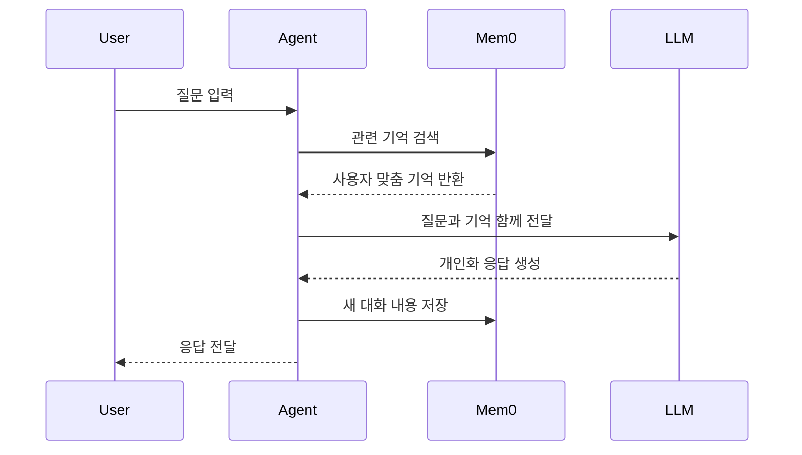

이번 Shorts의 요지는 명확합니다. 1:1 대화에서는 크게 필요하지 않을 수 있지만, 여러 고객을 동시에 상대하는 AI 에이전트 SaaS에서는 "고객별 기억 분리"가 필수이며 그 지점에서 Mem0가 유용하다는 주장입니다. ([영상 근거](https://youtu.be/qVLvBZpuH1M?t=20)) 이 글에서는 그 메시지를 출발점으로, Mem0 공식 문서/공식 레포 근거로 기능과 활용법을 실무 관점에서 정리합니다.

<!--more-->

## Sources

- https://www.youtube.com/shorts/qVLvBZpuH1M
- https://docs.mem0.ai/
- https://docs.mem0.ai/open-source/python-quickstart
- https://docs.mem0.ai/core-concepts/memory-operations/add
- https://docs.mem0.ai/components/vectordbs/overview
- https://docs.mem0.ai/platform/platform-vs-oss
- https://docs.mem0.ai/integrations/openai-agents-sdk
- https://github.com/mem0ai/mem0

## 1) Shorts 핵심 요약: "멀티 고객 환경"에서 왜 메모리 레이어가 필요한가

영상은 Mem0를 "복잡한 기억이 필요한 상황"에 쓰는 서비스로 소개합니다. 핵심 포인트는 고객 A/B/C의 정보가 섞이면 개인화 품질 저하를 넘어 개인정보 이슈가 될 수 있으므로, 사용자 단위로 기억을 분리하고 해당 사용자 맥락만 불러와야 한다는 점입니다. ([영상 근거](https://youtu.be/qVLvBZpuH1M?t=30))

또한 Shorts에서는 Mem0가 클라우드/오픈소스 양쪽을 제공하고, 기억 압축과 추적성을 제공한다고 설명합니다. 즉, 단순 저장소가 아니라 "추출-압축-조회-추적"이 붙은 메모리 계층으로 이해하는 것이 맞습니다. ([영상 근거](https://youtu.be/qVLvBZpuH1M?t=55))

## 2) Mem0 기능 구조: add 파이프라인과 검색 모델

공식 문서 기준으로 Mem0의 `add` 동작은 크게 3단계입니다. (1) 정보 추출, (2) 충돌 해결/중복 처리, (3) 저장입니다. 기본값 `infer=True`에서는 구조화 추출 및 충돌 처리까지 수행하고, `infer=False`에서는 원문을 그대로 적재하므로 중복 관리 전략을 따로 세워야 합니다. (docs: Add Memory)

검색 측면에서는 사용자/세션/실행 단위 식별자와 메타데이터 필터를 통해 필요한 기억만 불러오는 모델을 채택합니다. 이 패턴은 "전체 대화 이력 통째 주입" 대비 토큰 사용량과 노이즈를 줄이는 데 유리합니다.

## 3) 공식 기능 요약: Platform vs OSS, 저장소 선택, 통합

Mem0는 관리형 Platform과 OSS를 병행합니다. Platform은 빠른 시작/운영 편의, OSS는 인프라 통제와 커스터마이징이 강점입니다. 공식 비교 페이지에서도 이 차이를 시간·운영 책임·확장 방식 기준으로 명시합니다. (docs: Platform vs Open Source)

저장 계층은 Qdrant, Chroma, PGVector, Pinecone, Milvus 등 다양한 벡터DB를 지원하며, 설정이 없으면 기본적으로 Qdrant를 사용합니다. (docs: Vector DB Overview) 또한 OpenAI Agents SDK 통합 예시에서 `search_memory`/`save_memory` 도구 패턴을 통해 멀티 에이전트 핸드오프에도 기억을 연결하는 방법을 제시합니다. (docs: OpenAI Agents SDK)

## 4) 실전 활용 패턴 6가지 (What / Why / How)

### 4-1) Chat Memory Loop
- What: 질의 전 검색, 답변 후 저장 루프를 고정합니다.
- Why: 매 턴마다 필요한 기억만 주입해 컨텍스트 과부하를 줄입니다.
- How: `search -> answer -> add` 순서를 래퍼 함수로 강제합니다.

### 4-2) 멀티테넌트 분리
- What: `user_id`, `agent_id`, `run_id`, `app_id` 스코프를 명시합니다.
- Why: 고객 간 메모리 오염과 유출 리스크를 낮춥니다.
- How: 검색 필터를 "기본 ON"으로 두고, 무필터 조회를 금지합니다.

### 4-3) Personalization + RAG 보강
- What: 검색/추천 에이전트 프롬프트에 사용자 기억을 함께 주입합니다.
- Why: 동일 질문이라도 사용자 선호에 맞는 응답을 만들 수 있습니다.
- How: 검색 결과와 기억 결과를 분리 수집 후 프롬프트에서 합성합니다.

### 4-4) 에이전트 핸드오프 메모리 공유
- What: 라우팅 에이전트와 전문 에이전트가 공용 메모리 레이어를 봅니다.
- Why: 에이전트가 바뀌어도 사용자 맥락이 끊기지 않습니다.
- How: 공통 도구 함수(`save_memory`, `search_memory`)를 에이전트별로 재사용합니다.

### 4-5) 메모리 수명 관리
- What: 중요도/만료일 기반으로 기억을 단기/장기로 분리합니다.
- Why: 오래된 기억 누적으로 발생하는 노이즈를 줄입니다.
- How: 메타데이터 + 만료 정책으로 아카이브/삭제를 자동화합니다.

### 4-6) 운영 가시성 확보
- What: 어떤 기억이 응답에 사용됐는지 추적 로그를 남깁니다.
- Why: 잘못된 개인화의 원인을 빠르게 역추적할 수 있습니다.
- How: 메모리 이벤트 훅/웹훅 또는 자체 감사 로그를 연결합니다.

## 5) 도입 시 주의할 점

1. `infer=True`와 `infer=False`를 혼용하면 중복/정합성 이슈가 생길 수 있으므로 사용 정책을 먼저 고정해야 합니다.
2. 벡터 차원(embedding dims)과 DB 설정이 맞지 않으면 검색 품질 저하 또는 오류가 발생할 수 있습니다.
3. 메모리를 많이 저장하는 것보다, 검색 필터와 만료 정책으로 "필요한 것만 남기는 운영"이 더 중요합니다.
4. "기억이 많으면 무조건 성능 향상"은 성립하지 않습니다. 평가 셋으로 회귀 테스트를 붙여야 합니다.

## Practical Takeaways

1. Mem0는 채팅 저장소가 아니라 "개인화 가능한 메모리 레이어"로 도입해야 효과가 난다.
2. 멀티 고객 SaaS라면 사용자 스코프 분리(`user_id` 중심)를 설계 초기에 고정해야 한다.
3. 첫 PoC는 Platform으로 빠르게 검증하고, 통제 요구가 커질 때 OSS로 확장하는 전략이 현실적이다.
4. 운영 품질은 저장량보다 검색 정책, 만료 전략, 감사 가능성에서 결정된다.
5. 영상의 메시지처럼 1:1 대화보다 "다수 사용자 대응 에이전트"에서 Mem0의 가치가 크게 드러난다. ([영상 근거](https://youtu.be/qVLvBZpuH1M?t=70))

## Conclusion

Mem0의 본질은 "기억을 많이 쌓는 도구"가 아니라 "필요한 기억만 정확히 꺼내 쓰게 만드는 계층"입니다. Shorts가 던진 문제의식(고객별 기억 분리)은 실무에서 매우 타당하며, 공식 문서가 제공하는 추출-충돌해결-저장-검색 파이프라인을 기준으로 설계하면 과장 없이 안정적인 개인화 에이전트를 만들 수 있습니다.
