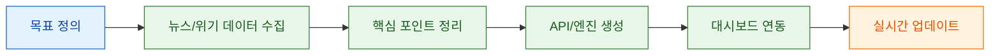
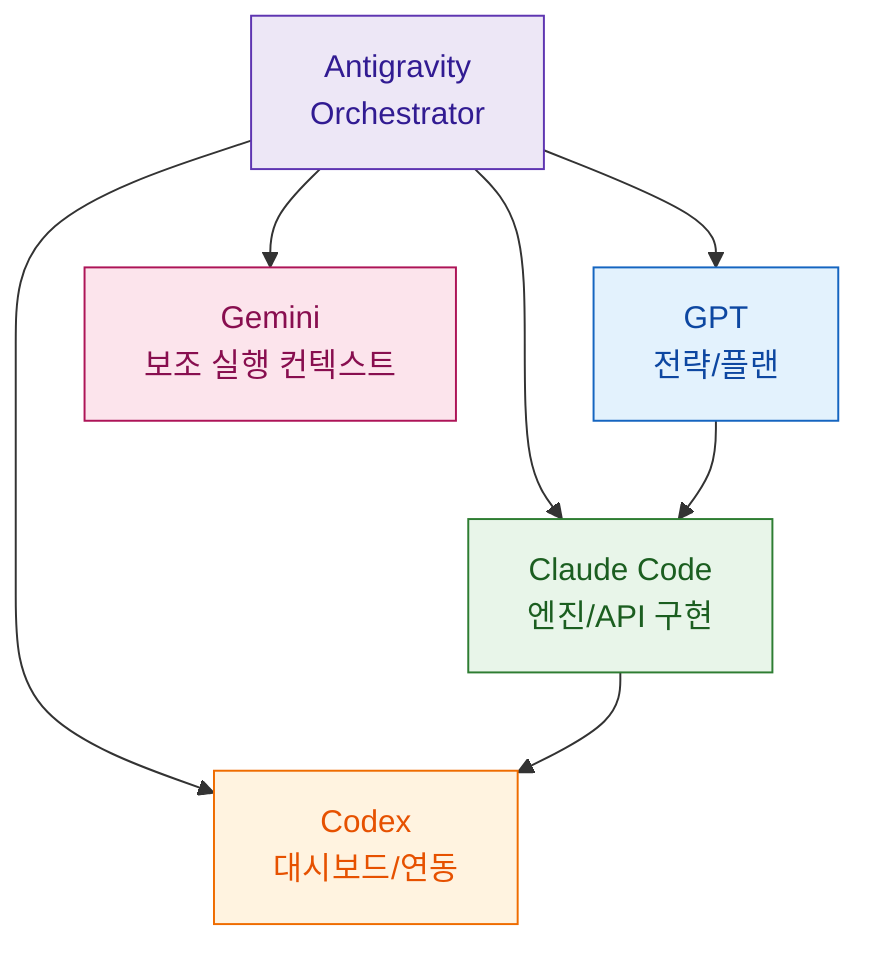
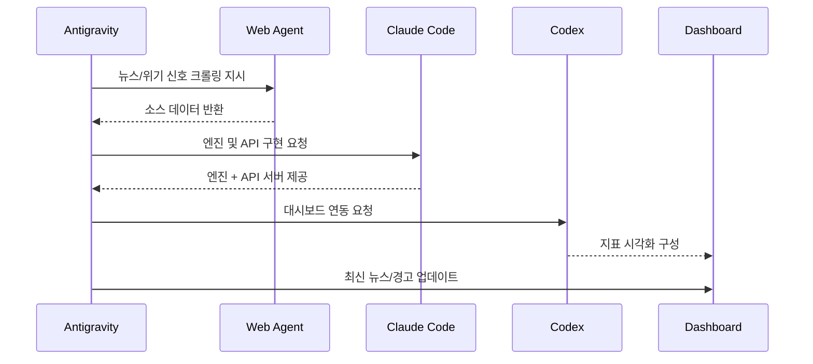

여러 LLM을 "각자 잘 쓰는 것"과 "팀처럼 같이 일하게 만드는 것"은 완전히 다른 문제입니다. 이번 영상은 Antigravity를 중심으로 GPT, Claude Code, Codex(그리고 내부 Gemini)를 동시에 돌리며, 뉴스 수집부터 지표 대시보드까지 이어지는 멀티 에이전트 실행 구조를 보여 줍니다. 핵심은 모델 성능 비교가 아니라 **역할 분해 + 오케스트레이션 설계**입니다. ([영상 근거](https://youtu.be/nJfqO5edMFk?t=35))

<!--more-->

## Sources

- https://www.youtube.com/watch?v=nJfqO5edMFk&feature=youtu.be

## 1) 문제 정의: "좋은 모델"보다 "좋은 배치"가 먼저다

발표자는 목표를 명확히 둡니다. 전 세계 뉴스/위기 신호를 모아 환율, 주가, 금값, VIX 같은 지표와 함께 한눈에 보는 실시간 대시보드를 만들고, 이 흐름을 단일 모델이 아니라 멀티 에이전트 협업으로 자동화하려고 합니다. ([영상 근거](https://youtu.be/nJfqO5edMFk?t=180))

여기서 중요한 포인트는 "뉴스 긁기"에서 끝내지 않고, 수집-정리-엔진-시각화로 분리한다는 점입니다. 즉, 정보 탐색과 코드 구현, UI 연동을 서로 다른 에이전트가 맡게 해서 병렬 처리 이점을 얻습니다. ([영상 근거](https://youtu.be/nJfqO5edMFk?t=258))

## 2) 역할 분해: Antigravity가 지휘하고, 각 LLM은 전문 업무를 맡는다

영상에서는 Antigravity를 오케스트레이터로 두고, GPT를 전략/계획(헤드), Claude Code를 엔진/파이썬/API 구현, Codex를 대시보드 연결 쪽으로 배치합니다. Gemini는 Antigravity 내부 실행 맥락에서 함께 동작하는 구성으로 언급됩니다. ([영상 근거](https://youtu.be/nJfqO5edMFk?t=75))

이 구조의 장점은 "한 모델에게 모든 맥락을 몰아주지 않아도 된다"는 점입니다. 각 에이전트가 좁은 책임만 처리하면 토큰 낭비와 컨텍스트 혼선을 줄일 수 있고, 실패 지점도 역할 단위로 추적하기 쉬워집니다. ([영상 근거](https://youtu.be/nJfqO5edMFk?t=520))

## 3) 실행 파이프라인: 크롤링 -> 엔진/API -> 대시보드 -> 재업데이트

데모 흐름은 매우 실무적입니다. 먼저 Antigravity의 브라우저 에이전트로 외부 소스를 크롤링하고, 이후 Claude Code가 파이썬 엔진과 API 서버를 구성합니다. 마지막으로 Codex가 대시보드 계층을 연결해 결과를 화면에 노출합니다. ([영상 근거](https://youtu.be/nJfqO5edMFk?t=420))

중간 산출물도 명확하게 말합니다. 엔진, API 서버, 대시보드라는 3개 아티팩트를 중심으로 반복 개선하며, 이후 "최신 뉴스"와 위기 알림이 실시간에 가깝게 갱신되도록 보완합니다. ([영상 근거](https://youtu.be/nJfqO5edMFk?t=640))

## 4) 운영 관점 인사이트: 1인 기업 시대의 핵심은 환경 설계

영상 후반부에서 강조하는 메시지는 단순합니다. 뛰어난 에이전트를 많이 붙여도, 오케스트레이션 환경이 나쁘면 성능이 제대로 나오지 않습니다. 즉 "좋은 인력"만큼 "좋은 작업 환경"이 중요하다는 비유를 통해, 협업 구조의 중요성을 설명합니다. ([영상 근거](https://youtu.be/nJfqO5edMFk?t=980))

또한 구독 기반 조합으로 추가 비용 부담을 크게 늘리지 않으면서도, 단일 모델에 모든 작업을 몰아줄 때보다 효율적일 수 있다는 경험적 관찰을 제시합니다. 이 부분은 계정/요금제/작업량에 따라 달라질 수 있으므로 팀별 실측 검증이 필요합니다. ([영상 근거](https://youtu.be/nJfqO5edMFk?t=860))

## Practical Takeaways

1. 멀티 LLM 도입의 첫 단계는 모델 교체가 아니라 **역할 분해표 작성**이다.
2. Orchestrator를 하나로 고정하고, 다른 에이전트는 전문 기능(전략/구현/UI)만 맡기면 디버깅이 쉬워진다.
3. 산출물을 엔진/API/대시보드처럼 아티팩트 단위로 쪼개면, 실패 복구와 재시도가 빨라진다.
4. "실시간"을 목표로 할 때는 크롤링 주기, API 갱신 주기, 프론트 표시 주기를 따로 설계해야 한다.
5. 비용 효율 주장은 반드시 팀의 실제 토큰 사용량/응답시간/성공률로 측정해 재검증해야 한다.

## Conclusion

이 사례의 본질은 "모델을 더 똑똑하게 고르는 법"이 아니라 "여러 모델이 함께 일하도록 시스템을 설계하는 법"입니다. Antigravity 같은 오케스트레이션 레이어를 중심에 두고 역할을 명확히 나누면, 단일 에이전트 한계를 넘는 실행 구조를 비교적 짧은 시간 안에 만들 수 있습니다. 다음 단계는 동일 패턴을 본인 도메인(개발, 리서치, 마케팅, 트레이딩)에 맞춰 재현하고, 지표 기반으로 개선 루프를 돌리는 것입니다.
