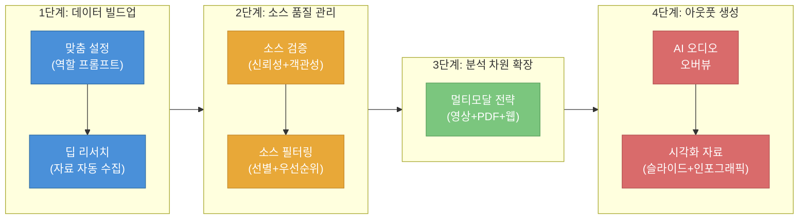
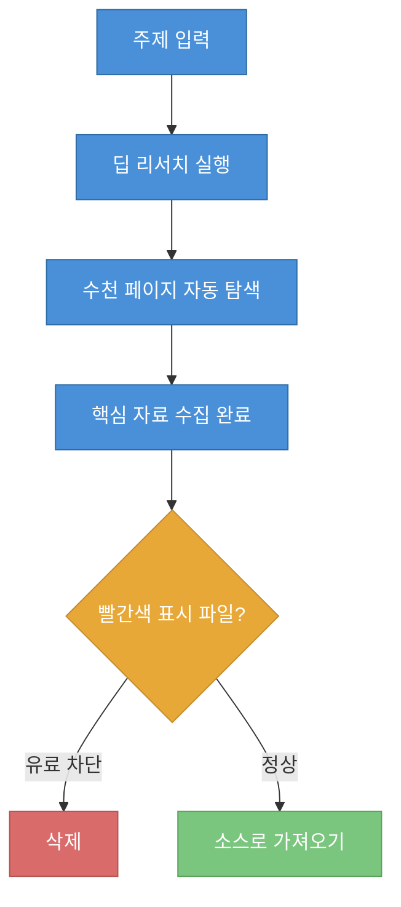
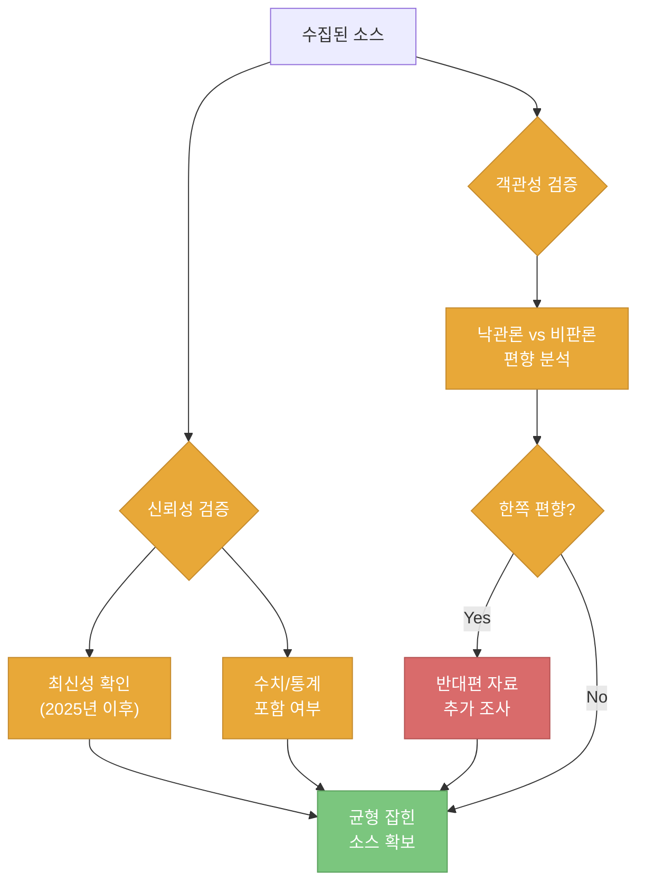
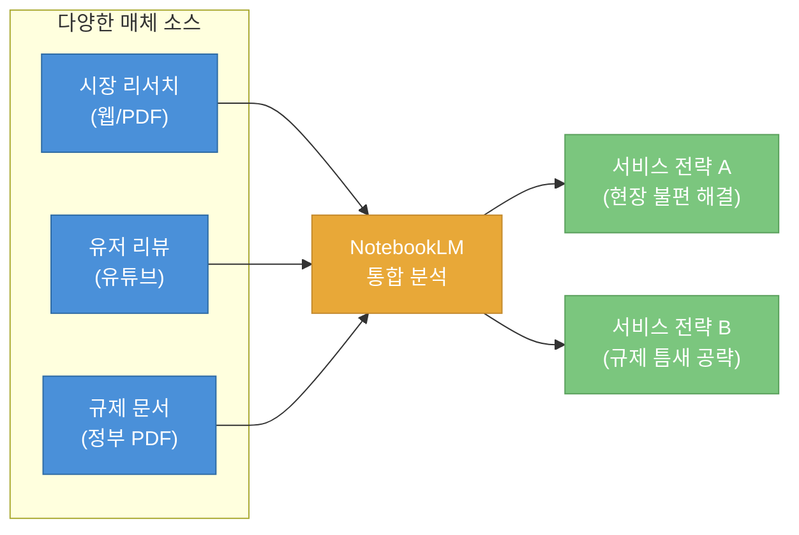
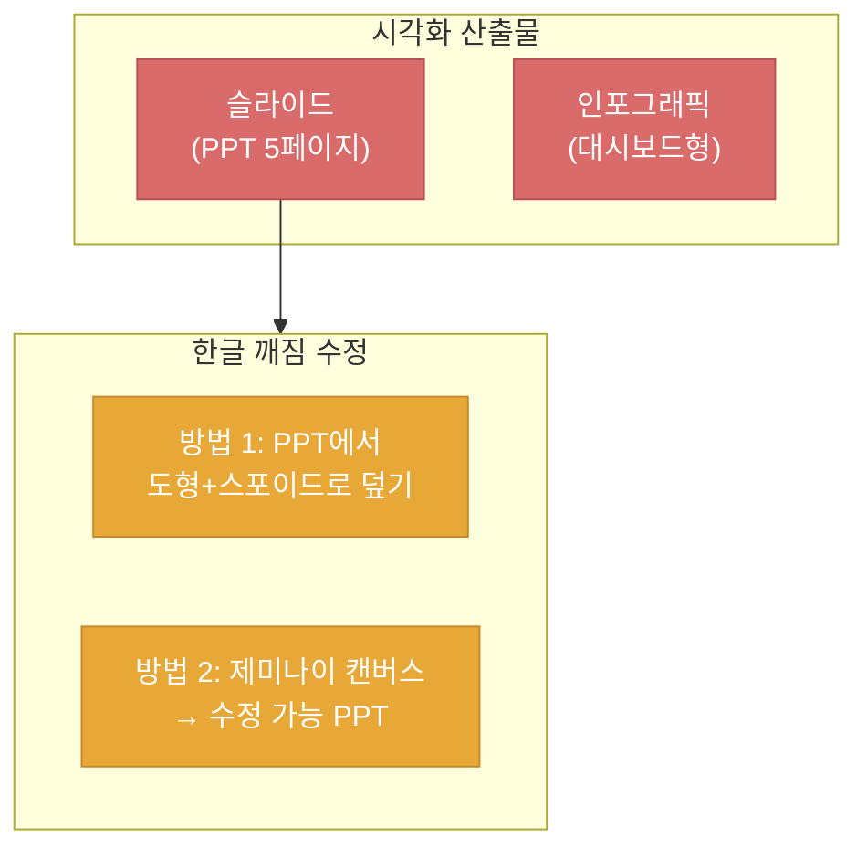

대부분의 사용자가 NotebookLM에 소스를 넣고 바로 질문하는 패턴에 머물러 있습니다. 이 글은 백프롬 채널 영상을 바탕으로, 소스 투입 전 사전 설정부터 최종 시각화 산출물까지 이어지는 7단계 워크플로우를 실무 관점에서 정리한 노트입니다.

<!--more-->

## Sources

- https://www.youtube.com/watch?v=G_arORBb6zc

## 전체 워크플로우 개요

영상에서 제시하는 7가지 기술은 크게 세 단계로 나뉩니다: **데이터 빌드업**, **소스 품질 관리**, **아웃풋 생성**. 단순히 기능 나열이 아니라, 앞 단계의 결과가 다음 단계의 품질을 결정하는 파이프라인 구조입니다.

## 1단계: 데이터 빌드업 — 맞춤 설정과 딥 리서치

### 기술 1: 맞춤 설정 (역할 프롬프트)

NotebookLM에서 새 노트를 만들면 소스 추가 화면이 바로 뜹니다. 대부분은 여기서 곧바로 소스를 넣지만, 영상에서는 이 단계를 **건너뛰고** 두 가지를 먼저 설정하라고 강조합니다 ([t=55](https://youtu.be/G_arORBb6zc?t=55)).

**첫째, 타이틀 설정.** 프로젝트명을 구체적으로 지정합니다. 예시에서는 "2026 디지털 헬스케어 전략"으로 입력합니다.

**둘째, 노트북 구성(역할 프롬프트).** 채팅 패널의 "노트북 구성" 아이콘에서 맞춤 프롬프트를 입력합니다. 핵심은 NotebookLM이 **어떤 전문가 역할**로 응답할지 정의하는 것입니다.

> 프롬프트 예시: "너는 15년차 IT 전략 기획자이자 디지털 헬스케어 전문가야. 모든 답변은 단순 요약을 넘어 비즈니스 기회, 법적 규제, 시장 침투 전략 관점에서 전문적으로 분석해 줘." ([t=55](https://youtu.be/G_arORBb6zc?t=55))

이렇게 설정하면 이후 모든 질문에 대해 해당 역할의 관점에서 분석된 답변을 받게 됩니다. 일반적인 요약이 아니라 **특정 도메인의 전문 분석**이 기본값이 되는 것입니다.

### 기술 2: 딥 리서치

딥 리서치는 단순 검색이 아니라, 주어진 주제를 바탕으로 **수천 페이지의 전문 자료를 AI가 자동 탐색하고 핵심만 골라오는 기능**입니다 ([t=103](https://youtu.be/G_arORBb6zc?t=103)).

화면 왼쪽에서 "딥 리서치"를 선택하고, 구체적인 조사 지시를 내립니다.

> 프롬프트 예시: "2026년 대한민국 디지털 헬스케어 시장 트렌드를 조사해 줘. 삼성 갤럭시링, 애플워치 신 모델의 AI 건강 코칭 서비스 현황과 비즈니스 모델을 뉴스 및 IT 전문지 위주로 수집해 줘. 특히 CES 2026의 관련 발표 내용이 있다면 포함해줘."

**주의사항:** 딥 리서치는 심층 조사를 수행하기 때문에 빠른 리서치보다 시간이 더 걸립니다. 작업 완료 후 "가져오기" 버튼을 누르면 참고 자료가 소스로 들어옵니다. 이때 빨간색으로 표시된 파일은 유료 결제창 등에 의해 차단된 링크이므로 삭제합니다 ([t=103](https://youtu.be/G_arORBb6zc?t=103)).

## 2단계: 소스 품질 관리 — 소스 검증과 필터링

### 기술 3: 소스 검증

자료 수집이 끝났다고 바로 질문하면 안 됩니다. 영상에서는 "충분한 양은 확보했지만 질을 확보했다고는 볼 수 없다"고 강조합니다. 검증 없이 사용하면 아무리 화려한 기획안이라도 기초부터 흔들린다는 것입니다 ([t=180](https://youtu.be/G_arORBb6zc?t=180)).

검증 기준은 **두 가지**입니다:

**① 신뢰성 검증**
- **최신 정보인가?** — 낡은 정보는 아무리 좋아도 쓸모없습니다
- **구체적 수치가 있는가?** — 통계적 근거가 있어야 신뢰가 형성됩니다

> 프롬프트 예시: "수집된 소스들이 2025년 이후의 최신 정보인지 확인해 주고, 구체적인 수치나 시장 통계 포함 여부도 확인해서 표로 정리해 줘."

**② 객관성 검증**
- 소스가 제조사의 낙관론과 시장 전문가의 비판론 중 어디에 치우쳐 있는지 분석합니다
- 한쪽으로 쏠려 있다면 반대편 자료를 추가 조사하여 균형을 맞춥니다

> 프롬프트 예시: "선별된 소스들이 제조사의 낙관론과 시장 전문가의 비판론 중 어디에 더 치우쳐 있는지 분석해서 비교표로 정리해 줘. 각 소스가 가진 시각의 편향성을 투명하게 짚어 줘."

### 기술 4: 소스 필터링

모든 자료가 선택된 상태에서 질문하면 50개 전체를 기반으로 **표면적이고 광범위한 답변**만 나옵니다. 3단계에서 신뢰성·객관성을 확인한 소스들만 선택하면 **더욱 명확하고 타게팅된 인사이트**를 얻을 수 있습니다 ([t=270](https://youtu.be/G_arORBb6zc?t=270)).

**우선순위 정렬 팁:**
- 소스 이름 앞에 **`!`(느낌표)**를 넣으면 → 1순위로 상단 이동
- 소스 이름 앞에 **`#`(샵)**을 넣으면 → 2순위로 상단 이동
- 적용 후 홈 화면에 나갔다 다시 들어오면 정렬이 반영됩니다

이 필터링 작업을 통해 일반화된 답변 대신 정확히 타게팅된 인사이트를 얻을 수 있게 됩니다.

## 3단계: 분석 차원 확장 — 멀티모달 전략

### 기술 5: 멀티모달 전략

NotebookLM은 웹사이트, 유튜브 영상, 오디오 파일, 구글 문서, PDF, 이미지를 모두 소스로 받아들입니다. 핵심은 **각 매체가 다른 종류의 정보를 제공**한다는 점입니다 ([t=355](https://youtu.be/G_arORBb6zc?t=355)).

- **PDF** → 학술적·공식적 데이터
- **유튜브 영상** → 현장의 생생한 목소리와 사용자 경험
- **정부 문서** → 규제·정책 프레임워크

영상의 예시에서는 딥 리서치로 확보한 시장 데이터에 **실제 유저 리뷰 유튜브 영상**과 **보건복지부 규제 PDF**를 추가하여, 시장 데이터 + 사용자 목소리 + 규제 가이드라인을 하나로 결합한 분석을 요청합니다 ([t=415](https://youtu.be/G_arORBb6zc?t=415)).

> 프롬프트 예시: "리서치 보고서의 시장 데이터, 유튜브 리뷰의 페인포인트, 보건복지부의 규제 가이드라인을 모두 결합해 줘. 우리가 삼성·애플 생태계에 공생하며 진입할 수 있는 서비스 전략 두 가지를 제안해 줘."

**메모→소스 변환 팁:** 분석 결과가 나오면 하단의 "메모에 저장"을 누르고, 점 세 개 메뉴에서 "소스로 변환"을 하면 해당 분석 결과 자체가 다시 소스로 활용됩니다. 이렇게 하면 분석 결과를 기반으로 추가 질문을 이어갈 수 있습니다 ([t=460](https://youtu.be/G_arORBb6zc?t=460)).

## 4단계: 아웃풋 생성 — 오디오와 시각화

### 기술 6: AI 오디오 오버뷰

스튜디오 패널에서 AI 오디오 오버뷰의 연필 아이콘을 클릭하면, 축적된 자료를 오디오 형태로 검토할 수 있습니다. 토론, 강의, 요약 등 여러 형식 중 선택이 가능합니다 ([t=470](https://youtu.be/G_arORBb6zc?t=470)).

영상에서는 **토론 형식**을 선택하고 다음과 같이 지시합니다:

> "보고 전 최종 검토야. 한 명은 보안과 리스크를 중시하는 깐깐한 임원, 한 명은 시장 선점을 주장하는 열정적인 팀장 역할을 맡아줘. 삼성·애플 생태계에 침투할지 말지에 대한 논쟁을 치열하게 토론해 줘. 인트로는 건너뛰고 바로 본론으로 들어가줘."

이 방법의 핵심 가치는 **원하는 정보가 나올 때까지 여러 번 생성할 수 있다**는 점입니다. 실제로 필요한 관점이 나올 때까지 반복해서 시도할 수 있습니다.

### 기술 7: 시각화 자료 제작

스튜디오 패널에서 슬라이드와 인포그래픽 두 가지 시각화를 만들 수 있습니다 ([t=530](https://youtu.be/G_arORBb6zc?t=530)).

**슬라이드 제작:**

> 프롬프트 예시: "지금까지 분석한 내용을 바탕으로 '2026 AI 헬스케어 서비스 진입 전략 보고서'를 만들어 줘. 보고용 PPT 5페이지 분량으로 구성하고, 슬라이드별 핵심 내용을 포함해 줘. 1) 시장 현황 2) 타겟 분석 3) 비즈니스 모델 4) 규제 대응 5) 기대 효과"

차트와 이미지까지 포함된 구조화된 슬라이드가 생성되지만, **한글 폰트가 깨지는 경우**가 있고 PPT로 직접 내보내서 수정하는 것은 제한적입니다. 영상에서 소개하는 **한글 깨짐 수정 방법**은 다음과 같습니다:

1. 파워포인트에서 이미지를 삽입
2. 도형(직사각형)을 수정할 텍스트 위에 그려 놓기
3. 스포이드로 기존 배경색을 가져와 통일
4. 도형 윤곽선을 "없음"으로 설정
5. 수정할 텍스트를 입력

또는 노트북LM 채팅창에서 같은 프롬프트를 입력한 결과를 **제미나이 캔버스**에서 PPT로 변환하면, 수정 가능한 파워포인트 파일로 받을 수 있습니다.

**인포그래픽 제작:**

> 프롬프트 예시: "핵심 수치, GTM 일정, 규제 체크리스트를 표와 리스트 중심으로 시각화해서 전문 대시보드 형태로 요약해 줘. 세련된 포인트 컬러를 써서 눈에 확 띄게 해 줘."

## 실전 활용 포인트

1. **소스 투입 전에 역할 프롬프트를 반드시 설정하세요.** 도메인 전문가 역할을 부여하면 일반적인 요약이 아닌 전문 분석이 기본값이 됩니다.
2. **딥 리서치 결과를 맹목적으로 신뢰하지 마세요.** 신뢰성(최신성+수치)과 객관성(편향) 두 축으로 반드시 검증한 후 사용하세요.
3. **`!`와 `#` 접두어로 소스 우선순위를 관리하세요.** 검증된 소스만 선택하면 표면적 답변 대신 타게팅된 인사이트를 얻습니다.
4. **매체를 섞으세요.** PDF(학술), 유튜브(현장 목소리), 정부 문서(규제)를 결합하면 단일 매체로는 불가능한 다차원 분석이 가능합니다.
5. **메모→소스 변환을 적극 활용하세요.** 분석 결과를 다시 소스로 전환하면 누적 분석이 가능해집니다.
6. **AI 오디오 오버뷰는 반복 생성이 핵심입니다.** 원하는 관점이 나올 때까지 여러 번 만들어 보세요.
7. **슬라이드 한글 깨짐은 도형 덮기 또는 제미나이 캔버스 경유로 해결하세요.**

## 마무리

NotebookLM의 진정한 가치는 개별 기능이 아니라, 맞춤 설정 → 딥 리서치 → 소스 검증 → 필터링 → 멀티모달 확장 → 오디오/시각화 산출까지 이어지는 **파이프라인 전체**에 있습니다. 각 단계를 건너뛰면 최종 산출물의 품질이 직접적으로 떨어집니다. 특히 소스 검증과 필터링 단계를 습관화하면, AI가 생성하는 답변의 정확도와 깊이가 체감될 만큼 달라집니다.
