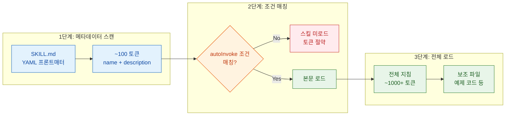
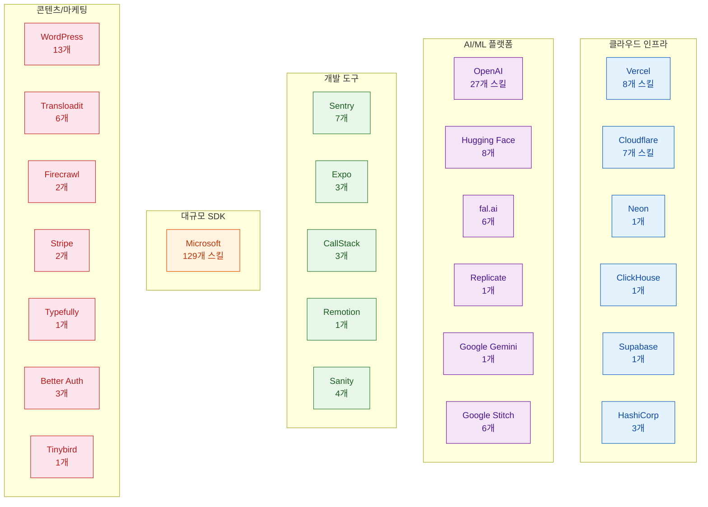
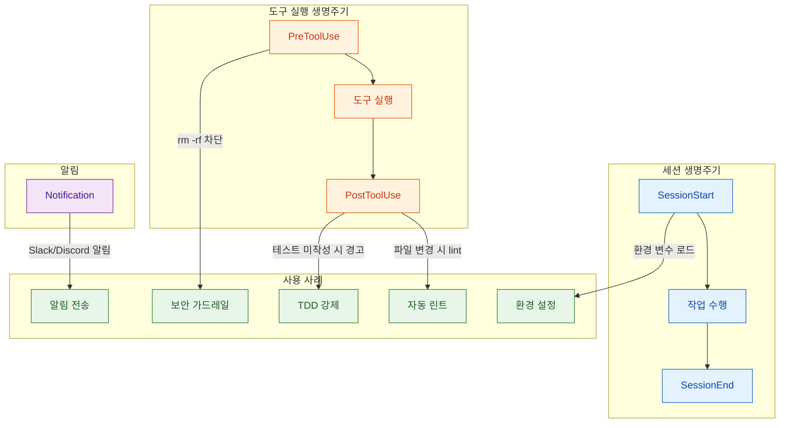

2026년 2월 현재, Claude Code의 Skills 생태계는 폭발적으로 성장했다. Anthropic 공식 17개 스킬, Microsoft의 129개 Azure SDK 스킬, Trail of Bits의 22개 보안 전문 스킬, OpenAI의 27개 크로스 플랫폼 스킬, 그리고 수백 개의 커뮤니티 스킬이 등장했다. 여기에 9개 이상의 오케스트레이터, 15개 훅 이벤트, 슬래시 커맨드, Status Line 확장까지 — 이제 Claude Code는 단순한 AI 코딩 도구를 넘어 하나의 **개발 플랫폼 생태계**로 진화하고 있다.

이 글은 **"스킬을 어떻게 만드는가"**가 아니라 **"현재 어떤 스킬들이 존재하고, 누가 제공하며, 어떤 도구 생태계가 형성되어 있는가"**를 정리한 종합 카탈로그다. 스킬 제작 가이드가 필요하다면 [Anthropic 공식 Skills 완전 가이드](/post/2026/2026-02-21-anthropic-skills-complete-guide/) 포스트를 참고하자.

<!--more-->

## 출처 및 참고 자료

이 글의 핵심 소스와 추가 참고 자료를 명시한다.

| 구분 | 링크 |
|------|------|
| **원문** | [Awesome Claude Skills 한국어 가이드](https://github.com/johunsang/vive-md/blob/main/vibe-coding/resources/Awesome-Claude-Skills-%ED%95%9C%EA%B5%AD%EC%96%B4-%EA%B0%80%EC%9D%B4%EB%93%9C.md) |
| **Upstream** | [travisvn/awesome-claude-skills](https://github.com/travisvn/awesome-claude-skills) |
| **Upstream** | [hesreallyhim/awesome-claude-code](https://github.com/hesreallyhim/awesome-claude-code) |
| **Upstream** | [VoltAgent/awesome-agent-skills](https://github.com/VoltAgent/awesome-agent-skills) |
| **Anthropic 공식** | [anthropics/skills](https://github.com/anthropics/skills) |
| **스킬 표준 스펙** | [agentskills.io](https://agentskills.io) |
| **Hooks 가이드** | [claudefa.st Hooks Guide](https://claudefa.st/blog/tools/hooks/hooks-guide) |

---

## 1. 스킬 시스템의 구조

Claude Code Skills의 핵심은 **SKILL.md** 파일이다. 하나의 마크다운 파일이 곧 하나의 스킬이며, YAML 프론트매터와 본문으로 구성된다.

### SKILL.md의 구조

```yaml
---
name: "my-skill"
description: "스킬에 대한 한 줄 설명"
version: "1.0.0"
autoInvoke: true          # 조건 매칭 시 자동 로드
tools: ["Bash", "Read"]   # 이 스킬이 사용하는 도구 화이트리스트
---

# 스킬 본문 (마크다운)

## 트리거 조건
- 사용자가 "배포"를 언급하면 활성화

## 실행 지침
1. 먼저 테스트를 실행한다
2. 빌드를 수행한다
3. 배포 스크립트를 실행한다
```

### Progressive Disclosure: 토큰 절약 메커니즘

스킬 시스템의 핵심 설계 원리는 **Progressive Disclosure**(점진적 노출)다. 모든 스킬을 항상 전부 로드하면 컨텍스트 윈도우를 낭비하므로, 단계적으로 필요한 만큼만 로드한다.



### 저장 경로

| 경로 | 범위 | 설명 |
|------|------|------|
| `~/.claude/skills/` | 개인 (전역) | 모든 프로젝트에서 사용 |
| `.claude/skills/` | 프로젝트 | 해당 레포지토리에서만 사용 |
| `.agents/skills/` | 에이전트 | 에이전트 프레임워크 전용 |

### CLAUDE.md와의 차이

| 항목 | CLAUDE.md | SKILL.md |
|------|-----------|----------|
| **목적** | 프로젝트 전역 컨텍스트 | 특정 작업 수행 지침 |
| **로딩** | 항상 로드 (always-on) | 조건부 로드 (progressive) |
| **구조** | 자유 형식 마크다운 | YAML 프론트매터 + 본문 |
| **크기 권장** | 최소한으로 유지 | 작업 완결성 우선 |
| **토큰 비용** | 매 세션마다 소비 | 필요할 때만 소비 |

핵심 원칙: **CLAUDE.md는 얇게, SKILL.md는 깊게**. 프로젝트 전역 규칙은 CLAUDE.md에, 도메인 전문 지식과 절차적 지침은 스킬로 분리하는 것이 토큰 효율의 핵심이다.

---

## 2. 공식 스킬과 기업 생태계

### Anthropic 공식 스킬 (17개)

Anthropic이 직접 제공하는 스킬은 4개 카테고리로 나뉜다.

| 카테고리 | 스킬 | 설명 |
|----------|------|------|
| **문서 처리** | [docx](https://github.com/anthropics/skills/tree/main/skills/docx), [pdf](https://github.com/anthropics/skills/tree/main/skills/pdf), [pptx](https://github.com/anthropics/skills/tree/main/skills/pptx), [xlsx](https://github.com/anthropics/skills/tree/main/skills/xlsx), [doc-coauthoring](https://github.com/anthropics/skills/tree/main/skills/doc-coauthoring) | Office 문서 생성·편집·공동작성 |
| **디자인/창작** | [algorithmic-art](https://github.com/anthropics/skills/tree/main/skills/algorithmic-art), [canvas-design](https://github.com/anthropics/skills/tree/main/skills/canvas-design), [slack-gif-creator](https://github.com/anthropics/skills/tree/main/skills/slack-gif-creator), [theme-factory](https://github.com/anthropics/skills/tree/main/skills/theme-factory) | 알고리즘 아트, 캔버스 디자인, GIF/테마 생성 |
| **개발** | [frontend-design](https://github.com/anthropics/skills/tree/main/skills/frontend-design), [web-artifacts-builder](https://github.com/anthropics/skills/tree/main/skills/web-artifacts-builder), [mcp-builder](https://github.com/anthropics/skills/tree/main/skills/mcp-builder), [webapp-testing](https://github.com/anthropics/skills/tree/main/skills/webapp-testing) | 프론트엔드, 웹앱 빌드, MCP 서버 제작, 테스트 |
| **커뮤니케이션/유틸** | [brand-guidelines](https://github.com/anthropics/skills/tree/main/skills/brand-guidelines), [internal-comms](https://github.com/anthropics/skills/tree/main/skills/internal-comms), [skill-creator](https://github.com/anthropics/skills/tree/main/skills/skill-creator), [template](https://github.com/anthropics/skills/tree/main/template) | 브랜드 가이드, 사내 문서, 스킬 메타 제작, 템플릿 |

특히 **[mcp-builder](https://github.com/anthropics/skills/tree/main/skills/mcp-builder)**는 "스킬을 만드는 스킬"의 상위 버전으로, MCP 서버 자체를 Claude가 설계·구현·테스트하도록 안내하는 메타 스킬이다. **[skill-creator](https://github.com/anthropics/skills/tree/main/skills/skill-creator)** 역시 새로운 스킬의 SKILL.md를 자동 생성하는 부트스트래핑 도구다.

### 기업 팀 스킬 생태계

25개 이상의 기업 팀이 자사 제품에 특화된 Claude Code 스킬을 공식 제공하고 있다.

대표 레포: [vercel-labs/agent-skills](https://github.com/vercel-labs/agent-skills), [cloudflare/skills](https://github.com/cloudflare/skills), [supabase/agent-skills](https://github.com/supabase/agent-skills), [google-gemini/gemini-skills](https://github.com/google-gemini/gemini-skills), [google-labs-code/stitch-skills](https://github.com/google-labs-code/stitch-skills), [huggingface/skills](https://github.com/huggingface/skills), [stripe/ai](https://github.com/stripe/ai/tree/main/skills), [callstackincubator/agent-skills](https://github.com/callstackincubator/agent-skills), [expo/skills](https://github.com/expo/skills), [getsentry/skills](https://github.com/getsentry/skills), [better-auth/skills](https://github.com/better-auth/skills), [tinybirdco/tinybird-agent-skills](https://github.com/tinybirdco/tinybird-agent-skills), [neondatabase/agent-skills](https://github.com/neondatabase/agent-skills), [ClickHouse/agent-skills](https://github.com/ClickHouse/agent-skills), [fal-ai-community/skills](https://github.com/fal-ai-community/skills), [hashicorp/agent-skills](https://github.com/hashicorp/agent-skills), [sanity-io/agent-toolkit](https://github.com/sanity-io/agent-toolkit), [remotion-dev/skills](https://github.com/remotion-dev/skills), [WordPress/agent-skills](https://github.com/WordPress/agent-skills), [transloadit/skills](https://github.com/transloadit/skills), [firecrawl/cli](https://github.com/firecrawl/cli/tree/main/skills), [openai/skills](https://github.com/openai/skills), [replicate/skills](https://github.com/replicate/skills), [typefully/agent-skills](https://github.com/typefully/agent-skills), [microsoft/skills](https://github.com/microsoft/skills/tree/main/.github/skills).



### [Microsoft](https://github.com/microsoft/skills/tree/main/.github/skills): 129개 Azure SDK 스킬

단일 기업 기준 최대 규모다. 6개 언어/플랫폼에 걸쳐 Azure 서비스 개발을 돕는 스킬을 제공한다.

| 플랫폼 | 스킬 수 | 주요 영역 |
|--------|---------|----------|
| .NET | 28개 | Azure SDK, Identity, Storage, Service Bus |
| Java | 26개 | Spring Boot, Azure Functions, Cosmos DB |
| Python | 39개 | Azure ML, Cognitive Services, Key Vault |
| Rust | 7개 | Azure Core, Storage, Identity |
| TypeScript | 24개 | Azure SDK, Functions, Static Web Apps |
| General | 5개 | 공통 가이드라인, 코드 리뷰 |

이 스킬들의 특징은 **SDK 래퍼** 성격이 강하다는 것이다. Azure 서비스별 best practice, 코드 패턴, 에러 핸들링 가이드를 Claude에게 주입하여, 개발자가 Azure 문서를 일일이 참고하지 않아도 올바른 SDK 사용법을 안내받을 수 있다.

### [OpenAI](https://github.com/openai/skills): 27개 크로스 플랫폼 스킬

흥미로운 점은 **경쟁사인 OpenAI가 Claude Code 스킬을 공식 제공**한다는 것이다. [`openai/skills`](https://github.com/openai/skills) 레포에서 Figma 통합, Sora 비디오 생성, 음성 API, 배포 자동화 등 27개 스킬을 제공한다. 이는 AI 도구 생태계가 "독점"이 아닌 **"상호운용"** 방향으로 진화하고 있음을 보여준다.

---

## 3. 보안 전문 스킬: Trail of Bits

블록체인·시스템 보안 전문 기업 [Trail of Bits](https://github.com/trailofbits/skills)가 제공하는 **22개 보안 전문 스킬**은 이 생태계에서 가장 깊이 있는 도메인 특화 스킬셋이다.

### 전체 스킬 목록

| 카테고리 | 스킬 | 핵심 기능 |
|----------|------|----------|
| **코드 분석** | [entry-point-analyzer](https://github.com/trailofbits/skills/tree/main/plugins/entry-point-analyzer) | 공격 표면 식별, 진입점 매핑 |
| | [static-analysis](https://github.com/trailofbits/skills/tree/main/plugins/static-analysis) | 정적 분석 도구 통합 (Semgrep, CodeQL) |
| | [constant-time-analysis](https://github.com/trailofbits/skills/tree/main/plugins/constant-time-analysis) | 타이밍 사이드채널 취약점 탐지 |
| | [sharp-edges](https://github.com/trailofbits/skills/tree/main/plugins/sharp-edges) | 위험한 API/패턴 식별 |
| | [insecure-defaults](https://github.com/trailofbits/skills/tree/main/plugins/insecure-defaults) | 안전하지 않은 기본값 탐지 |
| **스마트 컨트랙트** | [building-secure-contracts](https://github.com/trailofbits/skills/tree/main/plugins/building-secure-contracts) | Solidity 보안 패턴 가이드 |
| | [spec-to-code-compliance](https://github.com/trailofbits/skills/tree/main/plugins/spec-to-code-compliance) | 스펙 대비 구현 적합성 검증 |
| **리뷰/감사** | [audit-context-building](https://github.com/trailofbits/skills/tree/main/plugins/audit-context-building) | 감사 컨텍스트 문서 자동 생성 |
| | [differential-review](https://github.com/trailofbits/skills/tree/main/plugins/differential-review) | 변경분 중심 보안 리뷰 |
| | [fix-review](https://github.com/trailofbits/skills/tree/main/plugins/fix-review) | 취약점 패치 검증 |
| **도구 통합** | [semgrep-rule-creator](https://github.com/trailofbits/skills/tree/main/plugins/semgrep-rule-creator) | Semgrep 규칙 자동 생성 |
| | [semgrep-rule-variant-creator](https://github.com/trailofbits/skills/tree/main/plugins/semgrep-rule-variant-creator) | 기존 규칙의 변형 생성 |
| | [burpsuite-project-parser](https://github.com/trailofbits/skills/tree/main/plugins/burpsuite-project-parser) | BurpSuite 프로젝트 파일 파싱 |
| | [firebase-apk-scanner](https://github.com/trailofbits/skills/tree/main/plugins/firebase-apk-scanner) | Firebase 설정 APK 스캐닝 |
| **고급 분석** | [variant-analysis](https://github.com/trailofbits/skills/tree/main/plugins/variant-analysis) | 발견된 취약점의 변형 패턴 탐색 |
| | [dwarf-expert](https://github.com/trailofbits/skills/tree/main/plugins/dwarf-expert) | DWARF 디버그 정보 분석 |
| | [property-based-testing](https://github.com/trailofbits/skills/tree/main/plugins/property-based-testing) | 속성 기반 퍼징/테스트 생성 |
| **프로세스** | [ask-questions-if-underspecified](https://github.com/trailofbits/skills/tree/main/plugins/ask-questions-if-underspecified) | 모호한 보안 요구사항 질문 유도 |
| | [testing-handbook-skills](https://github.com/trailofbits/skills/tree/main/plugins/testing-handbook-skills) | 테스트 핸드북 기반 검증 절차 |
| | [modern-python](https://github.com/trailofbits/skills/tree/main/plugins/modern-python) | Python 보안 코딩 가이드 |
| **기타** | [claude-in-chrome-troubleshooting](https://github.com/trailofbits/skills/tree/main/plugins/claude-in-chrome-troubleshooting) | Chrome 확장 트러블슈팅 |
| | [culture-index](https://github.com/trailofbits/skills/tree/main/plugins/culture-index) | 조직 보안 문화 평가 |

### 핵심 패턴: variant-analysis

Trail of Bits 스킬 중 가장 실무적으로 강력한 것은 **[variant-analysis](https://github.com/trailofbits/skills/tree/main/plugins/variant-analysis)**다. 하나의 취약점이 발견되면 코드베이스 전체에서 동일 패턴의 변형을 자동 탐색한다. Semgrep/CodeQL과 연계하여 규칙을 생성하고, 해당 규칙으로 전체 코드를 스캔하는 워크플로우를 Claude가 자율적으로 수행한다.

### 커뮤니티 보안 스킬 (3개)

Trail of Bits 외에도 커뮤니티에서 제공하는 보안 스킬이 있다.

- **[ffuf-web-fuzzing](https://github.com/jthack/ffuf_claude_skill)** — 웹 퍼징 자동화
- **[clawsec](https://github.com/prompt-security/clawsec)** — Claude 기반 보안 감사 프레임워크
- **[security-bluebook-builder](https://github.com/SHADOWPR0/security-bluebook-builder)** — 보안 정책/절차서 자동 생성

---

## 4. 커뮤니티 스킬과 워크플로우

커뮤니티가 만든 스킬은 에이전트 스킬, 개별 스킬, 워크플로우/지식 가이드로 나뉜다.

### 에이전트 스킬

에이전트 스킬은 Claude를 **자율 에이전트**로 동작시키는 고수준 스킬이다.

| 스킬 | 설명 |
|------|------|
| **[AgentSys](https://github.com/avifenesh/agentsys)** | 여러 Claude 인스턴스를 병렬 실행하여 작업 분할 |
| **[Claude Code Agents](https://github.com/undeadlist/claude-code-agents)** | 에이전트 간 컨텍스트 전달과 작업 인계 |
| **[Superpowers](https://github.com/obra/superpowers)** | 실패 시 자동 복구·재시도하는 자율 에이전트 |
| **[Context Engineering Kit](https://github.com/NeoLabHQ/context-engineering-kit)** | 세션 간 기억을 유지하는 장기 메모리 에이전트 |

### 개별 스킬 카테고리

커뮤니티 개별 스킬은 다양한 도메인을 커버한다.

**개발 스킬:**
- 프론트엔드 (React, Vue, Svelte 컴포넌트 생성)
- 백엔드 (API 설계, DB 마이그레이션, Docker 구성)
- 모바일 (React Native, Flutter, Expo)
- 인프라 (Terraform, Kubernetes, CI/CD)

**마케팅/콘텐츠:**
- SEO 최적화, 소셜 미디어 포스트 생성
- 블로그 포스트 작성, 뉴스레터 초안

**생산성:**
- Git 워크플로우 자동화, PR 리뷰
- 코드 리팩토링, 테스트 자동 생성
- 문서화 자동화

**컨텍스트 엔지니어링:**
- CLAUDE.md 최적화, 토큰 절약 전략
- 프로젝트 온보딩 가이드 자동 생성
- 코드맵(cartography) 생성

**특수 도메인:**
- n8n 워크플로우 자동화
- [WordPress](https://github.com/WordPress/agent-skills) 플러그인/테마 개발 (13개 스킬)
- 미디어 처리 ([Transloadit](https://github.com/transloadit/skills) 6개 스킬)
- 웹 스크래핑 ([Firecrawl](https://github.com/firecrawl/cli/tree/main/skills) 2개 스킬)

### Ralph Wiggum 기법

커뮤니티에서 주목받는 자율 작업 완료 패턴이다. 핵심 아이디어는 Claude에게 "작업이 완료될 때까지 스스로 반복하라"는 지침을 주되, **안전 가드레일**을 함께 제공하는 것이다.

- 최대 반복 횟수 제한
- 각 반복마다 진행 상황 체크포인트
- 실패 시 자동 롤백 메커니즘
- 검증 단계를 반복 루프에 포함

6개 이상의 관련 레포지토리가 이 패턴의 변형을 구현하고 있으며, 대표적으로 [awesome-ralph](https://github.com/snwfdhmp/awesome-ralph), [ralph-orchestrator](https://github.com/mikeyobrien/ralph-orchestrator), [The Ralph Playbook](https://github.com/ClaytonFarr/ralph-playbook) 등이 있다.

### 워크플로우 패턴

스킬 자체가 아닌, 스킬을 **조합하여 사용하는 방법**을 정리한 지식 가이드도 활발하게 공유되고 있다.

- **TDD 강제 워크플로우** — 테스트를 먼저 작성하도록 강제하는 훅 + 스킬 조합
- **코드 리뷰 파이프라인** — PR 생성 → 자동 리뷰 → 수정 제안 → 재리뷰 루프
- **온보딩 자동화** — 신규 개발자가 레포에 진입할 때 자동으로 프로젝트 구조·규칙을 설명

---

## 5. 개발자 도구 생태계

스킬을 넘어서, Claude Code 주변의 도구 생태계가 폭발적으로 성장하고 있다.

### 오케스트레이터 (9개+)

오케스트레이터는 여러 Claude 인스턴스를 **조율·관리**하는 상위 레이어다.

| 도구 | 핵심 기능 |
|------|----------|
| **[Auto-Claude](https://github.com/AndyMik90/Auto-Claude)** | Ralph 모드, Ultrawork 병렬 실행, 팀 모드, 훅 시스템 |
| **[Claude Code Flow](https://github.com/ruvnet/claude-code-flow)** | 멀티 에이전트 DAG 오케스트레이션 |
| **[Claude Squad](https://github.com/smtg-ai/claude-squad)** | tmux 기반 병렬 Claude 세션 관리 |
| **[Claude Swarm](https://github.com/parruda/claude-swarm)** | N개 에이전트 공유 태스크 리스트 |
| **[Claude Task Master](https://github.com/eyaltoledano/claude-task-master)** | SPARC 프레임워크 기반 구조화된 실행 |
| **[Claude Task Runner](https://github.com/grahama1970/claude-task-runner)** | 대규모 코드 변경을 위한 계획 기반 엔진 |
| **[Happy Coder](https://github.com/slopus/happy)** | VS Code 통합 멀티 에이전트 |
| **[The Agentic Startup](https://github.com/rsmdt/the-startup)** | Git 통합 페어 프로그래밍 |
| **[TSK](https://github.com/dtormoen/tsk)** | 엔지니어링 워크플로우 자동화 |

### 훅 시스템



훅은 `.claude/settings.json`에서 설정하며, 15개 생명주기 이벤트에 연결할 수 있다. 가장 흔한 사용 사례는 다음과 같다.

대표 구현체: [Talieisin/britfix](https://github.com/Talieisin/britfix), [dazuiba/CCNotify](https://github.com/dazuiba/CCNotify), [GowayLee/cchooks](https://github.com/GowayLee/cchooks), [aannoo/claude-hook-comms](https://github.com/aannoo/claude-hook-comms), [beyondcode/claude-hooks-sdk](https://github.com/beyondcode/claude-hooks-sdk), [johnlindquist/claude-hooks](https://github.com/johnlindquist/claude-hooks), [ctoth/claudio](https://github.com/ctoth/claudio), [nizos/tdd-guard](https://github.com/nizos/tdd-guard), [bartolli/claude-code-typescript-hooks](https://github.com/bartolli/claude-code-typescript-hooks).

- **PreToolUse — 보안 가드레일**: `rm -rf /`, `git push --force` 같은 위험한 명령 차단
- **PostToolUse — 자동 린트/포맷**: 파일 변경 후 자동으로 ESLint, Prettier 실행
- **SessionStart — 환경 설정**: 프로젝트별 환경 변수 자동 로드
- **PostToolUse — TDD 강제**: 코드 변경 시 테스트 미작성이면 경고
- **Notification — 외부 알림**: 작업 완료/실패 시 Slack, Discord, Telegram 알림

### 슬래시 커맨드

사용자가 직접 호출하는 커맨드로, 스킬보다 가볍고 즉시 실행된다.

- [`/commit`](https://github.com/evmts/tevm-monorepo) — 모범 사례 기반 git 커밋 자동화
- [`/create-pr`](https://github.com/toyamarinyon/giselle) — 풀 리퀘스트 생성 자동화
- [`/tdd`](https://github.com/zscott/pane) — 테스트 우선 개발 워크플로우 실행
- [`/code_analysis`](https://github.com/kingler/n8n_agent) — 코드 정적/구조 분석 자동화

### Status Line (5개)

터미널에서 Claude Code 실행 상태를 실시간 표시하는 확장이다. 현재 모드, 토큰 사용량, 작업 진행률 등을 HUD(Head-Up Display) 형태로 보여준다.

대표 도구: [Haleclipse/CCometixLine](https://github.com/Haleclipse/CCometixLine), [sirmalloc/ccstatusline](https://github.com/sirmalloc/ccstatusline), [rz1989s/claude-code-statusline](https://github.com/rz1989s/claude-code-statusline), [Owloops/claude-powerline](https://github.com/Owloops/claude-powerline), [hagan/claudia-statusline](https://github.com/hagan/claudia-statusline).

### 기타 도구

| 카테고리 | 도구 예시 |
|----------|----------|
| **세션 관리** | 세션 저장/복원, 컨텍스트 압축 |
| **컨테이너** | Docker 기반 격리 실행 환경 |
| **설정** | CLAUDE.md 린터, 설정 검증 |
| **IDE 통합** | VS Code, JetBrains, Neovim 확장 |
| **모니터링** | 토큰 사용량 추적, 비용 계산 |
| **음성** | 음성 명령으로 Claude 제어 |

---

## 6. CLAUDE.md 파일과 표준화 동향

### CLAUDE.md 모음

커뮤니티에서 검증된 CLAUDE.md 템플릿과 실전 사례가 활발히 공유되고 있다. 프로젝트 유형별(웹앱, API, 모노레포, 오픈소스) 맞춤 템플릿이 있으며, 핵심은 **"Always-On 비용을 최소화하면서 에이전트 정확도를 극대화"**하는 것이다.

### 표준화 동향: 세 가지 방향

현재 스킬 생태계의 발견·배포를 표준화하려는 움직임이 세 갈래로 진행되고 있다.

**1. [agentskills.io](https://agentskills.io) — "에이전트의 OpenAPI"**

OpenAPI가 REST API의 표준 스펙이 된 것처럼, agentskills.io는 AI 에이전트 스킬의 표준 스펙을 목표로 한다. 스킬의 입출력, 트리거 조건, 의존성을 기계가 읽을 수 있는 형식으로 정의한다.

**2. [Cloudflare](https://github.com/cloudflare/skills) — 분산형 발견 (well-known)**

Cloudflare는 `/.well-known/ai-skills.json` RFC를 제안했다. 웹사이트가 자신의 도메인에 스킬 목록을 선언하면, 에이전트가 크롤링하여 자동 발견하는 **분산형** 모델이다. `robots.txt`처럼 웹 표준에 가깝다.

**3. [Vercel](https://github.com/vercel-labs/agent-skills) — 중앙형 디렉토리 (`npx skills add`)**

Vercel은 `npx skills add <skill-name>` 명령으로 스킬을 설치하는 **중앙 패키지 레지스트리** 방식을 취한다. npm처럼 중앙 서버에서 스킬을 검색·설치하는 모델로, 사용 편의성이 높지만 중앙 의존성이 있다.

| 접근법 | 모델 | 장점 | 단점 |
|--------|------|------|------|
| agentskills.io | 표준 스펙 | 도구 불가지론, 상호운용 | 아직 초기, 채택률 미정 |
| Cloudflare | 분산형 | 검열 저항, 자율성 | 발견 비용, 품질 관리 어려움 |
| Vercel | 중앙형 | 편리한 UX, 큐레이션 | 단일 장애점, 벤더 종속 |

이 세 접근법이 공존하는 현재 상황은 초기 웹 표준 경쟁(RSS vs Atom, REST vs SOAP)을 연상시킨다. 장기적으로는 agentskills.io 같은 표준 스펙 위에 Vercel/Cloudflare 방식이 구현 레이어로 올라가는 형태가 유력하다.

---

## 실무 적용 가이드

### 시작하기: 3단계

1. **스킬 설치**: 자신의 기술 스택에 맞는 기업 공식 스킬부터 설치한다. Vercel 사용자라면 `npx skills add vercel`, Azure 개발자라면 [Microsoft 스킬셋](https://github.com/microsoft/skills/tree/main/.github/skills)을 설치한다.

2. **CLAUDE.md 최적화**: 프로젝트 전역 규칙은 CLAUDE.md에 최소한으로, 도메인 지침은 `.claude/skills/`에 SKILL.md로 분리한다. 토큰 절약의 핵심이다.

3. **훅 설정**: `.claude/settings.json`에 최소한의 안전 가드레일을 설정한다. `PreToolUse`에서 위험 명령 차단, `PostToolUse`에서 자동 린트가 좋은 시작점이다.

### 추천 스킬 조합 (역할별)

| 역할 | 추천 스킬 |
|------|----------|
| **풀스택 웹 개발** | [Vercel](https://github.com/vercel-labs/agent-skills)(8) + [Sentry](https://github.com/getsentry/skills)(7) + [frontend-design](https://github.com/anthropics/skills/tree/main/skills/frontend-design) + [webapp-testing](https://github.com/anthropics/skills/tree/main/skills/webapp-testing) |
| **클라우드 인프라** | [Microsoft SDK](https://github.com/microsoft/skills/tree/main/.github/skills) + [Terraform](https://github.com/hashicorp/agent-skills)(3) + [Cloudflare](https://github.com/cloudflare/skills)(7) |
| **보안 엔지니어** | [Trail of Bits](https://github.com/trailofbits/skills) 전체(22) + [ffuf-web-fuzzing](https://github.com/jthack/ffuf_claude_skill) + [clawsec](https://github.com/prompt-security/clawsec) |
| **모바일 개발** | [Expo](https://github.com/expo/skills)(3) + [CallStack](https://github.com/callstackincubator/agent-skills)(3) + React Native 커뮤니티 스킬 |
| **AI/ML 엔지니어** | [Hugging Face](https://github.com/huggingface/skills)(8) + [fal.ai](https://github.com/fal-ai-community/skills)(6) + [OpenAI](https://github.com/openai/skills)(27) |
| **콘텐츠/마케팅** | [WordPress](https://github.com/WordPress/agent-skills)(13) + [Typefully](https://github.com/typefully/agent-skills) + [Firecrawl](https://github.com/firecrawl/cli/tree/main/skills)(2) |

### 주의사항

- **스킬 과적재 금지**: 너무 많은 스킬을 동시에 로드하면 컨텍스트 윈도우를 낭비한다. Progressive Disclosure를 활용하여 필요한 시점에만 로드되도록 `autoInvoke` 조건을 적절히 설정하자.
- **훅 성능**: 훅이 느린 외부 API를 호출하면 모든 도구 실행이 지연된다. 훅 스크립트는 빠르게 유지하자.
- **버전 관리**: 스킬을 `.claude/skills/`에 넣고 Git으로 버전 관리하면 팀 전체가 동일한 스킬셋을 공유할 수 있다.

---

## 마무리

Claude Code Skills 생태계는 2026년 초 기준으로 **양적·질적 임계점**을 넘었다. Anthropic 공식 17개, Microsoft 129개, Trail of Bits 22개, OpenAI 27개 등 주요 플레이어만 해도 200개 이상의 검증된 스킬이 존재하며, 커뮤니티 스킬까지 합하면 수백 개에 달한다.

더 중요한 것은 **생태계 인프라**의 성숙이다. 오케스트레이터, 훅 시스템, 슬래시 커맨드, Status Line, 세션 관리 도구 등 스킬을 "실전에서 운용"하기 위한 보조 생태계가 빠르게 갖춰지고 있다. [agentskills.io](https://agentskills.io), [Cloudflare](https://github.com/cloudflare/skills), [Vercel](https://github.com/vercel-labs/agent-skills) 등의 표준화 움직임은 이 생태계가 일회성 트렌드가 아닌 **장기적 플랫폼**으로 정착하고 있음을 시사한다.

스킬 하나를 설치하는 것은 간단하다. 그러나 CLAUDE.md와 SKILL.md를 적절히 분리하고, 훅으로 가드레일을 설정하며, 오케스트레이터로 복잡한 워크플로우를 자동화하는 것 — 이것이 진정한 "스킬 기반 개발"의 시작이다.
