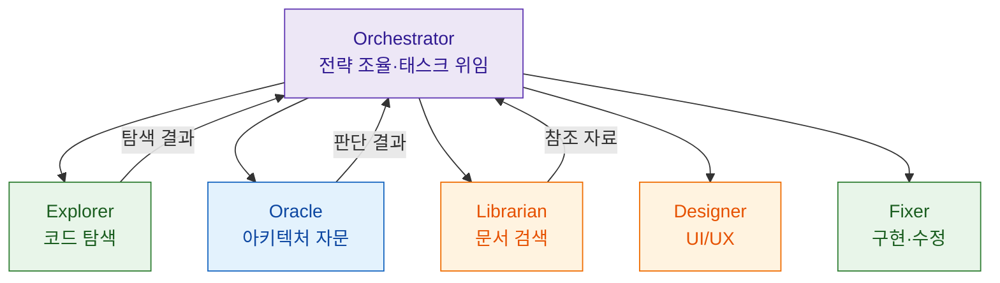
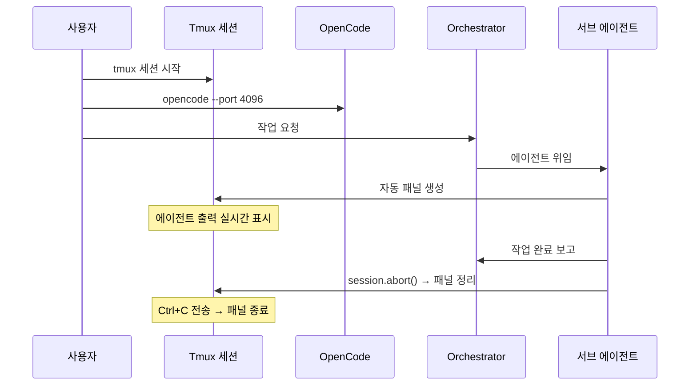
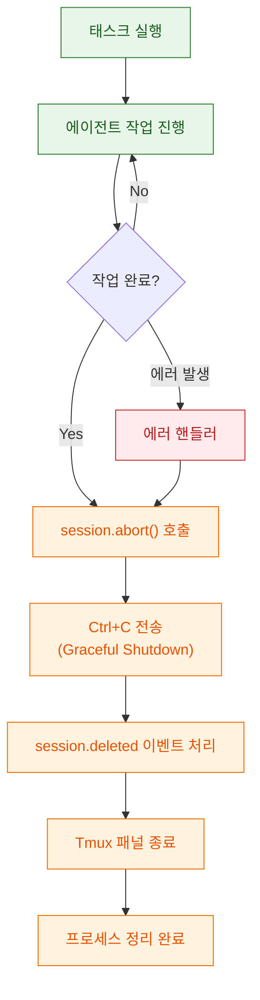

멀티 에이전트 코딩 시스템에서 가장 답답한 순간은 "지금 에이전트가 뭘 하고 있는 건지 모를 때"입니다. oh-my-opencode-slim은 Tmux 통합을 통해 이 문제를 해결합니다. Orchestrator가 서브 에이전트를 실행하면 새로운 Tmux 패널이 자동으로 생성되어 각 에이전트의 작업을 실시간으로 볼 수 있습니다. 더 이상 암흑 속에서 기다릴 필요가 없습니다.

<!--more-->

## Sources

- https://github.com/alvinunreal/oh-my-opencode-slim/blob/master/docs/tmux-integration.md
- https://github.com/alvinunreal/oh-my-opencode-slim

## 1) oh-my-opencode-slim이란: 6개 전문 에이전트의 오케스트레이션

oh-my-opencode-slim은 OpenCode(오픈소스 AI 코딩 에이전트) 위에서 동작하는 멀티 에이전트 오케스트레이션 플러그인입니다. 핵심 아이디어는 단일 LLM에게 모든 작업을 맡기는 대신, **역할별로 특화된 6개 에이전트**가 협업하도록 설계하는 것입니다.

| 에이전트 | 역할 | 추천 모델 |
|----------|------|-----------|
| **Orchestrator** | 전략 조율, 태스크 위임 | kimi-for-coding/k2p5, openai/gpt-5.2-codex |
| **Explorer** | 코드베이스 탐색, 패턴 파악 | cerebras/zai-glm-4.7, google/gemini-3-flash |
| **Oracle** | 아키텍처 자문, 고난도 디버깅 | openai/gpt-5.2-codex, kimi-for-coding/k2p5 |
| **Librarian** | 외부 문서·라이브러리 검색 | google/gemini-3-flash |
| **Designer** | UI/UX 구현 및 시각 최적화 | google/gemini-3-flash |
| **Fixer** | 빠른 구현, 코드 수정 | cerebras/zai-glm-4.7, google/gemini-3-flash |

각 에이전트에 서로 다른 LLM 모델을 할당할 수 있다는 점이 핵심 차별점입니다. 비용이 높은 추론 모델은 Oracle처럼 판단이 중요한 역할에, 속도가 빠른 모델은 Explorer나 Fixer에 배치하면 비용과 속도를 동시에 최적화할 수 있습니다.



이 구조에서 **Tmux 통합이 빛을 발합니다.** Orchestrator가 Explorer에게 코드 탐색을 위임하고, 동시에 Librarian에게 문서 검색을 시키면, 각 에이전트 작업이 별도 Tmux 패널에 실시간으로 표시됩니다. 개발자는 어떤 에이전트가 어떤 작업을 하고 있는지 한눈에 파악할 수 있습니다.

## 2) Tmux 통합 아키텍처: 에이전트 → 패널 자동 스폰 구조

Tmux 통합의 핵심 메커니즘은 단순합니다. Orchestrator가 서브 에이전트나 백그라운드 태스크를 실행하면, 플러그인이 자동으로 새 Tmux 패널을 생성해서 해당 에이전트의 출력을 표시합니다. 작업이 완료되면 패널은 자동으로 정리됩니다.



### 설정 방법

`~/.config/opencode/oh-my-opencode-slim.json` (또는 `.jsonc`) 파일에서 Tmux 통합을 활성화합니다:

```json
{
  "tmux": {
    "enabled": true,
    "layout": "main-vertical",
    "main_pane_size": 60
  }
}
```

| 설정 | 타입 | 기본값 | 설명 |
|------|------|--------|------|
| `enabled` | boolean | `false` | Tmux 패널 자동 생성 활성화 |
| `layout` | string | `"main-vertical"` | 패널 배치 레이아웃 |
| `main_pane_size` | number | `60` | 메인 패널 크기 (%, 20-80) |

### 실행 순서

```bash
# 1. Tmux 세션 시작
tmux

# 2. OpenCode를 포트 지정으로 실행
opencode --port 4096
```

> **⚠️ 임시 워크어라운드**: OpenCode는 반드시 `--port` 플래그와 함께 시작해야 합니다. 포트 번호는 `OPENCODE_PORT` 환경변수와 일치해야 하며(기본값 4096), 이는 업스트림 이슈 [opencode#9099](https://github.com/anomalyco/opencode/issues/9099)가 해결될 때까지 필요합니다.

## 3) 레이아웃 옵션: 화면 구성 전략

화면 크기와 작업 패턴에 따라 5가지 레이아웃을 선택할 수 있습니다:

| 레이아웃 | 배치 방식 | 적합한 상황 |
|----------|-----------|-------------|
| `main-vertical` | 왼쪽 메인(60%) + 오른쪽 에이전트 스택 | 기본 추천, 일반 개발 |
| `main-horizontal` | 위쪽 메인(60%) + 아래쪽 에이전트 스택 | 와이드 스크린 |
| `tiled` | 동일 크기 그리드 | 다수 에이전트 동시 모니터링 |
| `even-horizontal` | 모든 패널 좌우 나란히 | 2-3개 에이전트 비교 |
| `even-vertical` | 모든 패널 상하 나란히 | 좁은 화면, 로그 위주 |

**와이드 스크린 예시:**

```json
{
  "tmux": {
    "enabled": true,
    "layout": "main-horizontal",
    "main_pane_size": 50
  }
}
```

**최대 병렬 모니터링 예시:**

```json
{
  "tmux": {
    "enabled": true,
    "layout": "tiled",
    "main_pane_size": 50
  }
}
```

### Tmux 패널 기본 조작

```bash
Ctrl+B 방향키       # 패널 간 이동
Ctrl+B z            # 패널 확대/축소 (줌)
Ctrl+B %            # 수평 분할
Ctrl+B "            # 수직 분할
Ctrl+B d            # 세션 분리 (백그라운드 유지)
tmux attach         # 세션 재접속
```

## 4) 백그라운드 태스크와 세션 라이프사이클

Tmux 통합은 단순히 패널을 여는 것에서 끝나지 않습니다. 백그라운드 태스크 도구들과 유기적으로 연결되어 완전한 에이전트 모니터링 체계를 구성합니다.

| 도구 | 기능 | Tmux 연동 |
|------|------|-----------|
| `background_task` | 에이전트를 비동기로 실행 | 모니터링용 패널 자동 생성 |
| `background_output` | 태스크 결과 확인 | 패널에 출력 표시 |
| `background_cancel` | 실행 중인 태스크 중지 | 패널 자동 정리 |

### 고스트 패널 문제와 해결

초기 버전에서는 에이전트 작업이 끝나도 Tmux 패널이 남아 있거나 `opencode attach` 프로세스가 누적되는 "고스트 패널" 문제가 있었습니다. 최신 버전에서는 세션 라이프사이클 관리가 개선되어 이 문제가 해결되었습니다:



만약 여전히 고스트 패널이 보인다면:

```bash
# 고아 프로세스 확인
ps aux | grep "opencode attach" | grep -v grep

# 강제 정리
pkill -f "opencode attach"

# 특정 패널 수동 종료
tmux kill-pane -t <pane-id>
```

## 5) 멀티 프로젝트 운영과 고급 활용

### 프로젝트별 세션 분리

서로 다른 포트로 여러 프로젝트를 동시에 관리할 수 있습니다:

```bash
# 프로젝트 1
tmux new -s project1
opencode --port 4096

# 분리 후 프로젝트 2
Ctrl+B d
tmux new -s project2
opencode --port 4097

# 프로젝트 간 전환
tmux switch -t project1
tmux switch -t project2
```

### 자동 시작 스크립트

```bash
#!/bin/bash
# OpenCode + Tmux 자동 시작 스크립트

# 전용 세션 생성
tmux new -d -s opencode

# 세션에서 OpenCode 실행
tmux send-keys -t opencode:0 'opencode --port 4096' Enter

# 대기 후 접속
sleep 2
tmux attach -t opencode
```

### 로그 모니터링 병행

Tmux의 분할 기능을 활용해 로그를 실시간으로 같이 볼 수 있습니다:

```bash
# 수평 분할 후 로그 모니터링
tmux split-window -h
tmux send-keys 'tail -f ~/.config/opencode/logs/opencode.log' Enter

# 메인 패널로 복귀
tmux select-pane -L
```

### 커스텀 Tmux 설정 추천

`~/.tmux.conf`에 추가하면 에이전트 모니터링이 더 편해집니다:

```bash
# 마우스 지원 (패널 클릭 이동)
set -g mouse on

# 256색 지원
set -g default-terminal "screen-256color"

# 상태바에 날짜·호스트 표시
set -g status-right "#H %Y-%m-%d %H:%M"

# Vim 스타일 패널 이동
bind h select-pane -L
bind j select-pane -D
bind k select-pane -U
bind l select-pane -R
```

## 6) 트러블슈팅 가이드

| 증상 | 원인 | 해결 |
|------|------|------|
| 패널이 생성되지 않음 | Tmux 비활성화 또는 Tmux 외부 실행 | `echo $TMUX` 확인, 설정에서 `enabled: true` 확인 |
| 포트 충돌 | 기존 프로세스가 포트 점유 | `pkill -f opencode` 후 재시작, 또는 다른 포트 사용 |
| 에이전트 연결 안 됨 | `--port`와 `OPENCODE_PORT` 불일치 | 두 값을 동일하게 맞춤 (기본 4096) |
| 레이아웃 깨짐 | 터미널 크기 부족 | `main_pane_size` 줄이거나 `tiled` 레이아웃 사용 |
| 고스트 패널 | 구버전 사용 | 최신 버전 업데이트, `pkill -f "opencode attach"` |
| Tmux 설치 안 됨 | 시스템 패키지 없음 | macOS: `brew install tmux`, Ubuntu: `sudo apt install tmux` |

### 포트 충돌 상세 해결

```bash
# 포트 사용 중인 프로세스 확인
netstat -tulpn | grep 4096   # Linux
lsof -i :4096                # macOS

# 다른 포트로 변경
export OPENCODE_PORT=5000
opencode --port 5000
```

## 실전 운영 팁

- **`main-vertical` 레이아웃을 기본으로 시작하세요.** 메인 세션 60%, 에이전트 패널 40%가 가장 범용적입니다.
- **프로젝트별로 Named Session을 사용하세요.** `tmux new -s project-name`으로 세션을 구분하면 컨텍스트 전환이 쉽습니다.
- **`Ctrl+B z`(줌)를 적극 활용하세요.** 특정 에이전트의 출력을 자세히 볼 때 패널을 전체 화면으로 확대했다가 원래 레이아웃으로 돌아올 수 있습니다.
- **작업 안 할 때는 `Ctrl+B d`로 분리하세요.** Tmux 세션은 백그라운드에서 계속 돌아가므로, 나중에 `tmux attach`로 돌아오면 됩니다.
- **로그 모니터링 패널을 하나 추가하세요.** `tail -f`로 OpenCode 로그를 옆에 띄워두면 에이전트 에러를 빠르게 잡을 수 있습니다.
- **고스트 패널이 의심되면 즉시 정리하세요.** `ps aux | grep "opencode attach"`로 확인하고 `pkill -f "opencode attach"`로 정리합니다.

## 마무리

oh-my-opencode-slim의 Tmux 통합은 "AI 에이전트가 무슨 일을 하고 있는가"라는 근본적인 투명성 문제를 해결합니다. 설정 3줄(`enabled`, `layout`, `main_pane_size`)로 활성화하면, 에이전트가 실행될 때마다 자동으로 패널이 생기고, 끝나면 스스로 정리됩니다. 멀티 에이전트 코딩을 도입했는데 에이전트가 뭘 하는지 모르겠다면, Tmux 통합부터 켜보세요.
