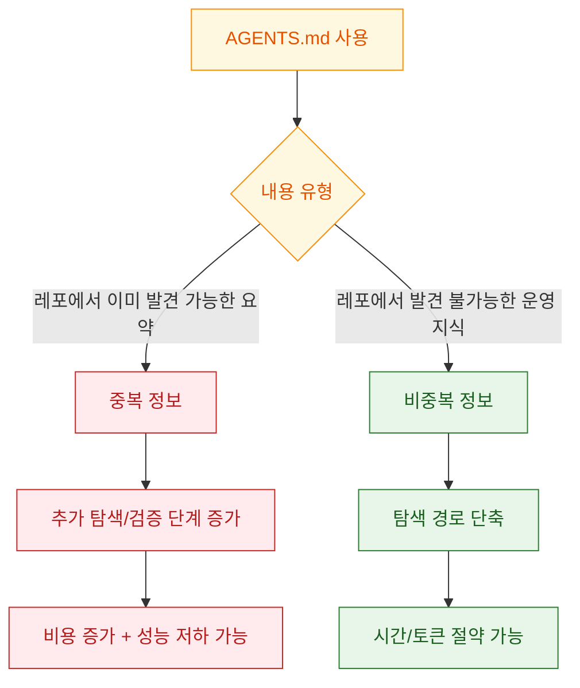
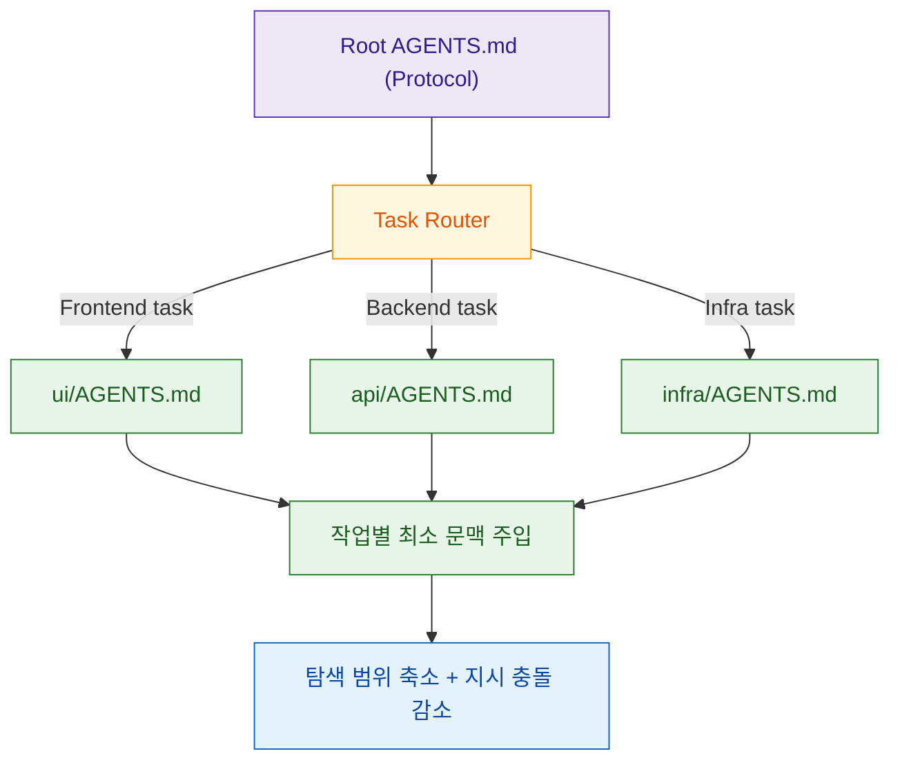

## Intro

에이전트 도입 초기에 많은 팀이 `/init`로 `AGENTS.md`를 만들고 그대로 저장합니다. 겉보기에는 "에이전트 온보딩"처럼 보이지만, Addy Osmani의 2026년 글은 반대로 묻습니다. 정말 도움이 되는 문맥은 무엇이고, 어떤 문맥은 오히려 탐색 비용과 추론 비용만 늘리는가?

이 글은 원문의 핵심 주장과 원문에서 인용한 연구들을 함께 묶어, `AGENTS.md`를 "많이 쓰는 파일"이 아니라 "정밀하게 관리하는 운영 레이어"로 다루는 방법을 정리합니다.

<!--more-->

## Sources

- https://addyosmani.com/blog/agents-md/

## 1) 연구가 말하는 핵심: AGENTS.md 자체보다 "내용의 성격"이 성능을 가른다

원문은 두 연구를 대비해서 보여줍니다. 하나는 `AGENTS.md`가 있을 때 실행 시간과 토큰 소비가 줄었다는 결과를, 다른 하나는 컨텍스트 파일이 성공률을 낮추고 비용을 늘릴 수 있다는 결과를 보고합니다. 겉으로는 모순처럼 보이지만, 원문 해석의 핵심은 단순합니다. "파일이 있느냐"보다 "파일에 무엇을 넣었느냐"가 성능을 결정한다는 점입니다.

원문에서 인용한 수치도 이 해석과 맞아떨어집니다. Lulla et al. (arXiv:2601.20404)은 124개 PR 실험에서 `AGENTS.md`가 있을 때 중앙값 기준 실행 시간 28.64% 감소, 출력 토큰 16.58% 감소를 보고합니다. 반면 ETH Zurich 팀의 연구 (arXiv:2602.11988)는 여러 에이전트 실험에서 컨텍스트 파일이 성공률을 낮추고 비용을 20% 이상 늘릴 수 있다고 보고합니다. 원문은 이 차이를 "자동 생성 컨텍스트의 중복성"으로 설명합니다.

근거 메모:

| claim | evidence | url | confidence |
|---|---|---|---|
| /init 관행이 성능 저하/비용 증가를 만들 수 있음 | "Auto-generated AGENTS.md files hurt agent performance and inflate costs by 20%+" | https://addyosmani.com/blog/agents-md/ | High |
| AGENTS.md가 효율 개선을 보인 연구도 존재 | "reduced median runtime (28.64%) and output token consumption (16.58%)" 요약 인용 | https://arxiv.org/abs/2601.20404 | High |
| 컨텍스트 파일이 성공률 저하 + 비용 증가를 보인 연구도 존재 | "reduce task success rates ... increasing inference cost by over 20%" 초록 인용 | https://arxiv.org/abs/2602.11988 | High |

## 2) 왜 /init 출력이 자주 문제를 만들까: "발견 가능한 정보의 재주입"

원문이 `/init`를 비판하는 이유는 간단합니다. 자동 생성 파일의 대부분이 디렉터리 구조, 기술 스택, 모듈 개요처럼 에이전트가 이미 코드 탐색으로 얻을 수 있는 정보이기 때문입니다. 즉, 에이전트는 "문서를 읽고" 다시 "코드를 확인"하면서 두 소스를 정합시키는 추가 추론을 수행하게 됩니다.

원문은 여기에 "앵커링 효과"를 추가로 지적합니다. 예를 들어 AGENTS.md에 과거 기술(레거시 패턴)이 명시되어 있으면, 현재 작업과 무관해도 모델은 해당 패턴을 우선 고려할 수 있습니다. 결과적으로 "지금 맞는 패턴"보다 "문맥에 먼저 들어온 패턴"이 선택될 위험이 커집니다.

실무에서 바로 적용 가능한 필터는 하나입니다. "이 문장은 에이전트가 코드/README를 읽으면 스스로 알 수 있는가?" 알 수 있다면 삭제합니다. 남겨야 하는 정보는 `uv` 사용 강제, 캐시 옵션 주의, 특정 모듈의 비표준 규칙처럼 "추론으로 복구하기 어려운 운영 사실"이어야 합니다.

근거 메모:

| claim | evidence | url | confidence |
|---|---|---|---|
| /init 산출물은 코드베이스 개요 중심으로 중복될 가능성이 큼 | 원문에서 "codebase overviews... precisely the things an agent can discover" 설명 | https://addyosmani.com/blog/agents-md/ | High |
| 비발견성(non-discoverable) 기준이 핵심 | 원문의 `uv vs pip` 예시와 "can the agent discover this on its own?" 필터 | https://addyosmani.com/blog/agents-md/ | High |
| 컨텍스트 길이 증가가 주의력 희석을 유발할 수 있음 | 원문의 "Lost in the Middle" 및 장문 컨텍스트 성능 저하 논의 | https://addyosmani.com/blog/agents-md/ | Medium |

## 3) 대안 아키텍처: 단일 루트 파일이 아니라 "라우팅 + 계층형 문맥"

원문이 제안하는 방향은 "AGENTS.md 폐기"가 아니라 "역할 재정의"입니다. 루트 파일은 전역 프로토콜(에이전트 라우팅, 필수 금지사항, 필수 도구 규칙)만 담고, 실제 도메인 지식은 작업 유형에 따라 선택 로드되는 하위 파일로 분리해야 한다는 것입니다.

또 하나 중요한 제안은 "유지보수 담당 에이전트"입니다. 정적 문서는 반드시 부패하므로, 실제 코드베이스 변화에 맞춰 프로토콜 파일을 지속적으로 줄이고 교정하는 자동화 루프가 필요합니다. Addy 글이 강조하듯, AGENTS.md는 영구 설정 파일이 아니라 "아직 코드로 해결하지 못한 마찰 목록"에 가깝게 다뤄야 합니다.

원문이 함께 소개한 ACE 연구 (arXiv:2510.04618)는 이런 방향과 맞닿아 있습니다. 정적 문맥보다 진화하는 문맥 관리(생성-반성-큐레이션)가 장기적으로 더 유리할 수 있다는 실험적 근거를 제시합니다.

근거 메모:

| claim | evidence | url | confidence |
|---|---|---|---|
| 단일 루트 파일보다 계층형/선택 로드가 적합 | 원문의 "single AGENTS.md at root isn’t sufficient" 및 3-layer 제안 | https://addyosmani.com/blog/agents-md/ | High |
| 정적 파일은 작업 유형을 구분하지 못해 비효율이 발생 | 원문의 "static file problem" 사례 (문서 변경에도 전체 테스트 실행) | https://addyosmani.com/blog/agents-md/ | High |
| 진화형 문맥 관리 프레임워크가 유의미한 성능 향상 가능 | ACE 초록의 strong baseline 대비 개선 보고 | https://arxiv.org/abs/2510.04618 | Medium |

## Practical Takeaways

- `/init` 결과를 그대로 커밋하지 말고, "발견 불가능 정보"만 남기는 삭제 중심 리뷰를 먼저 수행합니다.
- 루트 `AGENTS.md`는 전역 프로토콜만 유지하고, 도메인별 지침은 하위 디렉터리/스킬 파일로 분리합니다.
- 문장 추가 기준을 "문서 친화성"이 아니라 "실행 영향성"으로 바꿉니다 (명령, 플래그, 금지 경로, 레거시 랜드마크).
- 에이전트가 같은 실수를 반복하면 문서부터 늘리지 말고 코드 구조/테스트/린트 규칙을 먼저 개선합니다.
- 분기별로 컨텍스트 파일을 감량 점검하고, 오래된 규칙을 자동 검출하는 유지보수 루프를 둡니다.

## Conclusion

핵심은 "AGENTS.md를 쓰느냐"가 아니라 "어떤 정보만 남기느냐"입니다. 에이전트는 코드 탐색 능력이 이미 강하기 때문에, 레포에서 재발견 가능한 설명을 반복 주입할수록 오히려 비용과 혼선을 키울 수 있습니다. 앞으로의 운영 방식은 넓은 온보딩 문서가 아니라, 작업 순간에 정확히 라우팅되는 얇고 살아있는 컨텍스트 레이어에 더 가깝습니다.
