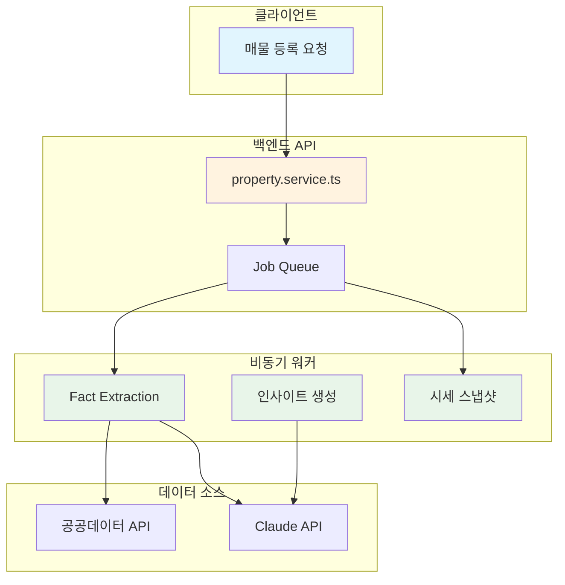
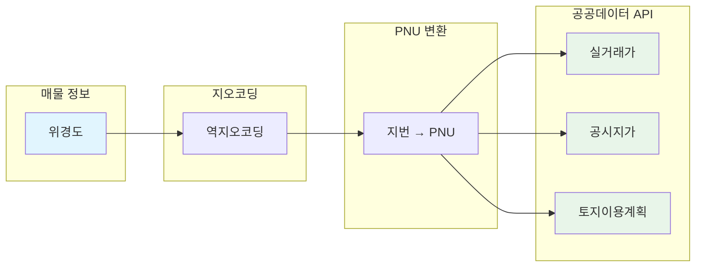
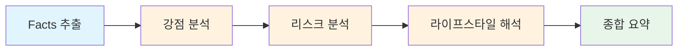
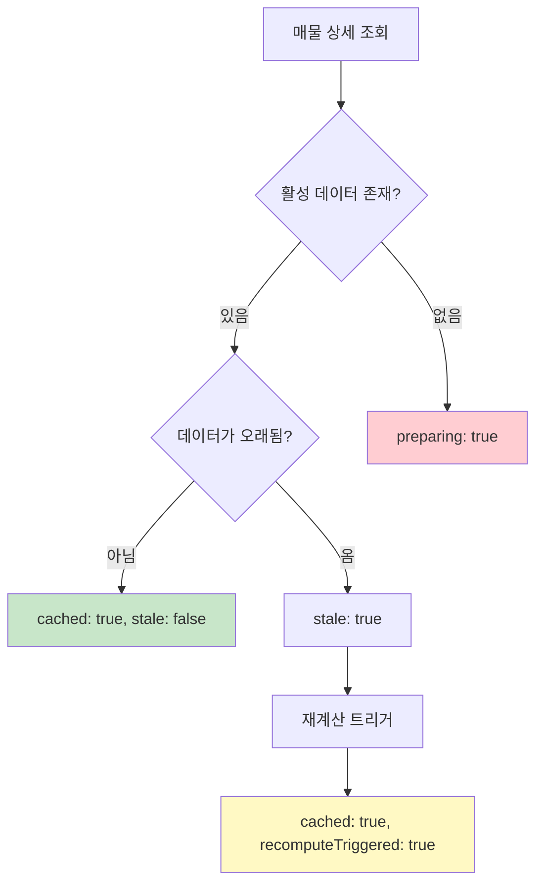
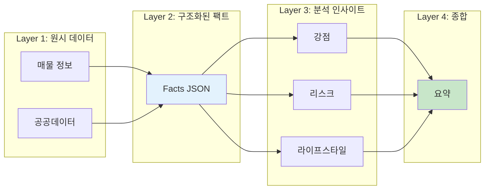

촌집은 지방 촌집 매물을 다루는 플랫폼이다. 매물이 등록되면 공공데이터를 수집하고 Claude API로 분석해서 인사이트를 자동으로 생성한다. 이 글에서는 그 파이프라인이 어떻게 작동하는지 살펴본다.

<!--more-->

## Sources

- [촌집 AI Insight, 매물 등록 시 분석이 만들어지기까지](https://www.shindongri.dev/blog/260223)

---

## 촌집 프로젝트의 탄생 배경

저자는 지방 여행을 좋아하고 가족과 귀촌해서 사는 삶을 꿈꾸고 있다. 돌아다니면서 느낀 건 매매·임대 문의가 곳곳에 많지만, 이를 모아서 보여주는 플랫폼이 부족하다는 것이다. 기존 서비스는 올드한 디자인에 등록 비용이 비싸거나, 직방·다방처럼 수도권 아파트 위주다.

그래서 **촌집**을 만들게 되었다. 지방 촌집 매물을 다루는 플랫폼이며, 더 나아가 촌라이프 스타일의 공유까지 목표로 한다.

프로젝트를 진행하면서 하나의 중요한 인사이트를 얻었다. **지방 매물은 '검색'보다 '해석'이 더 중요하다**는 것이다.

---

## 도시와 지방의 매물 분석 차이

도시 아파트는 비교 기준이 명확하다. 평당가, 학군, 교통, 브랜드, 시세 차트 등 표준화된 지표가 있다. 하지만 시골 매물은 다르다. 집을 보러 갈 때 이런 질문들이 나온다.

- 이 가격이 적당한 건가?
- 건축이 가능한 땅인가?
- 농사는 지을 수 있나?
- 법적으로 뭔가 걸리는 건 없나?
- 주변에서 실제로 거래가 이루어지고 있나?

이러한 질문들은 매물 설명 텍스트만 읽어서는 답이 나오지 않는다. 공공데이터도 보고, 법적 제한도 확인하고, 주변 시세도 비교해야 한다. 이 부분을 AI로 자동화한 것이 촌집 AI Insight다.

---

## 전체 아키텍처 개요

촌집의 백엔드는 크게 두 영역으로 나뉜다.

**기본 기능 (일반적인 CRUD)**
- 매물 등록/수정/삭제
- 인증
- 결제
- 검색, 필터링

**AI 분석 (비동기 처리)**
- 팩트 추출
- 강점 분석
- 리스크 분석
- 라이프스타일 해석
- 종합 요약
- 시세 스냅샷

AI 분석은 매물 등록의 핵심 흐름에 영향을 주지 않도록 별도의 비동기 워커에서 처리된다.



---

## Step 1: 매물 등록과 Job 발행

매물을 DB에 저장하고 AI 분석 Job을 큐에 넣는다. `property.service.ts`의 `create()` 메서드가 매물을 저장한 뒤 fire-and-forget 방식으로 세 가지 비동기 작업을 큐에 넣는다.

```typescript
// AI insight 사전 계산 (비동기, 실패해도 매물 등록에 영향 없음)
this.insightJobService
  ?.enqueueFullPropertyInsight(savedProperty.id, "created")
  .catch((error) => {
    this.logger.error("Failed to enqueue insight jobs", error);
  });

// Market snapshot 사전 계산 (비동기)
this.insightJobService
  ?.enqueueMarketSnapshot(savedProperty.id, "created")
  .catch((error) => {
    this.logger.error("Failed to enqueue market snapshot", error);
  });
```

`enqueueFullPropertyInsight`는 내부적으로 두 개의 Job을 큐에 넣는다.

```typescript
async enqueueFullPropertyInsight(
  propertyId: number,
  reason: InsightJobReason,
): Promise<void> {
  await this.enqueuePropertyFactExtract(propertyId, reason);
  await this.enqueuePropertyInsightGenerate(propertyId, reason);
}
```

**핵심 설계 포인트:**
- 비동기이므로 매물 등록 API는 Job 결과를 기다리지 않고 바로 200 OK 반환
- AI 분석이 실패해도 매물 등록 자체에는 영향 없음
- Worker는 최대 3개 Job을 동시에 처리
- 실패 시 10초 간격으로 최대 3번 재시도
- 같은 매물이 30분 안에 다시 들어오면 중복 생성 방지

---

## Step 2: 팩트 추출 (Fact Extraction)

`PropertyInsightProcessor`가 `PROPERTY_FACT_EXTRACT` Job을 처리한다. 공공데이터 3종을 수집하고 Claude로 매물 정보를 구조화한다.

### 2-1. 중복 호출 방지

Claude API를 부르기 전에 두 가지를 확인한다.

- 같은 프롬프트로 이미 만들어진 데이터가 있으면 스킵
- 30분 이내에 생성된 데이터가 있으면 스킵 (쿨다운)

여기서 **promptHash** 개념이 등장한다. 프롬프트 템플릿 원본의 SHA-256 해시로, 프롬프트가 바뀌었는지 检测한다.

### 2-2. Property Context 구성

매물 정보를 Claude에 넘기기 좋은 텍스트 형태로 변환한다. 매물 유형, 거래 유형, 위치, 토지 면적, 가격, 건물면적, 건축년도, 방 수, 난방, 접근성, 지목, 설명 등이 포함된다.

### 2-3. 공공데이터 3종 병렬 수집

`PublicDataService`를 통해 정부 API 3종을 동시에 호출한다.

| 데이터 소스 | API | 가져오는 정보 | 캐시 TTL |
|------------|-----|---------------|----------|
| data.go.kr | 국토교통부 주택/토지 거래 API | 거래 건수, 평균가, 평당가, 가격 범위 | 24시간 |
| V-World | 개별공시지가 API | 공시지가(원/㎡), 전년 대비 변동률 | 24시간 |
| V-World | 토지이용계획 API | 용도지역, 건폐율, 용적률, 건축/농사 가능 여부 | 24시간 |

**데이터 수집 로직:**



각 데이터의 용도:
- **실거래가** — 주변에서 실제로 얼마에 거래됐는지 판단
- **개별공시지가** — 국가가 매긴 기준 가격, 프리미엄 가늠
- **토지이용계획** — 건축 가능 여부 법적 확인

공공데이터 없이 텍스트만 넣으면 할루시네이션 확률이 높다.

### 2-4. Claude API 호출 — 팩트 추출

수집한 데이터를 `extractFacts` 프롬프트에 넣어서 Claude를 호출한다.

```typescript
const response = await this.anthropic.messages.create({
  model: this.model,
  max_tokens: 4096,
  system: `${system}\n\nIMPORTANT: You MUST respond with ONLY valid JSON.`,
  messages: [{ role: "user", content: userMessage }],
  temperature: 0.3,
});
```

**설계 결정 사항:**

1. **temperature: 0.3** — 매물 분석은 같은 매물을 넣으면 거의 같은 결과가 나와야 하므로 변동성을 낮춤
2. **SYSTEM/USER 분리** — Anthropic API 권장 방식 적용
3. **응답 후처리** — Claude가 마크다운 코드블록으로 감싸도 3단계 폴백으로 JSON 추출

```typescript
private extractJson(raw: string): string {
  // 1. 마크다운 코드블록에서 추출 시도
  const codeBlockMatch = raw.match(/```(?:json)?\s*\n?([\s\S]*?)\n?```/);
  if (codeBlockMatch) return codeBlockMatch[1].trim();

  // 2. JSON 객체/배열 패턴 찾기
  const jsonMatch = raw.match(/(\{[\s\S]*\}|\[[\s\S]*\])/);
  if (jsonMatch) return jsonMatch[1].trim();

  // 3. 그대로 반환
  return raw.trim();
}
```

추출 결과는 13개 카테고리로 분류된다: location, price, sizes, property_type, access, utilities, surroundings, market_context, official_land_price, land_use, notable_features, evidence, uncertainties

### 2-5. 저장

- 기존 활성 row를 `isActive: false`로 비활성화
- 새 row 삽입 (factsJson JSONB + rawLlmResponse 원본 보관)
- 캐시에 저장 (30분 TTL)

---

## Step 3: 인사이트 4종 순차 생성

팩트를 바탕으로 강점/리스크/라이프스타일/요약 4종을 순서대로 만든다.



**왜 순차 실행인가?**

Summary가 앞선 3개 분석 결과를 입력으로 받기 때문이다. 실제 코드:

```typescript
const generatedInsights: Record<string, Record<string, any>> = {};

for (const { insightType, promptKey } of types) {
  const context: Record<string, string> = {
    ...baseContext,
    property_facts_json: factsJson,
  };

  // Summary 프롬프트에는 앞의 3개 결과 주입
  if (insightType === "summary") {
    context.strengths_bullets = JSON.stringify(
      generatedInsights.strengthsAnalysis ?? {},
    );
    context.lifestyle_json = JSON.stringify(
      generatedInsights.lifestyleInterpretation ?? {},
    );
    context.risks_json = JSON.stringify(
      generatedInsights.riskAnalysis ?? {},
    );
  }

  const result = await this.aiInsightService.getOrGeneratePropertyInsight(
    propertyId,
    insightType,
    promptKey,
    context,
  );

  if (result.resultJson) {
    generatedInsights[insightType] = result.resultJson;
  }
}
```

**순차 실행의 장점:**

- 강점 분석만 바뀌면 Summary만 다시 만들면 된다 (부분 재계산)
- Strengths, Risk, Lifestyle는 독립적이므로 나중에 병렬화 가능
- 안 바뀐 부분은 캐시 그대로 사용

---

## Step 4: 시세 스냅샷 (Market Snapshot)

인사이트 생성과 별개로 동시에 돌아가는 Job이다. `MarketSnapshotProcessor`가 처리하고 다음 정보를 저장한다.

| 필드 | 설명 |
|------|------|
| spi | Spatial Price Index (공간 가격 지수) |
| volatilityIndex | 가격 변동성 지수 |
| changeRate3y | 3년간 가격 변화율 |
| transactionCount | 주변 거래 건수 |
| trendData | 월별 가격·거래량 추이 (JSONB) |
| aiSummary | AI가 만든 시세 요약 |
| aiRiskInsight | AI가 만든 시세 리스크 |
| aiOpportunityInsight | AI가 만든 기회 요인 |

---

## Step 5: 데이터 조회와 Staleness 관리

사용자가 매물 상세를 보면 GraphQL 쿼리가 `aiInsight` 필드를 요청한다. `AgentRouterService`가 처리하는 흐름:



**플래그 조합으로 UI 분기:**

| 플래그 | 의미 |
|--------|------|
| cached: true | DB에서 기존 데이터를 가져옴 |
| stale: true | 데이터가 있긴 한데 오래돼서 갱신 중 |
| recomputeTriggered: true | 백그라운드에서 새 분석 시작 |
| preparing: true | 아직 분석 데이터가 없음 |

이 패턴은 **Staleness-While-Revalidate**다. 오래된 데이터라도 일단 보여주고 백그라운드에서 갱신한다.

---

## 프롬프트 관리: promptHash 기반 캐시 무효화

프롬프트 파일을 수정하면 기존 인사이트가 자동으로 다시 만들어지는 구조다. 핵심은 **promptHash**다.

```typescript
export function getPromptHash(key: PromptKey): string {
  const template = getPromptTemplate(key);
  const hash = createHash("sha256").update(template).digest("hex");
  return hash;
}
```

**왜 변수 치환 전 원본 기준인가?**

- 프롬프트 문구를 수정하면 → 해시 바뀜 → 기존 인사이트 모두 stale → 자동 재생성
- 같은 프롬프트 + 다른 매물 데이터 → 해시 같음 → DB에서 캐시 조회

**프롬프트별 토큰 예산 최적화:**

```typescript
const PROMPT_MAX_TOKENS = {
  "property/extractFacts": 4096,      // 12개 카테고리 구조화
  "property/strengthsAnalysis": 4096, // 근거 기반 상세 분석
  "property/riskAnalysis": 4096,      // risk + unknown 분리
  "property/lifestyleInterpretation": 2048, // 서술형
  "property/summary": 1024,            // 간결한 요약
};
```

Claude API 비용은 출력 토큰에 비례하므로, 응답 길이에 따라 예산을 달리 설정한다.

---

## 전체 타임라인

| 단계 | 소요 시간 |
|------|----------|
| 매물 등록 API 응답 | ~0.1초 |
| Fact Extraction (Claude 1회) | 3-5초 |
| 인사이트 4종 (Claude 4회) | 12-20초 |
| 시세 스냅샷 | 병렬 실행 |
| **전체 파이프라인** | **약 25-30초** |

**실패 처리:**
- Worker가 10초 후 재시도, 3번 다 실패하면 포기
- 사용자가 매물 상세에 다시 들어오면 preparing: true로 다시 트리거
- 일시적인 API 장애는 자연스럽게 복구

---

## 실전 분석 예시: 경기도 양평 토지 매물

**입력:**
- 매물 유형: 토지, 거래 유형: 매매
- 위치: 경기도 양평군 서종면
- 토지 면적: 661㎡, 가격: 9,900만원
- 지목: 전

**Claude 분석 결과 — 강점:**
```json
{
  "items": [{
    "title": "주변 시세 대비 저렴한 평당가",
    "description": "이 매물의 평당가는 약 49만원으로, 서종면 최근 6개월 토지 평균 평당가 73만원 대비 약 33% 저렴합니다.",
    "evidence": [
      "매물 평당가: 9,900만원 ÷ 200평 ≈ 49만원/평",
      "공공데이터 평균: 73만원/평 (최근 5건)"
    ]
  }]
}
```

**Claude 분석 결과 — 리스크:**
```json
{
  "risks": [{
    "title": "거래 유동성 낮음",
    "why": "최근 6개월간 서종면 토지 거래가 5건에 불과합니다.",
    "severity": "medium"
  }],
  "unknowns": [{
    "question": "진입 도로의 폭과 포장 상태는?",
    "why_it_matters": "건축 허가 시 도로 폭 4m 이상이 필요합니다."
  }]
}
```

핵심: "주변 평균 대비 33% 저렴" 같은 구체적 수치는 공공데이터가 있었기 때문에 가능하다.

---

## 만들면서 배운 것들 — 컨텍스트 프롬프팅

이 프로젝트에서 가장 크게 배운 것은 **컨텍스트 프롬프팅(Contextual Prompting)**의 중요성이다.

프롬프트 문구를 다듬는 것보다 AI한테 넘기는 **맥락 데이터**를 잘 구성하는 게 결과 품질에 훨씬 큰 영향을 준다.

| 컨텍스트 추가 | 분석 결과 변화 |
|-------------|---------------|
| 주변 실거래가 3건 + 공시지가 | "주변 평균 대비 20% 저렴" — 근거 있는 문장 |
| 토지이용계획 추가 | "농림지역이라 증축 제한" — 실질적 리스크 |

**DAG 구조도 컨텍스트 쌓기다:**



앞 단계 결과가 뒷 단계의 입력이 되니까 분석이 점점 구체적으로 된다. 처음부터 모든 걸 한 번에 분석하라고 했을 때보다 단계별로コンテキストを渡す 게 결과가 훨씬 좋았다.

**temperature 0.3**도 같은 맥락이다. 컨텍스트를 충분히 줬으면 Claude가 창작할 필요가 없다. 데이터에 기반해서 정리만 하면 된다. 창의성을 낮추니까 오히려 할루시네이션이 줄고 일관된 분석이 나왔다.

---

## Practical Takeaways

1. **공공데이터 확보가 핵심** — 텍스트만으로는 할루시네이션 확률이 높다. 실제 수치가 있어야 "주변 대비 N% 저렴" 같은 근거 있는 분석이 가능하다.

2. **비동기 워커로 분리** — AI 분석은 핵심业务流程에 영향을 주지 않도록 별도 워커에서 처리한다. 실패해도 매물 등록 자체는 성공한다.

3. **순차 DAG 구조의 장점** — Summary가 앞선 3개 결과를 받으므로 의존 관계를 고려한 순서가 필요하다. 강점만 바뀌면 Summary만 재계산하면 된다.

4. **프롬프트 버저닝** — promptHash로 프롬프트 변경을 감지하고 자동 재계산 트리거. 캐시 무효화를 자동으로 처리한다.

5. **토큰 예산 최적화** — 응답 길이에 따라 max_tokens를 달리 설정하여 불필요한 비용을 절감한다.

6. **Staleness-While-Revalidate** — 오래된 데이터라도 일단 보여주고 백그라운드에서 갱신. 사용자는 빈 화면을 보지 않는다.

7. **컨텍스트 프롬프팅** — 프롬프트보다 맥락 데이터 구성이更重要. 단계별로 쌓아가는 DAG 구조가 분석 품질을 높인다.

---

## Conclusion

촌집 AI Insight는 매물 등록 시 공공데이터 3종(실거래가, 공시지가, 토지이용계획)을 수집하고, Claude API로 강점·리스크·라이프스타일·요약 4종의 인사이트를 자동 생성한다.

핵심 아키텍처는:
- **비동기 워커** — 매물 등록流程에 영향 없음
- **DAG 구조** — 단계별로 컨텍스트 쌓기
- **promptHash 캐시** — 프롬프트 변경 시 자동 재계산
- **Staleness-While-Revalidate** — 사용자 경험 최적화

프로젝트를 통해 배운 가장 중요한 교훈은 **컨텍스트 프롬프팅**이다. AI한테 판단에 필요한 재료를 빠짐없이 넘기는 것이 핵심이다.

저자는 촌집 앱 출시를 앞두고 있으며, 지방 촌집에 관심 있다면 한 번 방문해보길 권장한다.
