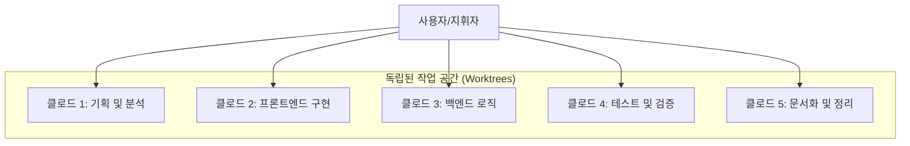

# 클로드 코드(Claude Code) 200% 활용법: 앤스트로픽 총책임자 보리스의 팁과 실전 가이드

최근 개발자들 사이에서 가장 뜨거운 도구 중 하나인 클로드 코드(Claude Code), 어떻게 사용하고 계신가요? 단순히 질문하고 답변을 복사해서 붙여넣는 방식으로만 사용하고 있다면, 여러분은 클로드 코드의 잠재력을 10%도 채 쓰지 못하고 있는 것일지도 모릅니다.

앤스트로픽(Anthropic)에서 클로드 코드를 직접 만든 총책임자, 보리스(Boris Cherny)가 공개한 '진짜' 사용법은 가히 충격적입니다. 그는 클로드 코드를 단순한 도구가 아니라, 마치 오케스트라를 지휘하듯 다룹니다. 오늘은 보리스의 핵심 팁과 더불어, 실전에서 바로 적용할 수 있는 고급 활용 전략을 정리해 드립니다.

<!--more-->

## Sources
- [클로드코드 직접 만든 사람이 공개한 사용법, 저도 충격받았습니다](https://www.youtube.com/watch?v=2WJzwwvzbBQ)

---

## 1. 오케스트라 지휘하기: 멀티 인스턴스와 알림 최적화

보리스의 작업 방식 중 가장 눈에 띄는 점은 클로드 코드를 하나만 쓰지 않는다는 것입니다. 그는 동시에 **5개 이상의 클로드 코드 인스턴스**를 띄워놓고 작업합니다.

### 멀티태스킹의 구조화
단순히 창을 여러 개 여는 것이 아니라, 각 창마다 독립된 작업 공간(Git Worktree 등)을 할당하여 서로 간섭 없이 작업하게 합니다. 예를 들어 한 명의 클로드에게는 기획서 작성을, 다른 한 명에게는 디자인 구현을, 또 다른 한 명에게는 코드 정리를 시키는 식입니다.

### 알림 설정으로 흐름 유지
여러 개의 클로드를 동시에 돌릴 때 가장 큰 문제는 "어떤 클로드가 일을 마쳤는지" 파악하는 것입니다. 보리스는 클로드가 다음 지시를 기다리는 상태가 되면 알림이 오도록 설정합니다. 이를 통해 사용자는 화면을 계속 주시할 필요 없이, 알림이 올 때마다 해당 창으로 가서 다음 지시를 내리는 '오케스트라 지휘자' 역할을 수행할 수 있습니다. [https://youtu.be/2WJzwwvzbBQ?t=120](https://youtu.be/2WJzwwvzbBQ?t=120)

---

## 2. 실행보다 중요한 계획: 플랜 모드(Plan Mode)와 SDD

보리스가 가장 강조하는 것 중 하나는 **"계획에 에너지를 쏟아라"**는 것입니다. 대부분의 사용자는 "이거 만들어 줘"라고 바로 명령하지만, 보리스는 80%의 작업을 **플랜 모드**에서 시작합니다.

### 플랜 모드의 마법
플랜 모드에서 클로드는 실제 코드를 수정하지 않고 전체 상황을 분석하여 최적의 설계도를 먼저 짭니다. 집을 짓기 전에 설계도를 그리는 것과 같습니다. 계획이 완벽하면 실제 구현은 한 번에 끝날 확률이 비약적으로 높아집니다. [https://youtu.be/2WJzwwvzbBQ?t=210](https://youtu.be/2WJzwwvzbBQ?t=210)

### 스펙 중심 개발 (SDD, Spec Driven Development)
코드 짜기 전에 무엇을 만들지, 어떻게 동작할지를 문서로 먼저 정리하는 SDD 방식은 클로드의 방향성을 명확히 잡아줍니다. 명확한 스펙이 있으면 클로드가 엉뚱한 곳을 건드리는 실수를 획기적으로 줄일 수 있습니다.

---

## 3. 품질을 3배 높이는 자가 검증(Self-Verification)

보리스가 꼽은 가장 중요한 팁은 **"클로드에게 스스로 확인할 수 있는 방법을 주라"**는 것입니다. 확인 방법이 주어지면 결과물의 품질이 2~3배 향상된다고 그는 단언합니다. [https://youtu.be/2WJzwwvzbBQ?t=300](https://youtu.be/2WJzwwvzbBQ?t=300)

### 피드백 루프 형성
요리사가 맛을 보지 않고 요리를 완성할 수 없듯이, 클로드도 자신의 작업이 맞는지 확인할 수 있어야 합니다.
- **간단한 작업**: 결과를 직접 실행해 보게 함.
- **복잡한 UI**: 브라우저를 직접 켜서 화면이 제대로 나오는지 확인하게 함.
- **로직 검증**: 테스트 코드를 실행하여 통과 여부를 확인하게 함.

### 똑똑한 모델의 경제학
보리스는 항상 가장 똑똑한 모델(Opus 등)을 최대 성능으로 사용합니다. 느리고 비싸 보일 수 있지만, 한 번에 제대로 된 결과물을 내놓기 때문에 여러 번 수정해야 하는 가벼운 모델보다 결과적으로는 더 빠르고 효율적입니다. [https://youtu.be/2WJzwwvzbBQ?t=360](https://youtu.be/2WJzwwvzbBQ?t=360)

---

## 4. 복리 학습과 컨텍스트 관리: CLAUDE.md 활용

클로드 코드가 시간이 지날수록 나에게 더 잘 맞춰지게 만드는 비결은 **'복리 학습'**에 있습니다.

### CLAUDE.md: 클로드 전용 매뉴얼
프로젝트 폴더에 `CLAUDE.md` 파일을 만들고, 여기에 팀의 작업 규칙, 방향, 그리고 **클로드가 반복해서 틀리는 실수 목록**을 기록하세요. 클로드가 실수했을 때 단순히 다시 시키는 것이 아니라, "이 실수를 메모장에 기록하고 다음부터는 반복하지 마"라고 지시하는 것이 핵심입니다. [https://youtu.be/2WJzwwvzbBQ?t=420](https://youtu.be/2WJzwwvzbBQ?t=420)

### 세션 간 맥락 유지
클로드 코드는 세션을 새로 시작하면 이전 대화를 잊어버립니다. 이를 방지하기 위해 중요한 진행 상황이나 요약 내용을 별도 파일로 저장해 두세요. 새 세션을 시작할 때 이 파일을 읽어주면 클로드는 즉시 이전 맥락을 파악하고 작업을 이어갈 수 있습니다.

---

## 실전 적용을 위한 Practical Takeaways

오늘 당장 클로드 코드 사용법을 바꾸고 싶다면, 다음 세 가지만 기억하세요.

1.  **플랜 모드 습관화**: 명령을 내리기 전 `/plan`을 통해 클로드와 함께 설계도를 먼저 그리세요.
2.  **자가 검증 지시**: "작업 완료 후 반드시 브라우저에서 결과를 확인하고 오류가 있으면 스스로 수정해"라는 지시를 추가하세요.
3.  **CLAUDE.md 업데이트**: 클로드의 실수를 기록하여 나만의 맞춤형 AI 사수로 성장시키세요.

## 결론

클로드 코드는 단순한 코드 생성기가 아니라, 여러분의 지시를 기다리는 유능한 엔지니어 군단입니다. 보리스의 팁처럼 그들을 오케스트라처럼 지휘하고, 명확한 계획과 검증 수단을 제공한다면 여러분의 생산성은 이전과는 비교할 수 없을 정도로 도약할 것입니다. 도구의 성능보다 중요한 것은, 그 도구를 다루는 여러분의 '지휘 능력'입니다.
