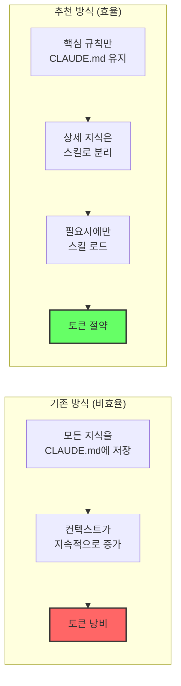
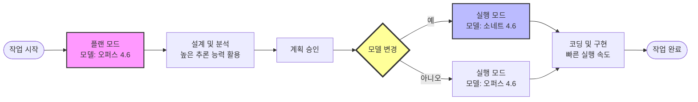
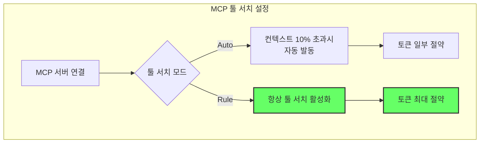
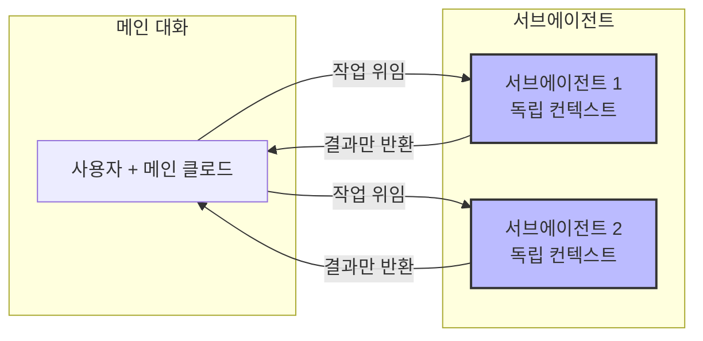

# 클로드 코드 토큰 녹는 분들, 이 6가지만 바꾸세요

클로드 코드(Claude Code)를 사용하면서 "토큰이 너무 빨리 녹는다", "오퍼스를 썼는데 2일 만에 주어진 토큰의 80%가 다 소진됐다"라는 고민을 하고 계신가요? [https://youtu.be/gLZ1wJUADqk?t=0](https://youtu.be/gLZ1wJUADqk?t=0)

컨텍스트를 제대로 관리하지 않으면 토큰이 낭비되고, 환각이 발생하고, 품질이 저하되면서 다시 수정 작업을 하고 토큰을 재소진하는 악순환이 반복됩니다. [https://youtu.be/gLZ1wJUADqk?t=30](https://youtu.be/gLZ1wJUADqk?t=30)

오늘은 짐코딩 님이 공개한 클로드 코드 토큰 절약 6가지 팁을 정리해 드립니다.

<!--more-->

## Sources
- [클로드 코드 토큰 녹는 분들, 이 6가지만 바꾸세요 - 짐코딩](https://www.youtube.com/watch?v=gLZ1wJUADqk)

---

## 1. 컨텍스트 요약 설정: CLAUDE.md가 먼저 읽히게 하기

클로드 코드는 대화 내용에서 무엇을 남기고 무엇을 버릴지 스스로 판단합니다. 하지만 중요한 내용은 반드시 요약 내용을 명시적으로 입력해 주어야 합니다. [https://youtu.be/gLZ1wJUADqk?t=60](https://youtu.be/gLZ1wJUADqk?t=60)

### 핵심 규칙만 남기고 가끔 쓰는 상세 지식은 스킬로 빼기

중요한 것은 어떤 도구를 쓰느냐가 아니라, 내가 원하는 결과물을 만들어내는 것입니다. 자주 사용하지 않는 상세 지식은 스킬(Skill)로 분리해서 필요할 때만 로드하는 방식이 효율적입니다. [https://youtu.be/gLZ1wJUADqk?t=90](https://youtu.be/gLZ1wJUADqk?t=90)

---

## 2. 모델 전환 타이밍: 설계는 오퍼스, 코딩은 소네트

"설계는 오퍼스로 하고 코딩은 소네트로 하고 싶은데, 계획 승인을 누르면 바로 실행으로 넘어가서 모델 바꾸는 걸 자꾸 놓친다"는 문제를 겪는 분들이 많습니다. [https://youtu.be/gLZ1wJUADqk?t=120](https://youtu.be/gLZ1wJUADqk?t=120)

### 이미 있는 기능을 활용하세요

이 기능은 이미 클로드 코드에 구현되어 있습니다. 플랜 모드에서 계획을 승인한 후, 실행 모드로 넘어갈 때 모델을 변경할 수 있는 옵션이 제공됩니다. 이를 통해 설계 단계에서는 오퍼스의 높은 추론 능력을, 구현 단계에서는 소네트의 빠른 실행 속도를 활용할 수 있습니다. [https://youtu.be/gLZ1wJUADqk?t=150](https://youtu.be/gLZ1wJUADqk?t=150)

---

## 3. MCP 툴 서치 설정: 컨텍스트 윈도우 최적화

MCP 서버를 여러 개 연결해서 사용하는 분들은 MCP 툴 서치 기능을 적극 활용해야 합니다. [https://youtu.be/gLZ1wJUADqk?t=180](https://youtu.be/gLZ1wJUADqk?t=180)

### 툴 서치 모드 설정

기본값은 **오토(Auto)** 로 설정되어 있어서, MCP 도구가 컨텍스트 윈도우의 10%를 초과할 때 자동으로 발동합니다. 하지만 더 적극적인 토큰 절약을 위해서는 **룰(Rule)** 모드를 설정해서 항상 해당 옵션을 켜두는 것이 좋습니다. [https://youtu.be/gLZ1wJUADqk?t=210](https://youtu.be/gLZ1wJUADqk?t=210)

---

## 4. 컨텍스트 관리 전략: 불필요한 기록 정리

클로드 코드는 한 달 전 내용이든 일 년 전 내용이든 매번 전체를 읽습니다. 이를 방지하기 위해 주기적인 컨텍스트 정리가 필요합니다. [https://youtu.be/gLZ1wJUADqk?t=240](https://youtu.be/gLZ1wJUADqk?t=240)

### 요약 기능 활용

대화가 길어질 때마다 중요한 결정 사항과 진행 상황을 요약해서 새 세션의 시작점으로 삼으세요. 이를 통해 이전 컨텍스트를 다시 읽지 않고도 작업을 원활하게 이어갈 수 있습니다.

---

## 5. 서브에이전트 활용: 메인 컨텍스트 토큰 절약

서브에이전트를 사용하면서 아끼는 토큰은 실제 사용량이 아니라 **메인 컨텍스트의 토큰 사용량을 조절**하는 것입니다. 따라서 훨씬 복잡한 작업 컨트롤이 가능합니다. [https://youtu.be/gLZ1wJUADqk?t=270](https://youtu.be/gLZ1wJUADqk?t=270)

### 독립된 컨텍스트 공간 활용

서브에이전트는 메인 대화와 별도의 컨텍스트를 가지므로, 긴 작업을 위임할 때 메인 대화의 토큰 소모를 막을 수 있습니다.

---

## 6. 주기적 세션 재시작: 컨텍스트 리셋

장시간 동안 같은 세션을 사용하면 컨텍스트가 계속 쌓여서 토큰 소모가 증가합니다. 적절한 타이밍에 세션을 재시작하는 것이 좋습니다. [https://youtu.be/gLZ1wJUADqk?t=300](https://youtu.be/gLZ1wJUADqk?t=300)

---

## 실전 적용을 위한 Practical Takeaways

토큰 절약을 위해 오늘 당장 적용할 수 있는 3가지 핵심 행동입니다.

1.  **핵심 규칙만 CLAUDE.md에 유지**: 상세 지식은 스킬로 분리하여 필요시에만 로드하세요.
2.  **모델 전환 타이밍 최적화**: 설계는 오퍼스, 코딩은 소네트로 분리하여 효율성을 높이세요.
3.  **MCP 툴 서치를 Rule 모드로 설정**: 항상 툴 서치를 활성화하여 컨텍스트 윈도우를 절약하세요.

## 결론

클로드 코드 토큰 소모 문제는 단순히 "더 많이 사면 되는" 문제가 아닙니다. 컨텍스트를 전략적으로 관리하면 토큰 사용량을 획기적으로 줄이면서도 더 높은 품질의 결과물을 얻을 수 있습니다.

6가지 팁 중에서 가장 중요한 것은 **"중요한 내용은 반드시 요약하고, 자주 쓰지 않는 지식은 스킬로 분리하라"** 는 원칙입니다. 이를 통해 클로드 코드는 더 효율적으로 작동하게 되고, 여러분의 토큰은 더 오래 지속될 것입니다.
