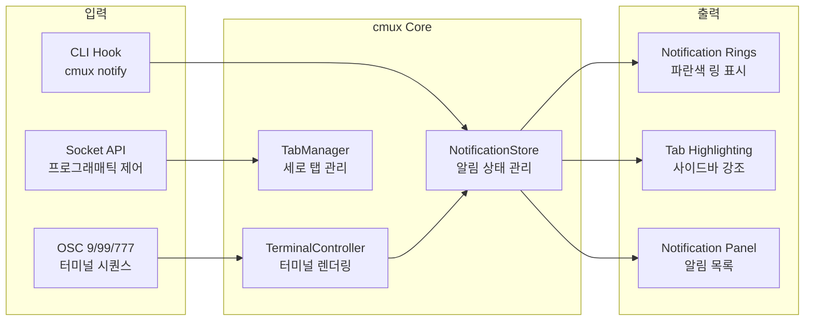
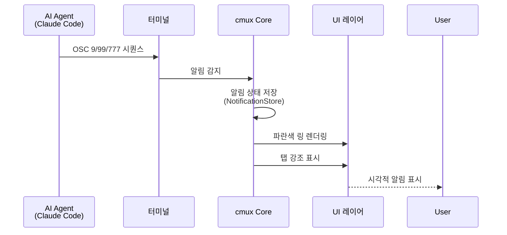
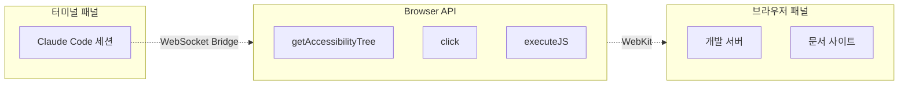
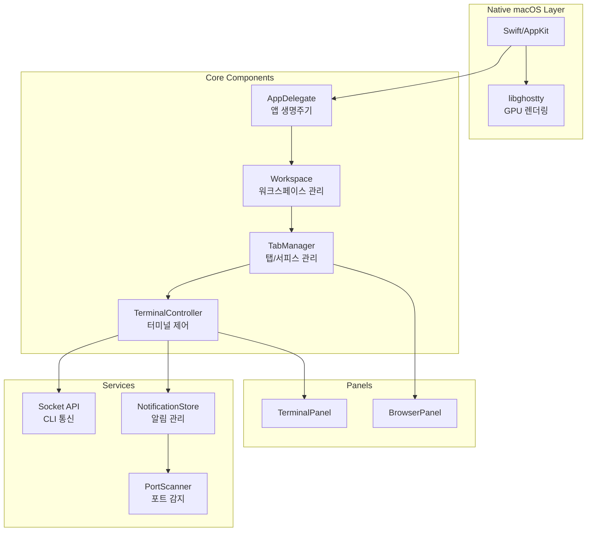
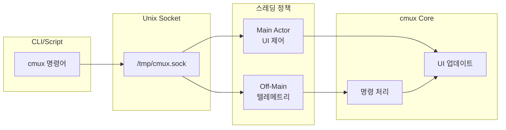

AI 코딩 에이전트(Claude Code, OpenCode 등)를 사용할 때 가장 큰 문제점 중 하나는 **어떤 세션이 나를 필요로 하는지 알기 어렵다**는 것입니다. macOS 기본 알림은 항상 "Claude is waiting for your input"이라는 맥락 없는 메시지만 보여주고, 여러 개의 분할 패널과 탭이 열려 있으면 탭 제목조차 읽기 힘듭니다.

<!--more-->

## Sources

- https://github.com/manaflow-ai/cmux

## cmux란 무엇인가요

**cmux**는 Ghostty 기반의 네이티브 macOS 터미널로, AI 코딩 에이전트를 위해 특별히 설계되었습니다. Swift와 AppKit으로 작성되어 Electron 기반 대안보다 빠른 시작 속도와 낮은 메모리 사용량을 제공합니다.



## 핵심 기능

### 1. 알림 링(Notification Rings)

AI 에이전트가 사용자의 입력을 기다릴 때, 해당 패널에 **파란색 링**이 표시되고 사이드바에서 해당 탭이 강조됩니다.



**구현 세부사항:**
- OSC 9, OSC 99, OSC 777 터미널 시퀀스를 감지하여 알림 트리거
- `TerminalNotificationStore`가 알림 상태를 중앙 관리
- `TabManager`와 연동하여 사이드바 탭 강조

### 2. 세로 탭과 사이드바

사이드바는 각 워크스페이스의 다음 정보를 표시합니다:

- **Git 브랜치**: 현재 작업 중인 브랜치
- **연결된 PR**: PR 상태와 번호
- **작업 디렉토리**: 현재 경로
- **리스닝 포트**: 개발 서버 포트
- **최신 알림 텍스트**: 가장 최근 알림 내용

### 3. 내장 브라우저

[agent-browser](https://github.com/vercel-labs/agent-browser)에서 포팅된 스크립트 가능한 API를 제공합니다:

- 접근성 트리 스냅샷 가져오기
- 요소 참조 얻기
- 클릭 및 양식 작성
- JavaScript 실행



### 4. 분할 패널 및 워크스페이스

- **수평/수직 분할**: `⌘D`(오른쪽), `⌘⇧D`(아래)
- **다중 워크스페이스**: `⌘N`(새 워크스페이스), `⌘1-8`(워크스페이스 전환)
- **세션 복원**: 레이아웃, 작업 디렉토리, 스크롤백, 브라우저 기록 저장

## 기술 아키텍처



### 주요 컴포넌트

| 컴포넌트 | 역할 | 파일 위치 |
|---------|------|----------|
| `AppDelegate` | 앱 생명주기, 이벤트 핸들링 | `Sources/AppDelegate.swift` |
| `Workspace` | 워크스페이스 상태 관리 | `Sources/Workspace.swift` |
| `TabManager` | 탭/서피스 생성 및 관리 | `Sources/TabManager.swift` |
| `TerminalController` | 터미널 입출력 제어 | `Sources/TerminalController.swift` |
| `TerminalNotificationStore` | 알림 상태 및 UI 동기화 | `Sources/TerminalNotificationStore.swift` |
| `BrowserWindowPortal` | 내장 브라우저 통합 | `Sources/BrowserWindowPortal.swift` |

## 스크립트 가능성

### CLI 명령어

```bash
# 워크스페이스 생성
cmux new-workspace --command "npm run dev"

# 알림 전송
cmux notify --title "빌드 완료" --body "프로젝트 빌드가 성공했습니다"

# 패널 분할
cmux split --direction horizontal

# 브라우저 열기
cmux open-browser --url "http://localhost:3000"
```

### Socket API

Unix socket(`/tmp/cmux.sock`)을 통해 JSON-RPC 스타일로 제어 가능합니다. 고빈도 텔레메트리 명령은 메인 스레드에서 실행되지 않도록 설계되어 있습니다.



## Ghostty 호환성

cmux는 기존 Ghostty 설정(`~/.config/ghostty/config`)을 그대로 사용합니다:

- **테마**: 색상 구성
- **글꼴**: 글꼴 설정
- **커서**: 커서 스타일

## 설치 방법

### DMG (권장)

```bash
# 다운로드 및 설치
# https://github.com/manaflow-ai/cmux/releases/latest/download/cmux-macos.dmg
```

### Homebrew

```bash
brew tap manaflow-ai/cmux
brew install --cask cmux

# 업데이트
brew upgrade --cask cmux
```

## 키보드 단축키

### 워크스페이스 (Workspace)

| 단축키 | 동작 |
|----------|--------|
| `⌘N` | 새 워크스페이스 |
| `⌘1–8` | 워크스페이스 1–8로 이동 |
| `⌘9` | 마지막 워크스페이스로 이동 |
| `⌃⌘]` | 다음 워크스페이스 |
| `⌃⌘[` | 이전 워크스페이스 |
| `⌘⇧W` | 워크스페이스 닫기 |
| `⌘B` | 사이드바 토글 |

### 서피스 (Surface)

| 단축키 | 동작 |
|----------|--------|
| `⌘T` | 새 서피스 |
| `⌘⇧]` | 다음 서피스 |
| `⌘⇧[` | 이전 서피스 |
| `⌃Tab` | 다음 서피스 |
| `⌃⇧Tab` | 이전 서피스 |
| `⌃1–8` | 서피스 1–8로 이동 |
| `⌃9` | 마지막 서피스로 이동 |
| `⌘W` | 서피스 닫기 |

### 분할 패널 (Split Panels)

| 단축키 | 동작 |
|----------|--------|
| `⌘D` | 오른쪽으로 분할 |
| `⌘⇧D` | 아래로 분할 |
| `⌥⌘←→↑↓` | 방향키로 패널 포커스 이동 |
| `⌘⇧H` | 포커스된 패널 깜빡임 |

### 브라우저 (Browser)

| 단축키 | 동작 |
|----------|--------|
| `⌘⇧L` | 분할에서 브라우저 열기 |
| `⌘L` | 주소창 포커스 |
| `⌘[` | 뒤로 |
| `⌘]` | 앞으로 |
| `⌘R` | 페이지 새로고침 |
| `⌥⌘I` | 개발자 도구 열기 |

### 알림 (Notifications)

| 단축키 | 동작 |
|----------|--------|
| `⌘I` | 알림 패널 표시 |
| `⌘⇧U` | 최신 읽지 않은 알림으로 이동 |

### 찾기 (Search)

| 단축키 | 동작 |
|----------|--------|
| `⌘F` | 찾기 |
| `⌘G` / `⌘⇧G` | 다음 찾기 / 이전 찾기 |
| `⌘⇧F` | 찾기 바 숨기기 |
| `⌘E` | 선택 영역으로 찾기 |

### 터미널 (Terminal)

| 단축키 | 동작 |
|----------|--------|
| `⌘K` | 스크롤백 지우기 |
| `⌘C` | 복사 (선택 시) |
| `⌘V` | 붙여넣기 |
| `⌘+` / `⌘-` | 글꼴 크기 확대 / 축소 |
| `⌘0` | 글꼴 크기 초기화 |

### 창 (Window)

| 단축키 | 동작 |
|----------|--------|
| `⌘⇧N` | 새 창 |
| `⌘,` | 설정 |
| `⌘⇧,` | 설정 다시 불러오기 |
| `⌘Q` | 종료 |

## 실용적 팁

### 1. Claude Code 통합

cmux는 Claude Code와 기본 통합되어 있습니다. 훅 설정 없이도 알림 링이 자동으로 작동합니다.

### 2. 워크스페이스 색상 구성

각 워크스페이스에 다른 색상을 지정하여 시각적으로 구분할 수 있습니다(`⌘,` 설정에서 설정).

### 3. 세션 복원

cmux는 레이아웃, 작업 디렉토리, 스크롤백, 브라우저 기록을 복원하지만, **실시간 터미널 프로세스 상태는 아직 복원하지 않습니다**.

## 라이선스

이 프로젝트는 **GNU Affero General Public License v3.0 이상**(AGPL-3.0-or-later)으로 라이선스가 부여됩니다.

## 결론

cmux는 AI 코딩 에이전트를 위해 특별히 설계된 네이티브 macOS 터미널입니다. 알림 링, 세로 탭, 내장 브라우저, 스크립트 가능한 API를 통해 여러 AI 에이전트 세션을 효율적으로 관리할 수 있습니다. Electron 기반 대안보다 빠르고 가볍고, Ghostty와 완벽하게 호환됩니다.
