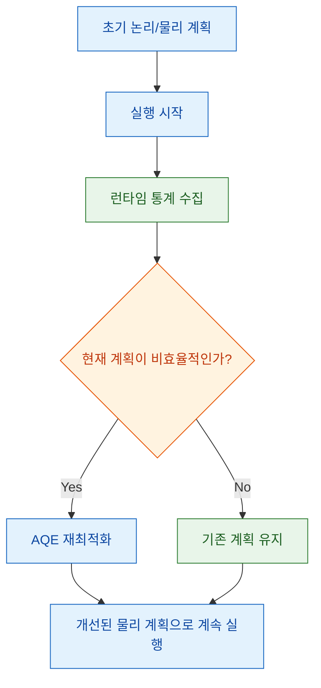
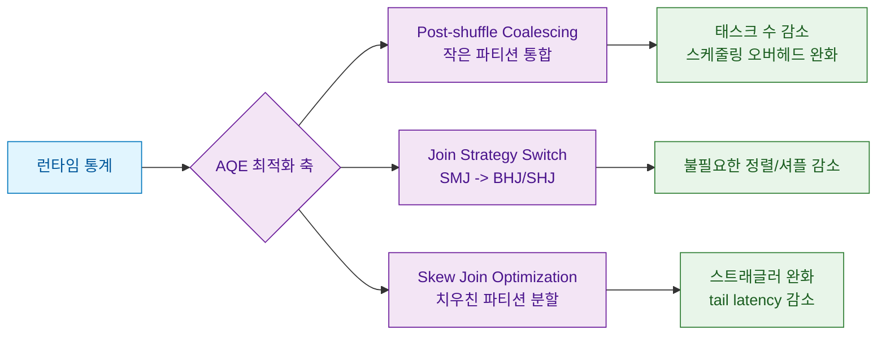
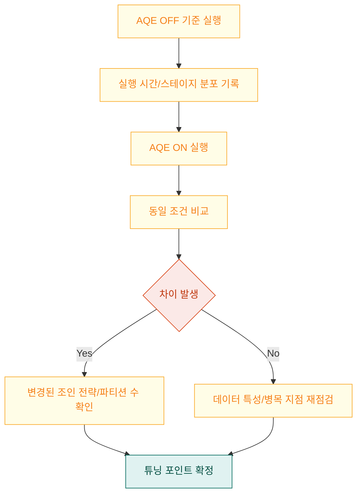

Spark SQL 성능을 다루다 보면 같은 쿼리인데도 실행 시간이 크게 달라지는 순간을 자주 보게 됩니다. 이번 영상은 그 차이를 만드는 핵심 축으로 AQE(Adaptive Query Execution)를 설명하고, 실제 데모에서 AQE on/off 차이를 보여줍니다. 이 글에서는 영상 내용을 기준으로 AQE를 "왜 빨라지는지" 중심으로 재구성하고, 공식 문서 기준으로 운영에서 바로 확인할 설정까지 연결하겠습니다.

<!--more-->

## Sources

- https://www.youtube.com/watch?v=ILscz6K3Icg
- https://spark.apache.org/docs/latest/sql-performance-tuning.html#adaptive-query-execution
- https://spark.apache.org/docs/latest/sql-performance-tuning.html#coalescing-post-shuffle-partitions
- https://spark.apache.org/docs/latest/sql-performance-tuning.html#optimizing-skew-join

## 1. AQE는 "실행 전에 끝내는 최적화"가 아니라 "실행 중 다시 고치는 최적화"

영상 초반에서는 AQE를 동적 쿼리 최적화로 소개합니다. 핵심은 정적 계획을 한 번 세우고 끝내는 것이 아니라, 실행 중 수집되는 런타임 통계를 보고 계획을 재최적화한다는 점입니다. Spark 공식 문서도 AQE를 "runtime statistics를 활용해 더 효율적인 실행 계획을 선택"하는 방식으로 정의합니다.

- 근거(영상): https://youtu.be/ILscz6K3Icg?t=15
- 근거(공식 문서): https://spark.apache.org/docs/latest/sql-performance-tuning.html#adaptive-query-execution
- 신뢰도: 높음

여기서 중요한 운영 포인트는 버전 감각입니다. 영상에서도 "최근 Spark 3.2+ 환경"을 전제로 설명하고, 공식 문서 역시 AQE가 기본 활성화라고 명시합니다. 즉, 최신 환경에서는 AQE를 "켜야 하나?"보다 "AQE가 어떤 방식으로 계획을 바꿨는가?"를 확인하는 것이 더 실전적인 질문입니다.

- 근거(영상): https://youtu.be/ILscz6K3Icg?t=96
- 근거(공식 문서): https://spark.apache.org/docs/latest/sql-performance-tuning.html#adaptive-query-execution
- 신뢰도: 높음

## 2. AQE의 실전 효과는 세 가지 축에서 나온다: 파티션 정리, 조인 전략 전환, 스큐 대응

영상 중반 이후 설명의 중심은 "작은 파티션이 너무 많아질 때 발생하는 오버헤드"입니다. 파티션 하나가 태스크 하나로 이어지는 구조에서 자잘한 파티션이 과도하게 많으면 스케줄링/실행 오버헤드가 커집니다. AQE는 이때 post-shuffle 파티션을 합쳐 태스크 개수를 줄이고, 병렬성-오버헤드 균형점을 다시 잡습니다.

- 근거(영상): https://youtu.be/ILscz6K3Icg?t=186
- 근거(공식 문서): https://spark.apache.org/docs/latest/sql-performance-tuning.html#coalescing-post-shuffle-partitions
- 신뢰도: 높음

AQE는 조인에서도 런타임 크기 정보를 활용해 sort-merge join을 broadcast hash join으로 바꾸거나, 조건이 맞으면 shuffled hash join으로 전환합니다. 즉, 처음 계획 시점의 "추정치"가 틀렸더라도 실행 중 관측값으로 전략을 바꿔 손실을 줄일 수 있습니다.

- 근거(영상): https://youtu.be/ILscz6K3Icg?t=310
- 근거(공식 문서): https://spark.apache.org/docs/latest/sql-performance-tuning.html#converting-sort-merge-join-to-broadcast-join
- 신뢰도: 중간(영상에서는 개념 설명 중심, 세부 조건은 공식 문서 보강)

또 하나는 데이터 스큐 처리입니다. 특정 키로 데이터가 몰리면 일부 태스크만 유독 오래 걸리는 straggler 문제가 생기는데, AQE는 skewed partition을 분할(필요 시 복제)해 병목을 완화합니다. 대규모 조인에서 "대부분 끝났는데 몇 개 태스크만 오래 남는" 상황을 줄이는 데 특히 유효합니다.

- 근거(영상): https://youtu.be/ILscz6K3Icg?t=420
- 근거(공식 문서): https://spark.apache.org/docs/latest/sql-performance-tuning.html#optimizing-skew-join
- 신뢰도: 높음

## 3. 영상 데모를 어떻게 읽어야 하나: 숫자보다 "왜 숫자가 바뀌었는지"를 본다

영상 후반 데모에서는 AQE 비활성화 대비 활성화 시 조인 작업 시간이 약 1.86초에서 0.79초로 줄어든 사례를 보여줍니다. 또한 작은 테이블 추정치와 실제 크기 간 차이(예: 추정 20MB, 실제 5MB)를 언급하는데, 이런 불일치가 바로 AQE가 개입할 여지를 만드는 전형적인 상황입니다.

- 근거(영상): https://youtu.be/ILscz6K3Icg?t=720
- 신뢰도: 중간(수치는 영상 설명 기반, 테스트 데이터/클러스터 조건은 영상에서 완전 공개되지 않음)

이 숫자를 일반화할 때는 주의가 필요합니다. 동일한 AQE 설정이어도 데이터 분포, 조인 키 카디널리티, 클러스터 리소스, 기본 `spark.sql.shuffle.partitions` 값에 따라 효과 크기는 달라집니다. 따라서 재현 실험에서는 반드시 실행 계획(예: AQE 적용 후 물리 계획)과 스테이지별 태스크 분포를 같이 확인해야 합니다.

- 근거(영상): https://youtu.be/ILscz6K3Icg?t=760
- 근거(공식 문서): https://spark.apache.org/docs/latest/sql-performance-tuning.html#adaptive-query-execution
- 신뢰도: 높음

## Practical Takeaways

1. AQE를 단순 on/off 옵션으로 보지 말고, "실행 중 계획 재작성 엔진"으로 이해하세요. 그래야 실행 계획 변화 로그를 읽는 습관이 생깁니다.
2. 작은 파티션이 많아지는 워크로드에서는 `spark.sql.adaptive.coalescePartitions.enabled` 축을 먼저 확인하세요. 태스크 과분할이 성능 저하의 흔한 원인입니다.
3. 조인 성능 이슈에서는 추정 통계와 런타임 크기 차이를 함께 보세요. AQE가 조인 전략 전환을 했는지 여부가 핵심 진단 포인트입니다.
4. 스큐가 의심되면 평균 시간보다 tail latency(느린 일부 태스크)를 추적하세요. AQE의 skew join 최적화는 이 구간에서 효과가 큽니다.
5. 영상의 성능 개선 수치는 방향성을 보여주는 예시로 받아들이고, 본인 환경에서 동일 데이터/동일 조건 A/B 실행으로 검증하세요.

## Conclusion

이 영상의 메시지는 간단합니다. Spark가 빨라지는 이유는 "마법 같은 단일 옵션"이 아니라, 실행 중 관측값으로 계획을 계속 수정하는 AQE의 구조적 특성에 있습니다. 따라서 실무에서는 AQE를 켜는 것에서 끝내지 말고, AQE가 무엇을 바꿨는지(파티션, 조인, 스큐 대응)를 관찰 가능한 지표로 추적할 때 성능 개선을 반복 가능하게 만들 수 있습니다.
