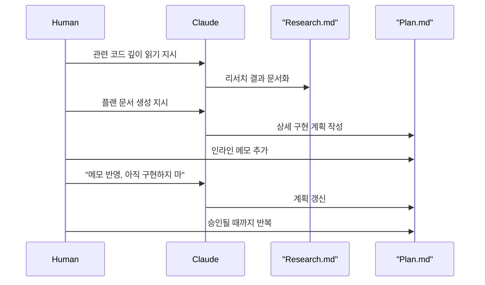
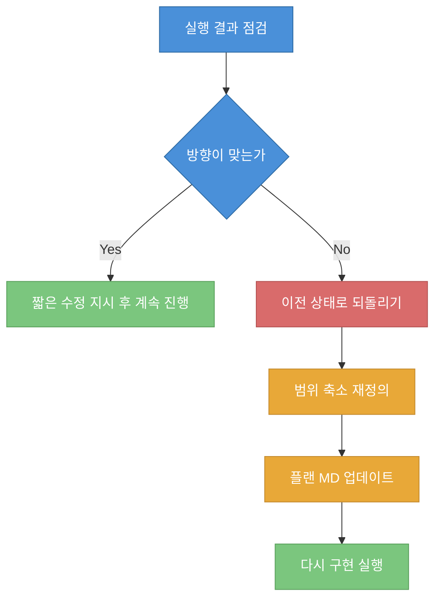

복잡한 작업에서 바이브 코딩이 흔들리는 이유는 모델이 코드를 못 써서가 아니라, 무엇을 써야 하는지 결정하는 단계와 실제 타이핑 단계가 섞이기 때문입니다. 이 영상은 그 문제를 "기획과 코딩의 분리"라는 단일 원칙으로 정리하고, 이를 문서 기반 루프로 실행하는 방법을 보여줍니다 (근거: [t=55](https://youtu.be/6Z6Le3Xwqdg?t=55), [t=63](https://youtu.be/6Z6Le3Xwqdg?t=63)).

<!--more-->

## Sources

- https://www.youtube.com/watch?v=6Z6Le3Xwqdg

## 1) 왜 복잡해지면 결과가 무너지는가

발표자는 프롬프트 실험 자체를 부정하지는 않지만, 작업 복잡도가 올라가는 순간 결과가 붕괴하는 경험은 거의 피할 수 없다고 말합니다. 핵심 실패는 문법 에러가 아니라, 겉으로는 동작해도 주변 시스템을 서서히 망가뜨리는 "무지한 변경"이라는 점을 강조합니다 (근거: [t=42](https://youtu.be/6Z6Le3Xwqdg?t=42), [t=170](https://youtu.be/6Z6Le3Xwqdg?t=170)).

예시로 제시된 실패 모드는 기존 레이어 무시, ORM 고려 없는 마이그레이션, 중복 API 엔드포인트 생성처럼 시스템 무결성을 깎아먹는 유형입니다. 즉, 문제의 본질은 "코드가 돌아가느냐"가 아니라 "아키텍처 맥락과 정합하냐"입니다 (근거: [t=174](https://youtu.be/6Z6Le3Xwqdg?t=174), [t=185](https://youtu.be/6Z6Le3Xwqdg?t=185)).

## 2) 핵심 원칙: 기획과 코딩의 분리

영상의 단일 원칙은 명확합니다. 작성된 계획을 사람이 직접 검토하고 승인하기 전까지는 Claude에게 코드를 쓰게 하지 않는 것입니다. 이 원칙의 효과로 삽질 감소, 아키텍처 주도권 유지, 토큰 효율 개선이 제시됩니다 (근거: [t=57](https://youtu.be/6Z6Le3Xwqdg?t=57), [t=72](https://youtu.be/6Z6Le3Xwqdg?t=72)).

실무적으로 보면 이 원칙은 "모델 성능 최적화"가 아니라 "의사결정 경로 최적화"에 가깝습니다. 먼저 결정 품질을 올리고, 구현은 기계적으로 실행하게 만드는 구조라서 장기 작업에서 일관성이 높아집니다 (근거: [t=102](https://youtu.be/6Z6Le3Xwqdg?t=102), [t=430](https://youtu.be/6Z6Le3Xwqdg?t=430)).

## 3) 리서치 MD -> 플랜 MD -> 인라인 메모 루프

첫 단계는 코드베이스를 깊게 읽고 결과를 채팅창이 아닌 리서치 문서로 남기는 것입니다. 발표자는 "채팅창 요약"은 휘발되기 때문에 산출물 축적에 불리하고, 리서치 MD는 세션 압축 이후에도 기준점으로 남는다고 설명합니다 (근거: [t=103](https://youtu.be/6Z6Le3Xwqdg?t=103), [t=110](https://youtu.be/6Z6Le3Xwqdg?t=110)).

두 번째 단계에서 플랜 MD를 만들고, 사람은 문서의 정확한 위치에 인라인 메모를 남겨 가정 수정, 접근 거부, 제약 추가, 도메인 지식 주입을 수행합니다. 여기서 중요한 운영 문구가 "아직 구현하지 마"이며, 이 문구로 실행 권한을 계속 사람 쪽에 둡니다 (근거: [t=291](https://youtu.be/6Z6Le3Xwqdg?t=291), [t=367](https://youtu.be/6Z6Le3Xwqdg?t=367), [t=381](https://youtu.be/6Z6Le3Xwqdg?t=381)).

영상은 내장 플랜 모드보다 외부 MD 파일을 선호하는 이유도 제시합니다. 에디터 편집성, 프로젝트 산출물 축적, 세션 휘발 대비 복원력 때문입니다 (근거: [t=240](https://youtu.be/6Z6Le3Xwqdg?t=240), [t=255](https://youtu.be/6Z6Le3Xwqdg?t=255)).

## 4) 구현 단계: "멈추지 않고 실행" + 타입 체크 상시화

계획이 승인되면 구현 프롬프트는 오히려 짧아집니다. 발표 예시에는 "전부 구현", "완료 상태 갱신", "모든 단계 완료까지 멈추지 마라", "지속적으로 타입 체크" 같은 실행 규칙이 포함됩니다 (근거: [t=410](https://youtu.be/6Z6Le3Xwqdg?t=410), [t=420](https://youtu.be/6Z6Le3Xwqdg?t=420)).

이 단계에서 사람의 역할은 설계자에서 감독자로 바뀌며, 피드백도 짧고 구체적인 수정 지시 중심으로 전환됩니다. 즉, 창의적 판단은 계획 단계에서 끝내고 구현은 결정된 항목의 집행으로 취급합니다 (근거: [t=448](https://youtu.be/6Z6Le3Xwqdg?t=448), [t=451](https://youtu.be/6Z6Le3Xwqdg?t=451), [t=482](https://youtu.be/6Z6Le3Xwqdg?t=482)).

## 5) 잘못된 방향을 고치는 법: 부분 패치보다 범위 재설정

영상의 강한 권고는 잘못된 방향에서 패치 누적하지 말고, 되돌린 뒤 범위를 좁혀 다시 지시하라는 것입니다. 이는 잘못된 기초 위에 수정을 누적하는 비용을 줄이는 리스크 관리 전략으로 읽을 수 있습니다 (근거: [t=491](https://youtu.be/6Z6Le3Xwqdg?t=491), [t=496](https://youtu.be/6Z6Le3Xwqdg?t=496), [t=512](https://youtu.be/6Z6Le3Xwqdg?t=512)).

또한 "운전대를 꼭 잡고 있기"라는 표현처럼, 실행은 위임해도 무엇을 만들지에 대한 결정권은 넘기지 않는 운영 원칙을 반복합니다. 이 원칙이 마지막에 "쉐어드 뮤터블 스테이트 패턴"으로 명명됩니다 (근거: [t=523](https://youtu.be/6Z6Le3Xwqdg?t=523), [t=529](https://youtu.be/6Z6Le3Xwqdg?t=529), [t=697](https://youtu.be/6Z6Le3Xwqdg?t=697)).

## 실전 적용 포인트

1. 작업 시작 전에 리서치 MD와 플랜 MD를 별도 파일로 만들고, 채팅창 요약은 보조 채널로만 사용하세요.
2. 플랜 리뷰 루프에서는 반드시 "아직 구현하지 마"를 명시해 실행 시점을 사람 승인의 종속 변수로 두세요.
3. 구현 프롬프트에는 "완료 조건", "중단 금지", "타입 체크 상시"를 고정 문구로 넣어 실행 편차를 줄이세요.
4. 진행 중 방향이 어긋나면 부분 패치 누적 대신 되돌리기 + 범위 축소로 재시작하는 규칙을 팀 표준으로 삼으세요.
5. 리뷰 관점은 "코드가 동작하는가"보다 "기존 레이어/데이터 계약/중복 없는가"에 두어 시스템 손상을 조기에 차단하세요.

## 결론

이 영상의 메시지는 프롬프트 해킹보다 운영 규율에 가깝습니다. Claude Code의 품질을 끌어올리는 핵심은 모델을 더 영리하게 만드는 것이 아니라, 사람이 의사결정 경로를 문서와 승인 루프로 고정해 "무엇을 쓸지"를 먼저 확정하는 데 있습니다 (근거: [t=620](https://youtu.be/6Z6Le3Xwqdg?t=620), [t=663](https://youtu.be/6Z6Le3Xwqdg?t=663), [t=697](https://youtu.be/6Z6Le3Xwqdg?t=697)).
