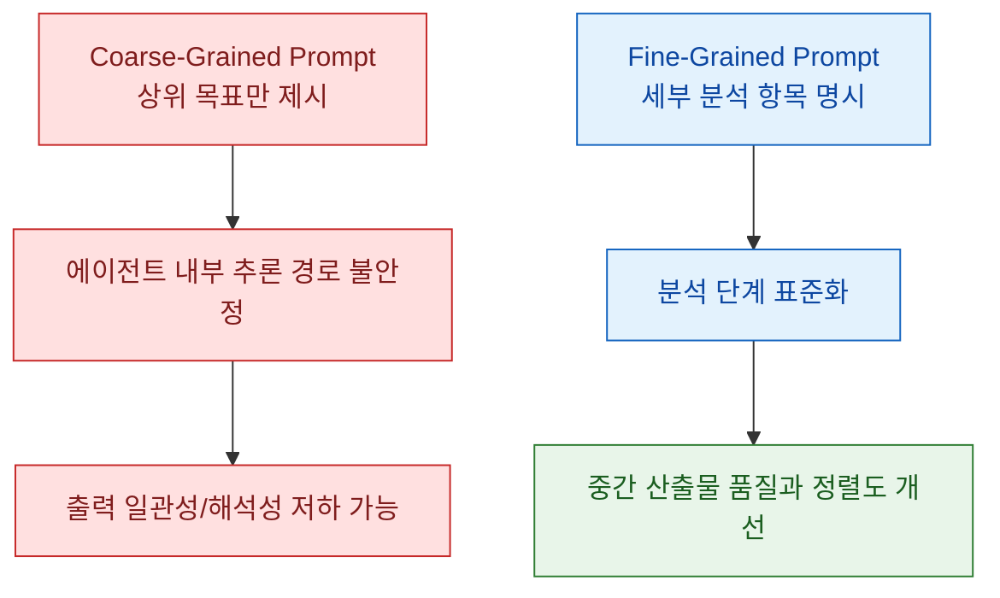
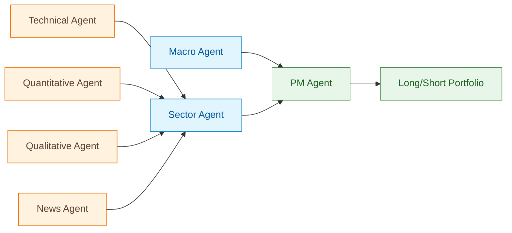

최근 LLM 기반 트레이딩 연구는 에이전트 수를 늘리는 데서 한 단계 더 나아가, 각 에이전트가 실제로 어떤 단위 작업을 수행해야 하는지까지 설계하는 방향으로 이동하고 있습니다. 이 논문은 바로 그 지점을 검증하며, "역할 이름"만 주는 coarse-grained 프롬프트보다, 분석 단계를 잘게 쪼갠 fine-grained 프롬프트가 위험 조정 수익률과 중간 추론 품질을 함께 개선한다고 보고합니다.

<!--more-->

## Sources

- https://arxiv.org/abs/2602.23330

## 1. 무엇이 다른가: 역할 부여에서 "업무 프로토콜" 설계로

기존 다중 에이전트 트레이딩 시스템은 "애널리스트", "매니저" 같은 역할 구분은 있었지만, 각 역할이 실제로 어떤 체크리스트를 따라 분석해야 하는지까지는 상대적으로 덜 구체적이었습니다. 이 논문은 그 공백을 메우기 위해, 특히 Technical Agent와 Quantitative Agent에서 coarse-grained(원시 데이터 중심 지시)와 fine-grained(사전 계산 지표 중심 지시)를 명확히 분리해 비교합니다.

- 근거: https://arxiv.org/html/2602.23330v1#S5.SS1
- 근거: https://arxiv.org/html/2602.23330v1#S6.SS1
- 신뢰도: 높음

핵심 포인트는 "더 많은 설명"이 아니라 "업무 단위의 명시적 분해"입니다. 즉, LLM이 무엇을 계산하고 어떤 근거를 텍스트로 남겨야 하는지 경로를 고정해, 다운스트림 의사결정자(PM Agent)가 읽을 수 있는 형태로 정보를 전달하게 만듭니다.

- 근거: https://arxiv.org/html/2602.23330v1#S6.SS3
- 근거: https://arxiv.org/html/2602.23330v1#S7
- 신뢰도: 높음

## 2. 시스템 구조: 7개 에이전트의 계층형 의사결정 파이프라인

논문 시스템은 하향식 지시가 아니라, 하위 분석 결과가 상위 의사결정으로 올라가는 bottom-up 구조입니다. 1단계에서 Quantitative/Qualitative/News/Technical 에이전트가 종목별 점수와 설명을 만들고, 2단계에서 Sector Agent와 Macro Agent가 이를 조정/보완한 뒤, 3단계 PM Agent가 최종 포트폴리오를 구성합니다.

- 근거: https://arxiv.org/html/2602.23330v1#S4.SS1
- 신뢰도: 높음

이 구조가 중요한 이유는, 단순히 "모델 하나가 다 하는" 방식보다 책임 경계가 명확해져서 오류 진단과 개선 실험(예: 특정 에이전트 제거 실험)이 가능해지기 때문입니다. 실제로 논문은 에이전트 단위 제거(ablation)로 어떤 모듈이 성능에 민감한지 분석합니다.

- 근거: https://arxiv.org/html/2602.23330v1#S6.SS2
- 신뢰도: 높음

## 3. 실험 설계와 결과: 성능뿐 아니라 "정보 전달 정렬"을 본다

평가는 일본 대형주(TOPIX 100) 기반의 월별 리밸런싱 long-short 백테스트로 진행되며, 데이터 누수 통제를 위해 LLM 지식 컷오프 이후 기간(2023-09 ~ 2025-11)을 테스트 구간으로 둡니다. 데이터는 가격, 재무제표, 뉴스, 거시지표를 결합해 실제 운용 환경을 최대한 모사합니다.

- 근거: https://arxiv.org/html/2602.23330v1#S3.SS1
- 근거: https://arxiv.org/html/2602.23330v1#S4.SS2
- 신뢰도: 높음

결과 측면에서 논문은 fine-grained 설정이 coarse-grained 대비 Sharpe ratio를 개선했다고 보고하며, all-agent 비교에서 5개 포트폴리오 크기 중 4개 구간에서 유의한 우위를 보였다고 제시합니다. 또한 중간 텍스트 분석을 통해, 단순히 점수가 높아진 것이 아니라 하위 분석 결과가 상위 의사결정 선호와 더 잘 정렬되는 것이 성능 개선의 핵심 동인임을 제시합니다.

- 근거: https://arxiv.org/abs/2602.23330
- 근거: https://arxiv.org/html/2602.23330v1#S6.SS1
- 근거: https://arxiv.org/html/2602.23330v1#S6.SS3
- 신뢰도: 높음

추가로, 시스템 출력과 지수 수익률 간 낮은 상관을 활용한 포트폴리오 최적화에서도 성과 개선을 보고합니다. 이는 LLM 에이전트 전략을 단독 알파 소스로만 보지 않고, 기존 자산과의 결합 자산으로 해석할 여지를 보여줍니다.

- 근거: https://arxiv.org/abs/2602.23330
- 근거: https://arxiv.org/html/2602.23330v1#S6.SS4
- 신뢰도: 중간(상세 수치 해석은 원문 표/부록 직접 확인 필요)

## 4. 한계와 적용 시 주의점

논문 자체도 한계를 분명히 둡니다. 단일 시장(일본 주식), 특정 리밸런싱 주기, 특정 모델 설정에 의존한 결과이므로, 다른 시장/빈도/실행 제약(거래비용, 슬리피지, 실시간성)으로 바로 일반화하면 과신이 될 수 있습니다.

- 근거: https://arxiv.org/html/2602.23330v1#S7.SS2
- 신뢰도: 높음

또한 이 연구의 강점은 "프롬프트 공학" 자체보다, 도메인 전문가의 업무 절차를 분석 가능한 프로토콜로 고정했다는 데 있습니다. 따라서 실무 재현의 핵심은 모델 교체보다, 조직의 실제 분석 워크플로를 어떻게 구조화해 에이전트 태스크로 번역하느냐에 있습니다.

- 근거: https://arxiv.org/html/2602.23330v1#S2.SS2
- 근거: https://arxiv.org/html/2602.23330v1#S5
- 신뢰도: 높음

## Practical Takeaways

1. 다중 에이전트 설계에서 먼저 정의할 것은 "역할"이 아니라 "업무 단위"입니다.
2. 백테스트 성과만 보지 말고, 중간 텍스트가 의사결정 계층 간에 잘 전달되는지(정렬도)를 함께 측정해야 합니다.
3. 에이전트별 제거 실험을 설계해 병목 모듈을 식별하면, 프롬프트 수정 우선순위를 명확히 잡을 수 있습니다.
4. 운영 적용 시에는 거래비용, 슬리피지, 재학습 주기, 모델 컷오프 기반 누수 통제를 실험 설계에 포함해야 합니다.
5. 전략을 단독 알파로 볼지, 기존 포트폴리오와의 분산 효과 자산으로 볼지 목적을 먼저 정하고 검증 지표를 맞추는 것이 좋습니다.

## Conclusion

이 논문의 메시지는 간단합니다. LLM 트레이딩에서 성능 차이를 만드는 것은 "모델 크기"보다 "작업 설계의 해상도"일 수 있습니다. fine-grained 태스크 분해는 수익률 개선 도구이면서 동시에 설명 가능성 강화 장치이며, 결국 실무 적용 가능성을 높이는 핵심 메커니즘으로 읽힙니다.
