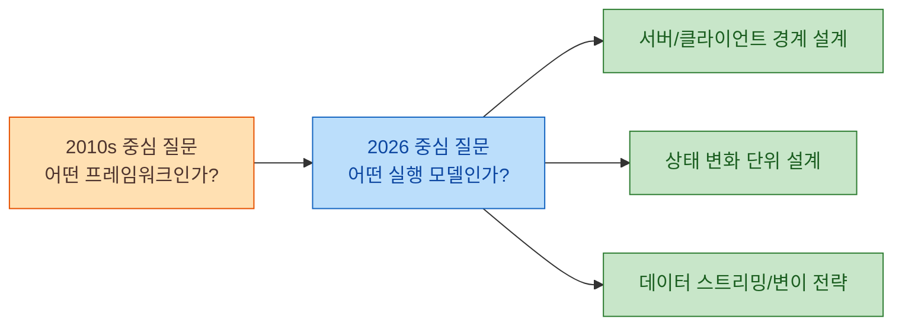
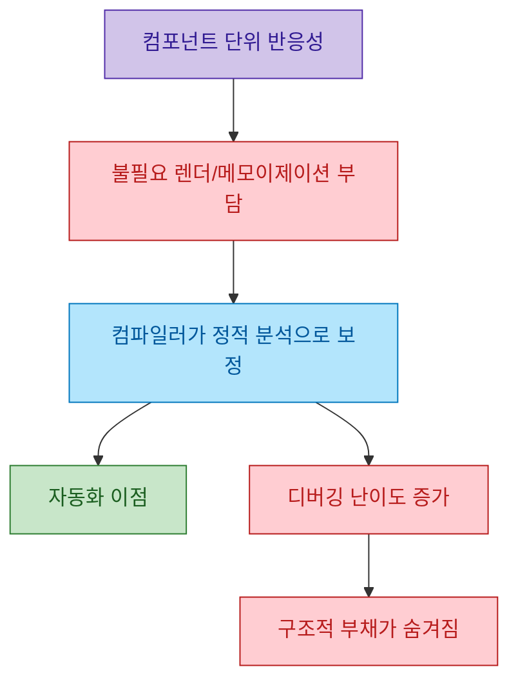
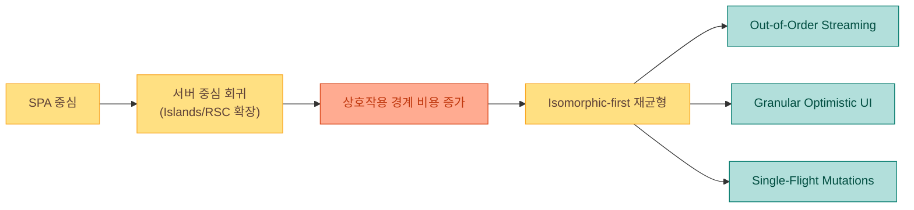

2026년 웹 개발 담론에서 가장 흥미로운 변화는 "프레임워크 선택 자체의 중요도"가 내려가고, 애플리케이션 구조를 어떻게 설계하는지가 더 중요해졌다는 주장입니다. 영상은 이 변화를 React 비판, AI 코드 생성 편향, 그리고 isomorphic-first 재정렬이라는 세 축으로 풀어냅니다 (근거: [t=35](https://youtu.be/wkXvv0iJffg?t=35), [t=299](https://youtu.be/wkXvv0iJffg?t=299)).

<!--more-->

## Sources

- https://www.youtube.com/watch?v=wkXvv0iJffg

## 1) 프레임워크 전쟁의 종료: 선택보다 구조가 중요해진 이유

영상의 핵심 메시지는 "이제 어떤 프레임워크를 고르느냐"보다, 서버와 클라이언트를 어떤 경계로 나누고 어떤 데이터 흐름을 기본값으로 삼느냐가 더 본질적이라는 점입니다. 즉, 프레임워크는 제품 아키텍처를 구현하는 수단으로 수렴하고 있고, 차별점은 런타임 모델과 DX/운영 모델에서 갈립니다 (근거: [t=30](https://youtu.be/wkXvv0iJffg?t=30), [t=395](https://youtu.be/wkXvv0iJffg?t=395)).

## 2) React가 마주한 구조적 비용: Virtual DOM, RSC, 컴파일러 계층

영상은 React 생태계가 "간단한 UI 라이브러리"에서 "정신적 부하가 큰 아키텍처 묶음"으로 확장됐다고 지적합니다. Virtual DOM 의존, React Server Components의 경계 모호성, 그리고 컴파일러 기반 자동 최적화가 합쳐지며 학습/디버깅 비용이 커졌다는 관점입니다 (근거: [t=70](https://youtu.be/wkXvv0iJffg?t=70), [t=98](https://youtu.be/wkXvv0iJffg?t=98), [t=122](https://youtu.be/wkXvv0iJffg?t=122)).

여기서 중요한 포인트는 "컴파일러가 문제를 해결했다"가 아니라 "기존 설계 부채를 다른 레이어로 이동시켰다"는 해석입니다. 컴포넌트 전체 함수 단위 반응성에서 오는 비용을 정적 분석으로 상쇄하려다 보니, 도구가 강력해질수록 내부 동작을 파악하기 어려워질 수 있다는 문제 제기입니다 (근거: [t=146](https://youtu.be/wkXvv0iJffg?t=146)).

## 3) AI 시대의 React 회귀 루프: 학습 데이터 규모가 만드는 역설

영상은 "React를 AI가 잘 생성한다"는 장점이 동시에 한계가 될 수 있다고 말합니다. 이유는 명확합니다. React는 학습 데이터가 매우 많고, 그 안에는 서로 다른 시대의 패턴이 섞여 있어 평균적인 결과물로 수렴하기 쉽습니다. 그 결과, 오래된 의존성/패턴이 다시 등장하는 회귀 루프가 발생할 수 있습니다 (근거: [t=180](https://youtu.be/wkXvv0iJffg?t=180), [t=210](https://youtu.be/wkXvv0iJffg?t=210)).

이 지점의 실무적 함의는 "AI가 코드를 잘 써준다"가 끝이 아니라는 것입니다. 어떤 프롬프트 가이드와 리뷰 규칙으로 코드 품질을 통제할지, 그리고 팀이 허용하는 아키텍처 경계가 무엇인지가 더 중요해집니다 (근거: [t=238](https://youtu.be/wkXvv0iJffg?t=238)).

## 4) Isomorphic-first 재정렬: 서버 편향 이후 다시 균형으로

영상은 최근 프레임워크 흐름을 "서버로 과도하게 밀었다가 다시 상호작용 중심 균형으로 돌아오는 단계"로 해석합니다. Islands/RSC 모델이 초기 렌더와 점수 최적화에는 강점이 있지만, 긴 사용자 플로우와 지속 상태에서 경계 비용이 누적된다는 설명입니다 (근거: [t=282](https://youtu.be/wkXvv0iJffg?t=282), [t=319](https://youtu.be/wkXvv0iJffg?t=319)).

특히 TanStack Start, SvelteKit, SolidStart 사례를 언급하며 Out-of-Order Streaming, Server Functions, Granular Optimistic UI, Single-Flight mutations 같은 패턴이 다시 중심으로 올라온다고 정리합니다. 요약하면 새로운 개념의 발명이라기보다, 앱 상호작용을 유지하기 위한 현실적 재조합에 가깝습니다 (근거: [t=361](https://youtu.be/wkXvv0iJffg?t=361), [t=389](https://youtu.be/wkXvv0iJffg?t=389), [t=425](https://youtu.be/wkXvv0iJffg?t=425)).

## 5) Meteor 사례와 "바닐라 회귀" 신호가 주는 교훈

영상 후반은 isomorphic 접근이 새 개념이 아니라 Meteor 시기부터 반복되어 왔음을 상기시킵니다. 즉, "새 프레임워크가 모든 문제를 끝낸다"는 서사는 역사적으로 반복해서 실패했고, 결국 운영 가능한 단순성과 팀의 이해 가능성이 생존 조건이었다는 점을 강조합니다 (근거: [t=432](https://youtu.be/wkXvv0iJffg?t=432), [t=451](https://youtu.be/wkXvv0iJffg?t=451)).

또한 발표자는 "툴은 이미 충분히 좋다"는 피로감과 함께, 필요할 때는 바닐라 JS로 내려가도 된다는 관점을 제시합니다. 이는 최신 프레임워크를 버리자는 주장이 아니라, 기술 선택의 기준을 "혁신성"보다 "문제-해결 적합성"으로 되돌리자는 메시지로 읽을 수 있습니다 (근거: [t=472](https://youtu.be/wkXvv0iJffg?t=472)).

## Practical Takeaways

1. React 사용 여부보다, 서버/클라이언트 경계와 상태 갱신 단위를 먼저 설계하세요.
2. AI 생성 코드 도입 팀이라면 "허용 패턴 목록"과 "금지 패턴 목록"을 리뷰 체크리스트로 명시하세요.
3. RSC/Islands를 쓰더라도 긴 상호작용 플로우에서 경계 비용이 커지는 지점을 별도로 계측하세요.
4. Out-of-Order Streaming, Optimistic UI, Single-Flight 같은 기능은 유행어보다 "실패 모드 감소" 관점에서 평가하세요.
5. 프레임워크 마이그레이션 판단 기준을 "새로움"이 아닌 "운영 단순성 + 디버깅 가능성"으로 고정하세요.

## Conclusion

이 영상의 결론은 단순합니다. 프레임워크 경쟁은 끝난 것이 아니라, 경쟁의 축이 바뀌었습니다. 이제 승부는 "무엇을 쓰느냐"보다 "복잡성을 어디에 두고 어떻게 통제하느냐"에서 갈립니다.

2026년의 실무자는 프레임워크 팬이기보다 시스템 설계자가 되어야 합니다. 그리고 그 기준은 화려한 추상화가 아니라, 사용자 상호작용과 운영 현실을 견디는 아키텍처입니다 (근거: [t=395](https://youtu.be/wkXvv0iJffg?t=395), [t=472](https://youtu.be/wkXvv0iJffg?t=472)).
