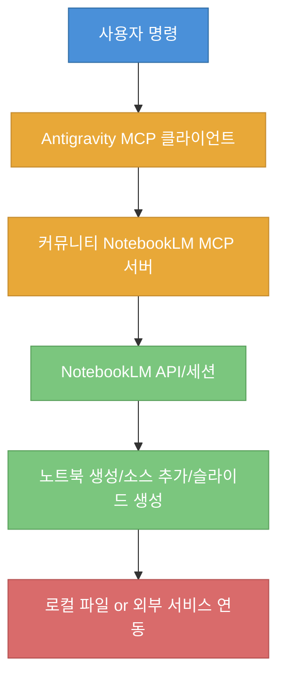
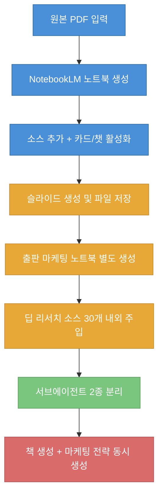

이 글은 AI 겸임교수 이종범 님의 실습 영상을 바탕으로, NotebookLM 단일 사용을 넘어 `Antigravity + MCP 허브 + Notion`까지 연결했을 때 실제로 어떤 자동화 파이프라인이 만들어지는지 정리한 실행 노트입니다 ([t=16](https://youtu.be/geBad4VaEPI?t=16), [t=734](https://youtu.be/geBad4VaEPI?t=734)).

<!--more-->

## Sources

- https://www.youtube.com/watch?v=geBad4VaEPI

## 1) 구조 이해: "공식 MCP 부재"를 커뮤니티 브리지로 우회하는 방식

영상의 출발점은 간단합니다. Antigravity에는 여러 MCP 서버가 기본 제공되지만 NotebookLM은 공식 MCP 서버를 제공하지 않기 때문에, GitHub에 공개된 커뮤니티 MCP 서버를 설치해 연결합니다 ([t=96](https://youtu.be/geBad4VaEPI?t=96), [t=150](https://youtu.be/geBad4VaEPI?t=150)).

핵심은 "NotebookLM을 직접 확장"하는 것이 아니라, MCP를 지원하는 실행 환경(예: Antigravity, CLI 계열)에서 NotebookLM 작업을 프록시처럼 호출하는 운영 모델이라는 점입니다 ([t=248](https://youtu.be/geBad4VaEPI?t=248), [t=296](https://youtu.be/geBad4VaEPI?t=296)).

운영 관점에서 중요한 포인트는 계정 인증입니다. 설치 중 구글 로그인 팝업을 통해 NotebookLM 노트북 목록을 불러오고, 이후 생성/조회/추가/공유 계열 작업이 가능한 상태로 전환됩니다 ([t=187](https://youtu.be/geBad4VaEPI?t=187), [t=223](https://youtu.be/geBad4VaEPI?t=223)).

## 2) 실습 파이프라인: PDF 투입 -> 슬라이드 생성 -> 서브에이전트 분리

첫 번째 데모는 PDF를 기반으로 새 NotebookLM 노트북을 생성하고 소스를 넣는 흐름입니다. 즉, 소스 업로드를 웹 UI에서 수동으로 하지 않고 MCP 명령으로 실행해 "자료 준비" 단계를 자동화합니다 ([t=331](https://youtu.be/geBad4VaEPI?t=331), [t=376](https://youtu.be/geBad4VaEPI?t=376)).

이어 같은 노트북으로 슬라이드 생성을 지시해 폴더에 PDF/PPTX 결과물을 저장합니다. 영상에서는 산출물 생성은 빠르지만 PPT가 통이미지 중심이라 후편집 유연성이 낮다는 실무적 제약도 함께 확인합니다 ([t=437](https://youtu.be/geBad4VaEPI?t=437), [t=509](https://youtu.be/geBad4VaEPI?t=509)).

다음 단계에서 발표자는 출판 마케팅 주제로 별도 노트북을 만들고 딥 리서치 기반 소스를 대량 주입한 뒤, 두 노트북(책 집필/마케팅)을 각각 서브에이전트로 분리해 역할 기반 자동화를 구성합니다 ([t=579](https://youtu.be/geBad4VaEPI?t=579), [t=671](https://youtu.be/geBad4VaEPI?t=671)).

여기서 얻을 수 있는 실전 인사이트는 "모델 하나에 모든 역할을 몰아주기"보다, 근거 소스가 다른 노트북을 역할별 에이전트로 분리하는 편이 산출물 통제가 쉽다는 점입니다 ([t=687](https://youtu.be/geBad4VaEPI?t=687), [t=726](https://youtu.be/geBad4VaEPI?t=726)).

## 3) Notion MCP 연결: 최종 저장 자동화와 실제 병목

영상 후반부는 생성된 원고/전략 문서를 Notion으로 보내는 단계에 집중합니다. Antigravity에서 Notion MCP를 설치하고 Notion API 토큰을 발급해 연결한 뒤, 페이지 단위 저장을 수행합니다 ([t=743](https://youtu.be/geBad4VaEPI?t=743), [t=792](https://youtu.be/geBad4VaEPI?t=792)).

중요한 운영 제약도 드러납니다. 워크스페이스 최상위에 바로 쓰기보다 "기존 페이지 아래 하위 페이지" 방식이 필요할 수 있어, 사전에 연결 대상 페이지를 만들고 통합 연결을 허용해야 저장이 안정적으로 진행됩니다 ([t=764](https://youtu.be/geBad4VaEPI?t=764), [t=812](https://youtu.be/geBad4VaEPI?t=812)).

이후 재실행을 통해 본문 구조(장/절 및 코드 블록 포함)까지 올라가는 것을 확인하는데, 이는 MCP 자동화에서 "권한과 타깃 페이지 설정"이 프롬프트 품질만큼 중요하다는 사례입니다 ([t=827](https://youtu.be/geBad4VaEPI?t=827), [t=835](https://youtu.be/geBad4VaEPI?t=835)).

## 4) 운영 체크포인트: 데모를 실무 파이프라인으로 옮길 때

영상 설명을 그대로 따르면 생산성은 크게 올라가지만, 동시에 검증 루틴을 넣지 않으면 품질 흔들림도 빠르게 커집니다. 특히 슬라이드 후편집 제약, 자동 생성 분량 검증, 외부 저장소 권한 문제는 초기에 체크리스트화하는 것이 안전합니다 ([t=509](https://youtu.be/geBad4VaEPI?t=509), [t=812](https://youtu.be/geBad4VaEPI?t=812)).

실무에서는 최소한 "생성 전 목표 정의 -> 생성 후 구조 검증 -> 게시 전 저장 검증"의 3단 점검을 자동화 루프에 포함해야 반복 사용 시 누적 오류를 줄일 수 있습니다 ([t=720](https://youtu.be/geBad4VaEPI?t=720), [t=830](https://youtu.be/geBad4VaEPI?t=830)).

## Practical Takeaways

- NotebookLM 공식 MCP 부재는 커뮤니티 MCP 서버로 우회 가능하지만, 인증/권한/안정성은 별도 운영 항목으로 관리해야 합니다 ([t=150](https://youtu.be/geBad4VaEPI?t=150)).
- "자료 수집 노트북"과 "실행/마케팅 노트북"을 분리해 서브에이전트화하면 역할 충돌을 줄이고 프롬프트 설계를 단순화할 수 있습니다 ([t=671](https://youtu.be/geBad4VaEPI?t=671)).
- 슬라이드/PPT 산출물은 생성 속도는 빠르지만 편집 제약이 있으므로 배포 전 수동 보정 시간을 계획에 포함해야 합니다 ([t=509](https://youtu.be/geBad4VaEPI?t=509)).
- Notion 저장 자동화는 토큰 발급보다 "페이지 연결 권한"이 실무 병목이 되기 쉬우니, 템플릿 페이지를 먼저 준비하는 방식이 안전합니다 ([t=812](https://youtu.be/geBad4VaEPI?t=812)).

## Conclusion

이 영상의 핵심 가치는 "NotebookLM을 더 똑똑하게 쓰는 팁"을 넘어, MCP를 허브로 두고 생성-가공-저장을 하나의 파이프라인으로 엮는 운영 관점을 보여준다는 점입니다. 실무에 적용할 때는 기능 데모를 그대로 복제하기보다, 권한 설계와 검증 루틴을 먼저 고정해 두면 자동화의 속도 이점을 훨씬 안정적으로 가져갈 수 있습니다 ([t=16](https://youtu.be/geBad4VaEPI?t=16), [t=835](https://youtu.be/geBad4VaEPI?t=835)).
