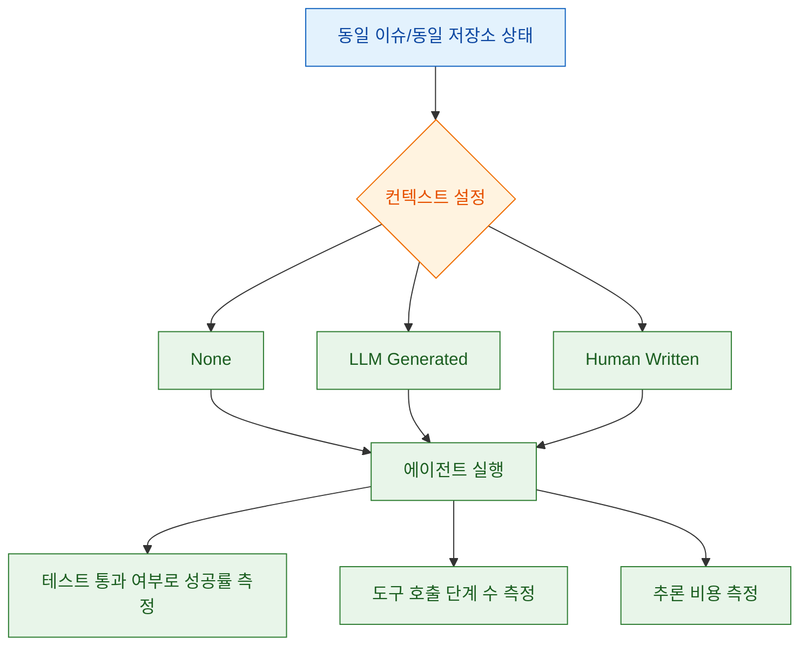
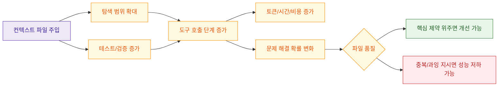

## Intro

`AGENTS.md` 같은 저장소 수준 컨텍스트 파일은 이제 많은 팀의 기본 관행이 되었습니다. 하지만 "권장된다"는 사실과 "실제로 성능이 좋아진다"는 사실은 다를 수 있습니다. 이 글은 **Evaluating AGENTS.md: Are Repository-Level Context Files Helpful for Coding Agents?**(arXiv:2602.11988v1)의 실험 설계와 결과를 중심으로, 언제 컨텍스트 파일이 도움이 되고 언제 오히려 비용만 키우는지 정리합니다.

<!--more-->

## Sources

- https://arxiv.org/html/2602.11988v1
- Extraction method: `http` (`webfetch` 기반 원문 본문 추출)

## 1) 논문이 실제로 검증한 것: "컨텍스트 파일 유무"가 아니라 "세 가지 설정 비교"

이 논문의 강점은 단순 찬반이 아니라, 동일한 문제를 세 가지 설정으로 비교했다는 점입니다.

- `None`: 컨텍스트 파일 없음
- `LLM`: 에이전트 권장 방식으로 자동 생성한 컨텍스트 파일
- `Human`: 저장소 개발자가 실제 커밋해 둔 컨텍스트 파일 (AGENTbench에서만 가능)

저자들은 두 벤치마크를 함께 사용합니다.

1. `SWE-bench Lite`: 잘 알려진 인기 저장소 중심
2. `AGENTbench`: 저자들이 새로 만든 벤치마크 (개발자 작성 컨텍스트 파일이 실제로 존재하는 저장소 중심)

핵심은 "컨텍스트 파일이 있으면 무조건 좋아진다"가 아니라, **어떤 방식으로 만들어진 파일인지**에 따라 결과가 달라진다는 점입니다.

## 2) 주요 결과: 자동 생성 컨텍스트는 성능 저하 가능성, 비용 증가는 일관적

논문 초록과 본문에서 반복되는 메시지는 명확합니다.

- LLM 생성 컨텍스트 파일은 여러 설정에서 성공률을 낮추는 경향이 있었다.
- 동시에 추론 비용은 평균적으로 20% 이상 증가했다.
- 개발자 작성 컨텍스트 파일은 성능을 평균 4% 정도 올리는 경우가 있었지만, 이 경우에도 단계 수와 비용 증가는 피하지 못했다.

즉, "컨텍스트를 넣으면 더 똑똑해진다"보다, **컨텍스트가 추가 행동(탐색, 테스트, 검증 루프)을 얼마나 유발하느냐**가 비용과 성공률을 좌우합니다.

## 3) 왜 이런 일이 생기나: 컨텍스트 파일은 "탐색 비용"을 바꾼다

논문의 trace 분석 섹션은 중요한 힌트를 줍니다.

- 에이전트는 컨텍스트 파일 지시를 대체로 따르는 편이다.
- 그 결과 더 많은 탐색과 테스트를 수행하게 된다.
- 이는 생각 단계와 호출 단계를 늘려 비용을 키운다.

여기서 실무적으로 중요한 포인트는, 컨텍스트 파일이 정답을 직접 제공하기보다 **행동 정책(policy)을 바꾼다**는 사실입니다. 정책이 정확하면 도움이 되지만, 과도하거나 중복되면 오히려 문제 해결 루프를 길게 만듭니다.

## 4) AGENTbench 자체의 의미: "현실 저장소"에서 본 결과

AGENTbench는 컨텍스트 파일이 실제로 쓰이는 저장소를 기준으로 만들어졌다는 점에서 의미가 큽니다.

- 12개 저장소, 138개 인스턴스
- 버그 수정과 기능 추가를 모두 포함
- 테스트 기반 성공 판정(pass/fail) 구조

즉, 인기 벤치마크에서만 보던 결과가 아니라, 컨텍스트 파일이 이미 운영되는 저장소에서도 비슷한 비용/효율 트레이드오프가 관찰됩니다. "우리 팀은 예외일 것"이라는 가정부터 검증해야 한다는 메시지로 읽을 수 있습니다.

## 핵심 내용

- 자동 생성 컨텍스트 파일은 성능을 보장하지 않으며, 비용 증가가 더 일관적으로 관찰된다.
- 개발자 작성 컨텍스트 파일도 만능이 아니고, 성능 소폭 개선과 비용 증가가 함께 나타날 수 있다.
- 컨텍스트 파일의 가치는 문서 길이가 아니라 "행동 정책을 얼마나 정확히 좁히는가"에 달려 있다.

## 실전 적용 포인트

- `AGENTS.md`에는 저장소에서 바로 추론 가능한 일반 설명보다, 실패 시 비용이 큰 **비복구성 규칙**(필수 명령, 금지 경로, 배포 안전 규칙)을 우선 기록합니다.
- 자동 생성 파일을 그대로 고정하지 말고, PR 단위로 "이번 작업에 실제로 기여한 문장"만 남기는 감량 루프를 운영합니다.
- 컨텍스트 파일 효과는 "체감"이 아니라 **성공률/평균 단계 수/작업당 비용**으로 측정해 유지 여부를 결정합니다.
- 팀 규칙을 늘릴 때는 "탐색 범위를 넓히는 지시인지"를 먼저 점검합니다. 넓히는 규칙이 많아질수록 비용이 빠르게 증가합니다.
- 루트 파일 하나에 모든 규칙을 넣기보다, 도메인별 분리와 선택 로드 전략으로 작업별 컨텍스트를 줄입니다.

## 결론

이 논문이 주는 결론은 단순합니다. 컨텍스트 파일은 "있으면 무조건 이득"이 아니라 **품질과 밀도에 따라 성능을 깎을 수도 있는 운영 도구**입니다. 특히 자동 생성 컨텍스트는 비용 증가 대비 성능 이득이 불안정하므로, 팀은 "문서를 많이 쓰는 것"보다 "문서가 행동 비용을 어떻게 바꾸는지"를 먼저 측정해야 합니다. 결국 좋은 컨텍스트 파일은 긴 개요가 아니라, 에이전트가 실패하지 않도록 만드는 최소한의 고신호 규칙 집합입니다.
