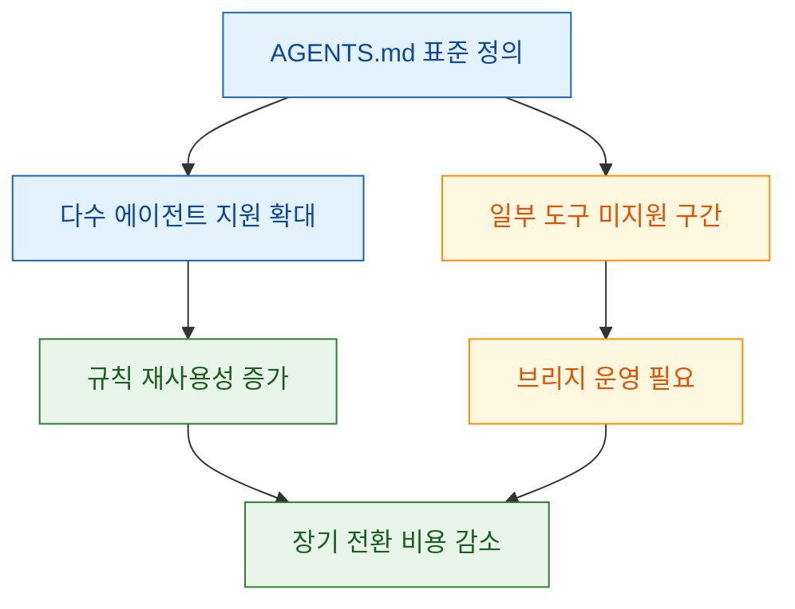
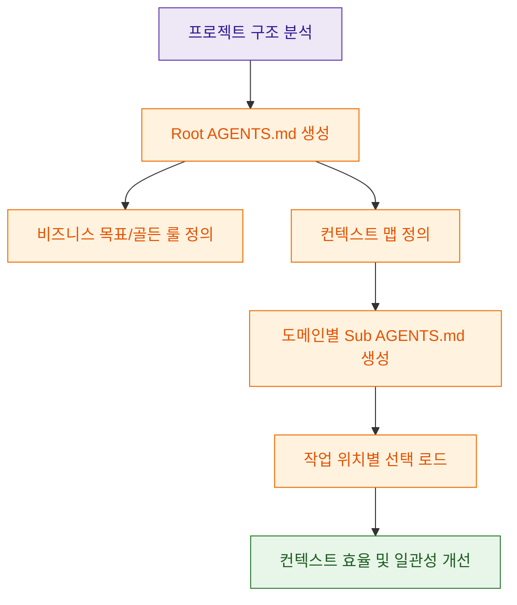

## Intro

코딩 에이전트를 여러 개 병행해서 쓰기 시작하면, 규칙 파일이 가장 먼저 운영 비용으로 돌아옵니다. 어떤 도구는 `CLAUDE.md`, 어떤 도구는 자체 규칙 포맷을 요구하다 보니, 같은 팀 규칙이 파일 이름만 바꿔 중복 관리되는 상황이 반복됩니다. 이번 영상은 이 문제를 `AGENTS.md`라는 공통 규칙 파일로 정리하자는 제안이며, 핵심은 "파일을 하나 더 늘리는 것"이 아니라 "규칙의 기준면을 하나로 맞추는 것"입니다.

<!--more-->

## Sources

- https://www.youtube.com/watch?v=LHx_EFoLonQ

## 1) 왜 AGENTS.md가 필요한가: "도구별 규칙"이 아니라 "프로젝트 규칙"으로 전환

영상 초반의 문제 정의는 명확합니다. 팀이 여러 코딩 에이전트를 오가며 일할수록 규칙 파일 포맷이 분산되고, 동일한 운영 지침이 여러 파일에 중복됩니다. 이 상태에서는 규칙 품질보다 "동기화 비용"이 먼저 커집니다. AGENTS.md 접근의 실무적 의미는 특정 벤더 파일을 대체하는 게 아니라, 프로젝트 단위 규칙을 한 표준으로 정의하고 각 에이전트가 이를 해석하게 만드는 데 있습니다.

근거 메모:

| claim | evidence | video url | confidence |
|---|---|---|---|
| 여러 에이전트 사용 시 규칙 파일 포맷 분산이 운영 고민으로 이어짐 | 영상 도입부에서 Cursor/Claude/Gemini 등 규칙 파일 분산 문제를 제시 | https://youtu.be/LHx_EFoLonQ?t=4 | High |
| AGENTS.md를 "하나로 정의/관리"하는 목적이 소개됨 | "모든 규칙 파일을 하나로 정의"라는 문제 해결 방향 제시 | https://youtu.be/LHx_EFoLonQ?t=35 | High |

## 2) 표준으로서의 AGENTS.md: 채택 포인트와 아직 남은 호환성 이슈

영상은 AGENTS.md를 OpenAI Codex 팀이 시작한 표준으로 소개하고, 현재 다수 코딩 에이전트가 이를 지원한다고 설명합니다. 동시에 일부 도구(영상 기준 Claude Code)에서는 지원 공백이 있다는 점도 함께 짚습니다. 중요한 해석은 "완전한 보편 지원 전이라도 표준 파일을 먼저 채택할 가치가 있는가"인데, 영상의 입장은 "그렇다"입니다. 이유는 팀 내부 규칙 체계를 미리 표준화해 두면, 도구별 지원 편차가 줄어들 때 전환 비용이 훨씬 작아지기 때문입니다.

근거 메모:

| claim | evidence | video url | confidence |
|---|---|---|---|
| AGENTS.md는 에이전트에 필요한 맥락/지침을 주입하는 표준 파일로 소개됨 | OpenAI Codex 팀 발표 및 표준 규칙 파일 설명 | https://youtu.be/LHx_EFoLonQ?t=95 | High |
| 다수 코딩 에이전트 지원과 일부 미지원 상황이 함께 언급됨 | 지원 도구 목록 소개 + Claude Code 미지원 불만 사례 언급 | https://youtu.be/LHx_EFoLonQ?t=185 | Medium |

## 3) 효율적인 파일 설계 원칙: 500줄 제한 + 중첩 구조 + 코드와 동시 버전 관리

영상에서 가장 실무적인 부분은 구조 원칙입니다. 핵심은 세 가지입니다. 첫째, 단일 파일이 비대해지면 컨텍스트 예산을 지속 소모하므로 루트 파일은 작게 유지합니다. 둘째, 프로젝트가 커질수록 도메인별 하위 AGENTS.md로 분할해 필요한 컨텍스트만 선택적으로 로드하게 만듭니다. 셋째, 코드는 바뀌었는데 규칙은 옛 상태로 남지 않도록, 코드 변경과 규칙 변경을 같은 버전 관리 흐름에서 다룹니다.

이 원칙의 본질은 "문서를 길게 쓰는 것"이 아니라 "작업 순간에 필요한 문맥만 주입하는 라우팅"입니다. 그래서 루트 파일은 관제탑(정책), 하위 파일은 실행 규칙(도메인) 역할로 나누는 것이 안정적입니다.

근거 메모:

| claim | evidence | video url | confidence |
|---|---|---|---|
| 하나의 AGENTS.md를 500줄 이내로 유지하자는 권고 | 컨텍스트 윈도우/토큰 효율 관점 설명 | https://youtu.be/LHx_EFoLonQ?t=495 | High |
| 큰 프로젝트일수록 중첩된 여러 규칙 파일이 효율적 | 루트 + 서브 파일 분리 전략 제시 | https://youtu.be/LHx_EFoLonQ?t=585 | High |
| 코드와 함께 규칙 파일도 버전 관리 및 리뷰 대상이어야 함 | 코드 리뷰/온보딩에서 AGENTS.md 중요성 강조 | https://youtu.be/LHx_EFoLonQ?t=655 | High |

## 4) 마스터 프롬프트 운영 방식: 루트 관제탑과 하위 컨텍스트 맵 자동 생성

영상 후반은 실제 적용 흐름을 보여줍니다. 아이디어는 "프로젝트 구조를 먼저 읽고, 루트 파일과 하위 파일을 역할 분리해 생성"하는 것입니다. 루트는 비즈니스 목표, 골든 룰, 공통 실행 규칙을 담고, 세부 구현 지침은 컨텍스트 맵 링크를 따라 하위 파일에서 관리합니다. 결과적으로 작업 위치(API, UI, infra)에 따라 읽히는 규칙이 달라져 컨텍스트 낭비가 줄어듭니다.

근거 메모:

| claim | evidence | video url | confidence |
|---|---|---|---|
| 루트 파일을 관제탑 역할로 두고 하위 파일로 위임하는 구조 제시 | 루트/서브 역할 분리와 컨텍스트 맵 설명 | https://youtu.be/LHx_EFoLonQ?t=900 | High |
| 마스터 프롬프트로 프로젝트 구조 기반 자동 생성 데모 제공 | 실제 생성 결과(루트 + 서브 파일) 시연 | https://youtu.be/LHx_EFoLonQ?t=1040 | High |

## 실전 적용 포인트

- 규칙을 먼저 "도구별 파일"로 만들지 말고, 프로젝트 표준 규칙(`AGENTS.md`)을 먼저 정의한 뒤 도구 적응 계층을 얇게 둡니다.
- 루트 파일에는 전역 불변 규칙(보안, 배포 금지 경로, 필수 명령)만 남기고, 구현 규칙은 도메인 하위 파일로 분할합니다.
- 하위 파일은 300~500줄 내에서 관리하고, 작업 경계(프레임워크/의존성/비즈니스 영역)가 바뀔 때만 세분화합니다.
- PR 리뷰 체크리스트에 "코드 변경 시 관련 AGENTS.md 갱신 여부"를 추가해 규칙 드리프트를 막습니다.
- 온보딩 문서와 AGENTS.md를 분리하지 말고, 실행/테스트/금지사항은 AGENTS.md를 단일 기준으로 유지합니다.

## 결론

AGENTS.md의 핵심 가치는 "파일 이름 통일"이 아니라 "규칙 운영 체계 통일"입니다. 단일 거대 문서보다 루트-하위 구조로 컨텍스트를 선택 로드하고, 코드와 함께 규칙을 계속 버전 관리해야 실제 성능 개선으로 이어집니다. 결국 좋은 규칙 파일은 많이 쓰는 문서가 아니라, 필요한 순간에 정확히 호출되는 작고 살아있는 실행 정책입니다.
