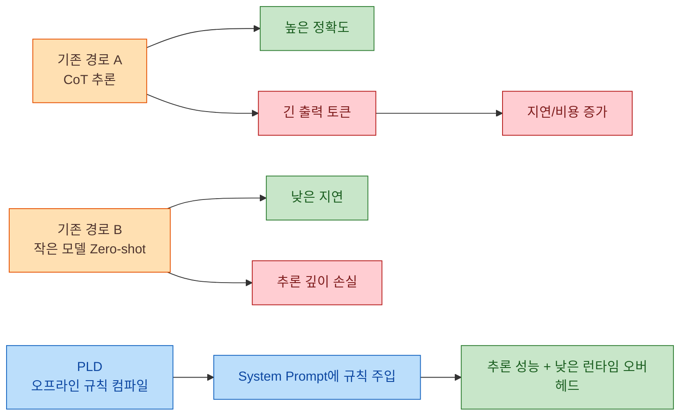
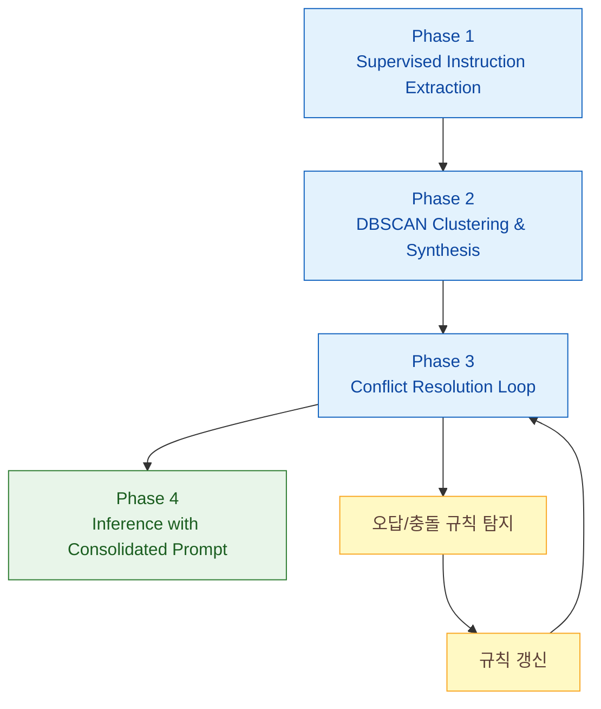

Chain-of-Thought(CoT) 는 정확도를 올리지만, 추론 토큰이 길어질수록 지연과 비용이 함께 증가합니다. 이 논문은 이 문제를 "모델 가중치"가 아니라 "시스템 프롬프트"에 추론 규칙을 컴파일하는 방식으로 풀며, 이를 Prompt-Level Distillation(PLD) 이라고 정의합니다 (근거: https://arxiv.org/html/2602.21103v1#S1, https://arxiv.org/html/2602.21103v1#S3).

<!--more-->

## Sources

- https://arxiv.org/html/2602.21103v1

수집 메모:
- extraction_method: `http` (webfetch)
- fallback_used: `false`

## 1) PLD가 풀고자 한 문제: CoT 정확도 vs 운영 지연/비용

논문은 기존 선택지가 사실상 두 가지였다고 봅니다. (1) CoT 기반 고성능 추론을 유지하되 지연/비용을 감수하거나, (2) 작은 모델의 zero-shot 속도를 택하되 reasoning depth를 포기하는 방식입니다. 저자들은 이 트레이드오프를 "런타임에서 추론을 생성"하는 대신 "오프라인에서 추론 규칙을 정리"함으로써 완화하려고 합니다 (근거: https://arxiv.org/html/2602.21103v1#S1, https://arxiv.org/html/2602.21103v1#S2.SS1).

중요한 차이는, 전통적 KD처럼 student의 파라미터를 업데이트하지 않는다는 점입니다. 즉, reasoning transfer의 저장 위치를 weight에서 prompt로 옮겨, 재학습/아티팩트 관리 부담을 줄이겠다는 접근입니다 (근거: https://arxiv.org/html/2602.21103v1#S2.SS2).

## 2) 핵심 방법론: 4단계 파이프라인으로 규칙을 뽑고 다듬기

PLD 파이프라인은 네 단계로 구성됩니다: (1) 지도형 instruction 추출, (2) 클러스터링 기반 논리 합성, (3) conflict resolution 루프, (4) 최종 추론 배포. 특히 3단계가 단순 요약과 구분되는 포인트인데, student의 오류 사례를 다시 teacher 계열 모델에 넣어 규칙 충돌을 줄이는 폐루프를 만듭니다 (근거: https://arxiv.org/html/2602.21103v1#S3, https://arxiv.org/html/2602.21103v1#S3.SS3).

또한 2단계에서 DBSCAN을 사용해 "일반화 불가능한 노이즈 규칙"을 버리고 밀집된 추론 패턴을 합치는 설계는, 규칙 라이브러리의 품질을 높이는 장치로 제시됩니다 (근거: https://arxiv.org/html/2602.21103v1#S3.SS2).

## 3) 실험 결과 해석: "작은 모델의 추론 역량"을 얼마나 끌어올렸나

논문 표에 따르면 Gemma-3 4B 기준으로 StereoSet은 zero-shot 0.57에서 0.90까지, Contract-NLI는 0.67에서 0.83까지 macro-F1이 상승합니다. 즉, 소형 모델에서 PLD의 개선폭이 특히 크게 나타났습니다 (근거: https://arxiv.org/html/2602.21103v1#S3.T1, https://arxiv.org/html/2602.21103v1#S5.SS1).

저자 해석의 핵심은 두 가지입니다. 첫째, compact model과 teacher급 모델 간 성능 간극을 줄였다는 점. 둘째, 특히 Contract-NLI처럼 규칙 충돌이 많은 데이터셋에서 conflict resolution 단계가 추가 개선을 만들었다는 점입니다 (근거: https://arxiv.org/html/2602.21103v1#S5.SS2).

주의할 부분도 분명합니다. 본 결과는 특정 데이터셋(Contract-NLI, StereoSet)과 모델 조합에서 측정되었으므로, 다른 도메인으로 일반화할 때는 동일한 추출/합성/검증 루프를 재현해야 합니다 (근거: https://arxiv.org/html/2602.21103v1#S4.SS3, https://arxiv.org/html/2602.21103v1#S7).

## 4) 왜 이 방식이 실무에서 의미가 큰가

PLD는 "모델을 다시 학습시키는 팀"보다 "규칙을 검증하고 업데이트하는 팀"에 더 맞는 운영 모델을 제시합니다. 논문이 강조하듯, 자연어 규칙 형태는 사람 검토가 가능해 규제 도메인(법률/금융/모더레이션)에서 감사 가능성을 높일 수 있습니다 (근거: https://arxiv.org/html/2602.21103v1#S1, https://arxiv.org/html/2602.21103v1#S8).

다만 규칙 집합이 커질수록 프롬프트 길이 관리와 규칙 충돌 관리가 새 병목이 될 수 있습니다. 따라서 "한 번 추출 후 고정"이 아니라, 데이터 분포 변화 시 주기적으로 conflict loop를 다시 돌리는 운영 절차가 필요합니다 (근거: https://arxiv.org/html/2602.21103v1#S3.SS3, https://arxiv.org/html/2602.21103v1#S7).

## 실전 적용 포인트

1. 먼저 업무를 규칙 기반 분류/판단 태스크로 쪼개고, label 품질이 높은 데이터셋부터 PLD 후보로 선정하세요.
2. Phase 1에서 추출된 micro-instruction을 그대로 쓰지 말고, 군집/노이즈 제거를 거쳐 "재사용 가능한 규칙"만 남기세요.
3. student 오답 샘플을 conflict loop에 재투입해 규칙 충돌을 줄이는 폐루프를 운영 파이프라인으로 고정하세요.
4. 모델 KPI(정확도)와 운영 KPI(지연, 비용, 감사 가능성)를 동시에 정의해 프롬프트 업데이트 기준을 명문화하세요.
5. 도메인 확장 시에는 기존 규칙을 복붙하지 말고, 데이터셋별로 규칙 라이브러리를 분리 관리하세요.

## 결론

PLD의 핵심은 "추론을 생성하는 비용"을 런타임에서 오프라인으로 이동시킨다는 점입니다. 이 접근은 작은 모델의 경제성을 유지하면서도, 규칙 기반 reasoning 성능을 유의미하게 끌어올릴 가능성을 보여줍니다.

결국 이 논문이 던지는 실무 메시지는 명확합니다. 미세튜닝만이 reasoning transfer의 답은 아니며, 잘 설계된 시스템 프롬프트와 conflict-aware 운영 루프만으로도 충분히 경쟁력 있는 추론 시스템을 만들 수 있습니다.
