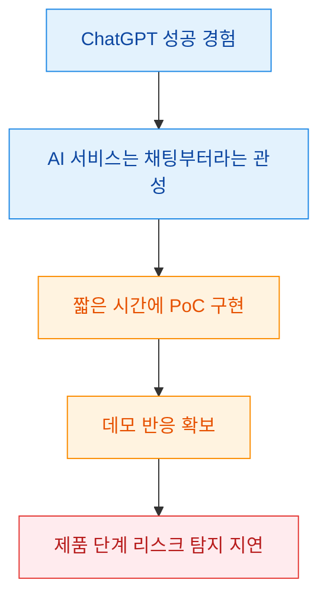
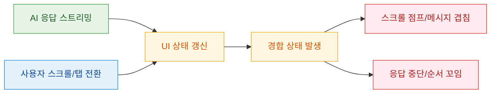
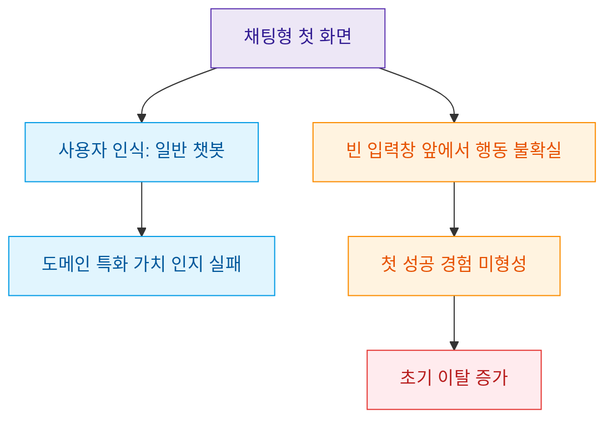
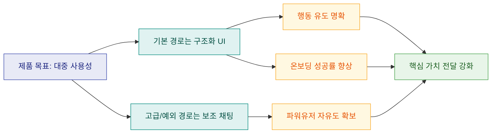

많은 팀이 AI 서비스를 시작할 때 가장 먼저 채팅창부터 붙입니다. 영상은 이 선택이 PoC 단계에서는 빨리 성과를 보여 주지만, 실제 사용자 단계에서는 안정성·차별화·온보딩에서 동시에 발목을 잡는다고 설명합니다. 핵심은 "채팅이 익숙해 보이는 인터페이스"와 "우리 제품의 핵심 가치를 전달하는 인터페이스"를 구분해야 한다는 점입니다.

<!--more-->

## Sources

- https://youtu.be/X4X1pSs87rM

> 참고: 이 글의 시간 기반 인용은 YouTube 자동 생성 자막(ko) 기준으로 정리했습니다. 자동 자막 특성상 일부 단어 표기는 문맥 기반으로 보정했습니다.

## 1) 왜 팀은 채팅 UI부터 시작하게 되는가: 빠른 PoC의 착시

영상의 출발점은 단순합니다. ChatGPT 성공 이후 "AI 서비스 = 채팅"이 기본 공식처럼 굳어졌고, 팀은 가장 익숙한 형태를 빠르게 붙입니다. 실제로 발표/데모 관점에서는 채팅 UI가 "동작하는 느낌"을 가장 빨리 만들기 쉽습니다. 문제는 이 빠른 성공이 제품 완성도 리스크를 가리는 착시가 된다는 점입니다.

### 증거 노트

- claim: ChatGPT 이후 채팅 UI가 AI 서비스 기본 형태로 고정되었다.
  - transcript quote/time marker: "그때부터 AI 이퀄 채팅이라는 공식이 거의 고정" (00:33-00:37)
  - video url: https://youtu.be/X4X1pSs87rM?t=33
  - confidence: high
- claim: 채팅 UI는 PoC와 데모 단계에서 빠르게 70% 수준 완성도를 만들기 쉽다.
  - transcript quote/time marker: "채팅 UI로 만들면 처음에는 빠르게... 70% 완성도까지 순식간" (00:46-00:50)
  - video url: https://youtu.be/X4X1pSs87rM?t=46
  - confidence: high

## 2) 제품화 시점의 첫 번째 실패: 스트리밍과 사용자 행동이 충돌하는 상태 불안정

영상은 채팅 UI의 첫 번째 치명점으로 "실사용 상호작용 동시성"을 짚습니다. AI가 답변을 스트리밍하는 동안 사용자가 다른 스레드로 이동하거나 스크롤/터치를 하면 화면 점프, 메시지 겹침, 응답 중단 같은 문제가 누적됩니다. 이 문제는 단순 렌더링 버그가 아니라, 스트리밍 상태·스크롤 상태·포커스 상태를 동시에 관리해야 하는 아키텍처 문제에 가깝습니다.

실무 관점에서 중요한 포인트는 "버그를 고치면 끝나는 종류인가"입니다. 영상의 뉘앙스는 반대입니다. 케이스를 하나 고치면 다른 사용자 행동 조합에서 다시 터지는 구조라서, 채팅 UI는 완성도 상승 비용이 후반으로 갈수록 급격히 증가합니다.

### 증거 노트

- claim: 스트리밍 중 사용자 개입은 UI 불안정과 자잘한 버그를 대량으로 유발한다.
  - transcript quote/time marker: "스크롤이 엉뚱한 대로... 메시지가 겹쳐... 답변이 멈추" (01:24-01:33)
  - video url: https://youtu.be/X4X1pSs87rM?t=84
  - confidence: high
- claim: 이 문제를 완벽히 처리하기는 체감보다 훨씬 어렵다.
  - transcript quote/time marker: "이걸 완벽하게 처리하는게 생각보다 훨씬 어려워요" (01:40-01:43)
  - video url: https://youtu.be/X4X1pSs87rM?t=100
  - confidence: high

## 3) 두 번째/세 번째 실패: 차별점 소멸과 온보딩 붕괴

영상은 기술적 안정성보다 더 치명적인 문제로 "제품 인식"을 제시합니다. 사용자는 채팅 형태를 보는 순간 "ChatGPT랑 뭐가 다르지?"라는 프레임으로 서비스를 해석하고, 도메인 특화 가치가 인터페이스 형태에 가려집니다. 결과적으로 강한 기능이 있어도 첫인상 단계에서 일반형 챗봇으로 분류됩니다.

또한 채팅 UI는 신규 사용자의 첫 행동을 유도하기 어렵습니다. 빈 입력창은 자유도를 주는 동시에 "무엇을 어떻게 입력해야 하는지"를 사용자에게 전가합니다. 이 지점에서 온보딩 이탈이 발생하고, 제품이 제공하는 핵심 경로를 학습시키기 어려워집니다.

### 증거 노트

- claim: 채팅형 제품은 사용자에게 "ChatGPT와 동일"하게 보이는 인식 문제를 만든다.
  - transcript quote/time marker: "이거 챗지피티랑 뭐가 달라?" (02:13-02:16)
  - video url: https://youtu.be/X4X1pSs87rM?t=133
  - confidence: high
- claim: 채팅 형태 자체가 제품의 특별함을 가려 차별화 전달을 방해한다.
  - transcript quote/time marker: "채팅이라는 형태 자체가 그 특별함을 덮어" (02:22-02:45)
  - video url: https://youtu.be/X4X1pSs87rM?t=142
  - confidence: high
- claim: 빈 채팅창은 신규 사용자 온보딩에 구조적으로 불리하다.
  - transcript quote/time marker: "빈 채팅창... 뭘 입력해야 할지 모르는" (03:08-03:13)
  - video url: https://youtu.be/X4X1pSs87rM?t=188
  - confidence: high

## 4) 대안 설계: 구조화 UI를 기본으로, 채팅은 선택적 보조로 배치

영상은 채팅 UI를 완전히 부정하지 않습니다. 오히려 "누구를 위한 인터페이스인가"를 분리해 보라고 제안합니다. 프롬프트 활용 능력이 높은 파워유저에게 채팅은 강력하지만, 대다수 사용자에게는 명시적 버튼/폼/선택지 기반 플로우가 더 직관적입니다.

실행 가능한 대안은 두 가지입니다.
첫째, 메인 플로우에서 채팅을 빼고 구조화 입력(버튼, 폼, 슬라이더)으로 핵심 작업을 완결합니다. 둘째, 메인 경험은 전통 UI로 유지하되 고급 조작 구간에서만 채팅 패널을 열어 보조 기능으로 사용합니다. 이 방식은 자유도와 예측 가능성을 동시에 확보하기 좋습니다.

### 증거 노트

- claim: 채팅 UI는 파워유저에게 강력하지만 일반 사용자 비중과는 맞지 않을 수 있다.
  - transcript quote/time marker: "프롬프트 잘 쓰는 분들에겐 강력... 대다수는 막막" (03:50-04:05)
  - video url: https://youtu.be/X4X1pSs87rM?t=230
  - confidence: high
- claim: 대안 1은 채팅 제거 후 버튼/폼/선택지 기반 구조화 입력이다.
  - transcript quote/time marker: "첫 번째는 채팅을 아예 빼는 거예요" (04:23-04:37)
  - video url: https://youtu.be/X4X1pSs87rM?t=263
  - confidence: high
- claim: 대안 2는 메인 기능은 전통 UI, 채팅은 특정 상황의 보조 기능이다.
  - transcript quote/time marker: "두 번째는 채팅을 보조 기능으로만" (04:44-04:56)
  - video url: https://youtu.be/X4X1pSs87rM?t=284
  - confidence: high

## 실전 적용 포인트

1. 기능 우선순위를 먼저 정의하고, 각 기능에 대해 "자유 입력이 꼭 필요한가"를 체크해 UI 타입을 분기하세요.
2. 메인 전환 퍼널(가입 직후 첫 결과 생성)은 채팅 없이 완료되게 설계해 초기 성공 경험을 보장하세요.
3. 채팅을 쓰더라도 기본값을 "열림"이 아니라 "필요 시 호출"로 두고, 템플릿 프롬프트·추천 액션으로 진입 장벽을 낮추세요.
4. 스트리밍 UI는 스크롤 고정, 중단/재개, 메시지 상태(생성 중/완료/실패) 모델을 분리해 상태 경합을 줄이세요.
5. "왜 우리 제품을 ChatGPT 대신 써야 하는가"를 첫 화면의 조작 요소만 보고도 이해되게 만드세요.

## 핵심 요약

- 채팅 UI는 PoC 속도는 빠르지만 제품 완성도 비용이 뒤로 밀려 누적되는 구조다.
- 사용성 문제는 버그만의 문제가 아니라 상태 모델과 온보딩 전략의 문제다.
- 제품 차별화는 모델 성능뿐 아니라 인터페이스가 가치를 드러내는 방식에서 결정된다.
- 대중 제품이라면 구조화 UI를 기본으로 두고 채팅은 선택적 보조 기능으로 쓰는 편이 안전하다.

## 결론

이 영상의 메시지는 "채팅 UI를 쓰지 말라"가 아니라, "채팅을 기본값으로 가정하지 말라"에 가깝습니다. AI 제품에서 인터페이스는 단순 입출력 껍데기가 아니라, 사용자가 제품의 가치를 인식하고 반복 사용으로 이어지는 핵심 설계입니다.

채팅을 넣기 전에 먼저 물어야 할 질문은 하나입니다. "이 작업을 채팅으로 해야만 사용자 성공률이 높아지는가?" 이 질문에 근거 있게 답할 수 있을 때 채팅은 강점이 되고, 그렇지 않으면 제품의 차별화를 지우는 함정이 됩니다.
