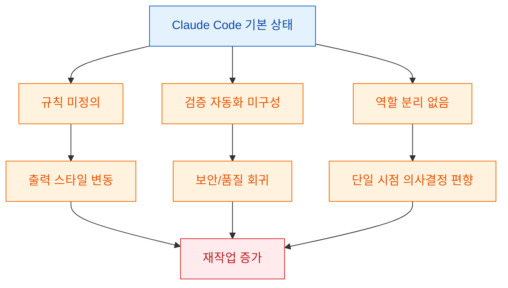
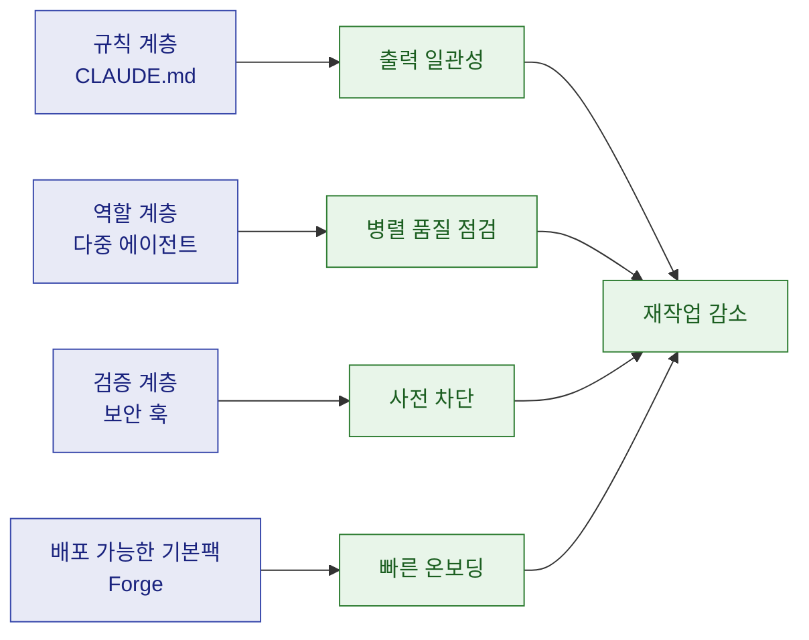
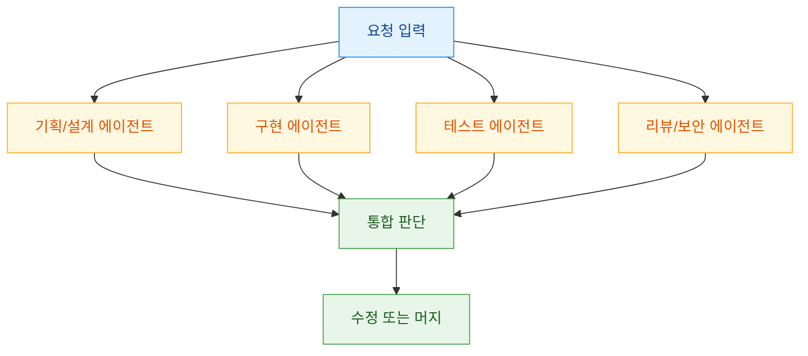
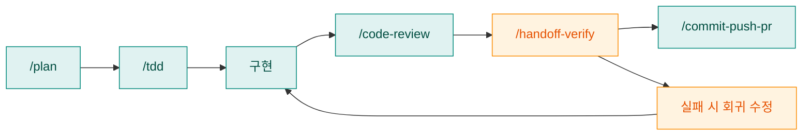
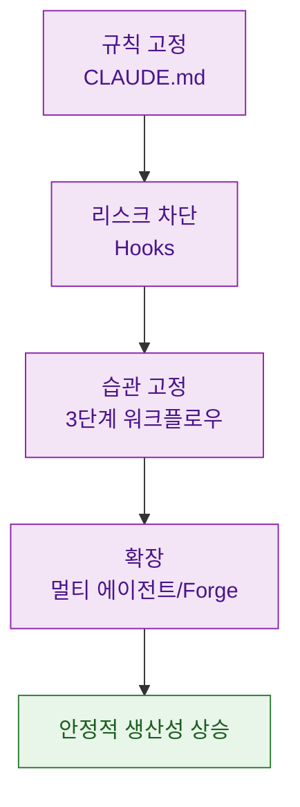

Claude Code를 설치하고 바로 쓰면 빠르게 결과가 나오지만, 팀 규칙 부재·검증 자동화 부재·역할 분리 부재 때문에 곧 한계에 부딪힙니다. 이 글은 Threads 연속 포스트(원글 + 1~5번 설명)를 근거로, "기본 설정 10%"라는 표현이 실제로 어떤 작업 병목을 뜻하는지 구조적으로 해석한 문서입니다. 문서 확인 시점은 **2026-03-02** 입니다.

<!--more-->

## Sources

- https://www.threads.com/@qjc.ai/post/DVYUPtxE9kF
- https://youtu.be/3lMjX5Gq1zE

> 참고: 본 글의 핵심 근거는 Threads 원문(연속 포스트 텍스트)입니다. YouTube 링크는 Threads 본문 내 참조 링크로만 사용했습니다.

## 1) "기본 설정 = 10%"의 의미: 모델 성능이 아니라 작업 시스템의 문제

원문 메시지는 단순히 "더 좋은 프롬프트를 써라"가 아닙니다. 핵심은 개발자가 일하는 시스템(규칙, 역할 분리, 검증 자동화, 재사용 가능한 템플릿)이 빠져 있으면 모델 자체 성능과 별개로 산출물이 흔들린다는 점입니다.

### 증거 노트

- claim: 기본 설정 상태를 "도구의 10%"로 표현하며 설정 필요성을 강조한다.
  - quote: "그거 도구의 10%만 쓰는 거예요."
  - source: https://www.threads.com/@qjc.ai/post/DVYUPtxE9kF
  - confidence: high
- claim: 문제를 "도구 부족한 주방" 비유로 설명한다.
  - quote: "맨손으로 요리... 칼도 없고. 도마도 없고."
  - source: https://www.threads.com/@qjc.ai/post/DVYUPtxE9kF
  - confidence: high

## 2) 세팅의 4축: CLAUDE.md, 에이전트 팀, 보안 훅, Forge 템플릿

연속 포스트 1~4번은 설정 체계를 4개 축으로 압축합니다.

1. `CLAUDE.md`: 프로젝트 규칙(코드 스타일, 테스트 기준, 커밋 규칙) 명시
2. 에이전트 시스템: 역할별 병렬 검토 구조
3. Hooks: 커밋 전 자동 검사 게이트
4. Forge: 위 요소를 즉시 도입 가능한 스타터 패키지화

### 2-1) `CLAUDE.md`는 "프롬프트"가 아니라 "작업 계약"

원문은 `CLAUDE.md`를 "신입사원 업무 매뉴얼"로 비유합니다. 실무적으로는 아래처럼 보는 것이 정확합니다.

- 모델 지시문이 아니라 팀의 실행 계약서
- PR 기준, 테스트 통과 조건, 네이밍 정책을 사전에 고정
- 세션마다 기준이 바뀌는 문제를 줄임

### 증거 노트

- claim: `CLAUDE.md`를 업무 매뉴얼로 정의한다.
  - quote: "CLAUDE.md = 신입사원 업무 매뉴얼"
  - source: https://www.threads.com/@qjc.ai/post/DVYUPtxE9kF
  - confidence: high
- claim: 규칙 부여 시 결과 일관성이 올라간다고 주장한다.
  - quote: "코드 스타일, 테스트 기준, 커밋 규칙. 전부 일관되게"
  - source: https://www.threads.com/@qjc.ai/post/DVYUPtxE9kF
  - confidence: high

### 2-2) 에이전트 시스템은 "속도"보다 "관점 분리" 효과가 크다

원문은 "11명의 AI 전문가 팀"을 제시합니다. 숫자 자체보다 중요한 건 역할 분리입니다: 설계/구현/테스트/리뷰/보안을 같은 맥락에서 독립 검토하면, 단일 시점 오류를 줄이기 쉽습니다.

### 증거 노트

- claim: 역할 분리된 다중 에이전트 체계를 제시한다.
  - quote: "총 11명의 AI 전문가 팀이에요."
  - source: https://www.threads.com/@qjc.ai/post/DVYUPtxE9kF
  - confidence: high
- claim: 병렬 작업으로 검토 밀도를 높인다고 말한다.
  - quote: "각자 독립적으로 동시에 일합니다."
  - source: https://www.threads.com/@qjc.ai/post/DVYUPtxE9kF
  - confidence: high

### 2-3) Hooks는 "사후 리뷰"가 아니라 "사전 차단 게이트"

원문은 훅을 누수 검사에 비유합니다. 핵심은 배포 전 검사보다 더 앞단, 즉 커밋 시점에 위험을 끊어내는 것입니다. 특히 비밀키/토큰 유출은 "나중에 고치기"가 거의 불가능하다는 점에서 선제 차단 가치가 큽니다.

### 증거 노트

- claim: 커밋 전 자동 검사 모델을 제시한다.
  - quote: "코드 커밋 전에 자동으로 검사합니다."
  - source: https://www.threads.com/@qjc.ai/post/DVYUPtxE9kF
  - confidence: high
- claim: 보안 훅 규모를 제시한다.
  - quote: "14개 보안 훅이 상시 가동돼요."
  - source: https://www.threads.com/@qjc.ai/post/DVYUPtxE9kF
  - confidence: high

## 3) 실무 워크플로우로 번역하면: 계획 -> 테스트 -> 리뷰 -> 검증 -> 배포

원문 5번 포스트는 아래 명령 체인을 제시합니다.

- `/plan` -> 기획
- `/tdd` -> 테스트 작성
- `/code-review` -> 코드 리뷰
- `/handoff-verify` -> 최종 검증
- `/commit-push-pr` -> 배포

이 체인의 가치는 "명령어를 외우는 것"이 아니라, 검증 타이밍을 앞당기는 순서 고정에 있습니다. 특히 TDD 단계를 앞에 두면 기능이 아니라 실패 조건부터 명확해져, 후반 회귀 비용을 줄이기 쉽습니다.

### 증거 노트

- claim: 명령 체인 기반 워크플로우를 제시한다.
  - quote: "/plan -> ... -> /commit-push-pr"
  - source: https://www.threads.com/@qjc.ai/post/DVYUPtxE9kF
  - confidence: high
- claim: 테스트 선행을 강조한다.
  - quote: "코드 짜기 전에 테스트부터 만드는 거예요."
  - source: https://www.threads.com/@qjc.ai/post/DVYUPtxE9kF
  - confidence: high

## 4) 도입 우선순위: 5분 설치 주장보다 중요한 것

원문은 "5분 설치"를 강조하지만, 실무에서 더 중요한 건 정착 순서입니다. 권장 순서는 아래처럼 최소 단위부터 잠그는 방식입니다.

1. `CLAUDE.md`에 리뷰/테스트/커밋 규칙 1차 고정
2. 훅으로 보안/금지 패턴 최소 차단
3. `/plan` + `/tdd` + `/code-review` 3단계만 먼저 습관화
4. 이후 역할 분리(에이전트)와 템플릿(Forge)을 확대

> 주의: 원문의 수치(예: 에이전트 11개, 슬래시 커맨드 36개, 스킬 15개, 보안 훅 14개)는 게시글 작성 시점 기준 주장입니다. 도구 버전과 구성에 따라 달라질 수 있으므로 실제 도입 전 현재 환경에서 재확인하는 것이 안전합니다.

## 핵심 요약

- "기본 설정 10%"는 모델 품질 이슈보다 작업 시스템 부재를 지적하는 표현에 가깝습니다.
- 핵심 축은 `CLAUDE.md`(규칙), 에이전트(역할 분리), 훅(사전 차단), Forge(재사용 가능한 패키징)입니다.
- 효과는 "더 똑똑한 AI"보다 "더 일관된 개발 프로세스"에서 먼저 나타납니다.
- 실전에서는 대규모 세팅보다 규칙 고정 -> 훅 적용 -> 워크플로우 고정 순으로 시작하는 편이 실패율이 낮습니다.

## 결론

이 Threads 연속 포스트의 메시지는 명확합니다. Claude Code를 잘 쓰는 핵심은 단일 프롬프트 기술이 아니라, 반복 가능한 작업 운영체계를 먼저 세우는 것입니다. 결국 생산성 차이는 모델 자체보다 "규칙, 검증, 역할, 순서"를 얼마나 시스템으로 고정했는지에서 벌어집니다.
